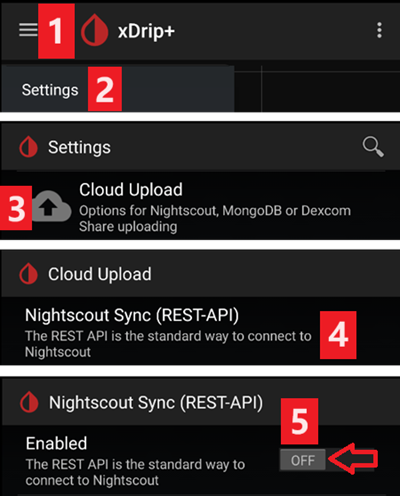
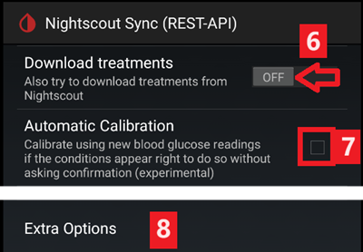
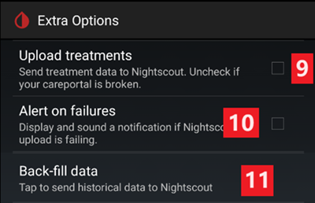
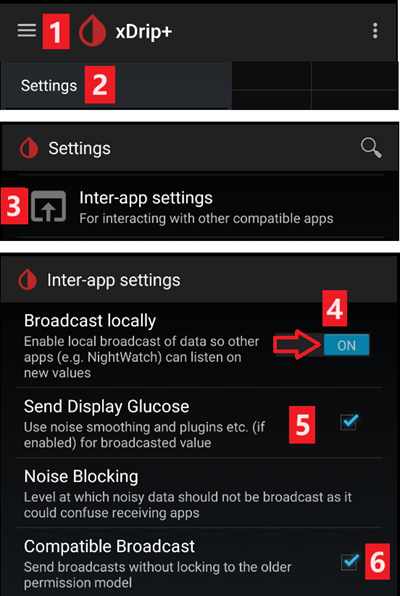
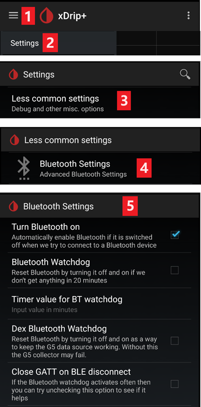
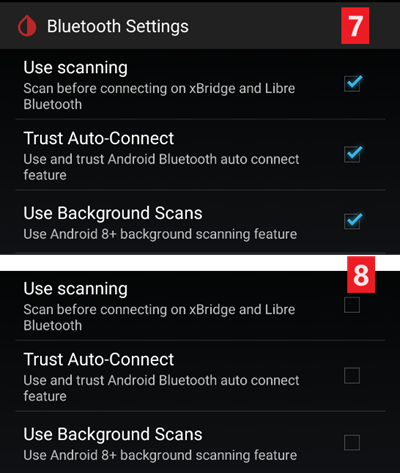
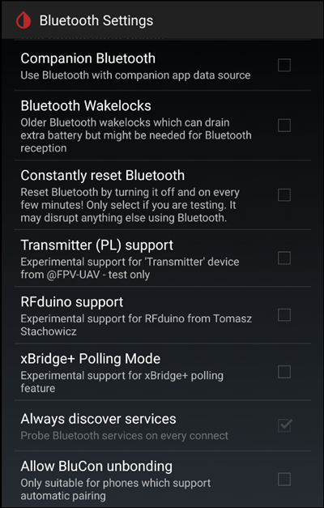
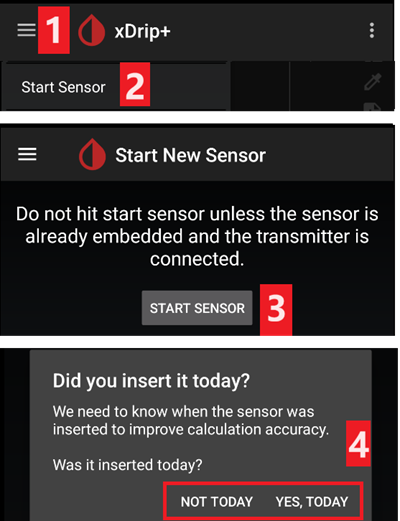
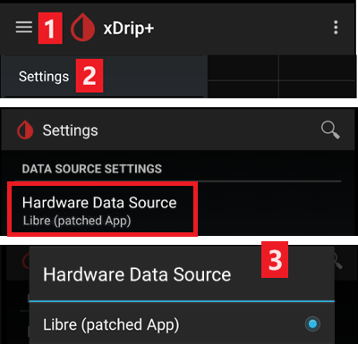

# xDrip settings

If not already set up, download and install the latest xDrip release from the [xDrip releases page](https://github.com/NightscoutFoundation/xDrip/releases).

Disable battery optimization and allow background activity for the xDrip app.

## Basic settings for all CGM & FGM systems

### Disable Nightscout upload

Starting with AAPS 3.2, you shouldn't let any other app upload data (blood glucose and treatments) to Nightscout.

→ Hamburger Menu (1) → Settings (2) → Cloud Upload (3) -> Nightscout Sync (REST-API)(4) → Switch **OFF** `Enabled` (5)



#### Disable automatic calibration and treatments

If you use an older version of AAPS (before 3.2), make sure to deactivate `Automatic Calibration` (7)
If the checkbox for `Automatic Calibration` is checked, activate `Download treatments` (6) once, then remove the checkbox for `Automatic Calibration` and deactivate `Download treatments` again.



Tap `Extra Options`(8)

```{admonition} Safety warning
:class: warning
You must deactivate "Upload treatments" from xDrip, otherwise treatments can be doubled in AAPS leading to false COB and IOB. 
```

Deactivate `Upload treatments`(9) and make sure you will **NOT** use `Back-fill data` (11). 

Option `Alert on failures` should also be deactivated (10). Otherwise you will get an alarm every 5 minutes in case Wi-Fi/mobile network issues or if the server is not available.



### **Inter-app Settings** (Broadcast)

If you are going to use AAPS and the data should be forwarded to i.e. AAPS you have to activate broadcasting in xDrip in Inter-App settings.

→ Hamburger Menu (1) → Settings (2) → Inter-app settings (3) → Broadcast locally **ON** (4)

In order for the values to be identical in AAPS with respect to xDrip, you should activate `Send the displayed glucose value` (5).

Enable Compatible Broadcast (6).



If you have also activated `Accept treatments` in xDrip and `Enable broadcasts to xDrip` in AAPS xDrip plugin, then xDrip will receive insulin, carbs and basal rate information from AAPS.

If you enable `Accept Calibrations`, xDrip will use the calibrations from AAPS. Be careful when you use this feature with Dexcom sensors: read [this](https://navid200.github.io/xDrip/docs/Calibrate-G6.html) first.

Remember to disable Import Sounds to avoid xDrip making a ringtone every time AAPS sends a basal/profile change.


(xdrip-identify-receiver)=

#### Identify receiver

* If you discover problems with local broadcast (AAPS not receiving BG values from xDrip) go to → Hamburger Menu (1) Settings (2) → Inter-app settings (3) → Identify receiver (7) and enter `info.nightscout.androidaps` for AAPS build (if you are using PumpControl build, please enter `info.nightscout.aapspumpcontrol` instead!!).
* Pay attention: Auto-correction sometimes tend to change i to capital letter. You **must use only lowercase letters** when typing `info.nightscout.androidaps` (or `info.nightscout.aapspumpcontrol` for PumpControl). Capital I would prevent the App from receiving BG values from xDrip.

   

## Use AAPS to calibrate in xDrip

-   If you want to be able to use AAPS to calibrate then in xDrip go to Settings → Interapp Compatibility → Accept Calibrations and select ON. 
-   You may also want to review the options in Settings → Less Common Settings → Advanced Calibration Settings.

## Dexcom sensors

Everything related to the Dexcom sensor and transmitter themselves (starting, stopping, replacing, calibrating, troubleshooting) is documented and kept up to date in the [xDrip Dexcom documentation](https://navid200.github.io/xDrip/docs/Dexcom_page.html). Follow those instructions for the sensor; the settings connecting xDrip to **AAPS** (described above on this page) are the only AAPS-specific part.

### Dexcom G6 and ONE

* Set up xDrip following the [recommended settings](https://navid200.github.io/xDrip/docs/G6-Recommended-Settings.html).
* The Dexcom G6 and ONE transmitters can simultaneously be connected to the Dexcom receiver (or alternatively the t:slim pump) and one app on your phone.
* When using xDrip as receiver uninstall the Dexcom app first. **You cannot connect xDrip and the Dexcom app with the transmitter at the same time!**
* If you need Clarity and want to profit from xDrip features, use the [Build Your Own Dexcom App](#DexcomG6-if-using-g6-with-build-your-own-dexcom-app) with local broadcast to xDrip, or use xDrip as a Companion app receiving notifications from the official Dexcom app (with possible delays in BG readings).

#### Sensor restarts

* xDrip always uses the transmitter's [native algorithm](https://navid200.github.io/xDrip/docs/Native-Algorithm.html) with current transmitters; there is no reason to disable it.
* [Preemptive restarts](https://navid200.github.io/xDrip/docs/Preemptive-Restart.html) only function on old transmitters (firmware 1.6.5.25 or earlier), where they are needed to prevent the sensor stopping after 10 days. Recent (Firefly) transmitters ignore them.
* Restarting a sensor on a Firefly transmitter requires [removing the transmitter](https://navid200.github.io/xDrip/docs/Remove-transmitter.html) and readings can be significantly in error after the restart, which is dangerous when looping: read [Restart a sensor](https://navid200.github.io/xDrip/docs/Restart-G6-sensor.html) in full and [calibrate carefully](https://navid200.github.io/xDrip/docs/Calibrate-after-G6Restart.html).

(xdrip-connect-g6-transmitter-for-the-first-time)=

#### Start, stop and replace sensors

Follow the instructions:

* [Start a G6 or ONE transmitter](https://navid200.github.io/xDrip/docs/Starting-G6.html)
* [Stop and start a G6 or ONE sensor](https://navid200.github.io/xDrip/docs/Dexcom/StartG6Sensor.html)
* [Remove the transmitter from a sensor](https://navid200.github.io/xDrip/docs/Remove-transmitter.html)
* [Transmitter lifetime](https://navid200.github.io/xDrip/docs/Transmitter-lifetime.html) can only be extended ([hard reset](https://navid200.github.io/xDrip/docs/Hard-Reset.html)) on rebatteried or modified transmitters, not on Firefly.

(xdrip-replace-transmitter)=

#### Replace a transmitter

* Turn the original Dexcom receiver off (if used) and do not turn it back on before xDrip shows readings.
* Forget the device in xDrip (System Status → Forget Device) AND in the smartphone's Bluetooth settings (shown as Dexcom?? where ?? are the last two digits of the transmitter serial number).
* Keep the old transmitter out of Bluetooth range to prevent reconnection.
* Then follow [Start a G6 or ONE transmitter](https://navid200.github.io/xDrip/docs/Starting-G6.html).

### Dexcom G7, ONE+ and Stelo

* Follow the [G7, ONE+ and Stelo instructions](https://navid200.github.io/xDrip/docs/Dexcom/G7.html) (a recent xDrip release is required — see the linked page).
* See also the [Dexcom G7, ONE+ and Stelo page](../CompatibleCgms/DexcomG7.md) for the available setups with **AAPS**.

(xdrip-troubleshooting-dexcom-g5-g6-and-xdrip)=

### Troubleshooting Dexcom and xDrip

* [G6/ONE connectivity troubleshooting](https://navid200.github.io/xDrip/docs/Connectivity-troubleshoot.html)
* [G7/ONE+/Stelo troubleshooting](https://navid200.github.io/xDrip/docs/Dexcom/G7_Troubleshooting.html)
* [Problem when starting a new sensor](https://navid200.github.io/xDrip/docs/Dexcom/SensorFailedStart.html)
* Full list: see **Troubleshooting** on the [xDrip Dexcom page](https://navid200.github.io/xDrip/docs/Dexcom_page.html).

## Libre 1

* Setup your NFC to Bluetooth bridge in xDrip

  → Hamburger Menu (1) → Settings (2) → Less common settings (3) → Bluetooth Settings (4)

* In Bluetooth Settings set the checkboxes exactly as in the screenshots below (5)

  - Disable watchdogs as they will reset the phone Bluetooth and interrupt your pump connection.

  

* You can try to enable the following settings (7)

  - Use scanning
  - Trust Auto-Connect
  - Use Background Scans

* If you easily lose connection to the bridge or have difficulties recovering connection, **DISABLE THEM** (8).

  

- Leave all other options disabled unless you know why you want to enable them.

  

### Libre smart reader battery level

* Battery level of bridges such as MiaoMiao and Bubble can be displayed in AAPS (not Blucon).
* Details can be found on [screenshots page](#screens-sensor-level-battery).

### Connect Libre Transmitter & start sensor

- If your sensor requires it (Libre 2 EU and Libre 1 US) install the latest out of process algorithm.

- Your sensor must be already started using the vendor app or the reader (xDrip cannot start or stop Libre sensors).

- Set the data source to Libre Bluetooth.

  → Hamburger Menu (1) → Settings (2) → Select Libre Bluetooth in Hardware Data source (3)

  

- Scan Bluetooth and connect the bridge.

  → Hamburger Menu (1) → Scan Bluetooth (2) → Scan (3)

  - If xDrip can't find the bridge, make sure it's not connected to the vendor app. Put it in charge and reset it.

  

- Start the sensor in xDrip.

  ```{admonition} Safety warning
  :class: warning
  Do not use sensor data before the one hour warm-up is over: the values can be extremely high and cause wrong decisions in AAPS.  
  ```

  → Hamburger Menu (1) → Start sensor (2) → Start sensor (3) → Set the exact time you started it with the reader or the vendor app. If you didn't start it today, answer "Not Today" (4).




(xdrip-libre2-patched-app)=
## Libre 2 patched app

* Set the data source to Libre patched app.

  → Hamburger Menu (1) → Settings (2) → Select Libre (patched App) in Hardware Data source (3)

  

-   You can add `BgReading:d,xdrip libre_receiver:v` under Less
    Common Settings->Extra Logging Settings->Extra tags for logging.
    This will log additional error messages for trouble shooting.


