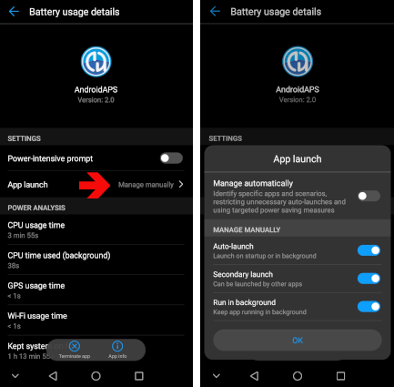

# How-to configure a Huawei phone

There are different options, some Android specific, some Huawei specific:

* Add AAPS and xdrip+ to apps list which ignore battery optimisations:
  * Settings / App / Settings / Special autorisations / Ignore battery optimisation / Select "All applications" / Set app to allowed
  
    

* Set battery option settings:
  * Settings / App / Select AndroidAPS/xdrip+ / Under Battery / App launch
   * Make sure to remove "automatic management"
    * Allow:
     * Automatic launch
     * Secondary launch (can be launched from other apps)
     * Background run
          
       
  
* Lock App
  * Go into App recent list and select the lock icon
  
    
  
  

For xDrip+, you must enable persistent notifications (within xDrip+ app):
* Settings / less common settings / other misc options / Run Collector in foreground

   

Depending on Android version, these settings are somewhere else. These explanations are for Android 8.1.
