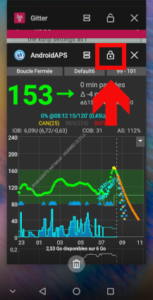

# How to configure a Huawei phone

```{admonition} Obsolete page
:class: warning

This page may be obsolete — consider revising or removing it.
```

There are different options, some Android specific, some Huawei specific:

* Add AAPS and xDrip to the apps list which ignore battery optimizations:
  * Settings / App / Settings / Special permissions / Ignore battery optimization / Select "All applications" / Set app to allowed
  
    


* Set battery option settings:
  * Settings / App / Select AndroidAPS/xdrip+ / Under Battery / App launch
   * Make sure to remove "automatic management"
    * Allow:
     * Automatic launch
     * Secondary launch (can be launched from other apps)
     * Background run
       
       
  
* Lock App
  * Go into App recent list and select the lock icon
  
    
  
