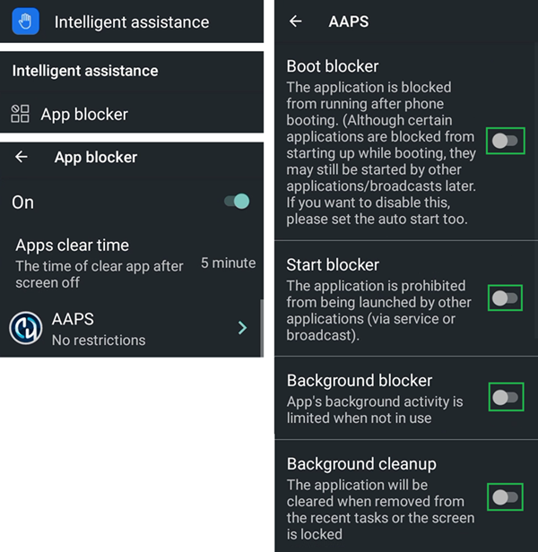
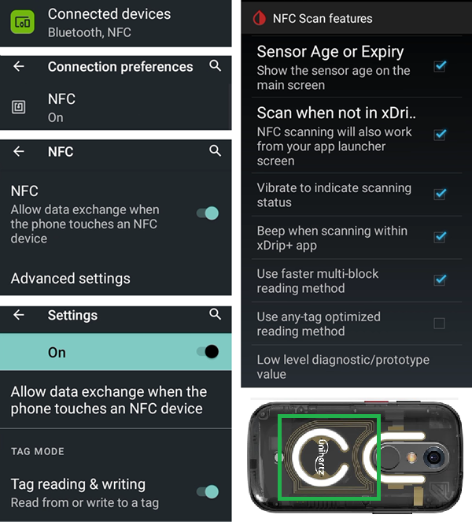
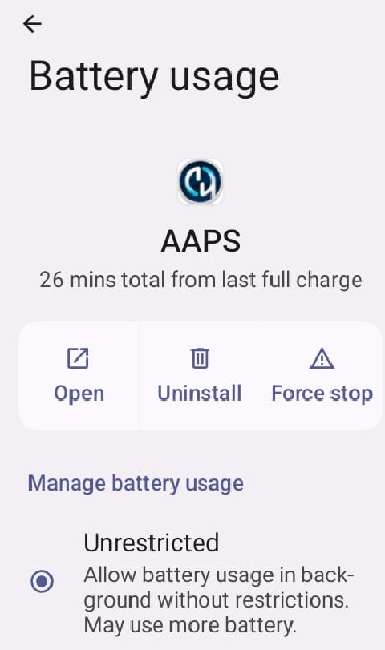
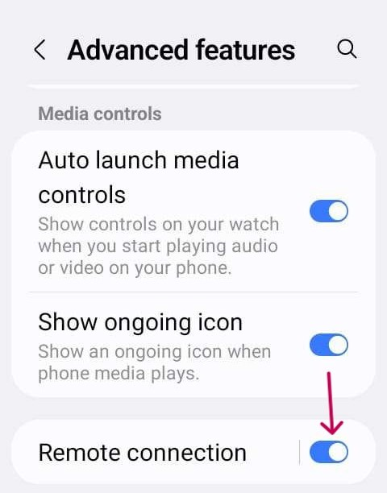

# Jelly

## Jelly Star Mini 

**Features**

* Android 13
* 8 GB RAM

**Advantages**

* It's really small.
* Even if you tell people, they might not consider it as a normal smartphone and will except it easier as a exception when phones are normally not allowed.

**Disadvantages**

* Recommended only for experienced loopers (some settings are not recognizable, you have to know from experience with a big Android AAPS phone, how and where what is located. Some AAPS buttons are hard to touch with a lot of feeling, but not with stubby fingers.)
* Can only be used as LooperPhone. It's better to have a normal smartphone in your pocket. 

### Battery life optimization

The Jelly comes with strong optimization features that **must** be disabled for AAPS (and other DIY apps like BYODA, xDrip+, OOP2, Juggluco, etc...).

You can leave Intelligent assistance enabled, but it **must be disabled for DIY apps**.

You can enable NFC for Libre sensors.

### Battery life optimization

To avoid interference with **AAPS**, the Jelly Star 'battery usage' should be disabled by selecting 'unrestricted' (and other **DIY apps** like BYODA, xDrip+, OOP2, Juggluco, etc...).

### Google Play Protect 

Remember to disable Google Play Protect.

### Remote Connection for Weak apk

For certain smart watches, like the Samsung Galaxy, 'Remote Connection' under Samsung Galaxy's Advanced Features must be switched **on** to use the Jelly, **Wear.apk** & **AAPS** remotely via Wi-Fi.

