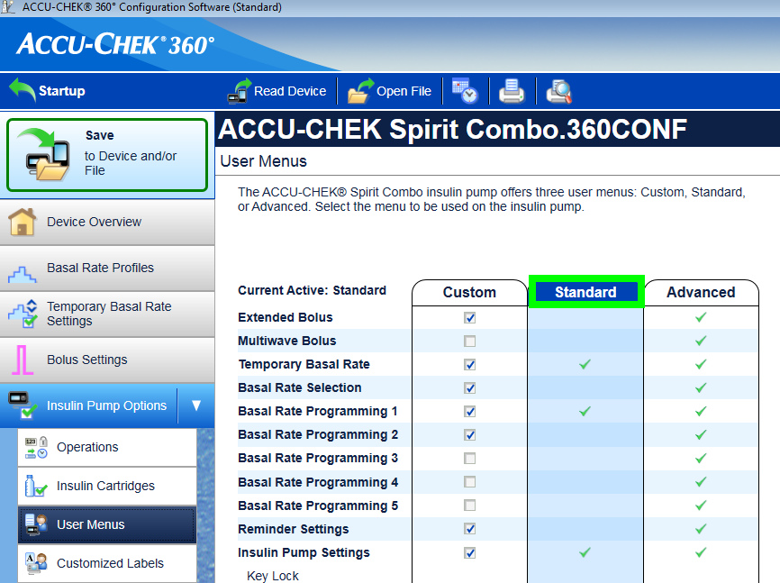
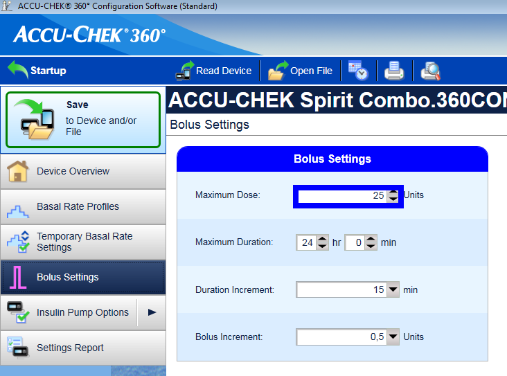
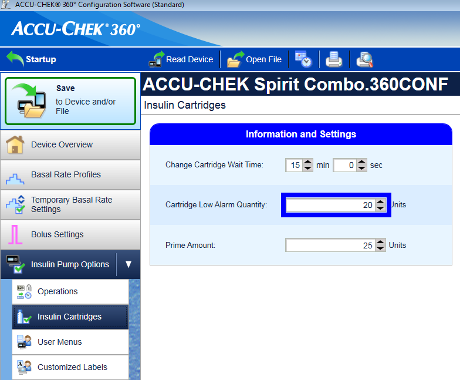
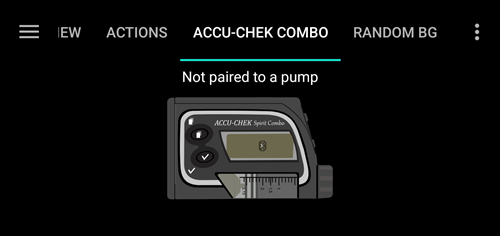
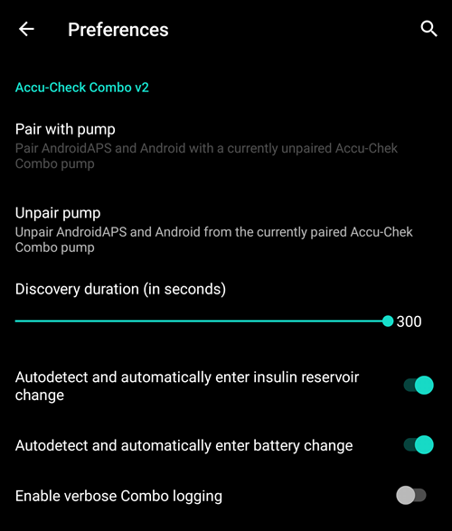
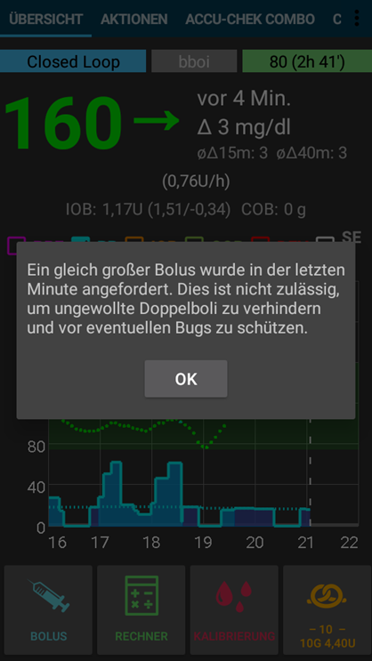
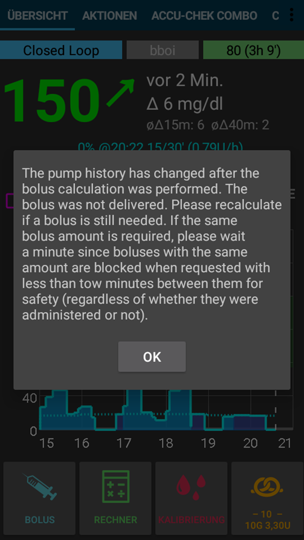

# Accu-Chek Combo

**This software is part of a DIY solution and is not a product, but requires YOU to read, learn and understand the system including how to use it. It is not something that does all your diabetes management for you, but allows you to improve your diabetes and your quality of life if you're willing to put in the time required. Don't rush into it, but allow yourself time to learn. You alone are responsible for what you do with it.**

```{admonition} Accu-Chek Combo is being phased out
:class: note

Roche is withdrawing from the insulin pump market to refocus its diabetes portfolio on the Accu-Chek SmartGuide CGM. It has communicated the end of sales of both the Accu-Chek Combo and Accu-Chek Insight pumps; its remaining Accu-Chek Solo micropump is also being wound down (last deliveries in Germany at the end of 2025). The change is being rolled out by region, starting in Germany, with other European markets expected to follow. If you rely on this pump, plan ahead for a transition to a supported pump.
```

```{contents} Table of contents
:depth: 1
:local: true
```

## Pump capabilities with AAPS

* Communicates with **AAPS** over your phone's native Bluetooth, without an additional communication device.
* Automatic DST and timezone handling.

## Hardware and software requirements

* A Roche Accu-Chek Combo (any firmware, they all work).
* A Smartpix or Realtyme device together with the 360 Configuration Software to configure the pump. (Roche sends out Smartpix devices and the configuration software free of charge to their customers upon request.)
* A compatible phone. Android 9 (Pie) or newer is a must. If using LineageOS, the minimum supported version is 16.1. See [release notes](#maintenance-android-version-aaps-version) for details.
* The AndroidAPS app installed on your phone.

Some phones may work better than others, depending on their quality of Bluetooth support and whether or not they have additional, very aggressive power saving logic. A list of phones can be found in the [AAPS Phones](#Phones-list-of-tested-phones) document. Please be aware that this is not complete list and reflects personal user experience. You are encouraged to also enter your experience and thereby help others (these projects are all about paying it forward).

(combov2-before-you-begin)=
## Before you begin

**SAFETY FIRST** - do not attempt this process in an environment where you cannot recover from an error. Keep your Smartpix / Realtyme device handy, along with the 360 Configuration Software. Plan on spending about an hour for setting everything up and checking that everything is working properly.

Be aware of the following limitations:

* Extended bolus and multiwave bolus are currently not supported (you can use [Extended Carbs](../DailyLifeWithAaps/ExtendedCarbs.md) instead).
* Only one basal profile (the first one) is supported.
* The loop is disabled if the currently active profile on the pump isn't profile no. 1. This continues until profile no. 1 is made the active one; when that is done, the next time AAPS connects (either on its own after a while or because the user presses the Refresh button in the combov2 user interface), it will notice that profile no. 1 is the current one, and enable the loop again.
* If the loop requests a running TBR to be cancelled, the Combo will set a TBR of 90% or 110% for 15 minutes instead. This is because actually cancelling a TBR causes an alert on the pump which causes a lot of vibrations, and these vibrations cannot be disabled.
* Bluetooth connection stability varies with different phones, causing "pump unreachable" alerts, where no connection to the pump is established anymore. If that error occurs, make sure Bluetooth is enabled, press the Refresh button in the Combo tab to see if this was caused by an intermitted issue and if still no connection is established, reboot the phone which should usually fix this.
* There is another issue were a restart doesn't help but a button on the pump must be pressed (which resets the pump's Bluetooth stack), before the pump accepts connections from the phone again.
* Setting a TBR on the pump is to be avoided since the loop assumes control of TBRs. Detecting a new TBR on the pump might take up to 20 minutes and the TBR's effect will only be accounted from the moment it is detected, so in the worst case there might be 20 minutes of a TBR that is not reflected in IOB.

If you have been using the old Combo driver that depends on the separate Ruffy app, and want to move to this new one, note that the pairing has to be done again - Ruffy and the new Combo driver are not able to share pairing information. Also, make sure that Ruffy is _not_ running. If in doubt, long-press the Ruffy app icon to bring up a context menu. In that menu, press on "App Info". In the UI that just opened up, press "Force stop". That way, it is ensured that an active Ruffy instance cannot interfere with the new driver.

Also, if you are migrating from the old driver, be aware that the new driver communicates a bolus command in an entirely different way to the Combo that is much faster, so don't be surprised when a bolus starts immediately regardless of the dosage. Furthermore, the general suggestions, tips and tricks etc. about dealing with Ruffy pairing and connection problems do not apply here, since this is an entirely new driver that shares no code with the old one.

This new driver is currently written to support the following languages on the Combo.
(This is unrelated to the language in AAPS - it is the language shown on the Combo's LCD itself.)

* English
* Spanish
* French
* Italian
* Russian
* Turkish
* Polish
* Czech
* Hungarian
* Slovak
* Romanian
* Croatian
* Dutch
* Greek
* Finnish
* Norwegian
* Portuguese
* Swedish
* Danish
* German
* Slovenian
* Lithuanian

**Important**: If your pump is set to a language that is not part of this list, please contact the developers, and set the pump's language to one in this list. Otherwise, the driver won't work properly.

## Phone setup

It is very important to make sure that battery optimizations are turned off. AAPS already auto-detects when it is subject to these optimizations, and requests in its UI that these be turned off. But, on modern Android phones, Bluetooth _itself_ is an app (a system app). And, usually, that "Bluetooth app" is run _with battery optimizations on by default_. As a result, Bluetooth can refuse to respond when the phone aims to save power because it kills off the Bluetooth app. This means that in that Bluetooth system app's settings, battery optimizations must be turned off as well. Unfortunately, how one can find that Bluetooth system app differs between phones. In stock Android, go to Settings -> Apps -> See all N apps (N = the number of apps on your phone). Then, open the menu to the top right corner, tap on "Show system" or "Show system apps" or "All apps". Now, in the newly expanded list of apps, look for a "Bluetooth" app. Select it, and on its "App info" UI, tap on "Battery". There, disable battery optimizations (sometimes called "battery usage").

## Combo setup

* Configure the pump using the Accu-Chek 360 Configuration Software. If you do not have the software, please contact your Accu-Chek hotline. They usually send registered users a CD with the "360° Pump Configuration Software" and a SmartPix USB-infrared connection device (the Realtyme device also works if you have that).

  - **Required settings** (marked green in screenshots):

     * Set/leave the menu configuration as "Standard", this will show only the supported menus/actions on the pump and hide those which are unsupported (extended/multiwave bolus, multiple basal rates), which cause the loop functionality to be restricted when used because it's not possible to run the loop in a safe manner when used.
     * Verify the _Quick Info Text_ is set to "QUICK INFO" (without the quotes, found under _Insulin Pump Options_).
     * Set TBR _Maximum Adjustment_ to 500%
     * Disable _Signal End of Temporary Basal Rate_
     * Set TBR _Duration increment_ to 15 min
     * Enable Bluetooth

  - **Recommended settings** (marked blue in screenshots)

     * Set low cartridge alarm to your liking
     * Configure a max bolus suited for your therapy to protect against bugs in the software
     * Similarly, configure maximum TBR duration as a safeguard. Allow at least 3 hours, since the option to disconnect the pump for 3 hours sets a 0% for 3 hours.
     * Enable key lock on the pump to prevent bolusing from the pump, esp. when the pump was used before and quick bolusing was a habit.
     * Set display timeout and menu timeout to the minimum of 5.5 and 5 respectively. This allows the AAPS to recover more quickly from error situations and reduces the amount of vibrations that can occur during such errors

  

  

  

  

## Activating the driver and pairing it with the Combo

* Select the "Accu-Chek Combo" driver in [Config builder > Pump](../SettingUpAaps/ConfigBuilder.md). **Important**: There is the old driver, called "Accu-Chek Combo (Ruffy)", in that list as well. Do _not_ select that one.

  

* Tap the cog-wheel to open the driver settings.

* In the settings user interface, tap on the button 'Pair with pump' at the top of the screen. This opens the Combo pairing user interface. Follow the instructions shown on screen to start pairing. When Android asks for permission to make the phone visible to other Bluetooth devices, press "allow". Eventually, the Combo will show a custom 10-digit pairing PIN on its screen, and the driver will request it. Enter that PIN in the corresponding field.

  

  

  

  

  

* When the driver asks for the 10-digit PIN that is shown on the Combo, and the code is entered incorrectly, this is shown:
  

* Once pairing is done, the pairing user interface is closed by pressing the OK button in the screen that states that pairing succeeded. After it is closed, you return to the driver settings user interface. The 'Pair with pump' button should now be greyed out and disabled.

  The Accu-Chek Combo tab looks like this after successfully pairing:

  

  if however there is no pairing with the Combo, the tab looks like this instead:

  

* To verify your setup (with the pump **disconnected** from any cannula to be safe!) use AAPS to set a TBR of 500% for 15 min and issue a bolus. The pump should now have a TBR running and the bolus in the history. AAPS should also show the active TBR and delivered bolus.

* On the Combo, it is recommended to enable the key lock to prevent bolusing from the pump, esp. when the pump was used before and using the "quick bolus" feature was a habit.

## Notes about pairing

The Accu-Chek Combo was developed before Bluetooth 4.0 was released, and just one year after the very first Android version was released. This is why its way of pairing with other devices is not 100% compatible with how it is done in Android today. To fully overcome this, AAPS would need system level permissions, which are only available for system apps. These are installed by the phone makers into the phone - users cannot install system apps.

The consequence of this is that pairing will never be 100% without problems, though it is greatly improved in this new driver. In particular, during pairing, Android's Bluetooth PIN dialog can briefly show up and automatically go away. But sometimes, it stays on screen, and asks for a 4-digit PIN. (This is not to be confused with the 10-digit Combo pairing PIN.) Do not enter anything, just press cancel. If pairing does not continue, follow the instructions on screen to retry the pairing attempt.

(combov2-tab-contents)=
## Accu-Chek Combo tab contents

The tab shows the following information when a pump was paired (items are listed from top to bottom):


1. _Driver state_: The driver can be in one of the following states:
   - "Disconnected" : There is no Bluetooth connection; the driver is in this state most of the time, and only connects to the pump when needed - this saves power
   - "Connecting"
   - "Checking pump" : the pump is connected, but the driver is currently performing safety checks to ensure that everything is OK and up to date
   - "Ready" : the driver is ready to accept commands from AAPS
   - "Suspended" : the pump is suspended (shown as "stopped" in the Combo)
   - "Executing command" : an AAPS command is being executed
   - "Error" : an error occurred; the connection was terminated, any ongoing command was aborted
2. _Last connection_: How many minutes ago did the driver successfully connect to the Combo; if this goes beyond 30 minutes, this item is shown with a red color
3. _Current activity_: Additional detail about what the pump is currently doing; this is also where a thin progress bar can show a command's execution progress, like setting a basal profile
4. _Battery_: Battery level; the Combo only indicates "full", "low", "empty" battery, and does not offer anything more accurate (like a percentage), so only these three levels are shown here
5. _Reservoir_: How many IU are currently in the Combo's reservoir
6. _Last bolus_: How many minutes ago the last bolus was delivered; if none was delivered yet after AAPS was started, this is empty
7. _Temp basal_: Details about the currently active temporary basal; if none is currently active, this is empty
8. _Base basal rate_: Currently active base basal rate ("base" means the basal rate without any active TBR influencing the basal rate factor)
9. _Serial number_: Combo serial number as indicated by the pump (this corresponds to the serial number shown on the back of the Combo)
10. _Bluetooth address_: The Combo's 6-byte Bluetooth address, shown in the `XX:XX:XX:XX:XX:XX` format

The Combo can be operated through Bluetooth in the _remote-terminal_ mode or in the _command_ mode. The remote-terminal mode corresponds to the "remote control mode" on the Combo's meter, which mimics the pump's LCD and four buttons. Some commands have to be performed in this mode by the driver, since they have no counterpart in the command mode. That latter mode is much faster, but, as said, limited in scope. When the remote-terminal mode is active, the current remote-terminal screen is shown in the field that is located just above the Combo drawing at the bottom. When the driver switches to the command mode however, that field is left blank.

(The user does not influence this; the driver fully decides on its own what mode to use. This is merely a note for users to know why sometimes they can see Combo frames in that field.)

At the very bottom, there is the "Refresh" button. This triggers an immediate pump status update. It also is used to let AAPS know that a previously discovered error is now fixed and that AAPS can check again that everything is OK (more on that below in [the section about alerts](#combov2-alerts)).

## Preferences

These preferences are available for the combo driver (items are listed from top to bottom):



1. _Pair with pump_: This is a button that can be pressed to pair with a Combo. It is disabled if a pump is already paired.
2. _Unpair pump_: Unpairs a paired Combo; the polar opposite of item no. 1. It is disabled if no pump is paired.
3. _Discovery duration (in seconds)_: When pairing, the drivers makes the phone discoverable by the pump. This controls how long that discoverability lasts. By default, the maximum (300 seconds = 5 minutes) is selected. Android does not allow for discoverability to last indefinitely, so a duration has to be chosen.
4. _Autodetect and automatically enter insulin reservoir change_: If enabled, the "reservoir change" action that is normally done by the user through the "prime/fill" button in the Action tab. This is explained [in further detail below](#combov2-autodetections).
5. _Autodetect and automatically enter battery change_: If enabled, the "battery change" action that is normally done by the user through the "pump battery change" button in the Action tab. This is explained [in further detail below](#combov2-autodetections).
6. _Enable verbose Combo logging_: This greatly expands the amount of logging done by the driver. **CAUTION**: Do not enable this unless asked to by a developer. Otherwise, this can add a lot of noise to AndroidAPS logs and lessen their usefulness.

Most users only ever use the top two items, the _Pair with pump_ and _Unpair pump_ buttons.

(combov2-autodetections)=
## Autodetecting and automatically entering battery and reservoir changes

The driver is capable of detecting battery and reservoir changes by keeping track of the battery and reservoir levels. If the battery level was reported by the Combo as low the last time the pump status was updated, and now, during the new pump status update, the battery level shows up as normal, then the driver concludes that the user must have replaced the battery. The same logic is used for the reservoir level: If it now is higher than before, this is interpreted as a reservoir change.

This only works if the battery and reservoir are replaced when these levels are reported as low _and_ the battery and reservoir are sufficiently filled.

These autodetections can be turned off in the Preferences UI.

(combov2-alerts)=
## Alerts (warnings and errors) and how they are handled

The Combo shows alerts as remote-terminal screens. Warnings are shown with a "Wx" code (x is a digit), along with by a short description. One example is "W7", "TBR OVER". Errors are similar, but show up with an "Ex" code instead.

Certain warnings are automatically dismissed by the driver. These are:

- W1 "reservoir low" : the driver turns this into a "low reservoir" warning that is shown on the AAPS main tab
- W2 "battery low" : the driver turns this into a "low battery" warning that is shown on the AAPS main tab
- W3, W6, W7, W8 : these are all purely informational for the user, so it is safe for the driver to auto-dismiss them

Other warnings are _not_ automatically dismissed. Also, errors are _never_ automatically dismissed. Both of these are handled the same way: They cause the driver to produce an alert dialog on top of the AAPS UI, and also cause it to abort any ongoing command execution. The driver then switches to the "error" state (see [the Accu-Chek Combo tab contents description above](#combov2-tab-contents)). This state does not allow for any command execution. The user has to handle the error on the pump; for example, an occlusion error may require replacing the cannula. Once the user took care of the error, normal operation can be resumed by pressing the "Refresh" button on the Accu-Chek Combo tab. The driver then connects to the Combo and updates its status, checking for whether an error is still shown on screen etc. Also, the driver auto-refreshes the pump status after a while, so manually pressing that button is not mandatory.

Bolusing is a special case. It is done in the Combo's command mode, which does not report mid-bolus that an alert appeared. As a consequence, the driver cannot automatically dismiss warnings _during_ a bolus. This means that unfortunately, the pump will be beeping until the bolus is finished. The most common mid-bolus alert typically is W1 "reservoir low". **Don't** dismiss Comnbo warnings on the pump itself manually during a bolus. You risk interrupting the bolus. The driver will take care of the warning once the bolus is over.

Alerts that happen while the driver is not connected to the Combo will not be noticed by the driver. The Combo has no way of automatically pushing that alert to the phone; it is always the phone that has to initiate the connection. As a consequence, the alert will persist until the driver connects to the pump. Users can press the "Refresh" button to trigger a connection and let the driver handle the alert right then and there (instead of waiting until AAPS itself decides to initiate a connection).

**IMPORTANT**: If an error occurs, or a warning shows up that isn't one of those that are automatically dismissed, the driver enters the error state. In that state, the loop **WILL BE BLOCKED** until the pump status is refreshed! It is unblocked after the pump status is updated (either by manual "Refresh" button press or by the driver's eventual auto-update) and no error is shown anymore.

## Things to be careful about when using the Combo

* Keep in mind that this is not a product, esp. in the beginning the user needs to monitor and understand the system, its limitations and how it can fail. It is strongly advised NOT to use this system when the person using it is not able to fully understand the system.
* Due to the way the Combo's remote control functionality works, several operations (especially setting a basal profile) are slow compared to other pumps. This is an unfortunate limitation of the Combo that cannot be overcome.
* Don't set or cancel a TBR on the pump. The loop assumes control of TBRs and cannot work reliably otherwise, since it's not possible to determine the start time of a TBR that was set by the user on the pump.
* Don't press any buttons on the pump while AAPS communicates with the pump (the Bluetooth logo is shown on the pump while it is connected to AAPS). Doing that will interrupt the Bluetooth connection. Only do that if there are problems with establishing a connection (see [the "Before you begin" section above](#combov2-before-you-begin)).
* Don't press any buttons while the pump is bolusing. In particular, don't try to dismiss alerts by pressing buttons. See [the section about alerts](#combov2-alerts) for a more detailed explanation why.

## Checklist for when no connection can be established with the Combo

The driver does its best to connect to the Combo, and uses a couple of tricks to maximize reliability. Still, sometimes, connections aren't established. Here are some steps to take for trying to remedy this situation.

1. Press a button on the Combo. Sometimes, the Combo's Bluetooth stack becomes non-responsive, and does not accept connections anymore. By pressing a button on the Combo and making the LCD show something, the Bluetooth stack is reset. Most of the time, this is the only step that's needed to fix the connection issues.
2. Restart the phone. This may be needed if there is an issue with the phone's Bluetooth stack itself.
3. If the Combo's battery cap is old, consider replacing it. Old battery caps can cause issues with the Combo's power supply, which affect Bluetooth.
4. If connection attempts still keep failing, consider unpairing and then re-pairing the pump.

(combov2-tips-for-basic-usage)=
## Tips for basic usage

### How to ensure smooth operations

* Always **carry the smartphone with you**, leave it next to your bed at night. As your pump may lay behind or under you body while you sleep, a higher position (on a shelf or board) works best.
* Always make sure that the pump battery is as full as possible. See the battery section for tipps regarding the battery.
* Whenever possible, only operate the pump via the AAPS app. To facilitate this, activate the key lock on the pump under **PUMP SETTINGS / KEY LOCK / ON**. Only when changing the battery or the cartridge, it is necessary to use the pump's keys. 


### Pump not reachable. What to do?

#### Activate pump unreachable alarm
* In AAPS, go to **Settings / Local Alarms** and activate **alarm when pump is unreachable** and set **pump not reachable limit [Min]** to **31** minutes.
* This will give you enough time to not trigger the alarm when leaving the room while your phone is left on the desk, but informs you if the pump cannot be reached for a time that exceeds the duration of a temporary basal rate.

#### Restore reachability of the pump

* When AAPS reports a **pump unreachable** alarm, first release the keylock and **press any key on the pump** (e.g. "down" button). As soon as the pump display has turned off, press **Refresh** on the **Combo Tab** in AAPS. Mostly then the communication works again.
* If that does not help, reboot your smartphone. After the restart, AAPS will be reactivated and a new connection will be established with the pump. If you are using the old driver, ruffy will be reactivated as well.

* The tests with different smartphones have shown that certain smartphones trigger the "pump unreachable" error more often than others. See [AAPS Phones](#Phones-list-of-tested-phones) for successfully tested smartphones. 

#### Root causes and consequences of frequent communication errors
* On phones with **low memory** (or **aggressive power-saving** settings), AAPS is often shut down. You can tell by the fact that the Bolus and Calculator buttons on the Home screen are not shown when opening AAPS because the system is initializing. This can trigger "pump unreachable alarms" at startup. In the **Last Connection** field of the Combo tab, you can check when AAPS last communicated with the pump.


* This error can drain the pump's battery faster because the basal profile is read from the pump when the app is restarted.
* It also increases the likelihood of causing the error that causes the pump to reject all incoming connections until a button on the pump is pressed. 

### Cancellation of temporary basal rate fails
* Occasionally, AAPS cannot automatically cancel a **TBR CANCELED** alert. Then you have to either press **UPDATE** in the AAPS **Combo tab** or the alarm on the pump will need to be confirmed.

### Pump battery considerations

#### Changing the battery
* After a **low battery** alarm, the battery should be changed as soon as possible to always have enough energy for a reliable Bluetooth communication with the smartphone, even if the phone is within a wider distance of the pump.
* Even after a **low battery** alarm, the battery might be used for a significant amount of time. However, it is recommended to always have a fresh battery with you after a "low battery" alarm rang.
* Before changing the battery, press on the **Loop** symbol on the main screen and select **Suspend loop for 1h**. 
* Wait for the pump to communicate with the pump and the Bluetooth logo on the pump has faded.


* Release the key lock on the pump, put the pump into stop mode, confirm a possibly canceled temporary basal rate, and change the battery quickly.
* When using the old driver, if the clock on the pump did not survive the battery change, re-set the date and time on the pump to exactly the date/time on your phone running AAPS. (The new driver automatically updates the pump's date and time.)
* Then put the pump back in run mode select **Resume** when pressing on the **Suspended Loop** icon on the main screen.
* AAPS will re-set a necessary temporary basal rate with the arrival of the next blood sugar value.

(Accu-Chek-Combo-Tips-for-Basic-usage-battery-type-and-causes-of-short-battery-life)=
#### Battery type and causes of short battery life
* As intensive Bluetooth communication consumes a lot of energy, only use **high-quality batteries** like Energizer Ultimate Lithium, the "power one"s from the "large" Accu-Chek service pack, or if you are going for a rechargeable battery, use Eneloop batteries. 


Ranges for typical life time of the different battery types are as follows:
* **Energizer Ultimate Lithium**: 4 to 7 weeks
* **Power One Alkaline** (Varta) from the service pack: 2 to 4 weeks
* **Eneloop rechargeable** batteries (BK-3MCCE): 1 to 3 weeks

If your battery life is significantly shorter than the ranges given above, please check the following possible causes:
* There are some variants of the screw-on battery cap of the Combo pump, which partially short circuit the batteries and drain them quickly. The caps without this problem can be recognized by the golden metal contacts.
* If the pump clock does not "survive" a short battery change, it is likely that the capacitor is broken which keeps the clock running during a brief power outage. In this case, a replacement of the pump by Roche might help, which is not a problem during the warranty period. 
* The smart phone hardware and software (Android operating system and Bluetooth stack) also impact the battery lifetime of the pump, even though the exact factors are not completely known yet. If you have the opportunity, try another smartphone and compare battery lifetimes.

### Extended bolus, multiwave bolus
The OpenAPS algorithm does not support a parallel extended bolus or multiwave bolus. But a similar treatment can be achieved by the following alternatives:
* Use **e-Carbs** when entering carbs or using the Calculator by entering the carbs of the full meal and the duration you expect the carbs to arrive as glucose in you blood. The system will then calculate small carbs equally distributed over the whole duration which will cause th algorithm to provide equivalent insulin dosing while still permanently checking the overall rise/decrease of the blood glucose level. For a multiwave bolus approach, you can also combine a smaller immediate bolus with e-carbs.  
* Before eating, on the **Actions tab** in AAPS set as a temporary **Eating Soon** goal with target glucose 80 for several hours. The duration should be based on the interval you would choose for an extended bolus. This will keep your target lower than usual and therefore increase the amount of insulin delivered.
* Then use the **CALCULATOR** to enter the full carbs of the meal, but do not directly apply the values suggested by the bolus calculator. If a multiwave-like bolus is to be delivered, correct the insulin dosage down. Depending on the meal, the algorithm now has to deliver additional SMBs or higher temporary basal rates to counteract the increase in blood sugar. Here, the safety limitation of the basal rate (Max IE / h, Maximum basal IOB) should be very carefully experimented with and, if necessary, temporarily changed. 

* If you are tempted to just use the extended or multiwave bolus directly on the pump, AAPS will penalize you with disabling the closed loop for the next six hours to ensure that no excess insulin dosage is calculated.


### Alarms at bolus delivery
* If AAPS detects that an identical bolus has been successfully delivered at the same minute, bolus delivery will be prevented with identical number of insulin units. If your really want to bolus the same insulin twice in short succession, just wait two more minutes and then deliver the bolus again. If the fist bolus has been interrupted or was not delivered for other reasons, you can immediately re-submit the bolus since AAPS 2.0.
* The alarm is a safety mechanism that reads the pump's bolus history before submitting a new bolus to correctly calculate insulin on board (IOB), even when a bolus is delivered directly from the pump. Here indistinguishable entries must be prevented.



* This mechanism is also responsible for a second cause of the error: If during the use of the bolus calculator another bolus is delivered via the pump and thereby the bolus history changes, the basis of the bolus calculation is wrong and the bolus is aborted. 



## Where to get help

Development of the Combo driver is done by the community on a **volunteer** basis. Before requesting help, please:

1. **Read** the relevant section of this documentation to confirm how the feature is meant to work.
2. **Ask** on the *#AAPS* channel on [Discord](https://discord.gg/4fQUWHZ4Mw), or in one of the other [community channels](../GettingHelp/WhereCanIGetHelp.md).
3. **Report a bug** by searching the [existing issues](https://github.com/nightscout/AndroidAPS/issues); if yours is not listed, open a [new issue](https://github.com/nightscout/AndroidAPS/issues) and attach your [log files](../GettingHelp/AccessingLogFiles.md).

When asking for help, include your phone make and model, Android version, **AAPS** version, and a plain-English description of the problem (what changed, when it last worked).
