# Accu-Chek Insight

**This software is part of a DIY artificial pancreas solution and is not a product, but
requires YOU to read, learn and understand the system including how to use it.
It is not something that does all your diabetes management for you but
allows you to improve your diabetes and your quality of life, 
if you're willing to put in the time required. Don't rush into it,
but allow yourself time to learn. You alone are responsible for what
you do with it.**

```{admonition} Accu-Chek Insight is being phased out
:class: note

Roche is withdrawing from the insulin pump market to refocus its diabetes portfolio on the Accu-Chek SmartGuide CGM. It has communicated the end of sales of both the Accu-Chek Combo and Accu-Chek Insight pumps; its remaining Accu-Chek Solo micropump is also being wound down (last deliveries in Germany at the end of 2025). The change is being rolled out by region, starting in Germany, with other European markets expected to follow. Support for the Insight is already listed as ended (see [Pumps no longer sold](./Future-possible-Pump-Drivers.md)). If you rely on this pump, plan ahead for a transition to a supported pump.
```

```{note}
Before **AAPS** had a native Insight driver, the Insight was controlled through the separate [SightRemote](https://github.com/TebbeUbben/SightRemote) app. SightRemote is no longer needed or maintained: if you still have it installed from those days, uninstall it and use a current version of **AAPS** instead.
```

```{contents} Table of contents
:depth: 1
:local: true
```

## Pump capabilities with AAPS

* Communicates with **AAPS** over your phone's native Bluetooth, without an additional communication device.
* Automatic DST and timezone handling.

## Hardware and software requirements

* A Roche Accu-Chek Insight pump (any firmware, they all work)

Note: AAPS will write data always in **first basal rate profile in the pump**.
* An Android phone (Basically every Android version would work with Insight, but check on the [Module](../Getting-Started/ComponentOverview) page which Android version is required to run AAPS.)
* The AAPS app installed on your phone

## Setup

* The Insight pump should only be connected to one device at a time. If you have previously used the Insight remote control (meter), you must remove the meter from the paired devices list of your pump: **Menu** > **Settings** > **Communication** > **Remove device**.

   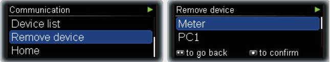

* In [Configuration > Pump](#Config-Builder-pump), select the **Accu-Chek Insight** card. Only one pump can be active at a time.

   

   Once it is selected, the **Accu-Chek Insight** card shows two buttons, **Settings** and **Open plugin**:

   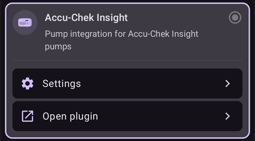

   **Settings** opens the settings of the Accu-Chek Insight driver (see [Settings in AAPS](#Accu-Chek-Insight-Pump-settings-in-aaps)).

   **Open plugin** (or **Manage → Pump**) opens the Accu-Chek Insight pump screen. Before a pump is paired it looks like this:

   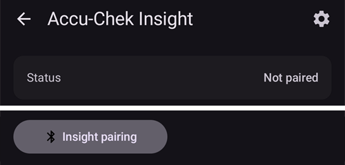

(accu-chek-insight-pairing)=
### Pairing

* On the pump screen, tap **Insight pairing**. The pairing wizard opens and searches for nearby Bluetooth devices (top of the picture below).
* On the Insight pump, go to **Menu** > **Settings** > **Communication** > **Add Device**. The pump shows the following screen (bottom of the picture below) with the serial number of the pump.

   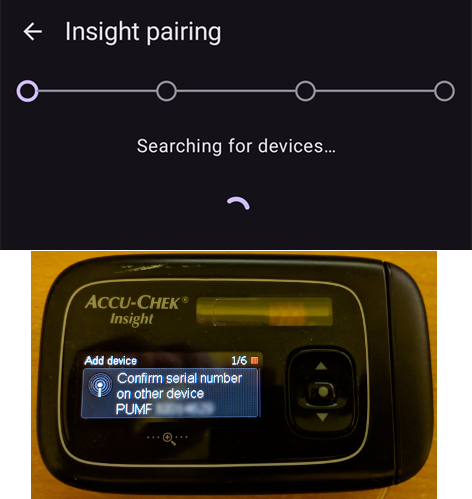

* Back on your phone, tap the pump serial number in the list of Bluetooth devices. If Android asks you to confirm the pairing, tap **Pair**.

   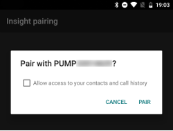

* The pump and the phone both show a code. Check that the codes are the same on both devices. Confirm on the pump, and tap **Yes** on the phone. (Tap **No** if the codes do not match.)

   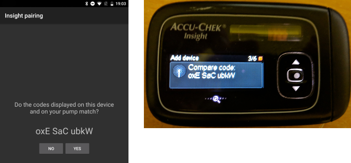

* The phone shows **Pairing completed**. Tap **Exit** to return to the pump screen.

   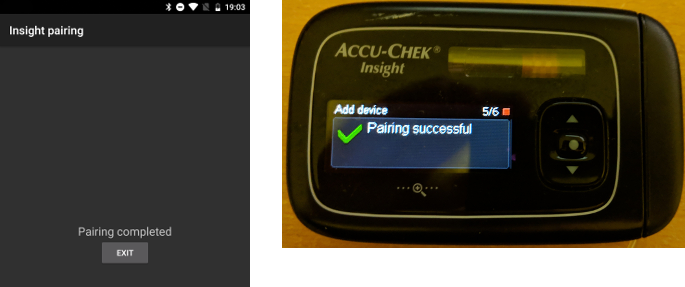

* To check that all is well, look at the pump screen (**Manage → Pump**). Once the pump is paired, it shows information about the pump, such as **Serial number**, **Manufacturing date**, **Release software version** and **Bluetooth address**.

   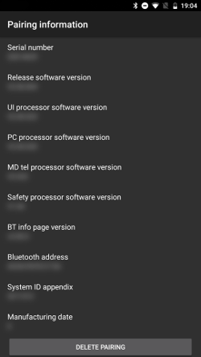

   ```{admonition} Older screenshot
   :class: note
   Apart from the top of the first picture, the pairing screenshots above are from an earlier **AAPS** version and may look different in **AAPS** 4.
   ```

* To remove the pairing, tap **Unpair** on the pump screen and confirm **Reset pairing information?**. The **Insight pairing** button then appears again.

Note: There is no permanent connection between the pump and the phone. **AAPS** only connects when needed (for example to set a temporary basal rate, give a bolus or read the pump history). Otherwise the batteries of the phone and the pump would drain far too fast.

(Accu-Chek-Insight-Pump-settings-in-aaps)=
## Settings in AAPS

Open the settings with **Settings** on the **Accu-Chek Insight** card in **Configuration** > **Pump**, or with the gear icon in the top-right corner of the pump screen.

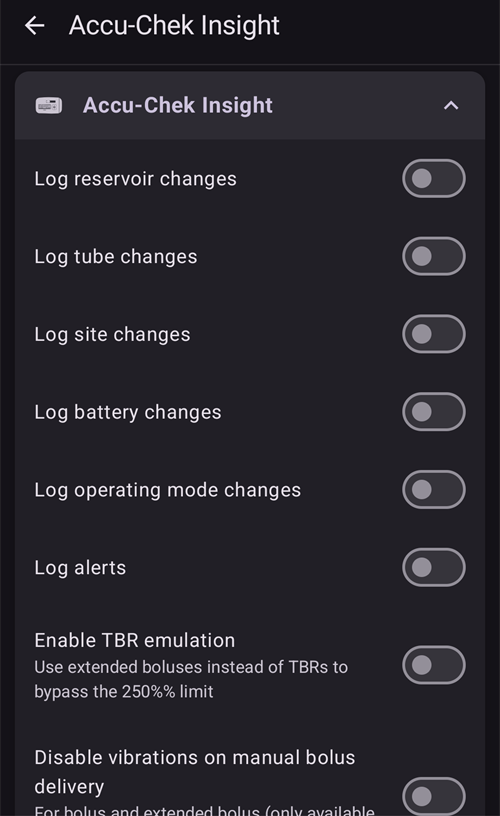

In the Insight settings in **AAPS** you can enable the following options:
* **Log reservoir changes**: automatically records an insulin cartridge change when you run the "fill cannula" program on the pump.

* **Log tube changes**: adds a note to the **AAPS** database when you run the "tube filling" program on the pump.

* **Log site changes**: adds a note to the **AAPS** database when you run the "cannula filling" program on the pump. **Note: A site change also resets Autosens.**

* **Log battery changes**: records a battery change when you put a new battery in the pump.

* **Log operating mode changes**: adds a note to the **AAPS** database whenever you start, stop or pause the pump.

* **Log alerts**: adds a note to the **AAPS** database whenever the pump issues an alert (except reminders, bolus and TBR cancellation, which are not recorded).

* **Enable TBR emulation**: the Insight pump can only set temporary basal rates (TBRs) up to 250%. To get around this limit, TBR emulation tells the pump to deliver an extended bolus for the extra insulin if a TBR of more than 250% is requested.

  **Note: Only use one extended bolus at a time. Several extended boluses at the same time might cause errors.**

* **Disable vibrations on manual bolus delivery**: stops the Insight pump from vibrating when it delivers a manual bolus (or extended bolus). Only available with Insight firmware 3.x.

* **Disable vibrations on automated bolus delivery**: stops the Insight pump from vibrating when it delivers an automatic bolus (SMB or temp basal with TBR emulation). Only available with Insight firmware 3.x.

* **Min. recovery duration [s]** and **Max. recovery duration [s]**: how long **AAPS** waits before trying again after a failed connection attempt. You can choose from 0 to 20 seconds. If you have connection problems, choose a longer wait time.
    <br><br>Example for min. recovery duration = 5 and max. recovery duration = 20
    <br><br>no connection -> wait <b>5</b> sec.
      <br>  retry -> no connection -> wait <b>6</b> sec.
      <br>  retry -> no connection -> wait <b>7</b> sec.
      <br>  retry -> no connection -> wait <b>8</b> sec.
      <br>...
      <br>retry -> no connection -> wait <b>20</b> sec.
      <br>retry -> no connection -> wait <b>20</b> sec.
      <br>...

* **Disconnect delay [s]**: how long (in seconds) **AAPS** waits before disconnecting from the pump after an operation is finished. You can choose from 0 to 15 seconds. The default value is 5 seconds.

For periods when the pump was stopped, **AAPS** logs a temporary basal rate of 0%.

### The pump screen

The Accu-Chek Insight pump screen (**Manage → Pump**) shows the current status of the pump, for example **Status**, **Last connected**, **Operating mode**, **Battery**, **Reservoir level**, today's total daily doses (**TDD Bolus**, **TDD Basal**), basal rates and the last bolus. Once the pump is paired, it has these buttons:
* **Refresh**: refreshes the pump status.
* **Enable notification of TBR end (pump setting)** / **Disable notification of TBR end (pump setting)**: a standard Insight pump sounds an alarm when a TBR finishes. This button turns that alarm on or off without the need for configuration software.
* **Unpair**: removes the pairing with the pump (see [Pairing](#accu-chek-insight-pairing)).

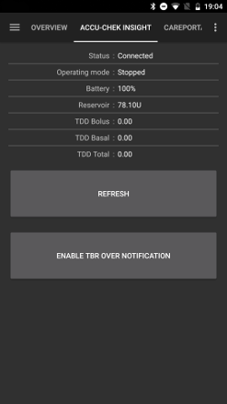

```{admonition} Older screenshot
:class: note
The screenshot above is from an earlier **AAPS** version. In **AAPS** 4 the pump screen looks different and also has an **Unpair** button.
```

## Settings in the pump

Configure alarms in the pump as follows:
* Menu > Settings > Device settings > Mode settings > Quiet > Signal > Sound
* Menu > Settings > Device settings > Mode settings > Quiet > Volume > 0 (remove all bars)
* Menu > Modes > Signal mode > Quiet

This will silence all alarms from the pump, allowing AAPS to decide if an alarm is relevant to you. If AAPS does not acknowledge an alarm, its volume will increase (first beep, then vibration).

(Accu-Chek-Insight-Pump-vibration)=
### Vibration

Depending on the firmware version of your pump, the Insight will vibrate briefly every time a bolus is delivered (for example, when AAPS issues an SMB or TBR emulation delivers an extended bolus).

* Firmware 1.x: No vibration by design.
* Firmware 2.x: Vibration cannot be disabled.
* Firmware 3.x: AAPS delivers bolus silently. (minimum [version 2.6.1.4](#Releasenotes-version-2-6-1-4))

Firmware version can be found in the menu.

## Battery replacement

Battery life for Insight when looping range from 10 to 14 days, max. 20 days. The user reporting this is using Energizer lithium batteries.

The Insight pump has a small internal battery to keep essential functions like the clock running while you are changing the removable battery. If changing the battery takes too long, this internal battery may run out of power, the clock will reset, and you will be asked to enter a new time and date after inserting a new battery. If this happens, all entries in AAPS prior to the battery change will no longer be included in calculations as the correct time cannot be identified properly.

(Accu-Chek-Insight-Pump-insight-specific-errors)=
## Insight specific errors

### Extended bolus

Just use one extended bolus at a time as multiple extended boluses at the same time might cause errors.

### Time out

Sometimes the Insight pump does not answer while **AAPS** sets up the connection. **AAPS** then shows the notification "Timeout during handshake - reset bluetooth".

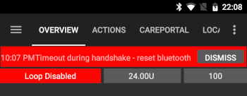

If this happens, turn off Bluetooth on the pump AND on the phone for about 10 seconds, then turn it back on.

## Crossing time zones with Insight pump

For information on traveling across time zones see section [Timezone traveling with pumps](#timezone-traveling-insight).

## Where to get help

Development of the Insight driver is done by the community on a **volunteer** basis. Before requesting help, please:

1. **Read** the relevant section of this documentation to confirm how the feature is meant to work.
2. **Ask** on the *#AAPS* channel on [Discord](https://discord.gg/4fQUWHZ4Mw), or in one of the other [community channels](../GettingHelp/WhereCanIGetHelp.md).
3. **Report a bug** by searching the [existing issues](https://github.com/nightscout/AndroidAPS/issues); if yours is not listed, open a [new issue](https://github.com/nightscout/AndroidAPS/issues) and attach your [log files](../GettingHelp/AccessingLogFiles.md).

When asking for help, include your phone make and model, Android version, **AAPS** version, and a plain-English description of the problem (what changed, when it last worked).

