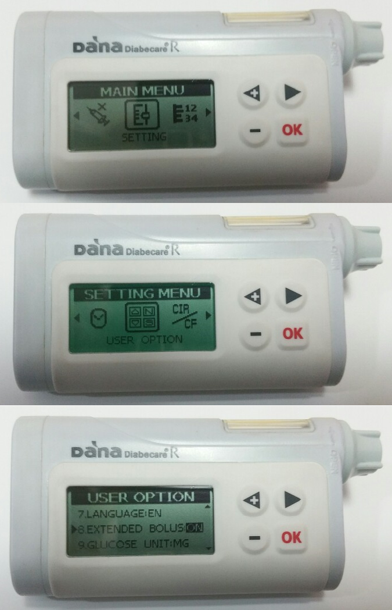

# DanaR

_These instructions are for configuring the app and your pump if you have a DanaR.  Visit [DanaRS Insulin Pump](./DanaRS-Insulin-Pump.md) if you have the DanaRS launched in 2017 instead._

## Pump capabilities with AAPS

* Communicates with **AAPS** over your phone's native Bluetooth, without an additional communication device.
* Timezone and DST changes need no special action, as the pump does not use its own history.

## Setup

* In the pump go to Main Menu > Setting > User Option
* Turn on "8. Extended Bolus"

* Go to Main Menu > Setting > Discovery
* In phone settings go to Bluetooth, scan for nearby devices, select your DanaR serial number and input your password (Pairing password is  0000).  If DanaR is not showing in scan then restart phone and take DanaR battery out, replace and start these two steps again.

* In AAPS go to Config Builder and select the type of DanaR you have (DanaR, DanaR Korean, DanaRv2)
* Select Menu by tapping the 3 dots in the top right. Select Preferences.
* Select DanaR Bluetooth device, and click your DanaR serial number.
* Select Pump password, and input your password. (Default password is 1234)
* If you want AAPS to allow basal rate above 200%, enable Use extended boluses for >200%. Note this means you cannot loop with high TBRs while using extended boluses for food.
* In Preferences under DanaR pump settings you can change the default bolus speed used (12sec per 1u, 30sec per 1u or 60sec per 1u).
* Set basal step on pump to 0.01 U/h
* Set bolus step on pump to 0.1 U/h
* Enable extended boluses on pump

## Timezone traveling with Dana R pump

For information on traveling across time zones see section [Timezone traveling with pumps](#timezone-traveling-danarv2-danars).

## Where to get help

Development of the DanaR driver is done by the community on a **volunteer** basis. Before requesting help, please:

1. **Read** the relevant section of this documentation to confirm how the feature is meant to work.
2. **Ask** on the *#AAPS* channel on [Discord](https://discord.gg/4fQUWHZ4Mw), or in one of the other [community channels](../GettingHelp/WhereCanIGetHelp.md).
3. **Report a bug** by searching the [existing issues](https://github.com/nightscout/AndroidAPS/issues); if yours is not listed, open a [new issue](https://github.com/nightscout/AndroidAPS/issues) and attach your [log files](../GettingHelp/AccessingLogFiles.md).

When asking for help, include your phone make and model, Android version, **AAPS** version, and a plain-English description of the problem (what changed, when it last worked).
