# DanaRS and Dana-i

_These instructions are for configuring the app and your pump if you have a DanaRS from 2017 onwards or the newer Dana-i. Visit [DanaR Insulin Pump](./DanaR-Insulin-Pump.md) if you have the original DanaR instead._

**New Dana RS firmware v3 can be used from AAPS version 2.7 onwards.**

**New Dana-i can be used from AAPS version 3.0 onwards.**

* In DanaRS/i pump "BASAL A" is used by the app. Existing data gets overwritten.

```{contents} Table of contents
:depth: 1
:local: true
```

## Pump capabilities with AAPS

* Communicates with **AAPS** over your phone's native Bluetooth, without an additional communication device.
* DST and timezone changes must be handled manually (see [Timezone traveling](#timezone-traveling-danarv2-danars)).

(DanaRS-Insulin-Pump-pairing-pump)=
## Pairing pump

* Open the **menu** (☰) in the top-left corner of the **AAPS** main screen and select **Configuration**.
* Tap **Pump** and select **Dana-i/RS**.

  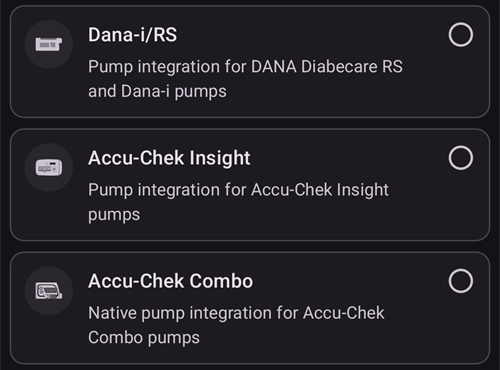

  Once it is selected, the **Dana-i/RS** card shows two buttons, **Settings** and **Open plugin**:

  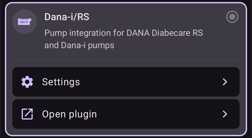

  **Settings** opens the settings of the Dana-i/RS driver:

  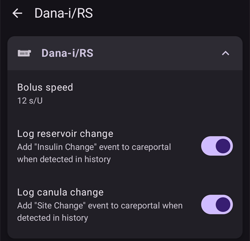

  **Open plugin** (or **Manage** > **Pump**) opens the Dana-i/RS pump screen. Before a pump is paired it looks like this:

  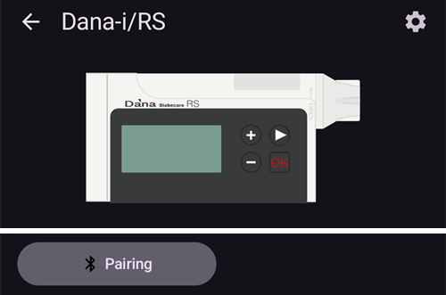

* On the pump screen, tap **Pairing**. **AAPS** scans for nearby pumps.
* Tap the entry for your pump in the list.

  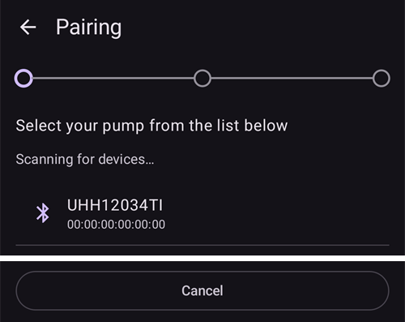

* **You have to confirm the pairing on the pump!** This works the same way as other Bluetooth pairings you may know (for example, smartphone and car audio).

  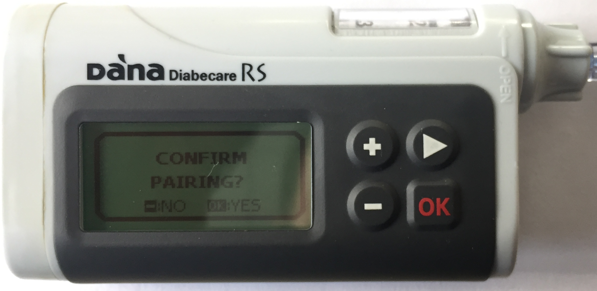

* Follow the pairing process based on the type and firmware of your pump:

   * For DanaRS v1, **AAPS** asks for the **Pump password (v1 only)**. Enter your pump password (see [Default password](#DanaRS-Insulin-Pump-default-password)).
   * For DanaRS v3, **AAPS** asks you to press OK on the pump and type the 2 sequences of numbers and letters shown on the pump. Keep the pump display on by pressing the minus button until you have finished. Then tap **Done**.
   * For Dana-i, the standard Android pairing dialog appears. Enter the 6-digit number shown on the pump.

* When **Pairing successful!** is shown, tap **Done**.

  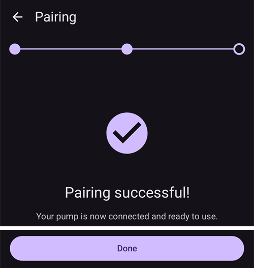

  You are back on the pump screen, which now shows your pump's status.

  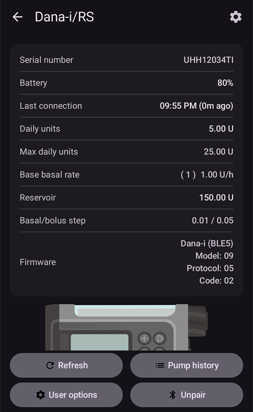
* In **Settings**, select **Bolus speed** to change the default bolus speed (12 s/U, 30 s/U or 60 s/U).
* Set basal step on pump to 0.01 U/h using Doctors menu (see pump user guide).
* Set bolus step on pump to 0.05 U/h using Doctors menu (see pump user guide).
* Enable extended boluses on pump

(DanaRS-Insulin-Pump-default-password)=

### Default password

* For DanaRS with firmware v1 and v2 the default password is 1234.
* For DanaRS with firmware v3 or Dana-i the default password is derived from the manufacturing date and calculates as MMDD where MM is the month and DD is the day, the pump was produced (i.e. '0124' representing month 01 and day 24). 

  * From MAIN MENU select REVIEW then open SHIPPING INFORMATION from the sub menu
  * Number 3 is manifacturing date. 
  * For v3/i this password is used only for locking menu on pump. It's not used for communication and it's not necessary to enter it in AAPS.

(DanaRS-Insulin-Pump-change-password-on-pump)=
## Change password on pump

* Press OK button on pump
* In main menu select "OPTION" (move right by pressing arrow button several times)

  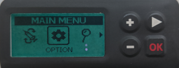

* In options menu select "USER OPTION"

  
  
* Use arrow button to scroll down to "11. password"

  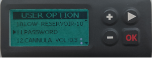
  
* Press OK to enter old password.

* Enter **old password** (Default password see [above](#DanaRS-Insulin-Pump-default-password)) and press OK

  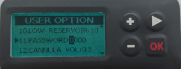

* If wrong password is entered here there will be no message indicating failure!
* Set **new password** (Change numbers with + & - buttons / Move right with arrow button).

  
  
* Confirm with OK button.
* Press OK to save setting.

  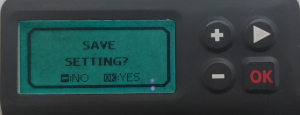
  
* Move down to "14. EXIT" and press OK to exit.

  

(DanaRS-Insulin-Pump-dana-rs-specific-errors)=
## Dana RS specific errors

### Error during insulin delivery
In case the connection between AAPS and Dana RS is lost during bolus insulin delivery (i.e. you walk away from phone while Dana RS is pumping insulin) you will see the following message and hear an alarm sound.

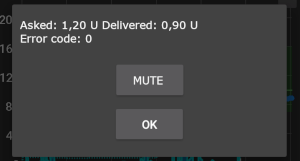

* In most cases this is just a communication issue and the correct amount of insulin is delivered.
* Check in the pump history that the correct bolus was given. You can do this on the pump itself, or in **AAPS** on the pump screen (**Manage** > **Pump**) > **Pump history** > **Boluses**.
* Delete the error entry in [treatments](#screens-bolus-carbs) if you wish.
* The real amount is read and recorded at the next connection. To force this, tap **Refresh** on the pump screen, or just wait for the next connection.

## Special note when switching phone

When switching to a new phone the following steps are necessary:
* [Export settings](../Maintenance/ExportImportSettings.md) on your old phone
* Transfer settings from old to new phone

### DanaRS v1
* **Manually pair** Dana RS with the new phone
* If you tick **Also replace pump settings** when importing, the pump connection settings are imported too and AAPS on your new phone will already "know" the pump and therefore not start a Bluetooth scan. Therefore new phone and pump must be paired manually.
* Install AAPS on the new phone.
* [Import settings](../Maintenance/ExportImportSettings.md) on your new phone

### DanaRS v3, Dana-i
* Start pairing procedure as described [above](#DanaRS-Insulin-Pump-pairing-pump).
* Sometimes you may need to clear the pairing information in **AAPS** first. On the pump screen (**Manage** > **Pump**), tap **Unpair** and confirm **Reset pairing information?**. Then tap **Pairing** again.

## Timezone traveling with DanaRS and Dana-i pumps

For information on traveling across time zones see section [Timezone traveling with pumps](#timezone-traveling-danarv2-danars).

## Where to get help

Development of the DanaRS/Dana-i driver is done by the community on a **volunteer** basis. Before requesting help, please:

1. **Read** the relevant section of this documentation to confirm how the feature is meant to work.
2. **Ask** on the *#AAPS* channel on [Discord](https://discord.gg/4fQUWHZ4Mw), or in one of the other [community channels](../GettingHelp/WhereCanIGetHelp.md).
3. **Report a bug** by searching the [existing issues](https://github.com/nightscout/AndroidAPS/issues); if yours is not listed, open a [new issue](https://github.com/nightscout/AndroidAPS/issues) and attach your [log files](../GettingHelp/AccessingLogFiles.md).

When asking for help, include your phone make and model, Android version, **AAPS** version, and a plain-English description of the problem (what changed, when it last worked).
