# Diaconn G8

```{contents} Table of contents
:depth: 1
:local: true
```

## Pump capabilities with AAPS

* Communicates with **AAPS** over your phone's native Bluetooth, without an additional communication device.
* DST and timezone changes must be handled manually.

## Insulin Pump Bluetooth Pairing

- Tap the **menu** (☰) in the top-left corner.


- Tap **Configuration** > **Pump** and select **Diaconn G8**.


Once it is selected, the **Diaconn G8** card shows two buttons, **Settings** and **Open plugin**:

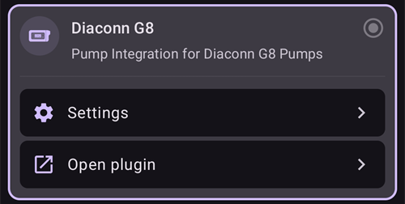

**Settings** opens the settings of the Diaconn G8 driver (see [Diaconn G8 insulin pump option setting](#diaconn-g8-insulin-pump-option-setting) below).

**Open plugin** (or **Manage** > **Pump**) opens the Diaconn G8 pump screen. Before a pump is paired it looks like this:

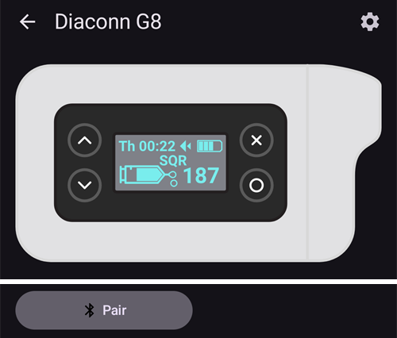

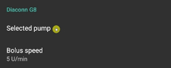

```{admonition} Older screenshot
:class: note
The screenshot above is from an earlier **AAPS** version. In **AAPS** 4 pairing starts from the **Pair** button on the pump screen; there is no **Selected pump** setting.
```

- On the pump screen, tap **Pair**. The **Diaconn Pump Pairing** screen opens and **AAPS** scans for nearby pumps.
- Tap your insulin pump's model number once it appears in the list (for example **DIACONN-65010**).

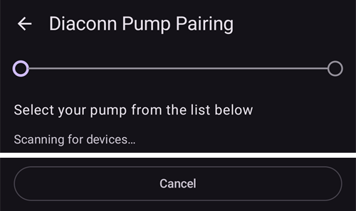

- There are two options to check your model number:

1. The last 5 digits of the SN number on the back of the pump.
2. Click on O button > Information > BLE > Last 5 digits.

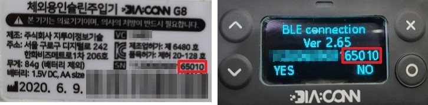

- Once you select your pump, a window appears asking for a PIN code. Enter the PIN number displayed on your pump to complete the connection.

 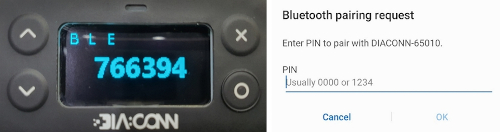

- When **Pairing successful!** is shown, tap **OK** to go back to the pump screen.

## Pump status check and log synchronization

- Once your pump is connected, open the pump screen (**Manage** > **Pump**). It shows the pump status (battery, reservoir, last connection, last bolus, basal rate and more).
- Tap **Refresh** to connect to the pump, update the status and synchronize the logs.
- Tap **Pump history** to see the history read from the pump.

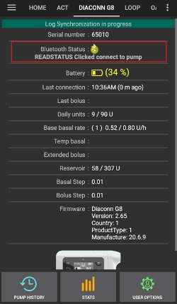

```{admonition} Older screenshot
:class: note
The screenshot above is from an earlier **AAPS** version. In **AAPS** 4 the pump status is shown on the pump screen (**Manage** > **Pump**) and synchronized with the **Refresh** button.
```

(diaconn-g8-bluetooth-troubleshooting)=

## Bluetooth Troubleshooting

**What to do in the case of an unstable Bluetooth connection with the pump.**

### Method 1) Restart AAPS, then check the pump again

- Tap the **menu** (☰) in the top-left corner.
- Tap **Exit** at the bottom of the menu.


- Start **AAPS** again and check the connection to the pump.

### Method 2) If the first method doesn't work, disconnect Bluetooth and then reconnect.

- Press and hold the Bluetooth button at the top for about 3 seconds.

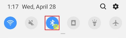

- Click on the Setting button on the paired Diaconn G8 Insulin pump.

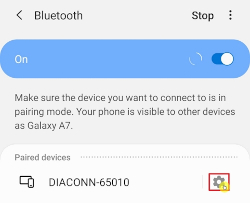

- Unpair.

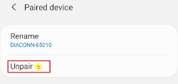

- In **AAPS**, open the pump screen (**Manage** > **Pump**), tap **Unpair** and confirm **Reset pairing information?**.
- Repeat the Bluetooth pairing process for the pump (see above).

## Further Information

(diaconn-g8-insulin-pump-option-setting)=

### Diaconn G8 Insulin pump option setting

- **Configuration** > **Pump** > **Diaconn G8** > **Settings**
- Or, on the pump screen (**Manage** > **Pump**), tap the settings icon (cog wheel) in the top-right corner.

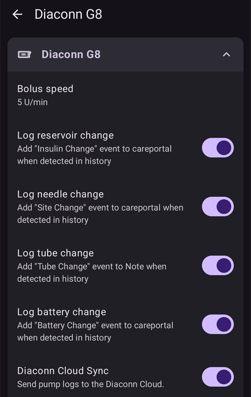

- **Bolus speed** sets how fast the pump delivers a bolus.
- If the **Log reservoir change** option is activated, the relevant details are automatically uploaded to the careportal when an "Insulin Change" event occurs.
- If the **Log needle change** option is activated, the relevant details are automatically uploaded to the careportal when a "Site Change" event occurs.
- If the **Log tube change** option is activated, the relevant details are automatically added as a note when a "Tube Change" event occurs.
- If the **Log battery change** option is activated, the relevant details are automatically uploaded to the careportal when a "Battery Change" event occurs. You can also record a battery change yourself with **Manage** > **Pump Battery Change**. (Note: To change the battery, please stop all in-progress injection functions before proceeding.)
- **Diaconn Cloud Sync** sends the pump logs to the Diaconn Cloud.

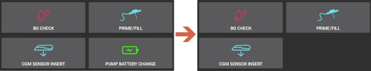

```{admonition} Older screenshot
:class: note
The screenshot above is from an earlier **AAPS** version. In **AAPS** 4 a battery change is recorded with **Manage** > **Pump Battery Change**; there is no **Actions** tab.
```

### Extended Bolus function

- If you use extended bolus it will disable closed loop.
- See [this page](#extended-bolus-and-why-they-wont-work-in-closed-loop-environment) for details why extended bolus does not work in a closed loop environment.

## Where to get help

Development of the Diaconn G8 driver is done by the community on a **volunteer** basis. Before requesting help, please:

1. **Read** the relevant section of this documentation to confirm how the feature is meant to work.
2. **Ask** on the *#AAPS* channel on [Discord](https://discord.gg/4fQUWHZ4Mw), or in one of the other [community channels](../GettingHelp/WhereCanIGetHelp.md).
3. **Report a bug** by searching the [existing issues](https://github.com/nightscout/AndroidAPS/issues); if yours is not listed, open a [new issue](https://github.com/nightscout/AndroidAPS/issues) and attach your [log files](../GettingHelp/AccessingLogFiles.md).

When asking for help, include your phone make and model, Android version, **AAPS** version, and a plain-English description of the problem (what changed, when it last worked).
