# EOPatch2

The patch needs rapid-acting U-100 insulin, such as NovoRapid or Humalog. Use the rapid-acting insulin your doctor has prescribed for you.

The smallest dose the patch can deliver is 0.05 U. Set every basal rate in your **Profile** to at least 0.05 U/hr, in steps of 0.05 U/hr. Otherwise the total insulin your **Profile** expects and the insulin the patch actually delivers may not match. In the same way, boluses must be at least 0.05 U.

```{contents} Table of contents
:depth: 1
:local: true
```

## Pump capabilities with AAPS

* Communicates with **AAPS** over your phone's native Bluetooth, without an additional communication device.
* DST and timezone changes must be handled manually.

## Pump setup

1. Open the **menu** (☰) in the top-left corner of the **AAPS** main screen and select **Configuration**.
1. In the **Pump** section, select **EOPatch2**.
1. Press the Back key to return to the main screen.


Once it is selected, the **EOPatch2** card shows two buttons, **Settings** and **Open plugin**:

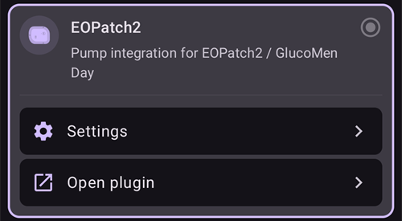

## Settings

Open the EOPatch2 settings in one of two ways:

* press **Settings** on the **EOPatch2** card in **Configuration**, or
* open the pump screen (**Manage** → **Pump**) and press the gear icon in the top-right corner.

There are three settings:

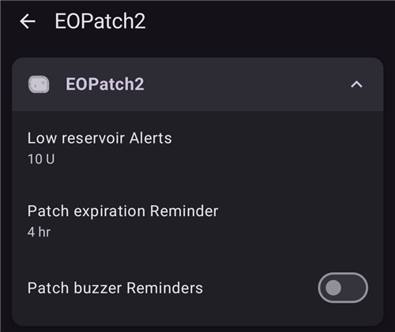

### Low reservoir Alerts

A warning appears when the insulin left in the patch drops to this amount or less. You can set it from 10 to 50 U, in steps of 5 U. The default is 10 U.

### Patch expiration Reminder

Reminds you how much time is left before the current patch expires. You can set it from 1 to 24 hours, in steps of 1 hour. The default is 4 hours.

### Patch buzzer Reminders

When this is on, the patch beeps when a bolus, extended bolus or temporary basal starts and when it ends. It has no effect on your normal basal. The default is off.

## Activating a new patch

### Open the activation wizard

Open the pump screen with **Manage** → **Pump** (or press **Open plugin** on the **EOPatch2** card in **Configuration**). When no patch is active, the screen shows **Not activated** and an **Activate Patch** button at the bottom.

Press **Activate Patch** to start the wizard.

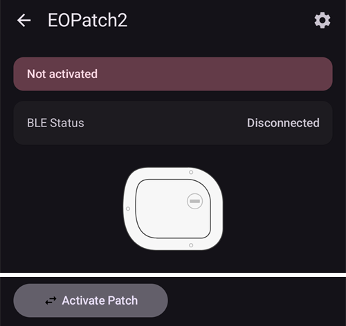

The wizard guides you through each step. The row of dots at the top shows how far along you are.

```{note}
If you have never activated a **Profile** in **AAPS**, the wizard first shows a **Profile required** page. Select the profile to use and press **Activate profile**.
```

### Filling Insulin

Insert the syringe needle into the insulin fill port on the patch. Slowly push the plunger to fill the patch. Once there is more than 80 U in the patch, it beeps once and starts up (boots).

When you hear the beep, press **Start pairing**.

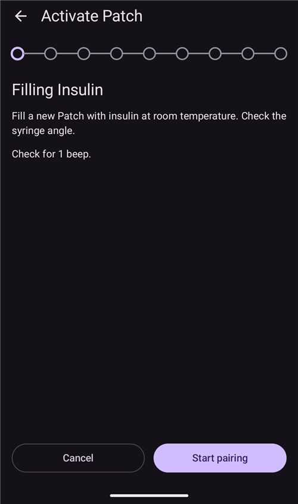

```{warning}
- Do not turn the needle action lever until the wizard tells you to. Turning it too early can cause serious problems during filling or the safety check.
- The patch holds 80 to 200 U. If you put in less than 80 U, the patch does not work.
- Take the insulin out of the refrigerator 15 to 30 minutes before filling, so it reaches room temperature. The insulin must be at least 10°C.
```

### Patch pairing

**AAPS** now tries to pair with the patch automatically. During pairing, two Android Bluetooth pairing requests appear. Press **OK** on the first one. Press **OK** again on the second one, which shows a passkey.

```{warning}
- Keep the patch and your phone within 30 cm of each other while pairing.
- After the patch has booted, it beeps every 3 minutes until pairing is complete.
- You must finish activating the patch within 60 minutes of it booting. If you cannot, discard the patch.
```

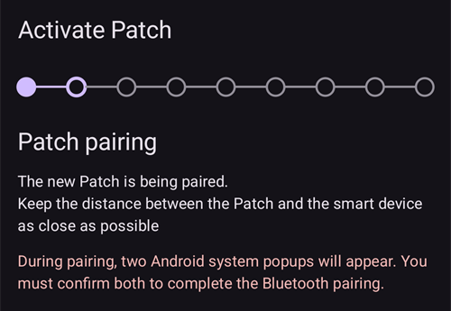
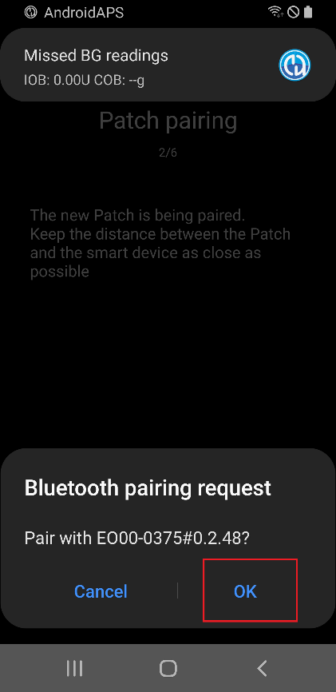
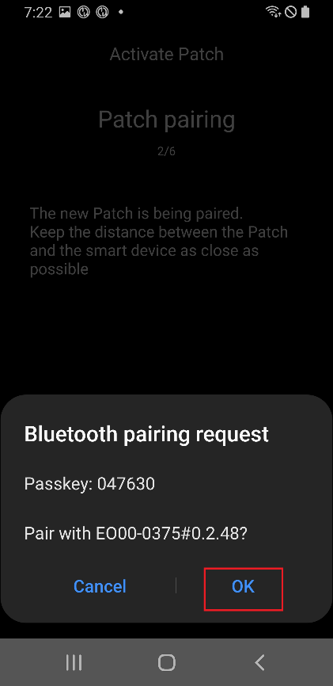

```{admonition} Older screenshot
:class: note
The two Bluetooth pairing screenshots are from an earlier **AAPS** version: the **AAPS** screen behind the Android pairing request looks different in **AAPS** 4.
```

### Select insulin

Select the insulin you filled the patch with and press **Next**. **AAPS** applies a profile switch with this insulin after activation.

### Prepare for attaching the Patch

Remove the adhesive tape from the patch, then press **Next**.

If a needle sticks out, or if the patch is wet, dirty or its adhesive tape is folded, press **Discard** instead and use a new patch.

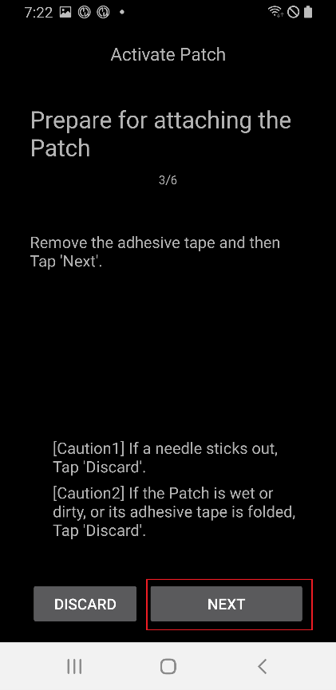

### Site location

This step only appears if **Manage pump site rotation** is turned on in the site rotation settings. Tap the place on the body diagram where you will attach the patch and press **Next**, or press **Skip**.

### Attaching the Patch

Insulin should go into a spot with fatty tissue under the skin, but few nerves or blood vessels. The abdomen, arm or thigh are good choices. Clean and dry the site, then attach the patch to your skin.

Check the infusion site, then press **Start safety check**.

```{warning}
- Press down the edges of the patch tape evenly, so the whole patch sticks firmly to your skin.
- If the patch does not stick completely, air can get between the patch and your skin. This weakens the adhesive and the water resistance of the patch.
```

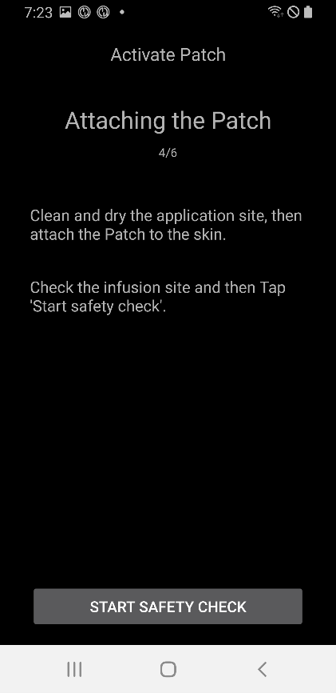

### Safety check

The safety check takes about 30 seconds. When it is finished, the patch beeps once. If it fails, press **Retry**.

```{warning}
For safe use, do not turn the needle action lever until the safety check is complete.
```

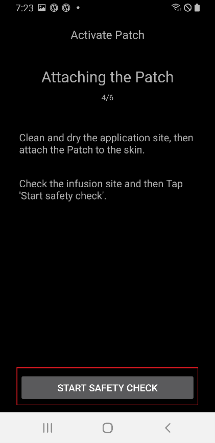


```{admonition} Older screenshot
:class: note
The screenshots from **Prepare for attaching the Patch** to **Safety check** are from an earlier **AAPS** version and may look different in **AAPS** 4.
```

### Inserting the needle

Hold the patch firmly. Turn the needle action lever upward by more than 100° to insert the needle. The patch beeps once when the needle is inserted correctly. Then keep turning the lever all the way to remove it. Press **Next**.

```{caution}
If you go to the next step without hearing the beep, a **Needle insertion Error** appears. Check for the beep and press **Retry**. If the error remains, press **Discard** to deactivate the patch.
```

### Patch activation completed

The last page confirms that the patch is active and that it will remind you when it nears its expiration time. Press **Finish** to go back to the pump screen.

## Discarding the patch

Replace the patch when it is low on insulin, when it expires, or if it is faulty. We recommend using each patch for no more than 84 hours after it boots.

1. Open the pump screen (**Manage** → **Pump**). While a patch is active, press **Discard Patch**.
1. The **Discard Patch** page shows the time left and the insulin left in the patch. Press **Discard Patch**.
1. A dialog asks you to confirm. Press **Discard Patch** again.
1. When the patch has been deactivated, the wizard shows **Discarding the patch is completed.** Remove the patch from your body and press **Confirm**.

After that, the wizard continues straight on to activating a new patch (see above). Press the back arrow if you want to stop here.

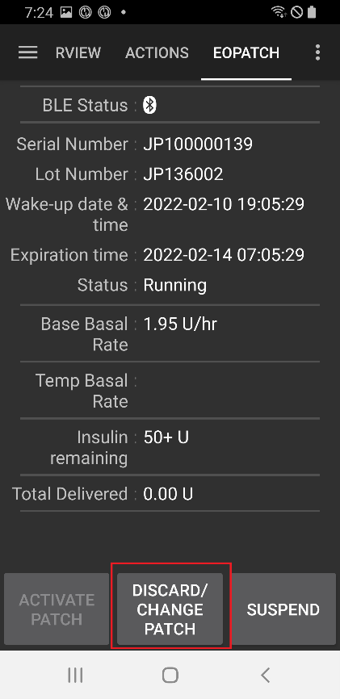
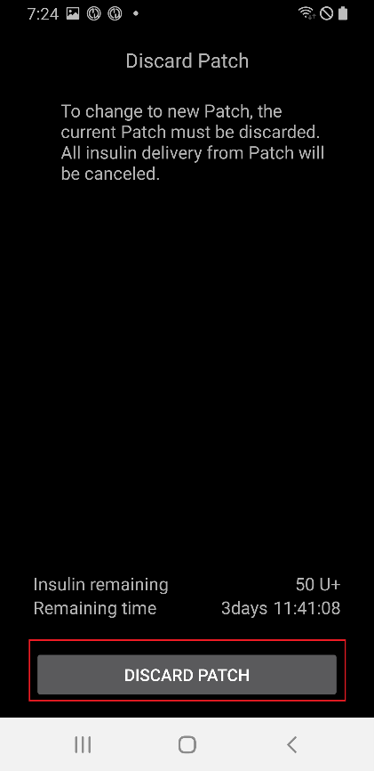
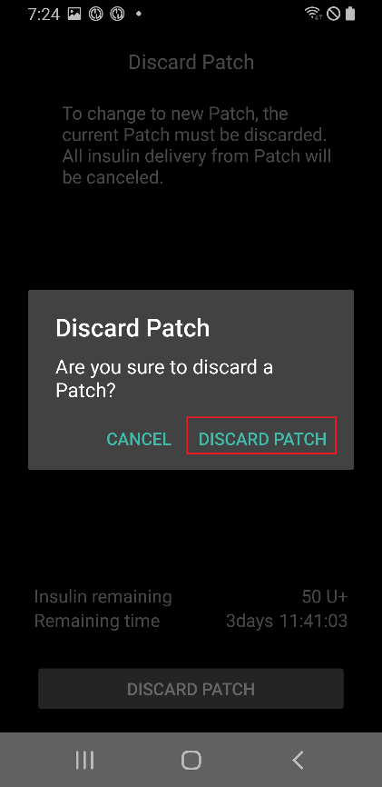


```{admonition} Older screenshot
:class: note
The screenshots above are from an earlier **AAPS** version. In **AAPS** 4 you open the pump screen from **Manage** → **Pump**, and the button on it is labelled **Discard Patch**.
```

```{admonition} If the patch does not respond
:class: warning
If **AAPS** cannot reach the patch, it may show a page about turning off the patch's alarm by hand: remove the patch from your body, peel off the adhesive tape, and use a clip to press firmly into the hole next to the insulin fill port.

The **Discard Patch** page also has a **Force Reset** button. It only clears the patch from **AAPS**, without sending any command to the patch. The patch keeps delivering insulin until its battery runs out or you turn it off by hand. Use it only if a normal discard fails, and remove the patch from your body.
```

## Suspending and resuming insulin delivery

Suspending insulin delivery also cancels any extended bolus and temporary basal. When you resume, these are **not** restarted. While insulin delivery is suspended, the patch beeps every 15 minutes.

### Suspending insulin delivery

1. Open the pump screen (**Manage** → **Pump**) and press **Suspend pump**.
1. A dialog explains what will be suspended. Press **Confirm**.
1. In the **Basal Suspending Time** dialog, choose how long to suspend: 30 min, 1 hr, 1 hr 30 min or 2 hr. Press **Confirm**.

Insulin delivery is suspended for the time you chose.

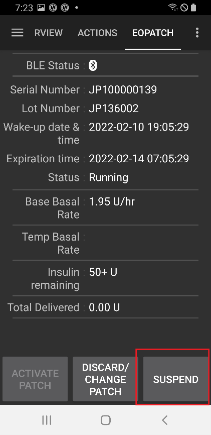
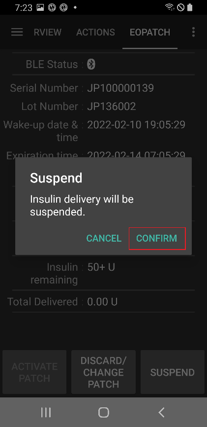
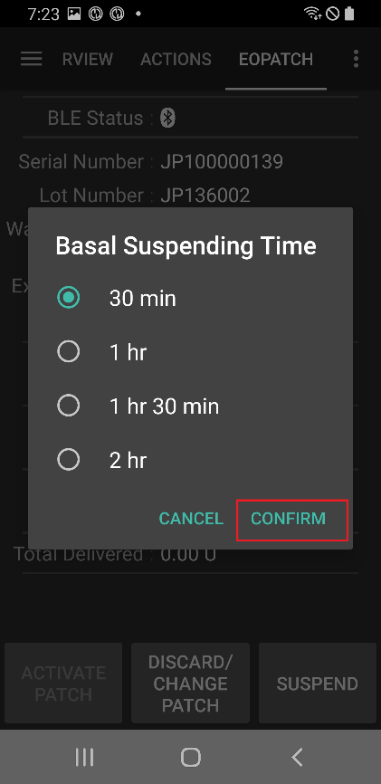

```{admonition} Older screenshot
:class: note
The screenshots above are from an earlier **AAPS** version. In **AAPS** 4 you open the pump screen from **Manage** → **Pump**, and the button on it is labelled **Suspend pump**.
```

### Resuming insulin delivery

1. Open the pump screen (**Manage** → **Pump**) and press **Resume pump**.
1. In the **Resume insulin delivery** dialog, press **Confirm**.

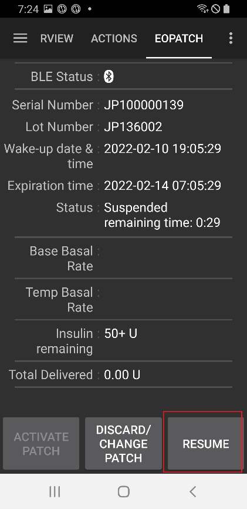
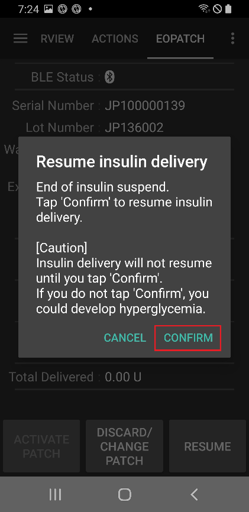

```{admonition} Older screenshot
:class: note
The screenshots above are from an earlier **AAPS** version. In **AAPS** 4 you open the pump screen from **Manage** → **Pump**, and the button on it is labelled **Resume pump**.
```

```{warning}
When the suspend time ends, **AAPS** shows an **End of insulin suspend** warning. Insulin delivery does **not** restart until you confirm it. If you do not, you could develop hyperglycemia.
```

## Alarms and warnings

### Alarms

Alarms are for urgent, top-priority situations and need your action straight away. **AAPS** sounds an alarm that keeps going until you acknowledge it, and shows the message as a notification on the **Overview** screen. An alarm means there is a problem with the patch in use. In many cases the patch has to be discarded and replaced with a new one.

When you press **Confirm** on the notification, **AAPS** handles the alarm. For most alarms, this deactivates the patch. For an **Inappropriate temperature** alarm, the button is **Retry**.

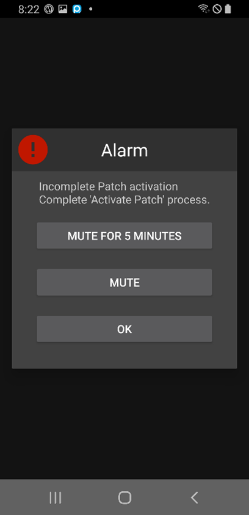
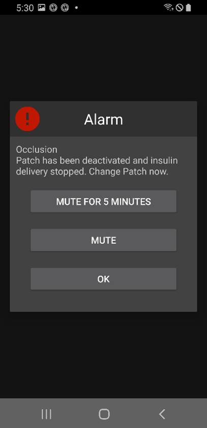

```{admonition} Older screenshot
:class: note
The alarm screenshots are from an earlier **AAPS** version and may look different in **AAPS** 4.
```

The different alarms are explained below.

| Alarm | Explanation |
|-----|-----|
| Empty reservoir | The patch has run out of insulin. |
| Patch expired | The patch's usage time is over, and it cannot deliver any more insulin. |
| Occlusion | The patch's insulin path seems to be blocked. |
| Power on self-test failure | The patch found an unexpected error during its self-test after booting. |
| Inappropriate temperature | The patch is outside its normal operating temperature while you activate or use it. Move the patch to a place with a suitable temperature (4.4 to 37°C). |
| Needle insertion Error | The needle was not inserted correctly during activation. Check that the needle insertion edge of the patch and the needle action lever are in a straight line. |
| Patch battery Error | The patch's internal battery is about to run out and the patch will power off. |
| Patch activation Error | The patch was not fully activated within 60 minutes of booting. |
| Patch Error | The patch found an unexpected error while being activated or used. |

### Warnings

Warnings are for medium- or low-priority situations. A warning appears as a notification on the **Overview** screen.

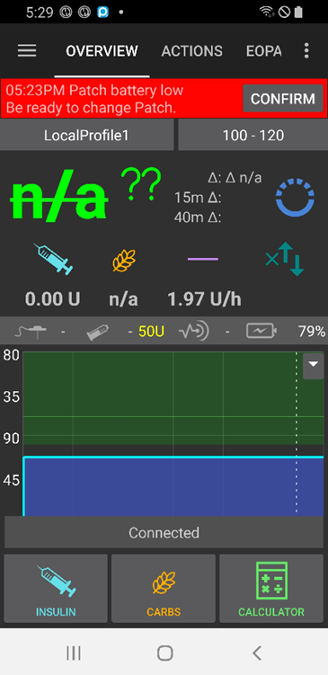

```{admonition} Older screenshot
:class: note
This screenshot is from an earlier **AAPS** version: in **AAPS** 4 the warning appears on the main screen, which looks different.
```

The different warnings are explained below.

| Warning | Explanation |
|----------|-----|
| End of insulin suspend | The suspend time you chose is over. Press **Resume pump** on the notification to restart insulin delivery. |
| Low reservoir | The insulin left in the patch is below the amount set in **Low reservoir Alerts**. |
| Patch operating life expired | The patch's usage period is over. |
| Patch will expire soon | The patch must be discarded in 1 hour. |
| Incomplete Patch activation | Patch activation was interrupted for more than 3 minutes after pairing. Open the pump screen and finish activating the patch. |
| Patch battery low | The patch's battery is low. |

## Where to get help

Development of the EOPatch2 driver is done by the community on a **volunteer** basis. Before requesting help, please:

1. **Read** the relevant section of this documentation to confirm how the feature is meant to work.
2. **Ask** on the *#AAPS* channel on [Discord](https://discord.gg/4fQUWHZ4Mw), or in one of the other [community channels](../GettingHelp/WhereCanIGetHelp.md).
3. **Report a bug** by searching the [existing issues](https://github.com/nightscout/AndroidAPS/issues); if yours is not listed, open a [new issue](https://github.com/nightscout/AndroidAPS/issues) and attach your [log files](../GettingHelp/AccessingLogFiles.md).

When asking for help, include your phone make and model, Android version, **AAPS** version, and a plain-English description of the problem (what changed, when it last worked).
