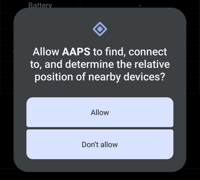

# Equil

These instructions are for configuring the Equil insulin pump. 

```{contents} Table of contents
:depth: 1
:local: true
```

## Pump capabilities with AAPS

* Tubeless patch pump that communicates with **AAPS** over your phone's native Bluetooth, without an additional communication device.
* DST and timezone changes must be handled manually.

## Hardware and software requirements
* **Compatible Equil hardware**

  Currently Equil 5.3 and 5.4 is supported

* [Version 3.3.0.0](#version3300) or newer of AAPS

## Setup

### Select Equil pump

In [Config Builder > Pump](#Config-Builder-pump), switch to **Equil 5.3**.

### Settings


### Activate patch

Navigate to the Equil Tab and press **Pair Equil Patch Pump**.





If you set different password than default 0000 (recommended for your safety), do not forget to store this password on a safe place. This password is stored to the pump. Then this password is asked 
on every next pairing attempt until you do proper unpairing in AAPS. This makes the pump also unusable with original PDA until you unpair pump from AAPS.

## Where to get help

Development of the Equil driver is done by the community on a **volunteer** basis. Before requesting help, please:

1. **Read** the relevant section of this documentation to confirm how the feature is meant to work.
2. **Ask** on the *#AAPS* channel on [Discord](https://discord.gg/4fQUWHZ4Mw), or in one of the other [community channels](../GettingHelp/WhereCanIGetHelp.md).
3. **Report a bug** by searching the [existing issues](https://github.com/nightscout/AndroidAPS/issues); if yours is not listed, open a [new issue](https://github.com/nightscout/AndroidAPS/issues) and attach your [log files](../GettingHelp/AccessingLogFiles.md).

When asking for help, include your phone make and model, Android version, **AAPS** version, and a plain-English description of the problem (what changed, when it last worked).
