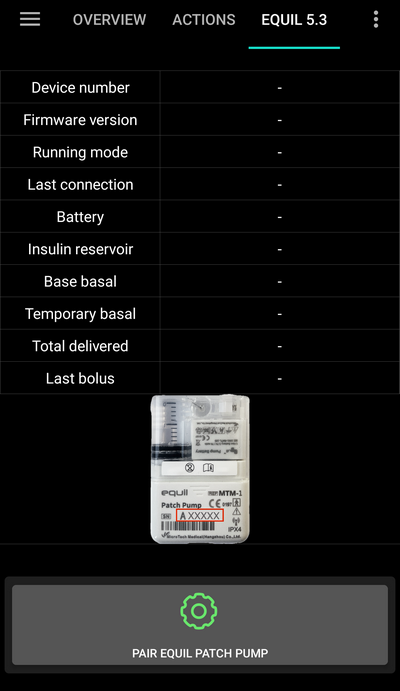

# Equil

These instructions are for configuring the Equil insulin pump. 

## Pump capabilities with AAPS

§todo

## Hardware and Software Requirements
* **Compatible Equil hardware**

  Currently Equil 5.3 and 5.4 is supported

* [Version 3.3.0.0](#version3300) or newer of AAPS

### Select Equil pump

In [Config Builder > Pump](#Config-Builder-pump), switch to **Equil 5.3**.

### Settings

### Activate patch

Navigate to the Equil Tab and press **Pair Equil Patch Pump**.

If you set different password than default 0000 (recommended for your safety), do not forget to store this password on a safe place. This password is stored to the pump. Then this password is asked 
on every next pairing attempt until you do proper unpairing in AAPS. This makes the pump also unusable with original PDA until you unpair pump from AAPS.
