# Equil

These instructions are for configuring the Equil insulin pump.

```{contents} Table of contents
:depth: 1
:local: true
```

## Pump capabilities with AAPS

* Tubeless patch pump that communicates with **AAPS** over your phone's native Bluetooth, without an additional communication device.
* DST and timezone changes must be handled manually.

## Hardware and software requirements
* **Compatible Equil hardware**

  Currently Equil 5.3 and 5.4 are supported.

* [Version 3.3.0.0](#version3300) or newer of AAPS

## Setup

### Select Equil pump

Open the **menu** (☰) in the top-left corner, choose **[Configuration](#Config-Builder-pump)**, and under **Pump** select **Equil**.

Once it is selected, the **Equil** card shows two buttons, **Settings** and **Open plugin**:

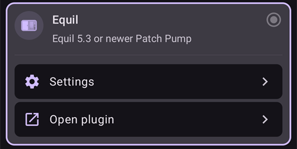

**Open plugin** (or **Manage** → **Pump**) opens the Equil pump screen. Before a pump is paired it looks like this:

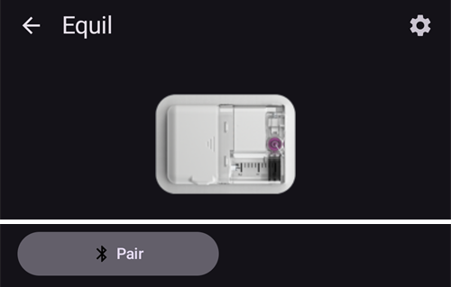

### Settings

Open the Equil settings with **Settings** on the **Equil** card, or with the gear icon in the top-right corner of the pump screen.

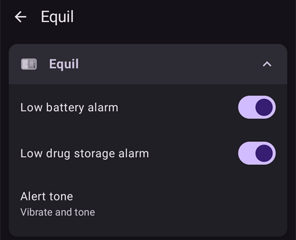

* **Low battery alarm**: warns you when the pump battery is low.
* **Low drug storage alarm**: warns you when the insulin in the reservoir is low.
* **Alert tone**: how the pump alerts you: **Mute**, **Vibrate only**, **Tone only** or **Vibrate and tone**.

```{admonition} Max basal and max bolus on the patch
:class: note
The patch itself refuses any basal rate above a maximum that **AAPS** programs into it. **AAPS** takes the higher of your **max basal** [preference](../SettingUpAaps/Preferences.md) and the highest hourly basal rate in your **Profile**, so the patch always accepts your profile and the temp basals the loop asks for. **AAPS** also sends your maximum allowed bolus to the patch.

When you change your **max basal** or **max bolus**, **AAPS** sends the new values to the patch automatically. They are also sent with every profile switch. There is nothing to set on the patch itself.
```

### Pair the pump

On the pump screen, press **Pair**. A wizard guides you through each step. The row of dots at the top shows how far along you are.

If Android asks whether **AAPS** may find and connect to nearby devices, press **Allow**. **AAPS** needs this to find the pump.

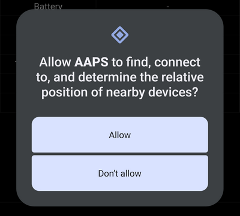

The wizard has these steps. Press **Next** to move on, or **Cancel** to leave the wizard.

1. **Profile required**: only shown if you have never activated a **Profile** in **AAPS**. Select the profile to use and press **Activate profile**.
1. **Assemble pump**: put together the pump, the filled reservoir and the charged battery.

   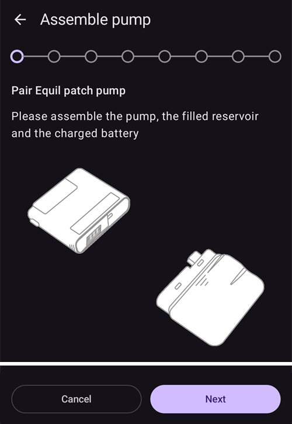

1. **Find Pump**: **AAPS** scans for nearby Equil pumps. Select your pump from the list.

   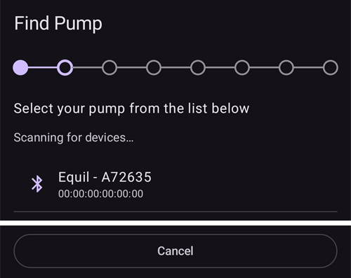
1. **Pair device**: you can enter a pairing password in **Set pair password**. It must be 4 characters long, chosen from `ABCDEF0123456789`. Press **Pair**.

   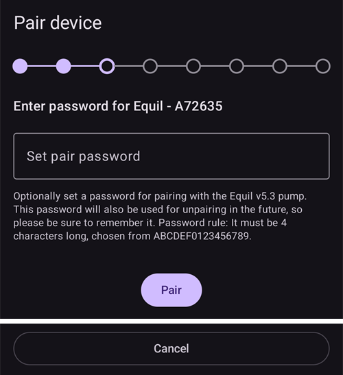

1. **Select Insulin**: only shown if you have more than one insulin set up. Select the insulin in the reservoir.
1. **Prime / Fill**: the pump must **not** be on its base plate. Press **Prime/Fill** and prime the reservoir until there is a drop of insulin on the needle tip. Press **Next**.

   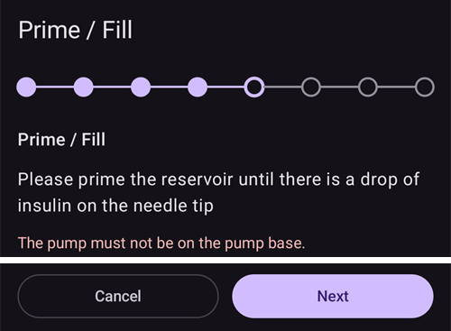
1. **Site Rotation**: only shown if **Manage pump site rotation** is turned on in the site rotation settings. Tap where you will attach the pump, or press **Skip**.
1. **Attach pump**: attach the pump to its base plate.

   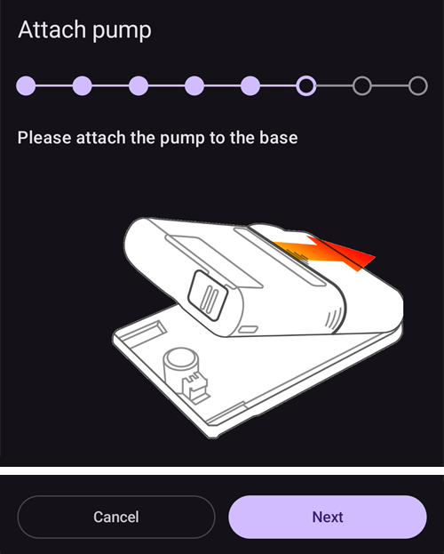
1. **Prime cannula**: once the pump is on the base plate, press **Purge air** to remove air from the cannula. Press **Next**.

   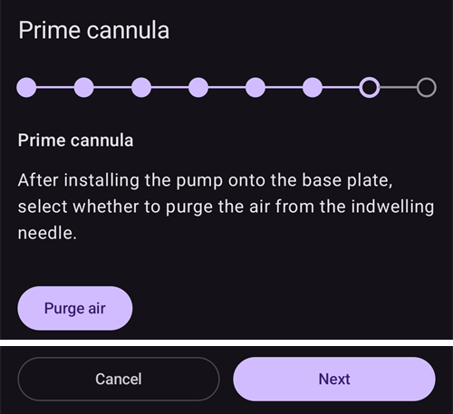

1. **Confirm**: put the pump on your body and press **Finish**.

   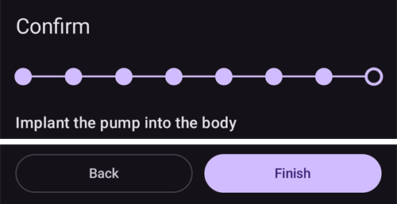

```{warning}
If you set your own pairing password (recommended for your safety), store it somewhere safe. The password is saved in the pump. The pump asks for it at every new pairing until you unpair it properly in **AAPS**. Until then, the pump also cannot be used with the original handheld controller (PDA).
```

### Pump screen after pairing

Once the pump is paired, the pump screen shows these buttons:

* **Suspend** / **Resume delivery**: stop or restart insulin delivery.
* **Change reservoir**: guides you through detaching the pump, fitting a new reservoir, priming and attaching it again.
* **History**: shows the events recorded by the pump.
* **Unpair device**: guides you through detaching the pump and unpairing it from **AAPS**. This stops insulin delivery, moves the pump plunger back to the bottom, and deletes the pairing.

## Where to get help

Development of the Equil driver is done by the community on a **volunteer** basis. Before requesting help, please:

1. **Read** the relevant section of this documentation to confirm how the feature is meant to work.
2. **Ask** on the *#AAPS* channel on [Discord](https://discord.gg/4fQUWHZ4Mw), or in one of the other [community channels](../GettingHelp/WhereCanIGetHelp.md).
3. **Report a bug** by searching the [existing issues](https://github.com/nightscout/AndroidAPS/issues); if yours is not listed, open a [new issue](https://github.com/nightscout/AndroidAPS/issues) and attach your [log files](../GettingHelp/AccessingLogFiles.md).

When asking for help, include your phone make and model, Android version, **AAPS** version, and a plain-English description of the problem (what changed, when it last worked).
