# Medtrum Nano / 300U

These instructions are for configuring the Medtrum insulin pump. 

This software is part of a DIY artificial pancreas solution and is not a product but requires YOU to read, learn, and understand the system, including how to use it. You alone are responsible for what you do with it.

```{contents} Table of contents
:depth: 1
:local: true
```

## Pump capabilities with AAPS
* All loop functionality supported (SMB, TBR etc)
* Automatic DST and timezone handling
* Extended bolus is not supported by AAPS driver

## Hardware and software requirements
* **Compatible Medtrum pumpbase and reservoir patches**
    - Currently supported:
        - Medtrum TouchCare Nano with pumpbase refs: **MD0201** and **MD8201**.
        - Medtrum TouchCare 300U with pumpbase ref: **MD8301**.
        - If you have an unsupported model and are willing to donate hardware or assist with testing, please contact us via discord [here](https://discordapp.com/channels/629952586895851530/1076120802476441641).
* **Version 3.2.0.0 or newer of AAPS built and installed** using the [Build APK](../SettingUpAaps/BuildingAaps.md) instructions.
* **Compatible Android phone** with a BLE Bluetooth connection 
    - See AAPS [Release Notes](../Maintenance/ReleaseNotes.md)
* [**Continuous Glucose Monitor (CGM)**](../Getting-Started/CompatiblesCgms.md)

## Before you begin

**SAFETY FIRST** Do not attempt this process in an environment where you cannot recover from an error (extra patches, insulin, and pump control devices are must-haves). 

**The PDM and Medtrum App will not work with a patch that is activated by AAPS.**
Previously you may have used your PDM or Medtrum app to send commands to your pump. For security reasons you can only use the activated patch with the device or app that was used to activate it.

*This does NOT mean that you should throw away your PDM. It is recommended to keep it somewhere safe as a backup in case of emergencies, for instance if your phone gets lost or AAPS is not working correctly.*

**Your pump will not stop delivering insulin when it is not connected to AAPS**
Default basal rates are programmed on the pump as defined in the current active profile.
As long as AAPS is operational, it will send temporary basal rate commands that run for a maximum of 120 minutes. If for some reason the pump does not receive any new commands (for instance because communication was lost due to pump - phone distance) the pump will fall back to the default basal rate programmed on the pump once the Temporary Basal Rate ends.

**30 min Basal Rate Profiles are NOT supported in AAPS.**
**The AAPS Profile does not support a 30 minute basal rate time frame**
If you are new to AAPS and are setting up your basal rate profile for the first time, please be aware that basal rates starting on a half-hour basis are not supported, and you will need to adjust your basal rate profile to start on the hour. For example, if you have a basal rate of 1.1 units which starts at 09:30 and has a duration of 2 hours ending at 11:30, this will not work. You will need to change this 1.1 unit basal rate to a time range of either 9:00-11:00 or 10:00-12:00. Even though the Medtrum pump hardware itself supports the 30 min basal rate profile increments, AAPS is not able to take them into account with its algorithms currently.

**0U/h profile basal rates are NOT supported in AAPS**
While the Medtrum pump does support a zero basal rate, AAPS uses multiples of the profile basal rate to determine automated treatment and therefore cannot function with a zero basal rate. A temporary zero basal rate can be achieved through the "Disconnect pump" function or through a combination of Disable Loop/Temp Basal Rate or Suspend Loop/Temp Basal Rate. 

## Setup

```{caution}
When you activate a patch with **AAPS**, you **MUST** turn off every other device that can talk to the Medtrum pump base, for example an active PDM or the Medtrum app. Have your pump base and a new reservoir patch ready.
```

### Step 1: Select Medtrum pump

#### Option 1: New installations

If you are installing **AAPS** for the first time, the **Setup Wizard** guides you through the setup. Select **Medtrum** when you reach the **Pump** step.

If in doubt, you can also select **Virtual Pump** and select **Medtrum** later, after setting up **AAPS** (see option 2).


#### Option 2: The Configuration screen

On an existing installation you can select the **Medtrum** pump in [Configuration > Pump](#Config-Builder-pump):

Open the top-left **menu** (☰), tap **Configuration** > **Pump**, and select the **Medtrum** card. Only one pump can be active at a time.


Once it is selected, the **Medtrum** card shows two buttons, **Settings** and **Open plugin**:

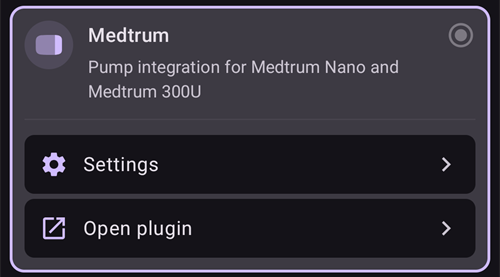

**Open plugin** (or **Manage → Pump**) opens the Medtrum pump screen. You use it to change patches and to see the pump status. Before a patch is activated it looks like this:

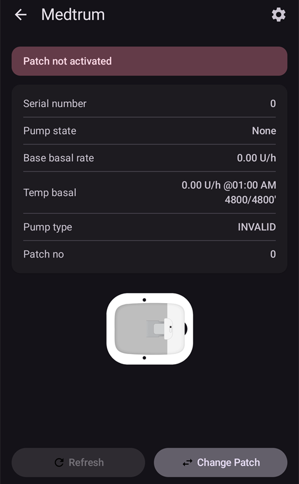

(medtrum-step-2)=
### Step 2: Change Medtrum settings

Tap **Settings** on the **Medtrum** card in **Configuration** > **Pump**. You can also tap the gear icon in the top-right corner of the Medtrum pump screen. This opens the **Medtrum pump settings**:

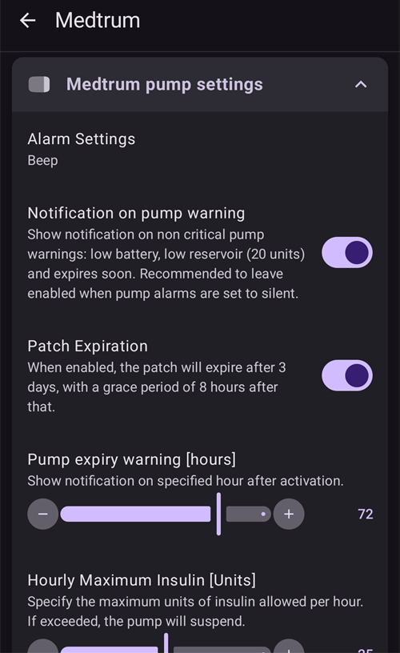

```{note}
There is no **Serial Number** setting any more. **AAPS** finds your pump base with a Bluetooth scan the first time you activate a patch (see [Step 3](#medtrum-activate-patch)), and remembers its serial number. To use a different pump base, see [Unpair](#medtrum-unpair).
```

#### Alarm Settings

***Default: Beep.***

This setting changes the way that the pump alerts you when there is a warning or error.

- **Beep**: the patch beeps on alarms and warnings.
- **Silent**: the patch does not alert you on alarms and warnings.

Note: In silent mode **AAPS** still sounds the alarm, depending on your phone's volume settings. If you do not respond to the alarm, the patch eventually beeps.

#### Notification on pump warning

***Default: Enabled.***

This setting changes the way **AAPS** shows notifications for non-critical pump warnings.
When enabled, a notification is shown on the phone when a pump warning occurs, including:
- Low battery
- Low reservoir (20 units)
- Patch expires soon

We recommend leaving this enabled when the pump alarms are set to **Silent**. In either case these warnings are also shown on the Medtrum pump screen under [Active alarms](#medtrum-active-alarms).

(medtrum-patch-expiration)=
#### Patch Expiration

***Default: Enabled.***

This setting changes the behavior of the patch. When enabled, the patch expires after 3 days and gives an audible warning if you have sound enabled. After 3 days and 8 hours the patch stops working.

If this setting is disabled, the patch does not warn you and continues running until the patch battery or reservoir runs out.

#### Pump expiry warning [hours]

***Default: 72 hours.***

This setting changes the time of the expiration warning. When [Patch Expiration](#medtrum-patch-expiration) is enabled, **AAPS** shows a notification this many hours after activation.

#### Hourly Maximum Insulin [Units]

***Default: 25U.***

This setting changes the maximum amount of insulin that can be delivered in one hour. If this limit is exceeded, the patch suspends and gives an alarm. You can reset the alarm with the **Reset alarms** button on the pump screen, see [Reset alarms](#nano-reset-alarms).

Set this to a sensible value for your insulin requirements.

#### Daily Maximum Insulin [Units]

***Default: 80U.***

This setting changes the maximum amount of insulin that can be delivered in one day. If this limit is exceeded, the patch suspends and gives an alarm. You can reset the alarm with the **Reset alarms** button on the pump screen, see [Reset alarms](#nano-reset-alarms).

Set this to a sensible value for your insulin requirements.

#### Scan on connection error

***Default: Off.***

Located under **Advanced Settings**.

Only enable this if you have connection problems. When enabled, the driver scans for the pump again before trying to reconnect to it. Make sure the Location permission for **AAPS** is set to "Allow all the time".

### Step 2b: AAPS alert settings

These settings are not part of the Medtrum driver. Open them from the **Settings** (gear) icon in the top-right corner of the main screen. See [Settings (Preferences)](../SettingUpAaps/Preferences.md) for more.

#### BT Watchdog

Open **Settings** > **Pump**:

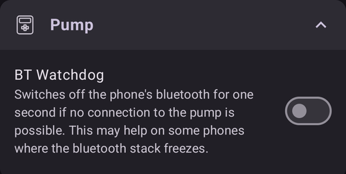

**BT Watchdog** switches off the phone's Bluetooth for one second if **AAPS** cannot connect to the pump. This may help on some phones where Bluetooth freezes.

Enable this setting if you often have connection problems with your pump.

#### Local alerts

Open **Settings** > **Local alerts**:

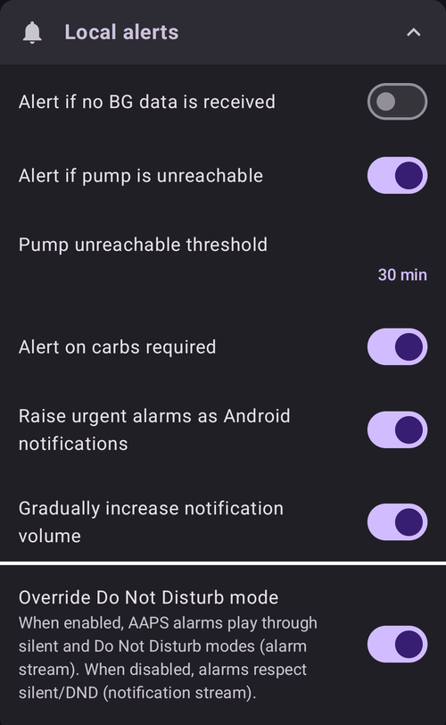

##### Alert if pump is unreachable

***Default: Enabled.***

This setting is forced on when the Medtrum driver is enabled. It alerts you when the pump is unreachable. This can happen when the pump is out of range, or when it is not responding because of a faulty patch or pump base, for example when water leaks between the pump base and the patch.

For safety reasons this setting cannot be disabled.

##### Pump unreachable threshold

***Default: 30 min.***

This setting changes how long **AAPS** waits before alerting you that the pump is unreachable.

You can change this setting when using the Medtrum pump, but we recommend keeping it at 30 minutes for safety reasons.

(medtrum-activate-patch)=
### Step 3: Activate patch

**Before you continue:**
- Have your Medtrum pump base and a new reservoir patch ready.
- Turn off other devices that can talk to the Medtrum pump (PDM and Medtrum app).
- Ideally, make sure **AAPS** is set up and a [profile is activated](../DailyLifeWithAaps/ProfileSwitch-ProfilePercentage.md). If no profile is active, the activation starts with a **Profile required** step where you choose the profile to activate.

#### Start the activation

Open the [Medtrum pump screen](#nano-overview) (**Manage → Pump**) and tap **Change Patch**. If you have set up [settings protection](#Preferences-protection), you must enter your password or PIN first.

If a patch is already active, you are asked to deactivate it first, see [Deactivate patch](#nano-deactivate-patch).

The activation is a step-by-step wizard. Follow the prompts to fill and activate a new patch. Tap **Cancel** at any step to stop.

```{important}
Only put the patch on your body and insert the cannula when the wizard tells you to (after priming is complete).
```

The first steps you see depend on your setup:

1. **Profile required**: only if no profile is active. Select the profile to apply, then continue.
2. **Find Pump**: only the first time, or after you used [Unpair](#medtrum-unpair). Connect the pump base to a fresh patch to power it on. **AAPS** scans for nearby Medtrum pump bases (their names start with `MT`). Tap yours in the list. **AAPS** saves its serial number, then goes straight to filling the patch.

   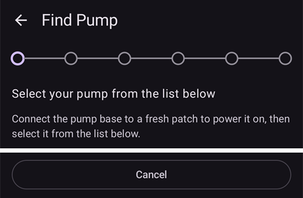

3. **Activate Patch**: only when **AAPS** already knows your pump base. The screen says "No active patch. Press **Next** to begin the activation process." Make sure the pump base is **not** connected to the patch yet, then tap **Next**.

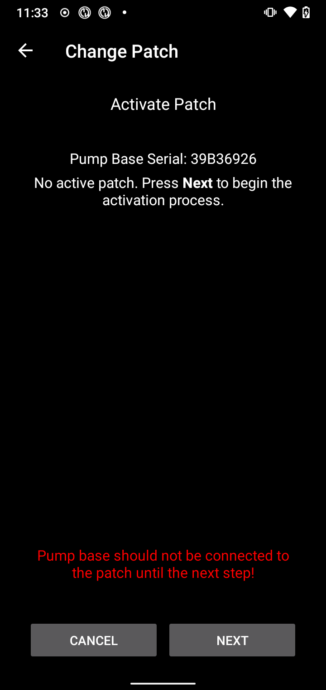

#### Connect and fill the patch

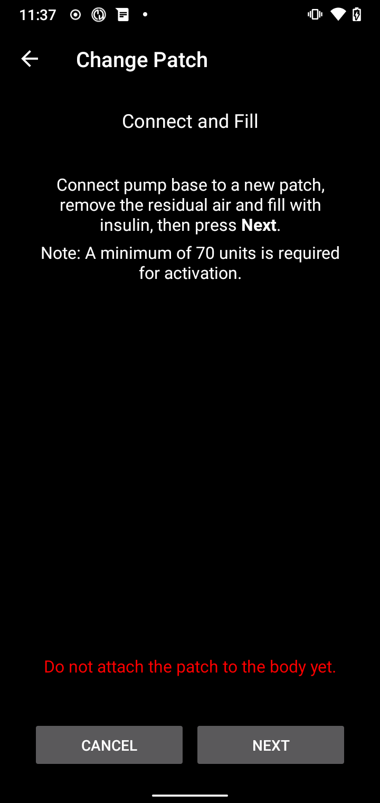

Connect the pump base to the patch, remove the residual air and fill the patch with insulin. A minimum of 70 units is needed for activation. The screen shows the reservoir level. Do not attach the patch to your body yet.

When the patch is detected and filled, the **Next** button appears. Tap it.

#### Select insulin

This step only appears if you have more than one insulin set up in **AAPS**. Select the insulin you are filling the patch with. **AAPS** applies a profile switch with this insulin after activation.

#### Prime the patch

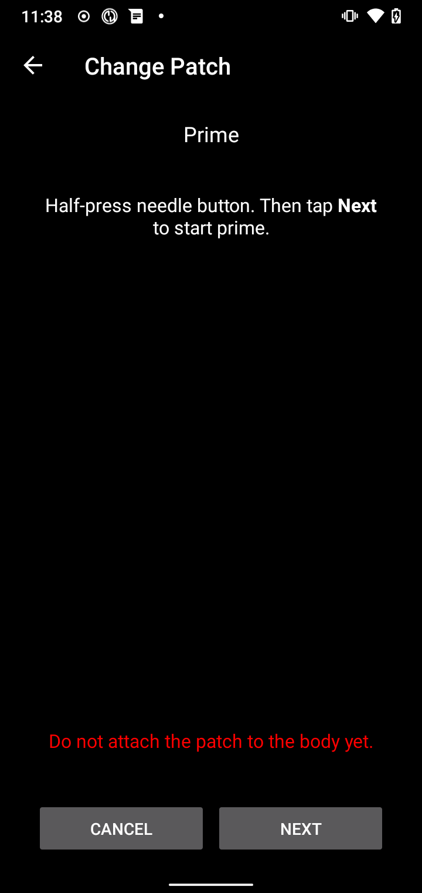

Do **not** remove the safety lock. Half-press the needle button on the patch, then tap **Next** to start priming.

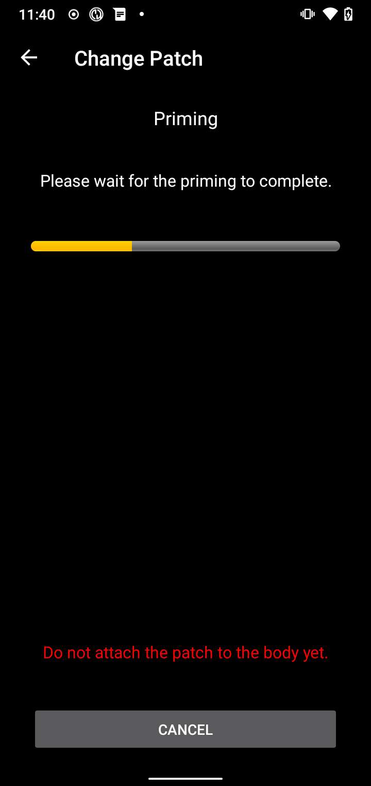

Wait for priming to complete.

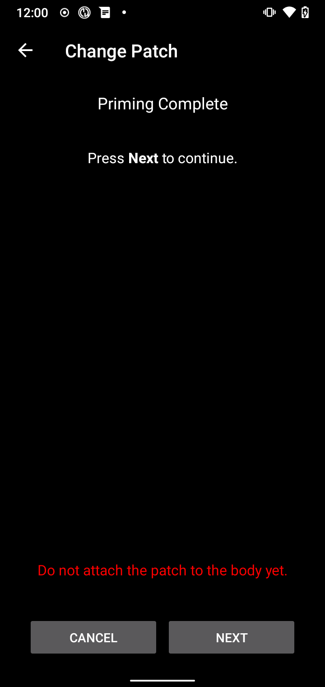

When priming is complete, tap **Next** to continue.

#### Site Rotation

This step only appears if you manage pump sites with [Site Rotation](#Aapsscreens-site-rotation) (setting **Manage pump site rotation**). Choose where you place the patch on your body, or skip this step.

#### Attach patch

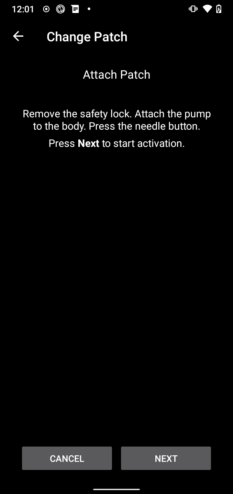

Clean the skin and remove the stickers. Remove the safety lock, attach the patch to your body, and press the needle button to insert the cannula.

Tap **Next** to activate the patch.

#### Activate patch

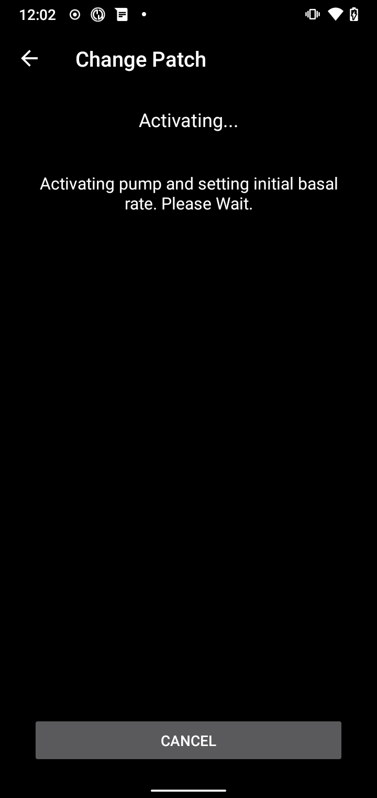

**AAPS** activates the pump and sets the initial basal rate. Please wait. When activation is complete, the following screen appears:


```{admonition} Older screenshot
:class: note
Apart from **Find Pump**, the activation screenshots above are from an earlier **AAPS** version and may look different in **AAPS** 4.
```

It shows how many units are left in the patch. Tap **OK** to return to the pump screen.

```{tip}
After a new activation, [export your settings](../Maintenance/ExportImportSettings.md). This lets you recover this patch session later, for example on a new phone.
```

(nano-deactivate-patch)=

### Deactivate patch

To deactivate the active patch, open the [Medtrum pump screen](#nano-overview) (**Manage → Pump**) and tap **Change Patch**.


You are asked to confirm that you want to deactivate the current patch. **This cannot be undone.** Tap **Next** to deactivate, or **Cancel** to return to the pump screen.


If **AAPS** cannot deactivate the patch (for example because the pump base has already been removed from the patch), tap **Discard** to forget the current patch session. You can then activate a new patch.

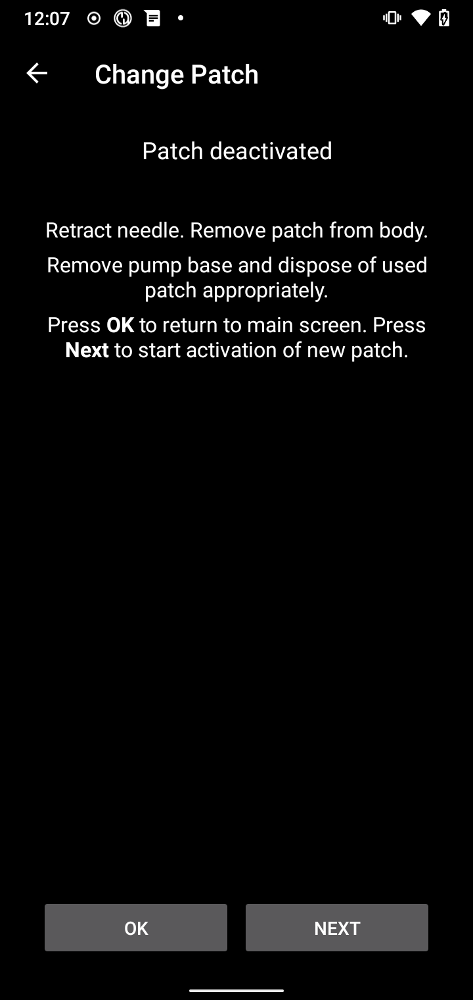

When deactivation is complete, retract the needle and remove the patch from your body. Remove the pump base and dispose of the used patch. Tap **OK** to return to the pump screen, or **Next** to start activating a new patch.

(nano-resume-interrupted-activation)=

### Resume interrupted activation

If a patch activation is interrupted, for example because the phone battery runs out, you can resume it. Open the [Medtrum pump screen](#nano-overview) (**Manage → Pump**) and tap **Change Patch**.

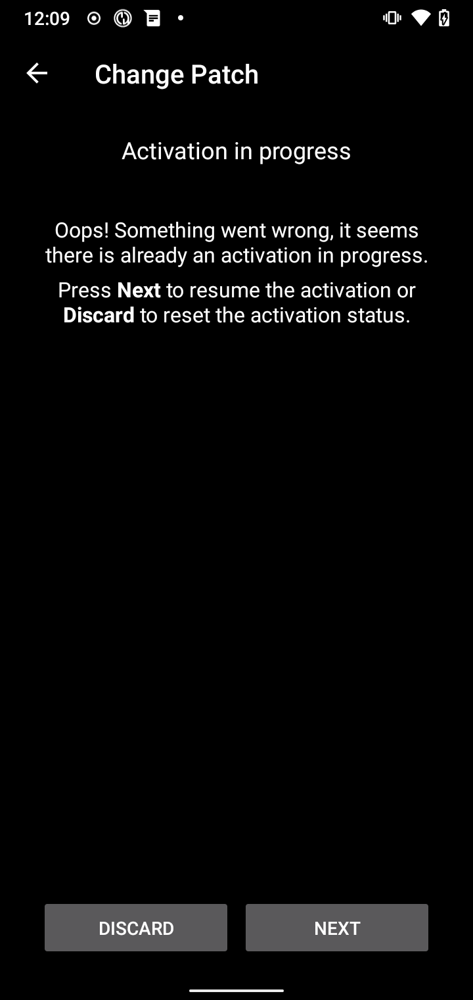

Tap **Next** to resume the activation. Tap **Discard** to reset the activation status, so you can activate a new patch.

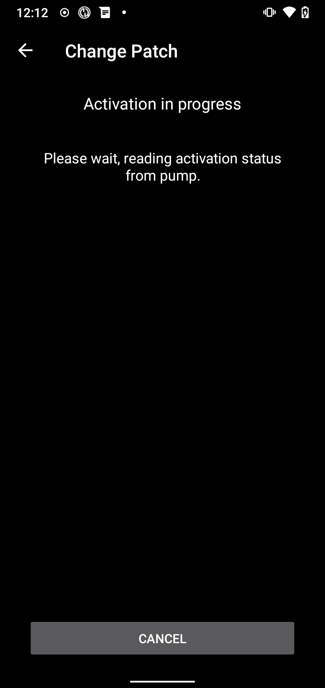

```{admonition} Older screenshot
:class: note
The screenshots in **Deactivate patch** and **Resume interrupted activation** are from an earlier **AAPS** version and may look different in **AAPS** 4.
```

The driver reads the activation status from the pump. If this works, the wizard continues at the step where it stopped.

(nano-overview)=

## Pump screen

The Medtrum pump screen (**Manage → Pump**) shows the current status of the Medtrum patch. It also has buttons to change the patch, reset alarms and refresh the status. A banner at the top shows important states, for example **Patch not activated** or **Pump is suspended**.


The screen can show these rows. Some rows only appear when they have a value.

- **Last connection**: how long ago **AAPS** last connected to the pump.
- **Last bolus**: the last bolus that was delivered.
- **Battery**: the current battery voltage of the patch.
- **Reservoir**: the current reservoir level.
- **Serial number**: the serial number of your pump base.
- **Pump state**: the current state of the pump. For example **Active** (the patch is activated and running normally) or **Stopped** (the patch is not activated).
- **Base basal rate**: the basal rate from your profile that is running now.
- **Temp basal**: the temporary basal rate, if one is running.
- **Active bolus**: the bolus that is being delivered right now.
- **Active alarms**: see [below](#medtrum-active-alarms).
- **Pump type**: the model of your pump base.
- **FW version**: the firmware version of the pump base.
- **Patch no**: the sequence number of the activated patch. It goes up by one every time you activate a new patch.
- **Activation**: the date and time the patch was activated, and how long ago that was.
- **Patch expires**: the date and time when the patch expires. Shows **Not enabled** if [Patch Expiration](#medtrum-patch-expiration) is off.

(medtrum-active-alarms)=
### Active alarms

This row shows any alarms that are active right now, for example a low reservoir or an expiring patch.

### Refresh

This button refreshes the status of the patch. It is only available when a patch is active and **AAPS** is not connected to the pump at that moment.

### Change Patch

This button starts the wizard to change the patch. See [Activate patch](#medtrum-activate-patch) for more information.

(medtrum-unpair)=
### Unpair

This button only appears when **AAPS** knows a pump base. It clears the stored pump base serial number and disconnects. The next time you activate a patch, **AAPS** scans for a pump base again (the **Find Pump** step). Use this if you switch to a different pump base. Only do this when no patch is active.

(nano-reset-alarms)=

### Reset alarms

The **Reset alarms** button only appears on the pump screen when the patch has suspended itself, for example after a maximum daily insulin alarm. Tap it to reset the alarms and resume insulin delivery.

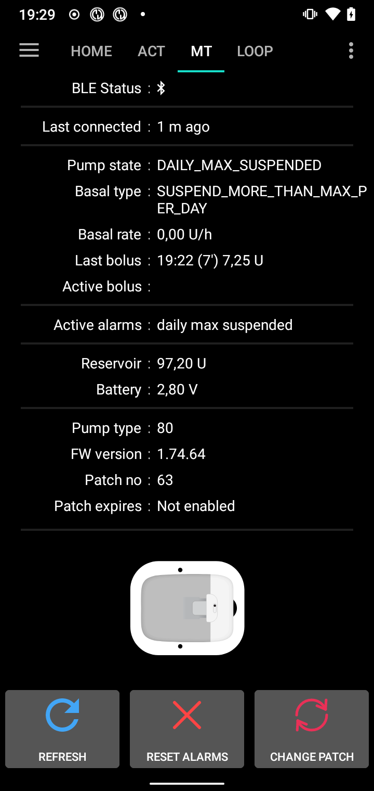

```{admonition} Older screenshot
:class: note
The screenshot above is from an earlier **AAPS** version. In **AAPS** 4 the pump screen looks different, but the **Reset alarms** button works the same way.
```

## Switching phone, export/import settings

When you switch to a new phone, do the following:
* [Export settings](../Maintenance/ExportImportSettings.md) on your old phone.
* Transfer the settings file from the old phone to the new phone, and import it into **AAPS**. Tick **Also replace pump settings** on the import screen, otherwise the patch session is not transferred to the new phone.

The imported settings file must be from the patch session you are using now, otherwise the patch will not connect.

After a settings import, the driver syncs the history with the pump. This can take a while, depending on the age of the settings file. The progress ("Syncing records, ... left") is shown on the main screen:

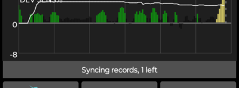

(medtrum-nano-troubleshooting)=

## Troubleshooting

### Connection issues

If you have connection timeouts or other connection problems:
- In the Android app settings for **AAPS**, set the Location permission to "Allow all the time".
- Try enabling **Scan on connection error** (Medtrum settings > **Advanced Settings**) and **BT Watchdog** (**Settings** > **Pump**), see [Step 2](#medtrum-step-2).

### Bluetooth issues
For known issues with Bluetooth connections, dropouts of pump/pods, or activation and connection issues [Bluetooth Troubleshooting](../GettingHelp/BluetoothTroubleshooting.md)

### Activation interrupted

If the activation is interrupted, for example by an empty phone battery or a phone crash, you can resume it. Tap **Change Patch** on the pump screen and follow the steps in [Resume interrupted activation](#nano-resume-interrupted-activation).

### Preventing patch faults

The patch can give a variety of errors. To prevent frequent errors:
- Make sure the pumpbase is properly seated in the patch and no gaps are visible.
- When filling the patch do not apply excessive force to the plunger. Do not try to fill the patch beyond the maximum that applies to your model.

## Where to get help

All of the development work for the Medtrum driver is done by the community on a **volunteer** basis; we ask that you to remember that fact and use the following guidelines before requesting assistance:

-  **Level 0:** Read the relevant section of this documentation to ensure you understand how the functionality with which you are experiencing difficulty is supposed to work.
-  **Level 1:** If you are still encountering problems that you are not able to resolve by using this document, then please go to the *#Medtrum* channel on **Discord** by using [this invite link](https://discord.gg/4fQUWHZ4Mw).
-  **Level 2:** Search existing issues to see if your issue has already been reported at [Issues](https://github.com/nightscout/AAPS/issues)
if it exists, please confirm/comment/add information on your problem.
If not, please create a [new issue](https://github.com/nightscout/AndroidAPS/issues) and attach [your log files](../GettingHelp/AccessingLogFiles.md).
-  **Be patient - most of the members of our community consist of good-natured volunteers, and solving issues often requires time and patience from both users and developers.**