# Omnipod DASH

These instructions are for configuring the **Omnipod DASH** generation pump **(NOT Omnipod Eros)**. The DASH driver has been part of **AAPS** since version 3.0 and is a well-established way to loop with Omnipod.

```{contents} Table of contents
:depth: 1
:local: true
```

## Omnipod DASH specifications

Key characteristics of the **Omnipod DASH** ('DASH'):

- The DASH pods are identified by a **blue needle cap** (the older EROS pod has a clear needle cap). The pods are otherwise identical in terms of physical dimensions.
- DASH does not require a BLE link/bridge device (NO RileyLink, OrangeLink, or EmaLink needed).
- The DASH's Bluetooth connection is used only when sending a command (e.g a Bolus), and disconnects right after issuing the command.
- It does not produce the "no connection to link device / pod" errors associated with link devices.
- **AAPS** will wait for pod's accessibility to send commands.
- On pod activation, **AAPS** will find and connect to a new DASH pod.
- Expected range from phone: 5-10 meters (YMMV).

(omnipod-dash-constraints)=

## Omnipod DASH known AAPS constraints/issues
- Android 16 requires **AAPS** version 3.3.2.1 or later.
- General advice is to run **AAPS** on Android 14 or 16. Android 15 has many reported [issues](https://github.com/nightscout/AndroidAPS/issues/3471) from the community. However, if you do run on Android 15 you will likely need to turn on **Bluetooth bonding** (in the **Advanced Settings** section of the [Dash settings](#omnipod-dash-advanced-settings)) to successfully activate and use Pods, see [General Troubleshooting](../GettingHelp/GeneralTroubleshooting.md) for more info on the Bonding settings.
- DST and timezone changes are not applied automatically. After a clock change you must update the pod manually: press **Refresh** on the DASH pump screen, then press **Set time** (shown when the pod and phone time zones differ) or perform a **Profile Switch** (see [Timezone change for Omnipod Dash](#timezone-traveling-with-pumps)).
- Dash only supports basal rate in 0.05 U/h steps. If you try to set Basal with 0.01 steps in your **AAPS profile**, AAPS will not give a warning even though the pod will round up the rate into 0.05 steps. If you open **Pod History** on the DASH pump screen, it will display that 0.05 basal was set. This also means the lowest basal rate allowed by the DASH in **AAPS** is 0.05U/h.
- The activation status of a Pod is stored in the settings file, if you export a settings file with an active pod. Then change to a new pod, then restore the settings from your previous export you will have now restored the old pod activation and removed the new pod activation. This is why we recommend to export settings after each pod activation to allow a restore of that pods activation state if something happens to your rig. 
- When setting a new basal profile, DASH will suspend delivery before setting the new basal **Profile**. If there is a communication interruption or error, the basal profile won't automatically re-start. See section [Resuming Insulin Delivery](#omnipod-dash-resuming-insulin-delivery) for details.
- If alerts are configured, and the pod is about to expire, the pod will keep beeping until alerts are silenced, see [Silencing Pod Alerts](#omnipod-dash-silencing-pod-alerts) for details.
- There are a number of known issues with Bluetooth which can cause pod activation problems. See [Bluetooth Troubleshooting](../GettingHelp/BluetoothTroubleshooting.md) for the known issue and solutions to these problems.

(hardware-software-requirements)=

(omnipod-dash-hardware-software-requirements)=
## Hardware and software requirements

- Omnipod DASH is identified by the blue needle cap.

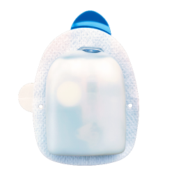

- **A Compatible Android phone** with a Bluetooth Low Energy (BLE) (see [Phones](../Getting-Started/Phones.md) for more info), additionally the following information will help guide you on other key considerations around successfully activating and using the DASH on a compatible phone:
    -  The **AAPS** Omnipod Dash driver connects with the DASH Pod using Bluetooth.  
      **AAPS** will automatically establish a new Bluetooth connection to the Pod every time it needs to send a command (e.g a Bolus), after sending the command the Bluetooth connection is immediately disconnected.  
       - **NOTE:** 
         - The Bluetooth connection can be interrupted/disturbed by other Bluetooth devices linked to the phone that is running **AAPS**, like earbuds etc... Devices like this can cause connection errors or pod activation issues on some models of phones. It's a good idea to review the [tested hardware setups](https://docs.google.com/spreadsheets/u/1/d/e/2PACX-1vScCNaIguEZVTVFAgpv1kXHdsHl3fs6xT6RB2Z1CeVJ561AvvqGwxMhlmSHk4J056gMCAQE02sAWJvT/pubhtml?gid=683363241&amp;single=true) list for known working configurations when choosing the phone for an Omnipod DASH setup.
         - There are a number of known issues with Bluetooth which can cause pod activation problems (See [Troubleshooting](#troubleshooting) for advice on other Bluetooth issues) specifically the [Bluetooth related issues](#omnipod-dash-bluetooth-related-issues) section.
    - For **Android 15** or below: You **MUST** use **Version 3.0 or newer of AAPS** using the [**Build APK**](../SettingUpAaps/BuildingAaps.md) instructions, however it's advisable to run the latest released version.
    - For **Android 16**: you **MUST** use **Version 3.3.2.1 or newer of AAPS** using the [**Build APK**](../SettingUpAaps/BuildingAaps.md) instructions, due to Android 16 changing how its Bluetooth works. Any version earlier than 3.3.2.1 will likely cause pod failures and/or activation [issues](https://github.com/nightscout/AndroidAPS/issues/3471). 
- A supported [**Continuous Glucose Monitor (CGM)**](../Getting-Started/CompatiblesCgms.md)

The instructions below explain how to activate a new pod session using **AAPS**. You should wait for your current Pod to be close expiry, as you will need to activate a new Pod with **AAPS**. Once a pod is de-activated it cannot be reused/re-activated, the de-activation is final.

## Before you begin

Ensure you have read and understand this whole guide, have read and understand the **Before You Begin** section, as well as  **[Omnipod and AAPS Constraints and Issues](#omnipod-dash-constraints)** to avoid running into a known problem.

### **SAFETY FIRST** - You **SHOULD NOT** try to connect **AAPS** to a pod for the first time without having access to all of the following:
1. Extra pods (3 or more spare)
2. Spare Insulin and MDI equipment
3. A working Omnipod PDM (In case **AAPS** fails)
4. Supported Phones are a must! (See [Hardware/Software Requirements](#hardware-software-requirements))
5. Correct version of AAPS built and installed

### Your Omnipod Dash PDM will become redundant after the AAPS Dash driver activates your pod.
- Before using **AAPS** you or your care giver would have had to manage the Pod using the Omnipod PDM (or in some regions a Phone app) to send commands to your DASH (e.g a Bolus).  
- The DASH can only facilitate a single Bluetooth device (e.g PDM or Phone) connection to manage and send commands.  
- The device that successfully activates the pod is the only device allowed to communicate with that Pod from that point forward. This means that once you activate a DASH with your Android phone using **AAPS**, **you will no longer be able to use your PDM with that pod!** For the time that Pod is active the **AAPS** Dash driver running on your Android phone is now the new PDM for your pod.  
- **DO NOT Throw away your PDM!** It is recommended to keep it around as a backup and for emergencies, for instance when your phone gets lost or **AAPS** is not working correctly.

### Your pod **WILL NOT** stop delivering insulin when it is not connected to AAPS.
Default basal rates are programmed on the pod on activation as defined in the current active [**Profile**](../SettingUpAaps/YourAapsProfile.md).  
As long as **AAPS** is operational it will send basal rate adjustment commands that run for a maximum of 120 minutes.  
When for some reason the pod does not receive any new commands (for instance because communication was lost due to Pod ➜ phone distance) the pod will automatically fall back to default basal rates as defined in your [**Profile**](../SettingUpAaps/YourAapsProfile.md).

### AAPS Profile(s) do not support 30 minute basal rate time frames
If you are new to **AAPS** and are setting up your basal rate [**Profile**](../SettingUpAaps/YourAapsProfile.md) for the first time, please be aware that basal rates starting on a half-hour basis are not supported.
For example, on your Omnipod PDM, if you have a basal rate of 1.1 units which starts at 09:30 and has a duration of 2 hours ending at 11:30, it is not possible replicate this exact Basal **Profile** in **AAPS**.  
You will need to change this 1.1 unit basal rate to a time range of either 9:00-11:00 or 10:00-12:00. Even though the DASH hardware itself supports the 30 minute basal rate **Profile** increments, **AAPS** does NOT support this feature.

### 0U/h Profile basal rates are NOT supported in AAPS
While the DASH does support a zero basal rate, **AAPS** uses multiples of the user's **Profile** basal rate to determine automated treatment; it cannot function with a zero basal rate.  
Instead a temporary zero basal rate can be achieved through the "Disconnect pump" function, or through a combination of Disable Loop/Temp Basal Rate or Suspend Loop/Temp Basal Rate.  
**NOTE:** The lowest basal rate allowed by the DASH in **AAPS** is 0.05U/h.

## Selecting Dash in AAPS

There are **two** ways to select the Omnipod DASH driver in **AAPS**:

### Option 1: New installations

When you install **AAPS** for the first time, the **Setup Wizard** guides you through the key features and installation requirements of **AAPS**.
When you reach the **Pump** step, select **Dash**.

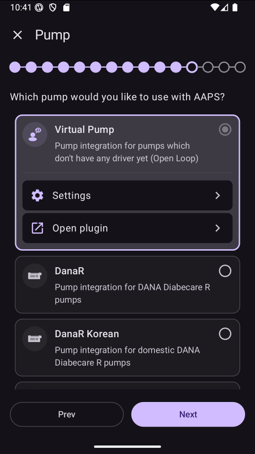

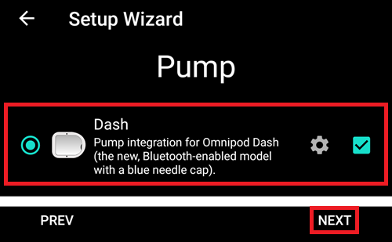

```{admonition} Older screenshot
:class: note
The screenshot above is from an earlier **AAPS** version. In **AAPS** 4 the **Pump** step of the **Setup Wizard** looks like the first screenshot, and the pump is listed as **Dash**.
```

If you are not sure yet, you can select **Virtual Pump** for now and select **Dash** later, after setting up **AAPS** (see Option 2).

(omnipod-dash-option-2-config-builder)=
### Option 2: The Configuration screen

On an existing installation you can select the **Dash** pump from the **Configuration** screen:

1. Open the **menu** (☰) in the top-left corner of the main screen and select **Configuration**.
2. Tap **Pump** and select the radio button of **Dash** (*"Pump integration for Omnipod Dash (the new, Bluetooth-enabled model with a blue needle cap)"*).

   

3. Once it is selected, the **Dash** card shows two buttons:
   - **Settings** opens the [Dash settings](#omnipod-dash-settings).
   - **Open plugin** opens the [DASH pump screen](#omnipod-dash-tab).

   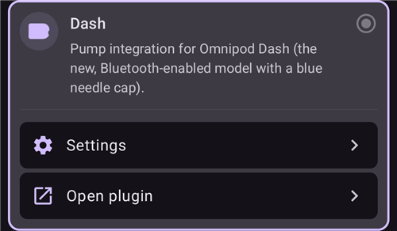

### Verification of Omnipod Driver Selection

To check that **Dash** is selected, open **Manage** (bottom navigation of the main screen) and tap **Pump**. The DASH pump screen opens, as shown in the next section.

(omnipod-dash-tab)=

## The DASH pump screen

The DASH pump screen is where you manage your pods: activate and deactivate them, refresh the pod status, silence alerts and look at the pod history. Open it with **Manage** > **Pump**, or with **Open plugin** on the **Dash** card in **Configuration** > **Pump**.

This is the screen without an active pod:

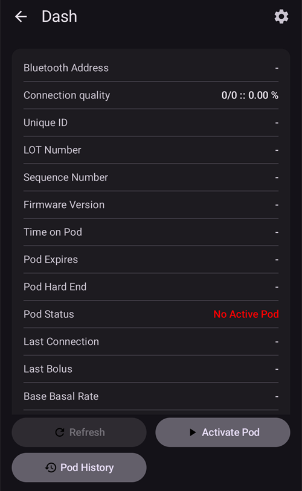

And this is the screen with an active pod:

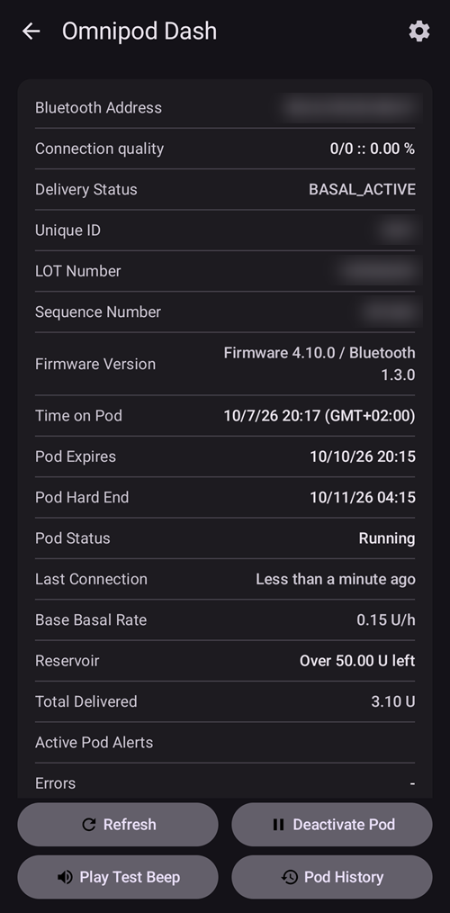

The **Settings** (gear) icon in the top-right corner opens the [Dash settings](#omnipod-dash-settings).

***NOTE:** If a field on the pump screen shows (uncertain), press **Refresh** to update the pod status.*

### Fields

- **Bluetooth Address:** The Bluetooth address of the pod.

- **Connection quality:** How reliably **AAPS** connects to the pod, shown as *successful connections / all connection attempts :: success rate*, for example `412/420 :: 98.10 %`. After more than 50 successful connections, the value turns yellow below 90 % and red below 70 %. A low value points to a Bluetooth problem (see [Bluetooth related issues](#omnipod-dash-bluetooth-related-issues)).

- **Delivery Status:** The raw delivery status reported by the pod. This field is shown only in engineering mode builds.

- **Unique ID:** The unique ID **AAPS** gave to the pod during activation.

- **LOT Number:** The production lot number of the pod.

- **Sequence Number:** The sequence number of the pod.

- **Firmware Version:** The firmware and Bluetooth versions of the pod.

- **Time on Pod:** The current time on the pod, with its time zone. The text turns red when the time zone of the pod is different from the time zone of the phone, and yellow when the pod time is more than 10 minutes off.

- **Pod Expires:** The date and time when the pod expires (72 hours after activation). The text turns yellow in the last 4 hours before this time, and red once it has passed.

- **Pod Hard End:** The end of the pod's grace period (8 hours after **Pod Expires**, for a maximum pod life of 80 hours). The text turns yellow in the last 4 hours before this time, and red once it has passed. The pod stops delivering insulin at the hard end and must be changed.

- **Pod Status:** The state of the pod: **No Active Pod**, **Setup in progress**, **Running**, **Suspended** or, after a pod fault, **ALARM**.

- **Last Connection:** How long ago **AAPS** last communicated with the pod.

  - *Moments ago* - less than 10 seconds ago.

  - *Less than a minute ago* - between 10 and 60 seconds ago.

  - *XX minutes ago* - more than 1 minute ago (and *X hours and XX minutes ago* after an hour).

- **Last bolus:** The amount of the last bolus sent to the pod and how long ago it was given. An unconfirmed bolus is marked (uncertain).

- **Base Basal Rate:** The basal rate programmed for the current time in your basal **Profile**.

- **Temp Basal Rate:** The temporary basal rate (TBR) that is currently running, with its start time and duration. This field is only shown while a TBR is running.

- **Reservoir:** Shows *Over 50 U left* when more than 50 units are left in the reservoir. Below 50 units, the exact amount is shown. The value turns red below 20 units.

- **Total Delivered:** The total amount of insulin delivered from the reservoir. This includes the insulin used for priming.

- **Active Pod Alerts:** Alerts that are currently active on the pod, for example *Pod will expire soon* or *Low Reservoir*.

- **Errors:** The pod fault, if the pod has failed, shown in red as *Pod Fault:* followed by the fault code and name, for example *Pod Fault: 020 ALARM_OCCLUDED*. Review the [Pod History](#omnipod-dash-view-pod-history) and the log files for past errors and more detailed information. See [Pod Failures](#omnipod-dash-pod-failures).

- **PDM Notification:** Shown only after a pod fault. It shows the fault the way the Omnipod PDM would have shown it: a title (for example *Occlusion Detected*, *Empty Reservoir* or *Pod Expired*), what happened (for example *Insulin delivery stopped. Change Pod now.*) and a *Ref:* code.

### Buttons

The buttons at the bottom of the pump screen change with the state of the pod. Only the buttons that make sense at that moment are shown.

- **Refresh:** Asks the pod for its current status.
  - *Use it to update the pod status and to clear fields that show (uncertain).*
  - *See the [Troubleshooting](#omnipod-dash-troubleshooting) section below for more information.*

- **Silence Alerts:** Stops the pod alert beeps (for example pod expiry or low reservoir). Shown only while the pod has an active alert. See [Silencing Pod Alerts](#omnipod-dash-silencing-pod-alerts).

- **Resume Delivery:** Resumes insulin delivery on a suspended pod. Shown only when delivery is suspended. See [Resuming Insulin Delivery](#omnipod-dash-resuming-insulin-delivery).

- **Set time:** Updates the pod to the time zone of your phone by sending your basal **Profile** again. Shown only when the time zone of the pod differs from the time zone of your phone.

- [**Activate Pod**](#omnipod-dash-activate-pod): Primes and activates a new pod. Shown when no pod is active.

- [**Deactivate Pod**](#omnipod-dash-deactivate-pod): Deactivates the active pod. Shown instead of **Activate Pod** while a pod is active.

- **Play Test Beep:** Makes the pod play a single test beep.

- [**Pod History**](#omnipod-dash-view-pod-history): Shows the activity history of the active pod.

- **Discard Pod:** Removes an unfinished pod from **AAPS**. Shown only when a pod activation stopped part-way. **AAPS** asks you to confirm. After discarding, **AAPS** can no longer communicate with that pod: remove it from your body.

	'Refresh' pod connectivity and status

	'Silence alerts'

	'Resume delivery'

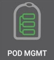	'Pod Management' (Activate, Deactivate, Play test beep, and Pod history)

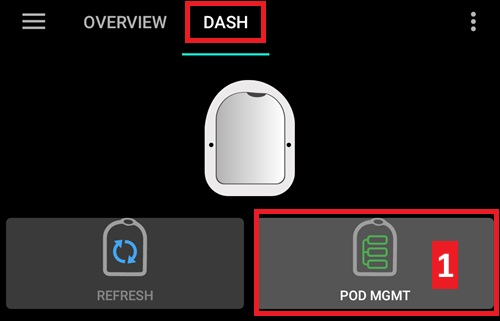

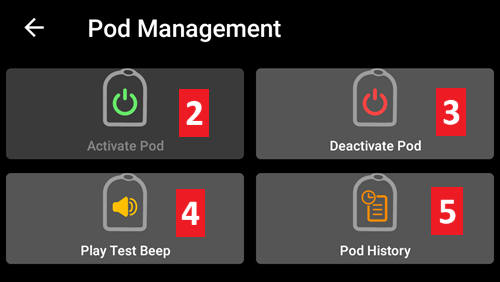

```{admonition} Older screenshot
:class: note
The screenshots above are from an earlier **AAPS** version, which used icon buttons and a separate **Pod Management** menu. In **AAPS** 4 all these actions, including **Activate Pod**, **Deactivate Pod**, **Play Test Beep** and **Pod History**, are buttons with text labels directly on the pump screen.
```

(omnipod-dash-activate-pod)=

## Activate Pod

1. Open the DASH pump screen (**Manage** > **Pump**) and press **Activate Pod**. The activation wizard opens.

   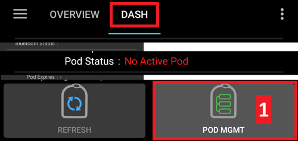

   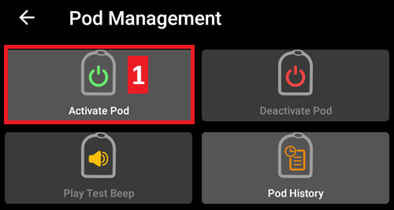

   ```{admonition} Older screenshot
   :class: note
   The screenshots above are from an earlier **AAPS** version. In **AAPS** 4 **Activate Pod** is a button directly on the DASH pump screen instead of in the **Pod Management** menu.
   ```

   If you have never activated a **Profile** in **AAPS** before, the wizard first shows the **Profile required** step: select the profile to apply on activation and continue.

2. The **Fill Pod** step is shown. Fill a new pod with enough insulin for 3 days, **at least 80 units**. Listen for two beeps from the pod: they mean the minimum amount of 80 units has been filled. Empty the fill syringe completely, even after hearing the two beeps. Do not remove the pod's needle cap yet.

   ***NOTE:** When you calculate the amount of insulin you need for 3 days, remember that priming the pod uses about 3-10 units.*

   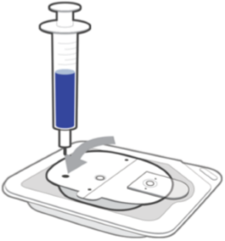

   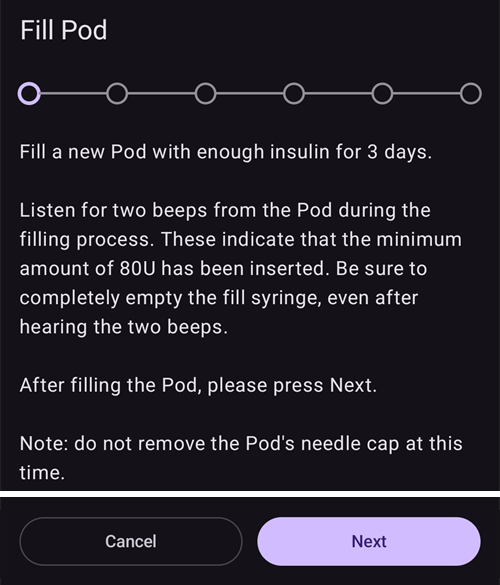

   Make sure that the new pod and the phone running **AAPS** are close to each other and press **Next**.

3. If you use more than one insulin in **AAPS**, the **Select Insulin** step is shown. It shows the **Currently active** insulin. If you filled the pod with a different insulin, press **Change** and select it. **AAPS** applies a **Profile Switch** with this insulin when the activation is finished. Press **Next**.

   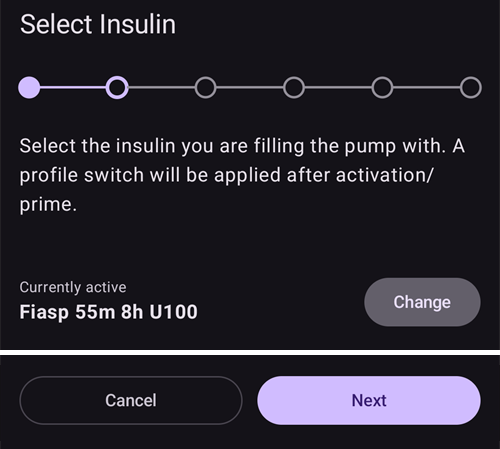

4. On the **Initialize Pod** step, **AAPS** pairs with the new pod and primes it. You hear a click followed by a series of ticking sounds as the pod primes itself.
   When this has finished successfully, the **Next** button appears. Press **Next**.

   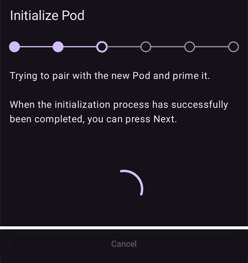    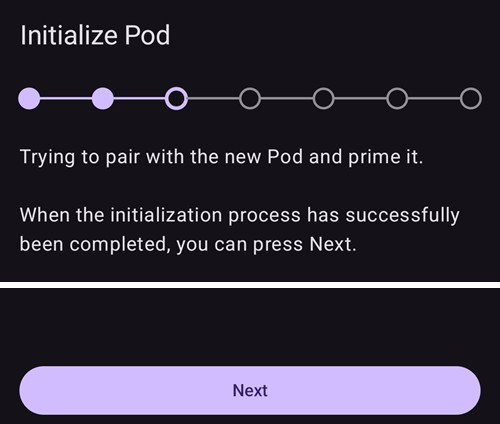

   ***NOTE**: If an error message such as _Scan failed_ or _'Could not find an available pod for activation'_ appears (this can happen), do not panic. Press **Retry**. In most cases the activation then continues successfully.*

   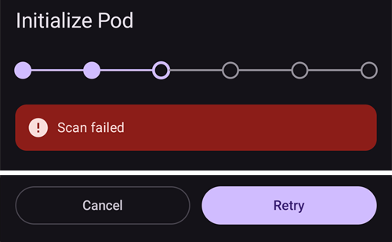

   If the pod has failed (for example because its activation time was exceeded), **Deactivate Pod** is shown instead of **Retry**. Use it and start again with a new pod.

   If you press **Cancel** before the activation is finished, **AAPS** asks you to confirm that you want to exit. Press **OK** to leave the wizard, or **Cancel** to stay.

   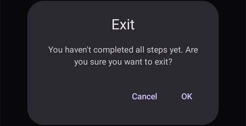

5. If you manage pump site rotation in **AAPS** (**Manage pump site rotation** in the [Site Rotation](#Aapsscreens-site-rotation) settings), the **Site location** step is shown. Select where you are going to place the pod on the body diagram and press **Next**, or press **Skip**.

   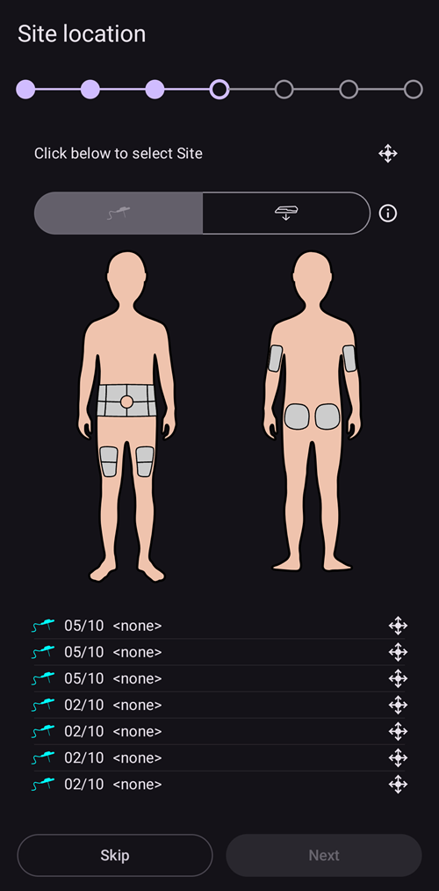

6. Next, prepare the infusion site for the new pod. Wash your hands to avoid any risk of infection. Clean the infusion site with soap and water or an alcohol wipe, and let the skin air dry completely before you continue.
   If the adhesive irritates your skin, consider using a barrier wipe or barrier spray.

   On the **Attach Pod** step, remove the pod's blue plastic needle cap. If the cannula or anything else sticks out of the pod, or it looks unusual, **STOP**: press **Cancel** and start again with a new pod. If everything looks **OK**, take off the white paper backing from the adhesive and stick the pod to the chosen site on your body.

   When finished, press **Next**.

   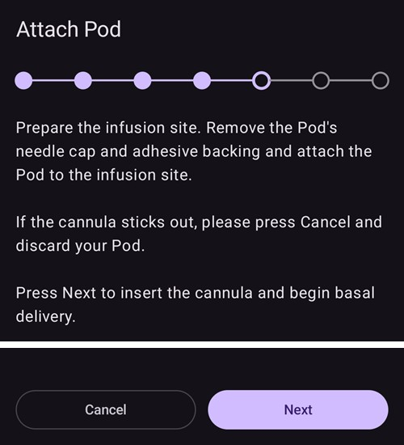

7. A confirmation dialog appears: *When you press OK, the cannula will be inserted.* **Press OK ONLY if you are ready to insert the cannula!**

   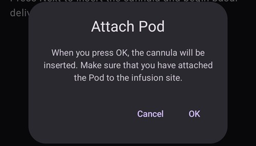

8. On the **Insert Cannula** step, **AAPS** sets your basal schedule and the pod inserts the cannula. This can take some time (1-2 minutes maximum). **Be patient!**

   ***NOTE:** It is good practice to pinch the skin near the cannula insertion point before the cannula is inserted. This helps the needle go in smoothly and lowers your chance of occlusions (blockages).*

       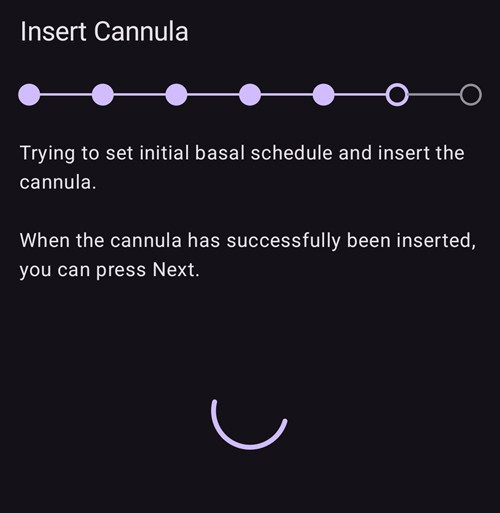

9. When the cannula has been inserted successfully, the **Next** button appears. Press **Next**.

   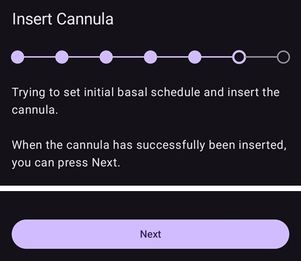

10. The **Pod Activated** step is shown. Check that the cannula has been inserted correctly, and change the pod if you think it has not.

    Press **Finish**.

    Congratulations! You have now started a new pod session.

    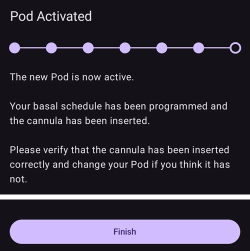

11. You are back on the DASH pump screen. It now shows the information of your active pod, including the current basal rate, reservoir level, insulin delivered, pod errors and alerts. **Activate Pod** is replaced by **Deactivate Pod**: you cannot activate another pod without deactivating the active pod first.

    ***NOTE:** For more details on the information shown, see [The DASH pump screen](#omnipod-dash-tab).*

    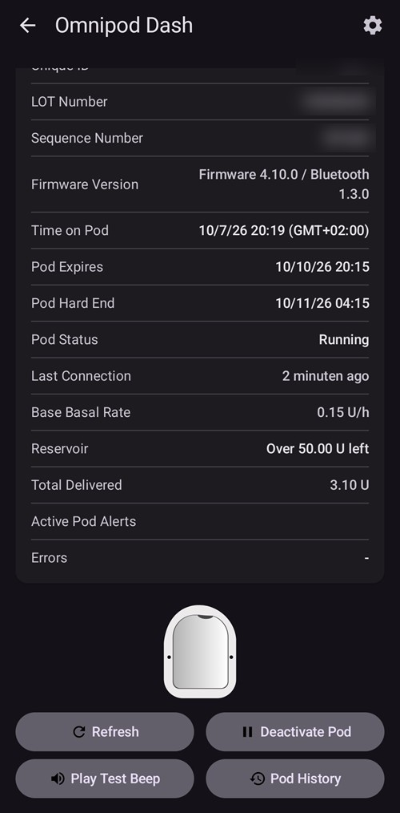

    ***NOTE:** It is good practice to export your settings AFTER activating the pod. Export your settings after each pod change and once a month. Copy the exported settings file to a cloud storage location (for example Google Drive) or somewhere off your phone in case you lose your phone (see [**Export settings**](../Maintenance/ExportImportSettings.md)).*

If an earlier activation stopped after the pod was primed, pressing **Activate Pod** continues from the **Attach Pod** step.

(omnipod-dash-deactivate-pod)=

## Deactivate Pod

Under normal circumstances, a pod lasts three days (72 hours), plus a grace period of 8 hours after the pod expiry warning: 80 hours in total.

To deactivate a pod (either because it expired or because it failed):

1. Open the DASH pump screen (**Manage** > **Pump**) and press **Deactivate Pod**.

   

2. On the **Deactivate Pod** step, press **Next** to start deactivating the pod. This suspends all insulin delivery and deactivates the pod.

   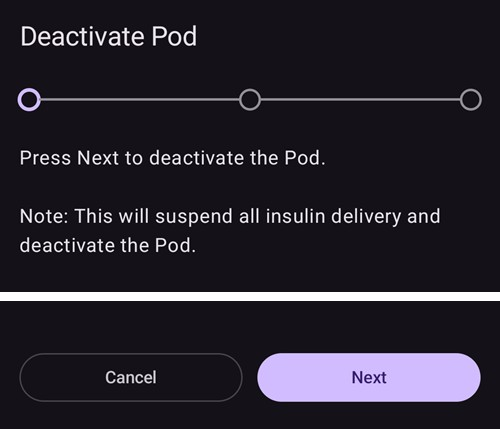

3. The **Deactivating Pod** step is shown while **AAPS** deactivates the pod. The pod beeps to confirm that deactivation was successful.

   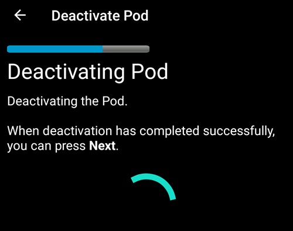

   ```{admonition} Older screenshot
   :class: note
   The screenshot above is from an earlier **AAPS** version. In **AAPS** 4 the wizard shows its progress as a row of dots at the top instead of a progress bar.
   ```

   When deactivation has finished successfully, the **Next** button appears. Press **Next**.

   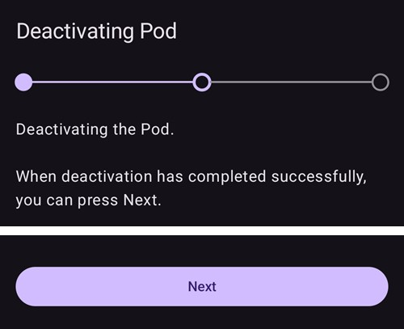

   If deactivation fails, an error message and a **Discard Pod** button are shown. See [Discarding a pod](#omnipod-dash-discard-pod) below before you use it. You can also press **Cancel** and try **Deactivate Pod** again later.

4. The **Pod Deactivated** step is shown. Remove the pod from your body and press **Finish**.

   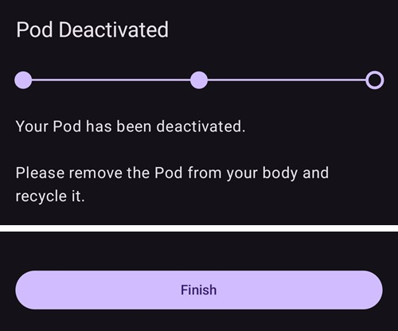

5. You are back on the DASH pump screen. Check that the **Pod Status** field shows **No Active Pod** and that the **Activate Pod** button is shown again.

   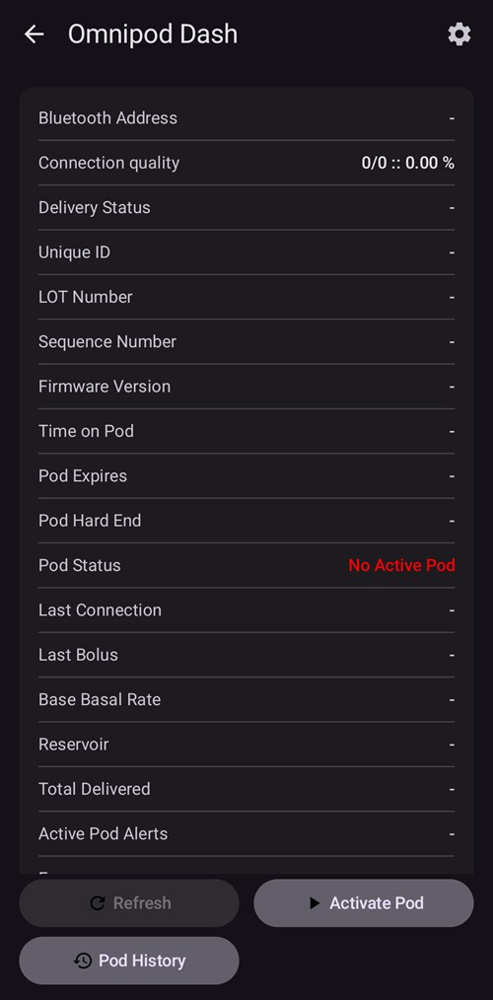

(omnipod-dash-discard-pod)=

### Discarding a pod

Only discard a pod when all communication with it keeps failing. If **AAPS** can still communicate with the pod, use **Deactivate Pod** instead.

- **AAPS** asks you to confirm before it discards the pod.
- After that, **AAPS** can no longer communicate with that pod.
- **Insulin delivery has NOT been suspended**, because the pod was not deactivated properly. **Remove the pod from your body!**
- The **Pod Discarded** step confirms that the pod state has been discarded. Press **Finish**. You can now activate a new pod.

(omnipod-dash-resuming-insulin-delivery)=

## Resuming Insulin Delivery

**NOTE**: During **Profile Switches**, like when using the PDM, **AAPS** must suspend delivery on the pod before setting the new basal **Profile**. If communication fails between the suspend and resume commands, delivery can stay suspended. Read [**Delivery suspended**](#omnipod-dash-delivery-suspended) in the troubleshooting section for more details.

When insulin delivery is suspended, you need to tell the pod to resume insulin delivery. When the command has been processed successfully, the pod delivers insulin again using the basal rate for the current time from your active basal **Profile**. The pod again accepts commands for bolus, **TBR** and **SMB**.

1. Open the DASH pump screen and check that the **Pod Status** field shows **Suspended**. Press **Resume Delivery** to tell the pod to resume normal insulin delivery.

   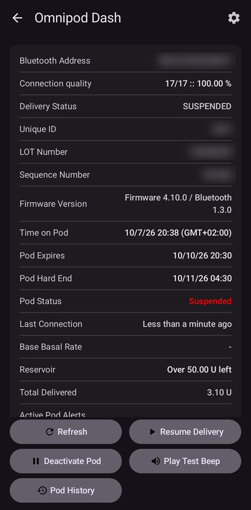

2. When the command was successful, the **Pod Status** field shows **Running** and the **Resume Delivery** button disappears.

   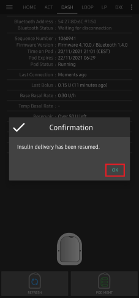

   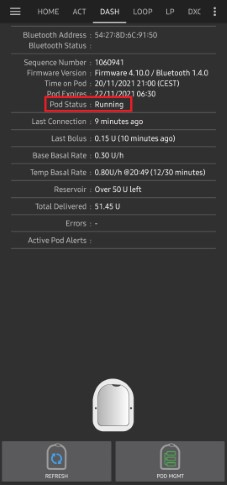

   ```{admonition} Older screenshot
   :class: note
   The screenshots above are from an earlier **AAPS** version, which showed a confirmation dialog. In **AAPS** 4 you confirm the result on the DASH pump screen: the **Pod Status** field shows **Running** and the **Resume Delivery** button is gone.
   ```

   If the command fails, **AAPS** shows a warning dialog starting with *Failed to resume delivery*. Press **Refresh** and try again.

   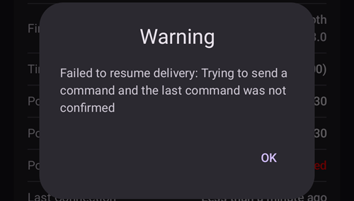

(omnipod-dash-silencing-pod-alerts)=

## Silencing Pod Alerts

This section explains how to stop the pod beeps when the pod approaches the end of its life. When these beeps start depends on the **Alerts** settings (see [Dash Settings](#omnipod-dash-settings)):

- **Reminder at hours before expiry (72 Hours):** how many hours before the 72-hour expiry the pod starts to beep.
- **Alert at hours before shutdown (80 Hours):** how many hours before the 80-hour shutdown the pod beeps again.

The maximum life of a pod is 80 hours (3 days 8 hours). However, the pod manufacturer recommends not going beyond 72 hours (3 days).

***NOTE**: The **Silence Alerts** button is only shown on the DASH pump screen while the pod has an active alert, for example pod expiry or low reservoir. If the **Silence Alerts** button is not shown but you hear the pod beeping, press **Refresh**.*

1. When the reminder time is reached, the pod beeps to tell you that it will expire soon and that you need to change it.
   On the DASH pump screen, the **Pod Expires (1)** field shows the exact time the pod will expire (72 hours after activation). The text turns yellow 4 hours before this time and red once it has passed.
   The **Active Pod Alerts (2)** field shows **Pod will expire soon**, and the **Silence Alerts (3)** button is shown.

   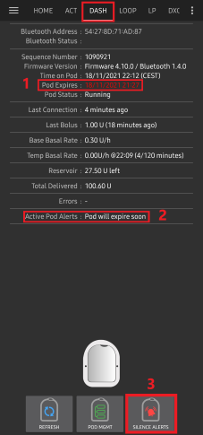

2. Press **Silence Alerts**. **AAPS** sends the command to the pod to stop the expiry beeps.

   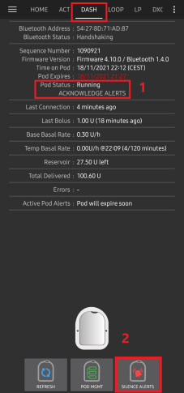

   ```{admonition} Older screenshot
   :class: note
   The screenshot above is from an earlier **AAPS** version, where this screen was the **DASH** tab. In **AAPS** 4 the **Silence Alerts** button is on the DASH pump screen (**Manage** > **Pump**).
   ```

3. When the alerts have been silenced, the alert is no longer shown in the **Active Pod Alerts** field, the **Silence Alerts** button disappears, and the pod stops its expiry beeps.

   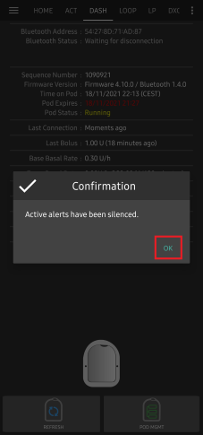

   ```{admonition} Older screenshot
   :class: note
   The screenshot above is from an earlier **AAPS** version, which showed a confirmation dialog. In **AAPS** 4 you confirm the result on the DASH pump screen: the alert is gone from the **Active Pod Alerts** field.
   ```

   If the command fails, **AAPS** shows a warning dialog starting with *Failed to silence alerts*. Press **Refresh** and try again.

The low reservoir alert works the same way. When the insulin left in the pod drops to the **Number of units** set in the **Alerts** settings, the pod beeps. The **Reservoir** field shows the amount left, the **Active Pod Alerts** field shows **Low Reservoir**, and the **Silence Alerts** button is shown. Press **Silence Alerts** to stop the beeps, and plan your next pod change.

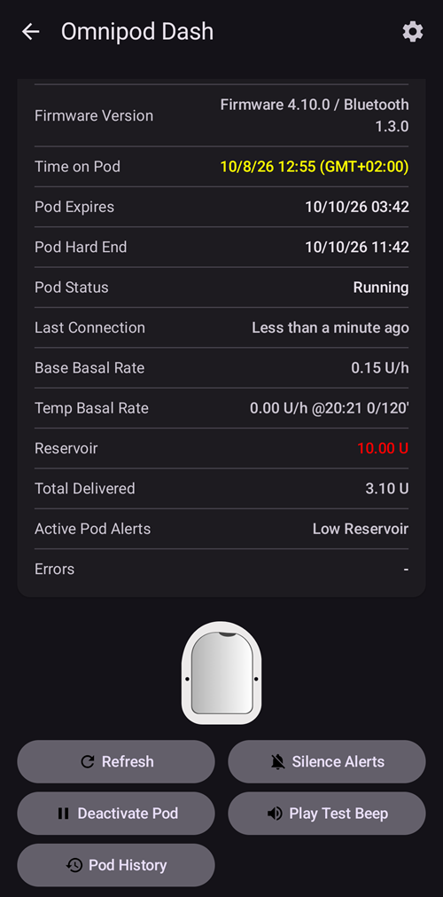

(omnipod-dash-view-pod-history)=

## View Pod History

This section explains how to look at the history of your active pod and filter it by type of action. The pod history shows the commands sent to your active pod and their results during its three-day (72 - 80 hours) life.

It is useful to check the boluses, TBRs and basal commands that were sent to the pod. The other categories help with troubleshooting and show the order of events that led up to a failure.

***NOTE:** **Only the last command can be uncertain**. New commands *are not sent* until the **last 'uncertain' command becomes 'confirmed' or 'denied'**. To 'fix' an uncertain command, press **Refresh** on the DASH pump screen.*

1. Open the DASH pump screen and press **Pod History**.

   
   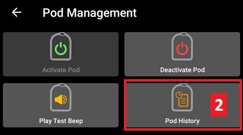

   ```{admonition} Older screenshot
   :class: note
   The screenshots above are from an earlier **AAPS** version. In **AAPS** 4 **Pod History** is a button directly on the DASH pump screen instead of in the **Pod Management** menu.
   ```

2. The **Pod History** screen opens with the **All** filter selected. It lists every command with its time and result, newest first, grouped by day. Use the filter buttons at the top (for example **Boluses** or **Basals**) to show only one type of command. Press the back arrow to return to the DASH pump screen.

   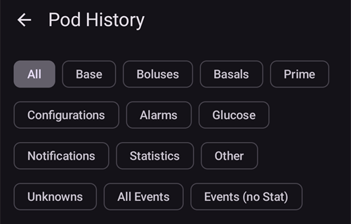 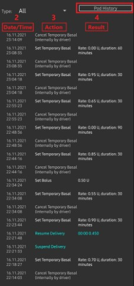

   ```{admonition} Older screenshot
   :class: note
   The second screenshot above is from an earlier **AAPS** version, where you picked the type of command from a **Type** list. In **AAPS** 4 you use the filter buttons shown in the first screenshot.
   ```

   For boluses, the amount is followed by the bolus type when it is not a normal bolus, for example *0.05 U (SMB)* or *0.05 U (Basal correction)*. A basal correction is a very small bolus (one pod pulse, 0.05 U) that the driver sends by itself; you did not request it.

   ```{admonition} Why basal corrections happen
   :class: note
   The pod delivers basal insulin in pulses of 0.05 U, timed by an internal clock. Each time the basal rate changes (for example when the loop sets a new **TBR**), the pod restarts this clock, and the pulse it was counting towards is lost. Because the loop changes the basal rate often, especially overnight, the pod can end up delivering less basal insulin than expected.

   **AAPS** compares the basal insulin the pod reports as delivered with what it should have delivered. When the shortfall reaches half a pulse or more, the driver delivers one extra pulse as a basal correction, so you still get the basal insulin your profile and the loop asked for. No correction is sent while the pod is suspended, or while a zero **TBR** is running.
   ```

(omnipod-dash-settings)=

## Dash Settings

There are two ways to open the Dash driver settings:

- Press the **Settings** (gear) icon in the top-right corner of the [DASH pump screen](#omnipod-dash-tab).
- Open the **menu** (☰) in the top-left corner of the main screen and select **Configuration** > **Pump**. On the **Dash** card, press **Settings**.

The settings are grouped into four expandable sections: **Confirmation Beeps**, **Alerts**, **Notifications** and **Advanced Settings**. Tap a section to open it:

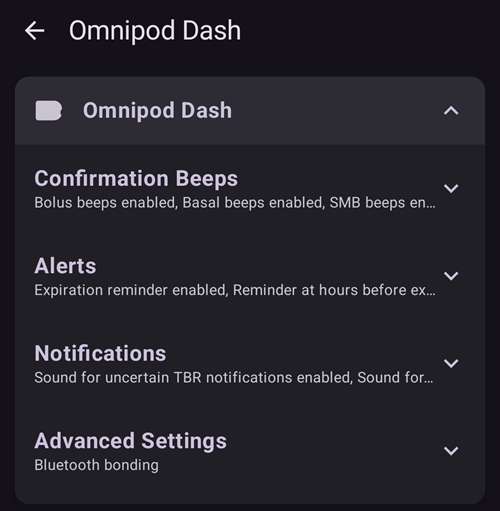

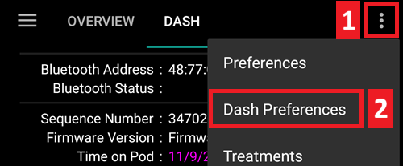

```{admonition} Older screenshot
:class: note
The screenshot above is from an earlier **AAPS** version. In **AAPS** 4 the **Settings** (gear) icon is on the DASH pump screen, which you open with **Manage** > **Pump**.
```

Most settings are on/off switches.

### Confirmation Beeps

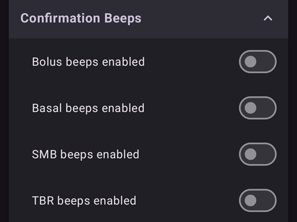

Confirmation beeps from the pod for bolus, basal, SMB and TBR delivery and changes.

**Bolus beeps enabled:**	The pod beeps when a bolus is delivered. On by default.

**Basal beeps enabled:**	The pod beeps when a new basal rate is set, or when the active basal rate is canceled or changed. Off by default.

**SMB beeps enabled:**	The pod beeps when an SMB is delivered. On by default.

**TBR beeps enabled:**	The pod beeps when a TBR is set or canceled. Off by default.

### Alerts

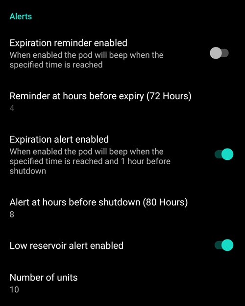

```{admonition} Older screenshot
:class: note
The screenshot above is from an earlier **AAPS** version. In **AAPS** 4 these settings are in the expandable **Alerts** section.
```

Pod alerts for pod expiry, shutdown and low reservoir. When you change these settings while a pod is active, **AAPS** sends the new alert settings to the pod.

***NOTE:** An **AAPS** notification is ALWAYS shown for any alert once **AAPS** has communicated with the pod after the alert was triggered. Dismissing the notification does NOT stop the pod alert. To stop the alert, open the DASH pump screen and press **Silence Alerts**.*

**Expiration reminder enabled:**	When this is on, the pod beeps when the reminder time is reached. On by default.

**Reminder at hours before expiry (72 Hours):**	How many hours before the 72-hour pod expiry the reminder starts (1 to 24 hours; default 4).

**Expiration alert enabled:**	When this is on, the pod beeps when the alert time is reached, and again 1 hour before shutdown. On by default.

**Alert at hours before shutdown (80 Hours):**	How many hours before the 80-hour pod shutdown the alert starts (1 to 8 hours; default 8).

**Low reservoir alert enabled:**	The pod alerts you when the insulin left in the reservoir drops to the value in **Number of units**. On by default.

**Number of units:**	The number of units at which the low reservoir alert is triggered (5 to 50 units; default 20).

### Notifications

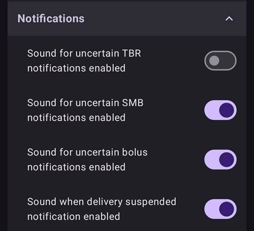

Choose whether **AAPS** plays a sound with its notifications when it is uncertain whether a TBR, SMB or bolus was delivered, and when delivery is suspended.

***NOTE:** These are phone notifications only; the pod itself does not beep.*

**Sound for uncertain TBR notifications enabled:**	Plays a sound with the notification when **AAPS** is uncertain whether a TBR was set.

**Sound for uncertain SMB notifications enabled:**	Plays a sound with the notification when **AAPS** is uncertain whether an SMB was delivered.

**Sound for uncertain bolus notifications enabled:**	Plays a sound with the notification when **AAPS** is uncertain whether a bolus was delivered.

**Sound when delivery suspended notification enabled:** 	Plays a sound with the notification when insulin delivery is suspended.

(omnipod-dash-advanced-settings)=

### Advanced Settings

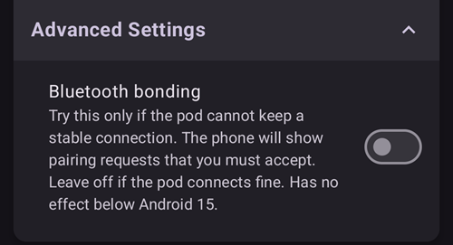

**Bluetooth bonding:**	Bonds the pod with the phone over Bluetooth. Try it only if the pod cannot keep a stable connection, for example on Android 15 (see [Omnipod DASH known AAPS constraints/issues](#omnipod-dash-constraints)). When it is on, the phone shows pairing requests that you must accept. Leave it off if the pod connects fine. It has no effect below Android 15. Off by default.

## Insulin and cannula age

The [status row](#screens-sensor-level-battery) on the main screen shows the age of your insulin and cannula. With Omnipod, these work a little differently than with tube-based pumps.

**AAPS** records a cannula change and an insulin change automatically each time you activate a pod. This resets the **Insulin** and **Cannula** ages to zero after every pod change. You do not need to record them yourself with **Prime/Fill**. This is because the pod inserts the cannula directly into the skin where it is attached: Omnipod does not use a tube.

**Pump battery** age is not reported: the battery and the insulin reservoir are built into each pod, and the battery always lasts longer than the pod itself (maximum 80 hours).

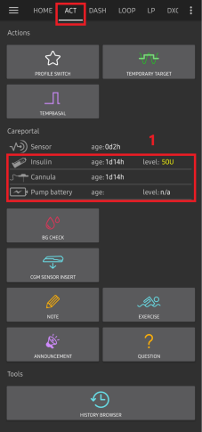

```{admonition} Older screenshot
:class: note
The screenshot above is from an earlier **AAPS** version, where these ages were shown in the **Careportal** section of the **Actions** tab. In **AAPS** 4 they are shown in the status row on the main screen.
```

### Level

**Insulin Level**

The insulin level shown is the amount reported by the pod. However, the pod only reports the actual reservoir level when it is below 50 units. Until then, *Over 50 U left* is shown. The amount reported is not exact: when the pod reports 'empty', in most cases the reservoir still has a few units of insulin left.

The DASH pump screen shows the level as follows:

  * **Over 50 U left** - The pod reports more than 50 units in the reservoir.
  * **Below 50 units** - The exact amount of insulin left in the reservoir, as reported by the pod.

Additional note:
  * **SMS** - Returns the value, or 50+U when over 50 units, in SMS responses.
  * **Nightscout** - Uploads a value of 50 when over 50 units to Nightscout (version 14.07 and older). Newer versions report a value of 50+ when over 50 units.

(omnipod-dash-troubleshooting)=

## Troubleshooting

This section covers common known issues and solutions for Omnipod DASH use with AAPS. There is also [General Troubleshooting](../GettingHelp/GeneralTroubleshooting.md) section in the documentation that should be reviewed as it covers relevant topics for some Pod issues too.

---

(omnipod-dash-bluetooth-related-issues)=

## Bluetooth related issues

For known issues with Bluetooth connections, dropouts of pump/pods, or activation and connection issues [Bluetooth Troubleshooting](../GettingHelp/BluetoothTroubleshooting.md)

---

(omnipod-dash-delivery-suspended)=

### Delivery suspended

  - There is no suspend button anymore. If you want to "suspend" the pod, you can set a zero **TBR** for x minutes. 
  - During **Profile Switches**, DASH must suspend delivery before setting the new basal **Profile**. If communication fails between the two commands, then delivery can stay suspended. When this happens:
     - There will be no insulin delivery, that includes Basal, SMB, Manual bolusing etc.
     - There might be notification that one of the commands is unconfirmed: this depends on when the failure happened. 
     - **AAPS** will try to set the new basal profile every 15 minutes.
     - **AAPS** will show a notification informing that the delivery is suspended every 15 minutes, if the delivery is still suspended (resume delivery failed).
     - The [**Resume Delivery**](#omnipod-dash-resuming-insulin-delivery) button is shown on the DASH pump screen if you want to resume delivery manually.
     - If **AAPS** fails to resume delivery on its own (this happens if the pod is unreachable, sound is muted, etc), the pod will start beeping 4 times every minute for 3 minutes, then repeated every 15 minutes if delivery is still suspended for more than 20 minutes.
  - For unconfirmed commands, press **Refresh** on the DASH pump screen to confirm or deny them.

***NOTE:** When you hear beeps from the pod, do not assume that delivery will continue without checking the phone, delivery might stay suspended, **so you need to check !***  

---
(omnipod-dash-pod-failures)=

### Pod Failures

- Pods fail occasionally due to a variety of issues, including hardware issues with the Pod itself. 
- It is best practice not to raise support / replacement cases with Insulet, since AAPS is not an approved method of using the Pods.
- A list of fault codes can be [**found here**](https://github.com/openaps/openomni/wiki/Fault-event-codes) to help determine the cause.

When a pod fails, it stops delivering insulin and beeps continuously. **AAPS** shows a notification on the main screen with the fault code and name, and the *Ref:* code, for example *Pod Fault: 020 ALARM_OCCLUDED*. Press **Dismiss** to close the notification. This does not stop the pod beeping.

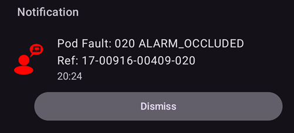

On the DASH pump screen, the **Pod Status** field shows **ALARM**, the **Errors** field shows the pod fault, and the **PDM Notification** field explains it, for example *Occlusion Detected. Insulin delivery stopped. Change Pod now. Check your BG*.

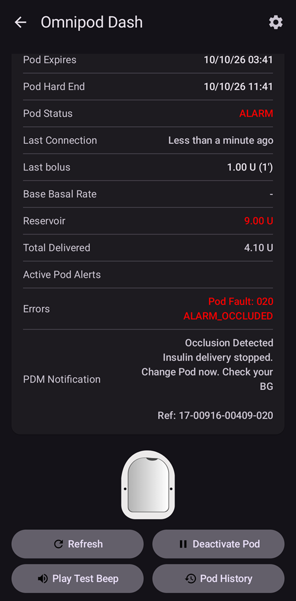

A failed pod cannot be used again. Check your blood glucose, then [deactivate the pod](#omnipod-dash-deactivate-pod) and activate a new one.

---
### Preventing error 49 pod failures

This failure is related to an incorrect pod state for a command or an error during an insulin delivery command. This is when the driver and Pod disagree on the actual state. The Pod (out of a built-in safety measure) then reacts with an unrecoverable error code 49 (0x31) ending up with what is know as a “screamer”: the long irritating beep that can only be stopped by punching a hole at the appropriate location at the back of the Pod.
The exact origin of a “49 pod failure” often is hard to trace. In situations that are suspected for this failure to occur (for instance on application crashes, running a development version or re-installation).

---

### Pump Unreachable Alerts

When no communication can be established with the pod for a pre-configured time a “Pump unreachable” alert will be raised. Pump unreachable alerts can be configured by pressing the **Settings** (gear) icon on the top right of the main screen, then selecting **Local Alerts** ➜ **Pump unreachable threshold [min]**. Recommended value is alerting after **120** minutes.

---
### Export  Settings

Exporting **AAPS** settings enables you to restore all your settings, and maybe more importantly, all your Objectives. You may need to restore settings to the “last known working situation” or after uninstalling/reinstalling **AAPS** or in case of phone loss, reinstalling on the new phone.

***NOTE:** The active pod information is included in the exported settings. If you import an "old" exported file, your actual pod will "die". There is no other alternative. In some cases (like a _programmed_ phone change), you may need to use the exported file to restore **AAPS'** settings **while keeping the current active Pod**. In this case it is important to only use the recently exported settings file containing the pod currently active.*

**It is good practice to do an export immediately after activating a pod**. This way you will always be able to restore the current active pod in case of a problem. For instance when moving to another backup phone.

Regularly (after each export preferably) copy your exported settings to a safe place (a cloud drive e.g. Google Drive) that is accessible by any phone when needed. This allows you to restore to a phone from anywhere in case of a phone loss or factory reset of your phone while you are not at home.

---
### Import Settings

**WARNING**: Please note that importing settings with **Also replace pump settings** ticked will possibly import an outdated Pod status (depending when you made the last export/backup).
As a result, there is a **risk of losing the active Pod!** (see **Exporting Settings**).
1. Only try an import when no other options are available.
2. When importing settings with an active Pod, make sure the export was done with the currently active pod.
3. When importing on the phone that is already running the Pod, leave **Also replace pump settings** unticked: the Pod session on the phone is then kept and only the other settings are imported. See [Export/Import settings](../Maintenance/ExportImportSettings.md).

**Importing while on an active Pod:** (you risk losing the Pod!)

1. **Make sure you are importing settings that were recently exported with the currently active Pod!**
2. Import your settings.
3. Check all preferences.

**Importing (no active Pod session)**

1. Importing any recent export should work (see above)
2. Import your settings.
3. Check all preferences.
4. You may need to **Deactivate** the "non existing" pod if the imported settings included any active pod data. 

---
### Importing settings that contain Pod state from an inactive Pod

When importing settings containing data for a Pod that is no longer active, AAPS will try to connect with it, which will obviously fail. You cannot activate a new Pod in this situation.

To remove the old pod session:
1. On the DASH pump screen, press **Deactivate Pod**. The deactivation will most likely fail.
2. When it fails, press **Discard Pod** and confirm (see [Discarding a pod](#omnipod-dash-discard-pod)).
3. Once the old pod is removed, you can activate a new pod.

### Generic error: java.lan.illegalStateException: Trying to set a Bluetooth Address to ***, but it is already set to ***.  

If you receive this error when attempting to Initialize a new pod **AAPS** fails as it still has settings for an old pod stored in configuration. 

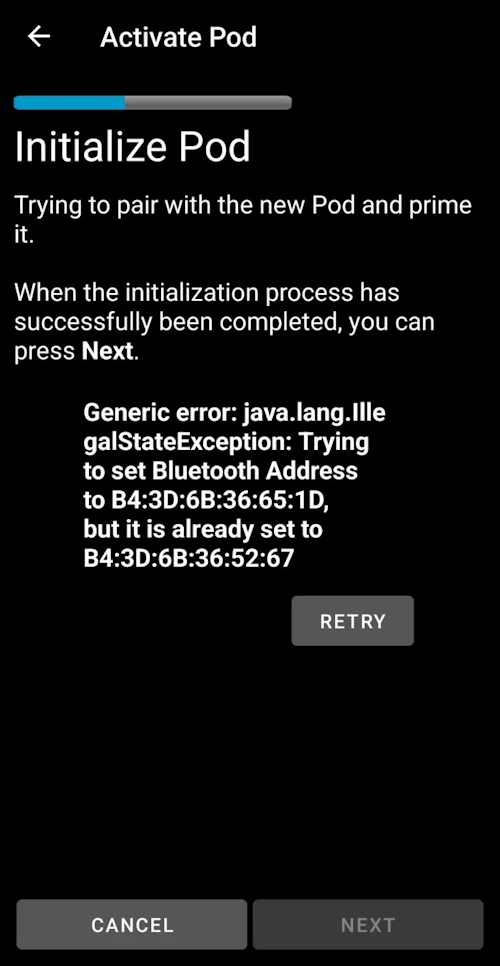

This can happen if you restore from a backup, or a pod deactivation fails.

To resolve it, press **Cancel** to leave the activation. On the DASH pump screen, press **Discard Pod** if it is shown. Otherwise press **Deactivate Pod**, and when the deactivation fails, press **Discard Pod** (see [Discarding a pod](#omnipod-dash-discard-pod)).

You should now be able to Activate a new pod.

---
### Reinstalling AAPS

When uninstalling **AAPS** you will lose all your settings, objectives and the current Pod session. **To restore them make sure you have a recent exported settings file available!**

When on an active Pod, make sure that you have an export for the current pod session or you will lose the currently active pod when importing older settings.

1. Export your settings and store a copy in a safe place (e.g Google Drive).
2. Uninstall **AAPS** and restart your phone.
3. Install the new version of **AAPS**.
4. Import your settings.
5. Verify all preferences (optionally import settings again).
6. Activate a new pod.
7. When done: Export current settings.

---
### Updating AAPS to a newer version

In most cases there is no need to uninstall. You can do an “in-place” install by starting the installation for the new version. This is also possible when on an active Pod session.

1. Export your settings.
2. Install the new **AAPS** version.
3. Verify the installation was successful
4. RESUME the Pod or activate a new pod.
5. When done: Export current settings.

---
### Omnipod driver alerts

The Omnipod Dash driver presents a variety of unique alerts on the **main screen**, most of them are informational and can be dismissed while some provide the user with an action requiring their input to resolve the cause of the triggered alert.  

A summary of the main alerts that you may encounter is listed below:

- *Pod Fault: XXX NAME*, followed by *Ref: ...*: the pod has failed and stopped delivering insulin. Change the pod. See [Pod Failures](#omnipod-dash-pod-failures).
- *No Active Pod*: no pod session was found. This notification keeps coming back until you activate a new pod. Once a pod is activated, it disappears automatically.
- *Insulin delivery suspended*: the pod has suspended insulin delivery. See [Resuming Insulin Delivery](#omnipod-dash-resuming-insulin-delivery).
- *Setting basal profile might have failed. Delivery might be suspended! Please manually refresh the Pod status from the Omnipod tab and resume delivery if needed.*
  Setting the basal **Profile** on the pod may have failed. Press **Refresh** on the DASH pump screen (the message still says "Omnipod tab"), and press **Resume Delivery** if it is shown.
- *Unable to verify whether SMB bolus (X U) succeeded. Refresh pod status to confirm or deny this command.*
  **AAPS** could not confirm that the **SMB** was delivered. Press **Refresh** on the DASH pump screen and check the **Last bolus** field.
- *Bolus delivery status uncertain. Refresh pod status to confirm or deny.*
  The same for a normal bolus: press **Refresh** on the DASH pump screen.
- *Timezone on pod is different from the timezone on phone. Basal rate is incorrect. Switch profile to fix*
  See the DST and timezone note in [Omnipod DASH known AAPS constraints/issues](#omnipod-dash-constraints).

(omnipod-dash-where-to-get-help-for-dash)=

## Where to get help

All of the development work for the DASH is done by the community on a **volunteer** basis; please keep this in mind and use the following guidelines before requesting assistance:

-  **Level 0:** Read the relevant section of this documentation to ensure you understand how the functionality with which you are experiencing difficulty is supposed to work.
-  **Level 1:** If you are still encountering problems that you are not able to resolve by using this document, then please go to the *#AAPS* channel on **Discord** by using [this invite link](https://discord.gg/4fQUWHZ4Mw). There are also numerous Facebook and other groups you can ask in too (see [**Getting Help**](../GettingHelp/WhereCanIGetHelp.md))
-  **Level 2:** Search existing issues to see if your issue has already been reported at [Issues](https://github.com/nightscout/AndroidAPS/issues)
if it exists, please confirm/comment/add information on your problem.
If not, please create a [new issue](https://github.com/nightscout/AndroidAPS/issues) and attach [your log files](../GettingHelp/AccessingLogFiles.md).
-  **Be patient - most of the members of our community consist of good-natured volunteers, and solving issues often requires time and patience from both users and developers.**

When requesting help come prepared with the following information to help those in the community with your specific questions and problems:  
- Android phone make and model
- Android OS version (e.g 15 or 16)
  - Did you recently upgrade your Android OS version?
- The version of **AAPS** you are running
- Plain english description of the problem you are facing considering some of the following things
   - Was it working before now?
   - When did it work or not work? 
   - Did you make any changes to configuration or profile settings?
   - Did you pair a new Bluetooth device?
   - Did you upgrade or install a new app?
   - How long was it working before it stopped working?
