# Omnipod Eros

These instructions are for configuring the Omnipod Eros generation pump (**NOT Omnipod Dash**). The Omnipod driver has been part of **AAPS** since version 2.8.

```{admonition} Omnipod Eros is being phased out
:class: note

The [Omnipod System](https://www.omnipod.com/current-podders/resources/omnipod-system) (the original Omnipod, comprising both the Personal Diabetes Manager (PDM) and the Pod) is being discontinued, and the end date varies by country. For example, it will no longer be available in Canada after 30 June 2026. If you rely on the Eros pump, plan ahead for a transition to a supported pump.
```

**This software is part of a DIY artificial pancreas solution and is not a product but requires YOU to read, learn, and understand the system, including how to use it. You alone are responsible for what you do with it.**

```{contents} Table of contents
:depth: 1
:local: true
```

## Hardware and software requirements

- **Pod Communication Device**

> Component that bridges communication from your AAPS enabled phone to Eros generation pods.
>
> > - 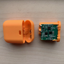  [OrangeLink Website](https://getrileylink.org/product/orangelink)
> > - 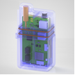 [433MHz RileyLink](https://getrileylink.org/product/rileylink433)
> > - 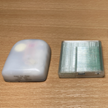  [Emalink Website](https://github.com/sks01/EmaLink) - [Contact Info](mailto:getemalink@gmail.com)
> > - 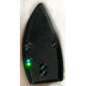  DiaLink - [Contact Info](mailto:Boshetyn@ukr.net)
> > - 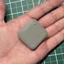  [LoopLink Website](https://www.getlooplink.org/) - [Contact Info](https://jameswedding.substack.com/) - Untested

-   **Mobile Phone Device**

> Component that will operate AAPS and send control commands to the Pod communication device.
>
> > - Supported [Omnipod driver Android phone](#Phones-list-of-tested-phones) with a version of AAPS 2.8 and related components set up.

- 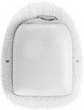  **Insulin Delivery Device**

> Component that will interpret commands received from the Pod communication device originating from your AAPS enable phone.
>
> > - A new Omnipod pod (Eros generation - **NOT DASH**)

These instructions assume that you are starting a new pod session. If this is not the case, please be patient and start this process at your next pod change.

In this page, **RileyLink** means any of the pod communication devices listed above.

## Before you begin

**SAFETY FIRST** - do not attempt this process in an environment where you cannot recover from an error (extra pods, insulin, charged RileyLink, and phone devices are must-haves).

**Your Omnipod PDM will no longer work after the AAPS Omnipod driver activates your pod**. Previously you used your Omnipod PDM to send commands to your Omnipod Eros pod. An Omnipod Eros pod only allows a single device to send communication to it. The device that successfully activates the pod is the only device allowed to communicate with it from that point forward. This means that once you activate an Omnipod Eros pod with your RileyLink through the AAPS Omnipod driver, **you will no longer be able to use your PDM with your pod**. The AAPS Omnipod driver with the RileyLink is now your acting PDM. *This does NOT mean you should throw away your PDM, it is recommended to keep it around as a backup, and for emergencies with AAPS is not working correctly.*

**Only one RileyLink at a time can communicate with a pod.** **AAPS** remembers one paired RileyLink. If you pair a different one, it replaces the previous one.

**Your pod will not shut off when the RileyLink is out of range.** When your RileyLink is out of range or the signal is blocked from communicating with the active pod, your pod will continue to deliver basal insulin. Upon activating a pod, the basal profile defined in AAPS will be programmed into the new pod. Should you lose contact with the pod, it will revert to this basal profile. You will not be able to issue new commands until the RileyLink comes back in range and re-establishes the connection.

**30 min Basal Rate Profiles are NOT supported in AAPS.** If you are new to AAPS and are setting up your basal rate profile for the first time please be aware that basal rates starting on a half hour are not supported and you will need to adjust your basal rate profile to start on the hour. For example, if you have a basal rate of say 1.1 units which starts at 09:30 and has a duration of 2 hours ending at 11:30, this will not work.  You will need to update this 1.1 unit basal rate to a time range of either 9:00-11:00 or 10:00-12:00.  Even though the 30 min basal rate profile increments are supported by the Omnipod hardware itself, AAPS is not able to take them into account with its algorithms currently.

## Enabling the Omnipod Driver in AAPS

You can enable the Omnipod driver in AAPS in **two ways**:

### Option 1: The Setup Wizard

After installing a new version of AAPS, the **Setup Wizard** starts automatically. If you have already exported your settings from a previous installation, you can import them in the wizard. For new installations, continue below.

Go through the [Setup Wizard](../SettingUpAaps/SetupWizard.md) until you reach the **Insulin pump** step, then select **Omnipod** (the description reads "Pump integration for Omnipod Eros").

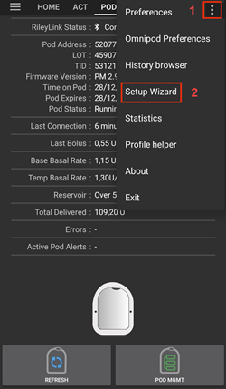  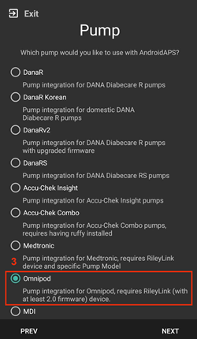

```{admonition} Older screenshot
:class: note
The screenshots above are from an earlier **AAPS** version. In **AAPS** 4 the pump is chosen in the **Insulin pump** step of the wizard, and the RileyLink is not paired in the wizard.
```

The Setup Wizard does not pair your RileyLink. After finishing the wizard, open the Omnipod pump screen and pair it as described in the [RileyLink Setup section](#OmnipodEros-rileylink-setup).

**OR**

### Option 2: The Configuration screen

Open the top-left **menu** (☰) > **Configuration** > **Pump** and select the **radio button** of **Omnipod**.


Once it is selected, the **Omnipod** card shows two buttons, **Settings** and **Open plugin**:

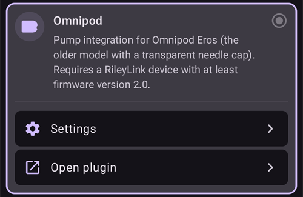

**Settings** opens the settings of the Omnipod driver (see [Omnipod Settings](#OmnipodEros-omnipod-settings)):

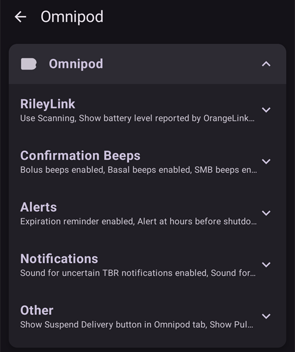

**Open plugin** opens the Omnipod pump screen. You can also open it at any time from the main screen with **Manage** > **Pump**. This page calls it the **Omnipod pump screen**. Before a RileyLink is paired and a pod is activated, it looks like this:

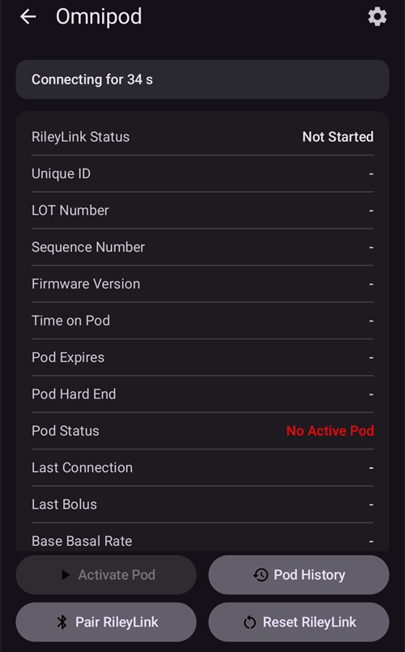

### Verification of Omnipod Driver Selection

To verify that you have enabled the Omnipod driver, open **Manage** > **Pump** from the main screen. You should see the **Omnipod** pump screen shown above. If you have not paired a RileyLink yet, **RileyLink Status** shows **Not Started** and **Pod Status** shows **No Active Pod**.

## Omnipod Configuration

All pod and RileyLink functions are buttons on the [Omnipod pump screen](#OmnipodEros-omnipod-pod-tab) (**Manage** > **Pump**). Some buttons only appear in certain situations, for example when a pod is active.

>  Refresh Pod connectivity and status
>
> 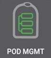 Pod Management (Activate, Deactivate, Play test beep, RileyLink Stats and Pod history)

```{admonition} Older screenshot
:class: note
The screenshots above are from an earlier **AAPS** version. In **AAPS** 4 there is no **POD MGMT** button or Pod Management menu: **Refresh** and all pod management actions are buttons on the Omnipod pump screen.
```

(OmnipodEros-rileylink-setup)=

### RileyLink Setup

If you have already paired your RileyLink, continue to the [Activating a Pod section](#OmnipodEros-activating-a-pod) below.

*Note: A good visual indicator that the RileyLink is not connected is that the treatment buttons (QuickLaunch toolbar) on the main screen will be missing. This will also occur for about the first 30 seconds after AAPS starts, as it is actively connecting to the RileyLink.*

1. Make sure that your RileyLink is fully charged and powered on.

2. Place the RileyLink [close to your phone](#OmnipodEros-optimal-omnipod-and-rileylink-positioning) (~30 cm away or less).

3. Open the Omnipod pump screen (**Manage** > **Pump**) and press **Pair RileyLink**.

4. The **Pair RileyLink** screen starts scanning for Bluetooth devices right away. Tap your RileyLink in the list of found devices.

   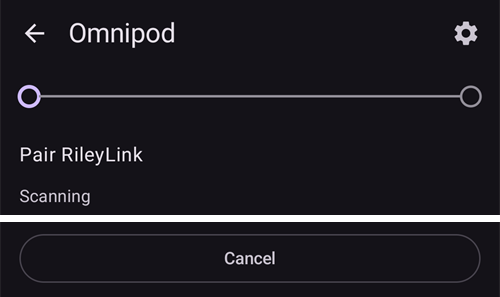

5. When **RileyLink paired successfully** is shown with the name and address of your device, press **OK**.

6. Back on the Omnipod pump screen, check that **RileyLink Status** changes to **Connected**. **Pod Status** should show **No Active Pod**. If the RileyLink does not connect, press **Reset RileyLink**, or restart **AAPS**.

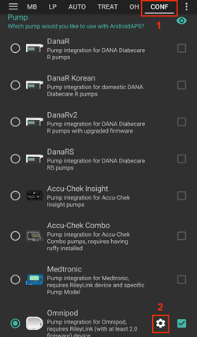 

 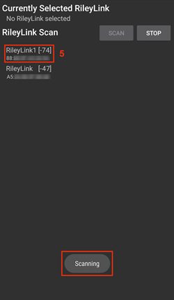


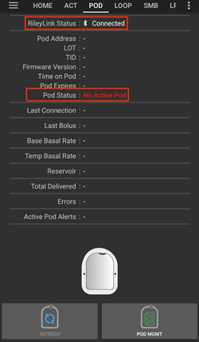

```{admonition} Older screenshot
:class: note
The six screenshots above (after step 6) are from an earlier **AAPS** version. In **AAPS** 4 you pair the RileyLink with the **Pair RileyLink** button on the Omnipod pump screen instead of **RileyLink Configuration** in the Omnipod settings, and scanning starts automatically.
```

```{note}
To switch to another RileyLink (for example a backup device), press **Pair RileyLink** again and select the new device. It replaces the one paired before. You do not need to remove the old device first.
```

(OmnipodEros-activating-a-pod)=

### Activating a Pod

Before you can activate a pod, make sure your RileyLink is paired and **RileyLink Status** shows **Connected**. The **Activate Pod** button stays disabled until the RileyLink is ready.

*REMINDER: Pod communication occurs at limited ranges for pod activation pairing due to security safety measures. Before pairing the Pod's radio signal is weaker, however after it has been paired it will operate at full signal power. During these procedures, make sure that your pod is* [within close proximity](#OmnipodEros-optimal-omnipod-and-rileylink-positioning) *(~30 cm away or less) but not on top of or right next to the RileyLink.*

01. Open the Omnipod pump screen (**Manage** > **Pump**) and press **Activate Pod**.

    If you have never activated a profile, a **Profile required** step appears first. Select the profile to apply on activation.

    > 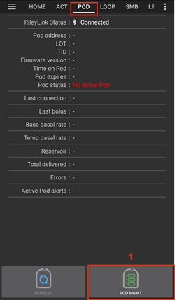 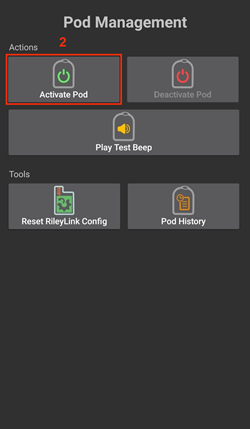

    ```{admonition} Older screenshot
    :class: note
    The screenshots above are from an earlier **AAPS** version. In **AAPS** 4 **Activate Pod** is a button on the Omnipod pump screen instead of in the **POD MGMT** menu.
    ```

02. The **Fill Pod** screen is displayed. Fill a new pod with enough insulin for 3 days and listen for two beeps. They mean that the minimum amount of 80 units has been filled. Empty the fill syringe completely, even after hearing the two beeps. When calculating the total amount of insulin you need for 3 days, please take into account that priming the pod will use 12 to 15 units. Do not remove the pod's needle cap yet.

    > 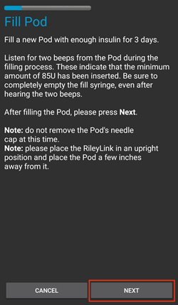
    >
    > Ensure the new pod and RileyLink are within close proximity of each other (~30cm or less) and press **Next**.

03. **Select Insulin** (only shown if you have more than one insulin configured): select the insulin you are filling the pod with and press **Next**. A profile switch with this insulin is applied after activation.

04. On the **Initialize Pod** screen, the pod will begin priming (you will hear a click followed by a series of ticking sounds as the pod primes itself). If RileyLink is out of range of the pod being activated, you will receive an error message **No response from Pod**. If this occurs, [move the RileyLink closer](#OmnipodEros-optimal-omnipod-and-rileylink-positioning) (~30 cm away or less) to but not on top of or right next to the Pod and press **Retry**.

    > 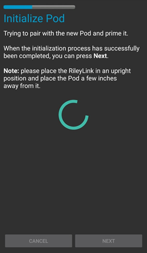 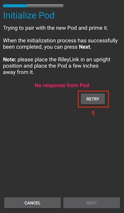

05. When priming is successful, a green checkmark is shown and the **Next** button becomes enabled. Press **Next**.

    > 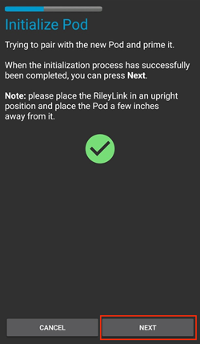

06. **Site location** (only shown if **Manage pump site rotation** is enabled in [Site Rotation](#Aapsscreens-site-rotation)): select where you place the pod on your body and press **Next**.

07. The **Attach Pod** screen is displayed. Prepare the infusion site of the new pod. Remove the pod's plastic needle cap and white paper backing from the adhesive and apply the pod to your chosen site on your body. If the cannula sticks out, press **Cancel** and discard the pod. When finished, press **Next**.

    > 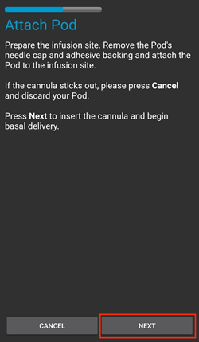

08. A confirmation dialog appears: "When you press OK, the cannula will be inserted". **ONLY press OK if you are ready to deploy the cannula**.

    > 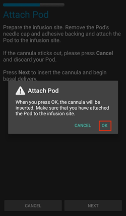

09. On the **Insert Cannula** screen, it may take some time before the Omnipod responds and inserts the cannula (1-2 minutes maximum), so be patient.

    > If RileyLink is out of range of the pod being activated, you will receive an error message **No response from Pod**. If this occurs, move the RileyLink closer (~30 cm away or less) to but not on top of or right next to the Pod and press **Retry**.
    >
    > If the RileyLink is out of Bluetooth range or does not have an active connection to the phone, you will receive an error message **No response from RileyLink**. If this occurs, move the RileyLink closer to the phone and press **Retry**.
    >
    > *NOTE: Before the cannula is inserted, it is good practice to pinch the skin near the cannula insertion point. This ensures a smooth insertion of the needle and will decrease your chances of developing occlusions.*
    >
    > 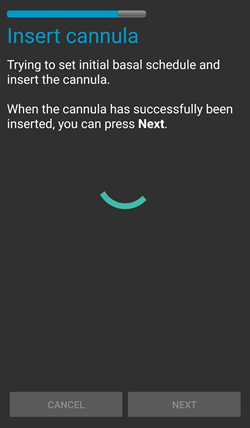
    >
    >  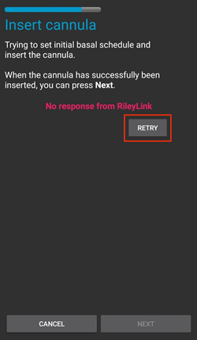

10. A green checkmark appears, and the **Next** button becomes enabled upon successful cannula insertion. Press **Next**.

    > 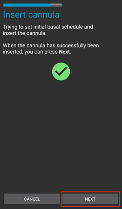

11. The **Pod Activated** screen is displayed. Check that the cannula has been inserted correctly, and change your pod if you think it has not. Press **Finish**. Congratulations! You have now started a new active pod session.

    > 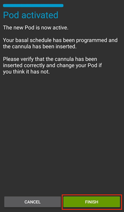

12. You are returned to the Omnipod pump screen. The **Activate Pod** button is replaced by **Deactivate Pod**, because you cannot activate another pod without deactivating the active one first.

    The pump screen now shows information about your active pod, including the current basal rate, reservoir level, insulin delivered, pod errors and alerts. For more details, see the [Omnipod pump screen](#OmnipodEros-omnipod-pod-tab) section.

    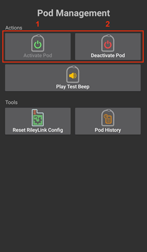 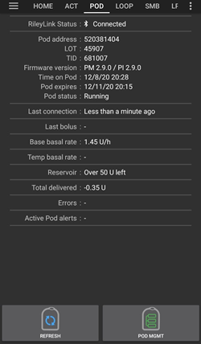

    ```{admonition} Older screenshot
    :class: note
    The screenshots above are from an earlier **AAPS** version. In **AAPS** 4 there is no Pod Management menu: you return directly to the Omnipod pump screen, where **Deactivate Pod** replaces **Activate Pod**.
    ```

```{note}
If activation was interrupted after priming (for example the app was closed), press **Activate Pod** again. The wizard continues from the cannula insertion steps.
```

### Deactivating a Pod

Under normal circumstances, the life of a pod should run for three days (72 hours) and an additional 8 hours after the pod expiration warning for a total of 80 hours of pod usage.

To deactivate a pod (either from expiration or from a pod failure):

1. Open the Omnipod pump screen (**Manage** > **Pump**) and press **Deactivate Pod**.

   > 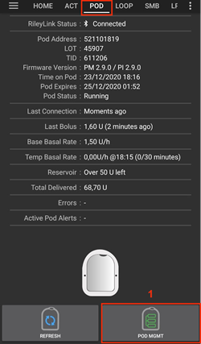 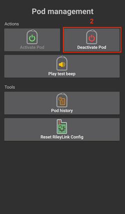

   ```{admonition} Older screenshot
   :class: note
   The screenshots above are from an earlier **AAPS** version. In **AAPS** 4 **Deactivate Pod** is a button on the Omnipod pump screen instead of in the **POD MGMT** menu.
   ```

2. On the **Deactivate Pod** screen, first make sure the RileyLink is in close proximity to the pod but not on top of or right next to the pod. Then press **Next** to start deactivating the pod. This suspends all insulin delivery.

   > 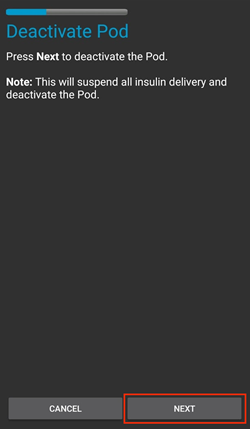

3. The **Deactivating Pod** screen appears, and you will receive a confirmation beep from the pod that deactivation was successful.

   > 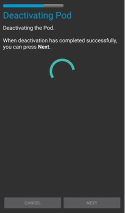
   >
   > **IF deactivation fails** and you do not receive a confirmation beep, you may receive a **No response from RileyLink** or **No response from Pod** message. Press **Retry** to attempt deactivation again. If deactivation keeps failing, press **Discard Pod** and confirm. **AAPS** then forgets the pod. Insulin delivery has **not** been suspended, so remove the pod from your body. If your pod has a screaming alarm, you may need to silence it manually (using a pin or a paperclip), because **Discard Pod** does not silence it.
   >
   > > 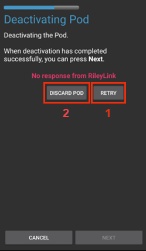  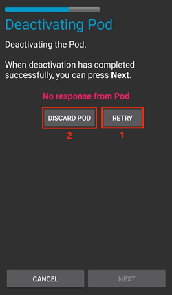

4. A green checkmark appears when deactivation is successful. Press **Next** to display the **Pod Deactivated** screen. You may now remove your pod as the active session has been deactivated.

   > 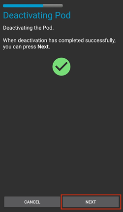

5. Press **Finish** to return to the Omnipod pump screen.

   > 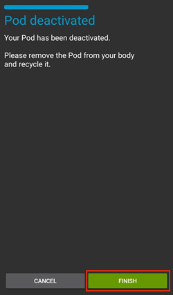

6. On the Omnipod pump screen, check that **RileyLink Status** shows **Connected** and **Pod Status** shows **No Active Pod**.

   > 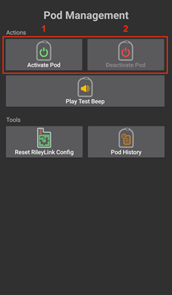  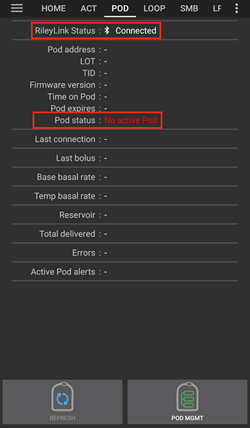

   ```{admonition} Older screenshot
   :class: note
   The screenshots above are from an earlier **AAPS** version. In **AAPS** 4 **Finish** returns you directly to the Omnipod pump screen; there is no Pod Management menu or **Omnipod (POD)** tab.
   ```

### Suspending and Resuming Insulin Delivery

The process below shows you how to suspend and resume insulin delivery.

*NOTE - if you do not see a **Suspend** button*, it is hidden by default. Enable **Show Suspend Delivery button in Omnipod tab** in the [Omnipod settings](#OmnipodEros-omnipod-settings) under **Other**.

#### Suspending Insulin Delivery

Use this command to put the active pod into a suspended state. In this suspended state, the pod will no longer deliver any insulin. This command mimics the suspend function that the original Omnipod PDM issues to an active pod.

1. Open the Omnipod pump screen (**Manage** > **Pump**) and press **Suspend**. The suspend command is sent through the RileyLink to the active pod.

2. When the pod has suspended all insulin delivery, **Pod Status** shows **Suspended** and the **Suspend** button is replaced by **Resume Delivery**.

   > 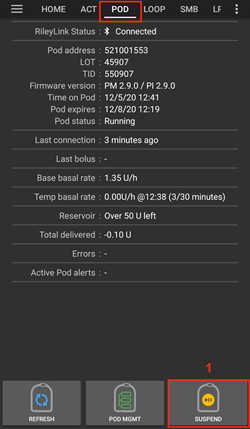 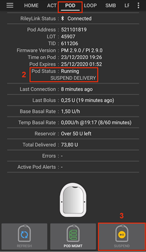
   >
   > 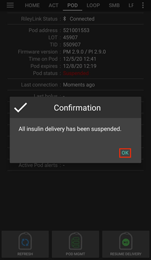
   >
   > 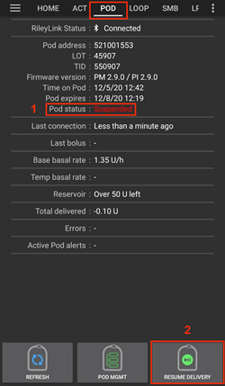

   ```{admonition} Older screenshot
   :class: note
   The screenshots above are from an earlier **AAPS** version. In **AAPS** 4 these steps take place on the Omnipod pump screen instead of the **Omnipod (POD)** tab, and the result is shown in **Pod Status**.
   ```

If the command fails, a **Warning** dialog shows "Failed to suspend delivery" with the reason. Check the RileyLink connection and try again.

#### Resuming Insulin Delivery

Use this command to instruct the active, currently suspended pod to resume insulin delivery. After the command is successfully processed, insulin will resume normal delivery using the current basal rate based on the current time from the active basal profile. The pod will again accept commands for bolus, TBR, and SMB.

1. Open the Omnipod pump screen and check that **Pod Status** shows **Suspended**. Press **Resume Delivery**.

2. When the command succeeds, **Pod Status** shows **Running** again and the **Resume Delivery** button disappears (the **Suspend** button is shown again if you have enabled it).

   > 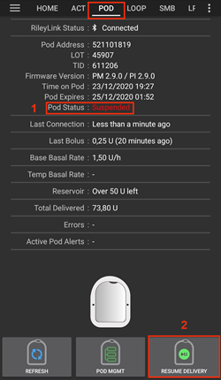 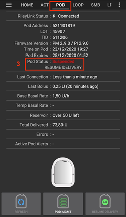
   >
   > 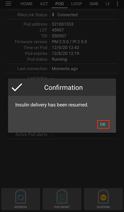
   >
   > 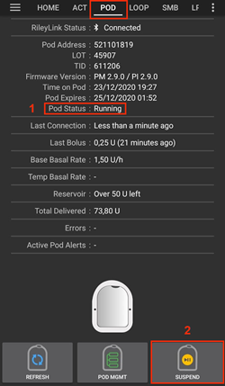

   ```{admonition} Older screenshot
   :class: note
   The screenshots above are from an earlier **AAPS** version. In **AAPS** 4 these steps take place on the Omnipod pump screen instead of the **Omnipod (POD)** tab, and the result is shown in **Pod Status**.
   ```

If the command fails, a **Warning** dialog shows "Failed to resume delivery" with the reason. Check the RileyLink connection and try again.

### Silencing Pod Alerts

*NOTE - The **Silence Alerts** button is only shown on the Omnipod pump screen while the pod has an active alert (for example the pod expiration or low reservoir alert), and only if **Automatically silence Pod alerts** is disabled.*

The process below shows you how to silence pod beeps that start when the pod reaches the warning time before it expires. This warning time is set with **Alert at hours before shutdown (80 Hours)** in the Omnipod **Alerts** settings. The maximum life of a pod is 80 hours (3 days 8 hours), however Insulet recommends not exceeding the 72 hour (3 days) limit.

*NOTE - If you have enabled **Automatically silence Pod alerts** in the Omnipod **Alerts** settings, **AAPS** silences the alert automatically at the next communication with the pod, and you do NOT need to do it manually.*

1. When the warning time is reached, the pod beeps to tell you that it will soon expire and needs to be changed. On the Omnipod pump screen, **Pod Expires** shows the exact time the pod expires (72 hours after activation); it turns **red** once this time has passed. **Active Pod Alerts** shows **Pod will expire soon**, and the **Silence Alerts** button appears. **AAPS** also shows a notification about the upcoming pod expiration.

   > 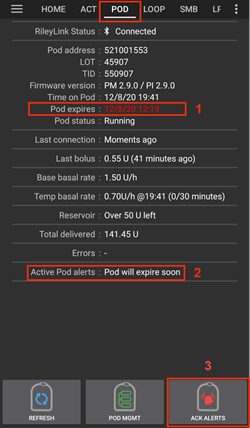 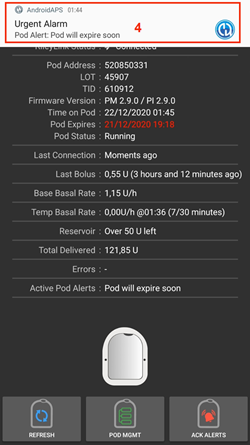

   ```{admonition} Older screenshot
   :class: note
   The screenshots above are from an earlier **AAPS** version. In **AAPS** 4 the **ACK ALERTS** button is called **Silence Alerts** and is on the Omnipod pump screen.
   ```

2. Press **Silence Alerts**. The RileyLink sends the command to the pod to stop the expiration warning beeps.

   > 

   ```{admonition} Older screenshot
   :class: note
   The screenshot above is from an earlier **AAPS** version. In **AAPS** 4 the button is called **Silence Alerts**.
   ```

3. When the alerts are silenced, the pod beeps twice. **Active Pod Alerts** no longer shows the warning, the **Silence Alerts** button disappears and the pod stops its expiration warning beeps.

   > 

   ```{admonition} Older screenshot
   :class: note
   The screenshot above is from an earlier **AAPS** version. In **AAPS** 4 the result is shown on the Omnipod pump screen: the warning disappears from **Active Pod Alerts**.
   ```

If the command fails (for example the RileyLink is out of range of the pod), a **Warning** dialog shows "Failed to silence alerts" with the reason. Move the RileyLink closer to the pod and try again.


```{admonition} Older screenshot
:class: note
The screenshot above is from an earlier **AAPS** version. In **AAPS** 4 the **Warning** dialog shows "Failed to silence alerts" with the reason.
```

(OmnipodEros-view-pod-history)=

### View Pod History

This section shows you how to review your active pod history and filter by different action categories. The pod history tool allows you to view the actions and results committed to your currently active pod during its three day (72 - 80 hours) life.

This feature is useful for verifying boluses, TBRs, basal changes that were given but you may be unsure if they completed. The remaining categories are useful in general for troubleshooting issues and determining the order of events that occurred leading up to a failure.

*NOTE:*
**Uncertain** commands will appear in the pod history, however due to their nature you cannot ensure their accuracy.

1. Open the Omnipod pump screen (**Manage** > **Pump**) and press **Pod History**.

   >  

   ```{admonition} Older screenshot
   :class: note
   The screenshots above are from an earlier **AAPS** version. In **AAPS** 4 **Pod History** is a button on the Omnipod pump screen instead of in the **POD MGMT** menu.
   ```

2. The **Pod History** screen lists all pod actions and their results, newest first, grouped by day. By default **All** is selected. Tap one of the filter buttons at the top to show only one category. Use the back arrow at the top left to return to the Omnipod pump screen.

   >  

### View RileyLink Settings and History

The **RileyLink Stats** screen shows the settings of your RileyLink and active pod, and the communication history of both. It has two tabs: **Settings** and **History**.

The **RileyLink Stats** button is hidden by default. To show it on the Omnipod pump screen, enable **Show RileyLink Stats button in Pod Management menu** in the [Omnipod settings](#OmnipodEros-omnipod-settings) under **Other**.

#### Manually Re-establish Pod Communication Device Bluetooth Communication

If your pod communication device was out of Bluetooth range of your phone for a while, **RileyLink Status** may report **RileyLink unreachable** on the Omnipod pump screen. **AAPS** normally reconnects by itself when the device is back in range. If it does not:

1. Make sure the RileyLink is powered on, charged and close to your phone.

2. On the Omnipod pump screen, press **Reset RileyLink**. A message confirms **RileyLink configuration reset**. See the [Reset RileyLink notes](#OmnipodEros-reset-rileylink-config-notes) below.

3. If the **Bluetooth connection** does not re-establish, try manually turning **off** and then back **on** the Bluetooth function on your phone.

4. If it still does not reconnect, press **Pair RileyLink** and select your RileyLink again.

5. After a successful reconnection, **RileyLink Status** shows **Connected**. You can also check **Connection Status** on the **Settings** tab of the **RileyLink Stats** screen. Congratulations, you have now reconnected your configured pod communication device to AAPS!

 


```{admonition} Older screenshot
:class: note
The screenshots above are from an earlier **AAPS** version. In **AAPS** 4 you reconnect with **Reset RileyLink** or **Pair RileyLink** on the Omnipod pump screen instead of the refresh button on the RileyLink Settings screen.
```

#### Pod Communication Device and Active Pod Settings

This screen shows information and status for both the currently paired pod communication device and the currently active Omnipod Eros pod. The information refreshes automatically.

1. Open the Omnipod pump screen (**Manage** > **Pump**) and press **RileyLink Stats**. The **Settings** tab shows your currently paired **RileyLink** and the active pod (**Device**).

   >  

   ```{admonition} Older screenshot
   :class: note
   The screenshots above are from an earlier **AAPS** version. In **AAPS** 4 **RileyLink Stats** is a button on the Omnipod pump screen instead of in the **POD MGMT** menu.
   ```

   > 

##### RileyLink fields

> - **Address:** MAC address of the paired pod communication device.
> - **Name:** Bluetooth name of the paired pod communication device.
> - **Battery Level:** The current battery level of the connected pod communication device. Only shown when **Show battery level reported by OrangeLink/EmaLink/DiaLink** is enabled.
> - **Connection Status**: The current status of the Bluetooth connection between the pod communication device and the phone running AAPS.
> - **Connection Error:** If there is an error with the pod communication device Bluetooth connection, details are displayed here.
> - **Firmware Version:** Current firmware version installed on the actively connected pod communication device.

##### Device fields - With an Active Pod

> - **Device Type:** The type of device communicating with the pod communication device (Omnipod (Eros)).
> - **Configured Device Model:** The model of the device configured to communicate with the pod communication device.
> - **Connected Device Model:** The model of the device currently communicating with the pod communication device.
> - **Pump Serial Number:** Serial number of the currently activated pod.
> - **Pump Frequency:** Radio frequency used to communicate with the pod.
> - **Last Used Frequency:** Last known radio frequency the pod used to communicate with the pod communication device.
> - **Last Device Contact:** Date and time of the last contact the pod made with the pod communication device.

(omnipod-eros-rileylink-and-active-pod-history)=
#### RileyLink and Active Pod History

This tab lists, newest first, each state or action of the RileyLink or the currently connected pod. The history is only available for the currently active pod. After a pod change, this history is erased and only events from the newly activated pod are recorded and shown.

1. Open the Omnipod pump screen (**Manage** > **Pump**), press **RileyLink Stats** and then tap the **History** tab.

   >  

   ```{admonition} Older screenshot
   :class: note
   The screenshots above are from an earlier **AAPS** version. In **AAPS** 4 **RileyLink Stats** is a button on the Omnipod pump screen instead of in the **POD MGMT** menu.
   ```

   > 

##### Fields

Each entry shows:

> - **Device:** The device to which the action or state refers.
> - **Time:** The time of the event.
> - **State or Action:** The state of the device or the action it performed.

(OmnipodEros-omnipod-pod-tab)=

## Omnipod pump screen

Below is an explanation of the status fields and buttons on the **Omnipod pump screen** (**Manage** > **Pump**, or **Configuration** > **Pump** > **Open plugin**).

The gear icon at the top right opens the [Omnipod settings](#OmnipodEros-omnipod-settings).

*NOTE: If any status field shows (uncertain), press **Refresh** to refresh the pod status and clear it.*


```{admonition} Older screenshot
:class: note
The screenshot above is from an earlier **AAPS** version, where this screen was the **Omnipod (POD)** tab. In **AAPS** 4 it is the Omnipod pump screen, and some field names and buttons differ.
```

### Fields

- **RileyLink Status:** Displays the current connection status of the RileyLink. Errors are shown in red.

  > - *Not Started* - no RileyLink is paired yet, or the connection has not started.
  > - *RileyLink unreachable* - pod communication device is either not within Bluetooth range of the phone, powered off or has a failure preventing Bluetooth communication.
  > - *RileyLink ready* - pod communication device is powered on and actively initializing the Bluetooth connection.
  > - *Connected* - pod communication device is powered on, connected and actively able to communicate via Bluetooth.

- **Unique ID:** Displays the address of the active pod.

- **LOT Number:** Displays the LOT number of the active pod.

- **Sequence Number:** Displays the serial number (TID) of the pod.

- **Firmware Version:** Displays the firmware version of the active pod.

- **Time on Pod:** Displays the current time on the active pod. It is highlighted when it differs from the phone time by more than 5 minutes.

- **Pod Expires:** Displays the date and time when the active pod will expire. The text turns red once this time has passed.

- **Pod Hard End:** Displays the end of the pod's grace period (8 hours after **Pod Expires**, for a maximum pod life of 80 hours). The text turns red once this time has passed. The pod stops delivering insulin at the hard end and must be changed.

- **Pod Status:** Displays the status of the active pod (for example **No Active Pod**, **Running** or **Suspended**).

- **Last Connection:** Displays the last time communication with the active pod was achieved. The text turns red when the [pump unreachable threshold](#OmnipodEros-troubleshooting) is exceeded.

  > - *Moments ago* - less than 20 seconds ago.
  > - *Less than a minute ago* - more than 20 seconds but less than 60 seconds ago.
  > - *1 minute ago* - more than 60 seconds but less than 120 seconds (2 min)
  > - *XX minutes ago* - more than 2 minutes ago as defined by the value of XX

- **Last Bolus:** Displays the dosage of the last bolus sent to the active pod and how long ago it was issued in parenthesis.

- **Base Basal Rate:** Displays the basal rate programmed for the current time from the basal rate profile.

- **Temp Basal Rate:** Only shown while a Temporary Basal Rate is running. Displays it in the following format:

  > - Units / hour @ time TBR was issued (minutes run / total minutes TBR will be run)
  > - *Example:* 0.00U/h @18:25 ( 90/120 minutes)

- **Reservoir:** Displays **Over 50 U left** when more than 50 units are left in the reservoir. Below this value the approximate number of units is displayed. The text turns red below the low reservoir threshold set in the [Alerts settings](#OmnipodEros-omnipod-settings).

- **Total Delivered:** Displays the total number of units of insulin delivered from the reservoir. *Note this is an approximation as priming and filling the pod is not an exact process.*

- **Active Pod Alerts:** Reserved for currently running alerts on the active pod. Normally used when pod expiration is past 72 hours and native pod beep alerts are running.

- **Errors:** Displays the last error encountered (shown in red). Review the [Pod history](#OmnipodEros-view-pod-history), [RileyLink history](#omnipod-eros-rileylink-and-active-pod-history) and log files for past errors and more detailed information.

### Buttons

The buttons at the bottom of the pump screen change depending on the situation. Buttons that cannot be used right now are greyed out, for example while the RileyLink is not connected.

**Pod status buttons** (shown when a pod is active):

- **Refresh:** Sends a refresh command to the active pod to update its status. Use it to refresh the pod status and clear status fields that contain the text (uncertain). See the [Troubleshooting section](#OmnipodEros-troubleshooting) below for additional information.

  

  ```{admonition} Older screenshot
  :class: note
  The screenshot above is from an earlier **AAPS** version. In **AAPS** 4 this is a text button named **Refresh** on the Omnipod pump screen.
  ```

- **Silence Alerts:** Silences the pod expiration and low reservoir beeps and notifications. Only shown when the pod has an active alert and **Automatically silence Pod alerts** is disabled. After the alerts are silenced, the button disappears.

  

  ```{admonition} Older screenshot
  :class: note
  The screenshot above is from an earlier **AAPS** version. In **AAPS** 4 this button is called **Silence Alerts**.
  ```

- **Set time:** Updates the time on the pod with the current time on your phone. Only shown when the time on the pod differs from the phone time by more than 5 minutes.

  

  ```{admonition} Older screenshot
  :class: note
  The screenshot above is from an earlier **AAPS** version. In **AAPS** 4 this is a text button named **Set time** on the Omnipod pump screen.
  ```

- **Suspend:** Suspends insulin delivery on the active pod. Only shown if enabled in the settings (**Show Suspend Delivery button in Omnipod tab**).

  

  ```{admonition} Older screenshot
  :class: note
  The screenshot above is from an earlier **AAPS** version. In **AAPS** 4 this is a text button named **Suspend** on the Omnipod pump screen.
  ```

- **Resume Delivery:** Resumes insulin delivery on the currently suspended, active pod. Only shown while the pod is suspended.

  

  ```{admonition} Older screenshot
  :class: note
  The screenshot above is from an earlier **AAPS** version. In **AAPS** 4 this is a text button named **Resume Delivery** on the Omnipod pump screen.
  ```

**Pod and RileyLink management buttons:**


```{admonition} Older screenshot
:class: note
The screenshot above is from an earlier **AAPS** version. In **AAPS** 4 there is no Pod Management menu: these actions are buttons directly on the Omnipod pump screen.
```

- **Activate Pod:** Primes and activates a new pod. Shown when no pod is active. It is enabled only when the RileyLink is connected.

  

  ```{admonition} Older screenshot
  :class: note
  The screenshot above is from an earlier **AAPS** version. In **AAPS** 4 **Activate Pod** is a button on the Omnipod pump screen instead of in the Pod Management menu.
  ```

- **Deactivate Pod:** Deactivates the currently active pod. Shown instead of **Activate Pod** while a pod is active.

  > - Use this command to deactivate a screaming pod (error 49).
  > - If deactivation fails, the deactivation wizard offers a **Discard Pod** option.

  

  ```{admonition} Older screenshot
  :class: note
  The screenshot above is from an earlier **AAPS** version. In **AAPS** 4 **Deactivate Pod** is a button on the Omnipod pump screen instead of in the Pod Management menu.
  ```

- **Play Test Beep:** Plays a single test beep on the pod when pressed. Shown when a pod is paired.

  

  ```{admonition} Older screenshot
  :class: note
  The screenshot above is from an earlier **AAPS** version. In **AAPS** 4 **Play Test Beep** is a button on the Omnipod pump screen instead of in the Pod Management menu.
  ```

- **Pod History:** Displays the active pod activity history. See [View Pod History](#OmnipodEros-view-pod-history).

  

  ```{admonition} Older screenshot
  :class: note
  The screenshot above is from an earlier **AAPS** version. In **AAPS** 4 **Pod History** is a button on the Omnipod pump screen instead of in the Pod Management menu.
  ```

- **Pair RileyLink:** Scans for your pod communication device and pairs it. See [RileyLink Setup](#OmnipodEros-rileylink-setup).

- **RileyLink Stats:** Opens the RileyLink Stats screen with two tabs. Only shown if enabled in the settings (**Show RileyLink Stats button in Pod Management menu**).

  > - **Settings** - displays RileyLink and active pod settings information
  > - **History** - displays RileyLink and Pod communication history

  

  ```{admonition} Older screenshot
  :class: note
  The screenshot above is from an earlier **AAPS** version. In **AAPS** 4 **RileyLink Stats** is a button on the Omnipod pump screen instead of in the Pod Management menu.
  ```

- **Reset RileyLink:** Resets the configuration of the currently connected pod communication device. When communication is started, specific data is sent to and set in the RileyLink:

  > - Memory Registers are set
  > - Communication Protocols are set
  > - Tuned Radio Frequency is set
  >
  > See [additional notes](#OmnipodEros-reset-rileylink-config-notes) below.

  

  ```{admonition} Older screenshot
  :class: note
  The screenshot above is from an earlier **AAPS** version. In **AAPS** 4 this button is called **Reset RileyLink** and is on the Omnipod pump screen.
  ```

- **Discard Pod:** Discards the pod state of an unresponsive pod, after a confirmation. Only shown when a pod has been started but not fully paired, as proper deactivation is no longer possible:

  > - A **pod is not fully paired** and thus ignores deactivate commands.
  > - A **pod is stuck** during the pairing process between steps.
  > - A **pod simply does not pair at all.**
  >
  > After you discard a pod, **AAPS** can no longer communicate with it. Remove the pod from your body.

  

  ```{admonition} Older screenshot
  :class: note
  The screenshot above is from an earlier **AAPS** version. In **AAPS** 4 **Discard Pod** is a button on the Omnipod pump screen instead of in the Pod Management menu.
  ```

(OmnipodEros-reset-rileylink-config-notes)=

#### *Reset RileyLink Notes*

- The primary usage of this feature is when the currently active pod communication device is not responding and communication is in a stuck state.
- If the pod communication device is turned off and then back on, press **Reset RileyLink** so that these communication parameters are set again in the pod communication device.
- If this is NOT done then AAPS will need to be restarted after the pod communication device is power cycled.
- This button **DOES NOT** need to be pressed when switching between different pod communication devices.

(OmnipodEros-omnipod-settings)=

## Omnipod Settings

To open the Omnipod driver settings, either:

- press the gear icon at the top right of the Omnipod pump screen (**Manage** > **Pump**), or
- open the top-left **menu** (☰) > **Configuration** > **Pump** and press **Settings** on the **Omnipod** card.


```{admonition} Older screenshot
:class: note
The screenshot above is from an earlier **AAPS** version. In **AAPS** 4 you open the settings with **Settings** on the **Omnipod** card or the gear icon on the Omnipod pump screen, instead of the settings gear in **Configuration** or the 3-dot menu.
```

The settings are grouped as listed below. Tap a group to expand it. Most entries are switches you can enable or disable:


*NOTE: An asterisk (\*) denotes the default for a setting is enabled.*

### RileyLink

Settings for the pod communication device. You pair the device itself with the **Pair RileyLink** button on the pump screen (see [RileyLink Setup](#OmnipodEros-rileylink-setup)).

- **Use Scanning:** Scans before connecting to the OrangeLink. This can improve connections. It can also be used with other RileyLink clones if needed.

- **Show battery level reported by OrangeLink/EmaLink/DiaLink:** Reports the actual battery level of the OrangeLink/EmaLink/DiaLink. It is **strongly recommended** that all OrangeLink/EmaLink/DiaLink users enable this setting.

  > - DOES NOT work with the original RileyLink.
  > - May not work with RileyLink alternatives.
  > - Enabled - Reports the current battery level for supported pod communication devices.
  > - Disabled - Reports a value of n/a.

- **Enable battery change logging in Actions:** Only available when the battery reporting setting above is enabled. Some pod communication devices can use regular batteries that you can change. With this setting enabled, you can record a **Pump Battery Change** [careportal entry](#aaps-screens-careportal) to note the change and reset the battery age.

### Confirmation Beeps

Provides confirmation beeps from the pod for bolus, basal, SMB, and TBR delivery and changes.

- **\*Bolus beeps enabled:** Enable or disable confirmation beeps when a bolus is delivered.
- **Basal beeps enabled:** Enable or disable confirmation beeps when a new basal rate is set, active basal rate is canceled or current basal rate is changed.
- **\*SMB beeps enabled:** Enable or disable confirmation beeps when a SMB is delivered.
- **TBR beeps enabled:** Enable or disable confirmation beeps when a TBR is set or canceled.

### Alerts

Provides AAPS alerts and Nightscout announcements for pod expiration, shutdown, low reservoir based on the defined threshold units.

*Note an AAPS notification will ALWAYS be issued for any alert after the initial communication with the pod since the alert was triggered. Dismissing the notification will NOT silence the alert UNLESS **Automatically silence Pod alerts** is enabled. To silence the alert MANUALLY, open the Omnipod pump screen and press **Silence Alerts**.*

- **\*Expiration reminder enabled:** When enabled, the pod beeps when the time set below is reached.
- **Alert at hours before shutdown (80 Hours):** The number of hours before the pod shuts down (80 hours after activation) at which the expiration reminder is triggered (1 to 8 hours, default 8).
- **\*Low reservoir alert enabled:** Enable or disable an alert when the pod's remaining units low reservoir limit is reached as defined in the Number of units field.
- **Number of units:** The number of units at which to trigger the pod low reservoir alert (5 to 50, default 20).
- **Automatically silence Pod alerts:** When enabled, a notification is still issued, but the alert is silenced automatically at the next communication with the pod after the alert started.

### Notifications

Provides AAPS notifications and audible phone alerts when it is uncertain if TBR, SMB, or bolus events were successful.

*NOTE: These are notifications only, no audible beep alerts are made.*

- **\*Sound for uncertain TBR notifications enabled:** Enable or disable this setting to trigger an audible alert and visual notification when AAPS is uncertain if a TBR was successfully set.
- **\*Sound for uncertain SMB notifications enabled:** Enable or disable this setting to trigger an audible alert and visual notification when AAPS is uncertain if an SMB was successfully delivered.
- **\*Sound for uncertain bolus notifications enabled:** Enable or disable this setting to trigger an audible alert and visual notification when AAPS is uncertain if a bolus was successfully delivered.

### Other

Provides advanced settings to assist debugging.

- **Show Suspend Delivery button in Omnipod tab:** Hide or display the **Suspend** button on the Omnipod pump screen.
- **Show Pulse Log button in Pod Management menu:** This setting is still listed, but the current version of the pump screen has no **Pulse Log** button.

- **Show RileyLink Stats button in Pod Management menu:** Hide or display the **RileyLink Stats** button on the Omnipod pump screen.
- **\*DST/Time zone detection enabled:** Allows time zone changes to be automatically detected if the phone is used in an area where DST is observed.

### Switching or Removing an Active Pod Communication Device (RileyLink)

With many alternative models to the original RileyLink available (such as OrangeLink or EmaLink), or the need to have multiple or backup versions of the same pod communication device, you may need to switch to another device.

To switch, open the Omnipod pump screen (**Manage** > **Pump**), press **Pair RileyLink** and select the new device, as described in [RileyLink Setup](#OmnipodEros-rileylink-setup). The new device replaces the previously paired one.

 


 

```{admonition} Older screenshot
:class: note
The screenshots above are from an earlier **AAPS** version. In **AAPS** 4 you add a device with **Pair RileyLink** on the Omnipod pump screen instead of **RileyLink Configuration** in the Omnipod settings, and scanning starts automatically.
```

There is no separate button to remove a paired device. If you stop using a RileyLink, simply pair the new one when you need it.


```{admonition} Older screenshot
:class: note
The screenshots above are from an earlier **AAPS** version. In **AAPS** 4 there is no **Remove** button: pairing a new RileyLink replaces the previous one.
```

## Status row and careportal

There are a few items that are specific to how the Omnipod pod differs from tube based pumps, especially after applying a new pod.

The **insulin** and **cannula** ages in the [status row](#screens-sensor-level-battery) of the main screen are **reset** to 0 days and 0 hours **after each pod change**. This is done because of how the Omnipod pump is built and operates. The **pump battery** and **insulin reservoir** are self contained inside of each pod. Since the pod inserts the cannula directly into the skin at the site of the pod application, a traditional tube is not used in Omnipod pumps. *Therefore after a pod change the age of each of these values will automatically reset to zero.* **Pump battery age** is not reported as the battery in the pod will always be more than the life of the pod (maximum 80 hours).


```{admonition} Older screenshot
:class: note
The screenshot above is from an earlier **AAPS** version, where these ages were shown in the **Careportal** section of the **Actions (ACT)** tab. In **AAPS** 4 they are shown in the status row of the main screen.
```

### Levels

**Insulin Level**

Reporting of the amount of insulin in the Omnipod Eros Pod is not exact. This is because it is not known exactly how much insulin was put in the pod, only that when the 2 beeps are triggered while filling the pod at least 80 units have been filled. A Pod can hold a maximum of 200 units. Priming can also introduce variance as it is not an exact process. With both of these factors, the Omnipod driver has been written to give the best approximation of insulin remaining in the reservoir.

> - **Above 50 Units** - Reports a value of 50+U when more than 50 units are currently in the reservoir.
> - **Below 50 Units** - Reports an approximate calculated value of insulin remaining in the reservoir.
> - **SMS** - Returns value or 50+U for SMS responses
> - **Nightscout** - Uploads value of 50 when over 50 units to Nightscout (version 14.07 and older).  Newer versions will report a value of 50+ when over 50 units.

**Battery Level**

Battery level reporting is a setting that can be enabled to return the current battery level of pod communication devices, such as the OrangeLink, EmaLink or DiaLink.  The RileyLink hardware is not capable of reporting its battery level.  The battery level is reported after each communication with the pod, so when charging a linear increase may not be observed.  A manual refresh will update the current battery level.  When a supported Pod communication device is disconnected a value of 0% will be reported.

> - **RileyLink hardware is NOT capable of reporting battery level**
> - **"Show battery level reported by OrangeLink/EmaLink/DiaLink" Setting MUST be enabled in the Omnipod settings to report battery level values**
> - **Battery level reporting ONLY works for OrangeLink, EmaLink and DiaLink Devices**
> - **Battery Level reporting MAY work for other devices (excluding RileyLink)**
> - **SMS** - Returns current battery level as a response when an actual level exists, a value of n/a will not be returned
> - **Nightscout** - Battery level is reported when an actual level exists, a value of n/a will not be reported

(OmnipodEros-troubleshooting)=

## Troubleshooting

### Pod Failures

Pods fail occasionally due to a variety of issues, including hardware issues with the Pod itself. It is best practice not to call these into Insulet, since AAPS is not an approved use case. A list of fault codes can be found [here](https://github.com/openaps/openomni/wiki/Fault-event-codes) to help determine the cause.

### Preventing error 49 pod failures

This failure is related to an incorrect pod state for a command or an error during an insulin delivery command. We recommend that you set Nightscout synchronization to *upload only*: keep all the "Receive ... from NS" options disabled in the synchronization settings of the Nightscout client (see [Nightscout](../SettingUpAaps/Nightscout.md)) to prevent possible failures.

### Pump Unreachable Alerts

We recommend setting pump unreachable alerts to **120 minutes**. Press the **Settings** (gear) icon at the top right of the main screen, select **Local alerts** > **Pump unreachable threshold** and set it to **120**.

(OmnipodEros-import-settings-from-previous-aaps)=
### Import Settings from previous AAPS

Please note that importing settings with **Also replace pump settings** ticked has the possibility to import an outdated Pod status. As a result, you may lose an active Pod. It is therefore strongly recommended that you **do not import settings while on an active Pod session**. When you import on the phone that already runs the Pod, leave **Also replace pump settings** unticked so the Pod session is kept (see [Export/Import settings](../Maintenance/ExportImportSettings.md)).

1. Deactivate your pod session. Verify that you do not have an active pod session.
2. Export your settings and store a copy in a safe place.
3. Uninstall the previous version of AAPS and restart your phone.
4. Install the new version of AAPS and verify that you do not have an active pod session.
5. Import your settings and activate your new pod.

### Omnipod driver alerts

Please note that the Omnipod driver presents a variety of unique alerts on the **main screen**, most of them are informational and can be dismissed while some provide the user with an action to take to resolve the cause of the triggered alert. A summary of the main alerts that you may encounter is listed below:

#### No active Pod

No active Pod session detected. This alert can temporarily be dismissed by pressing **SNOOZE** but it will keep triggering as long as a new pod has not been activated. Once activated this alert is automatically silenced.

#### Pod suspended

Informational alert that Pod has been suspended.

#### Setting basal profile failed. Delivery might be suspended! Please manually refresh the Pod status from the Omnipod tab and resume delivery if needed.

Informational alert that the Pod basal profile setting has failed. Open the Omnipod pump screen and press **Refresh**, then **Resume Delivery** if needed.

#### Unable to verify whether SMB bolus succeeded. If you are sure that the Bolus didn't succeed, you should manually delete the SMB entry from Treatments.

Alert that the SMB bolus success could not be verified. Check the **Last Bolus** field on the Omnipod pump screen to see if the SMB succeeded. If it did not, remove the entry from the treatments.

#### Uncertain if "task bolus/TBR/SMB" completed, please manually verify if it was successful.

Due to the way that the RileyLink and Omnipod communicate, situations can occur where it is *uncertain* if a command was successfully processed. The need to inform the user of this uncertainty was necessary.

Below are a few examples of when an uncertain notification can occur.

- **Boluses** - Uncertain boluses cannot be automatically verified. The notification will remain until the next bolus but a manual pod refresh will clear the message. *By default alerts beeps are enabled for this notification type as the user will manually need to verify them.*
- **TBRs, Pod Statuses, Profile Switches, Time Changes** - a manual pod refresh will clear the message.
- **Pod Time Deviation -** When the time on the pod and the time on your phone differ too much, it is difficult for the AAPS loop to function and make accurate predictions and dosage recommendations. If the time difference between the pod and the phone is more than 5 minutes, a **Set time** button appears on the Omnipod pump screen. Press **Set time** to synchronize the time on the pod with the time on the phone. If **Pod Status** shows **Suspended** afterwards, press **Resume Delivery** to continue normal pod operations.

## Best Practices

(OmnipodEros-optimal-omnipod-and-rileylink-positioning)=

### Optimal Omnipod and RileyLink Positioning

The antenna used on the RileyLink to communicate with an Omnipod pod is a 433 MHz helical spiral antenna. Due to its construction properties it radiates an omni directional signal like a three dimensional doughnut with the z-axis representing the vertical standing antenna. This means that there are optimal positions for the RileyLink to be placed, especially during pod activation and deactivation routines.


> *(Fig 1. Graphical plot of helical spiral antenna in an omnidirectional pattern*)

Because of both safety and security concerns, pod *activation* has to be done at a range *closer (~30 cm away or less)* than other operations such as giving a bolus, setting a TBR or simply refreshing the pod status. Due to the nature of the signal transmission from the RileyLink antenna it is NOT recommended to place the pod directly on top of or right next to the RileyLink.

The image below shows the optimal way to position the RileyLink during pod activation and deactivation procedures. The pod may activate in other positions but you will have the most success using the position in the image below.

*Note: If after optimally positioning the pod and RileyLink communication fails, this may be due to a low battery which decreases the transmission range of the RileyLink antenna. To avoid this issue make sure the RileyLink is properly charged or connected directly to a charging cable during this process.*


## Where to get help

All of the development work for the Omnipod driver is done by the community on a volunteer basis; we ask that you please be considerate and use the following guidelines when requesting assistance:

- **Level 0:** Read the relevant section of this documentation to ensure you understand how the functionality with which you are experiencing difficulty is supposed to work.
- **Level 1:** If you are still encountering problems that you are not able to resolve by using this document, then please go to the *#androidaps* channel on **Discord** by using [this invite link](https://discord.gg/4fQUWHZ4Mw).
- **Level 2:** Search existing issues to see if your issue has already been reported; if not, please create a new [issue](https://github.com/nightscout/AndroidAPS/issues) and attach your [log files](../GettingHelp/AccessingLogFiles.md).
- **Be patient - most of the members of our community consist of good-natured volunteers, and solving issues often requires time and patience from both users and developers.**
