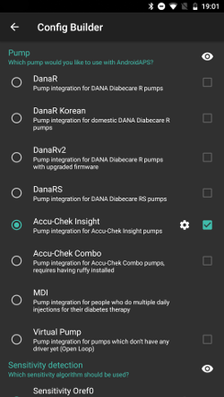
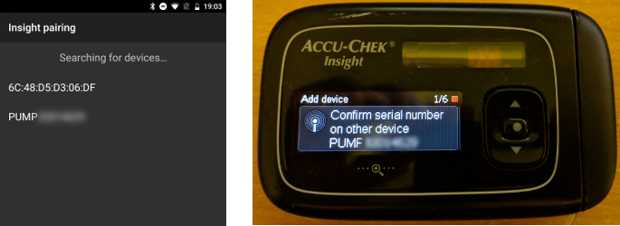
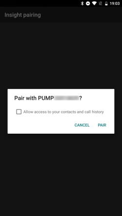
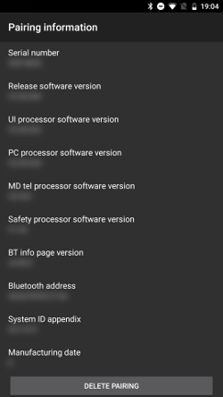
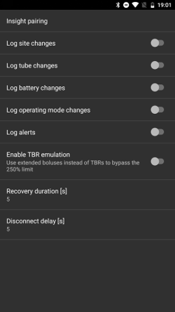
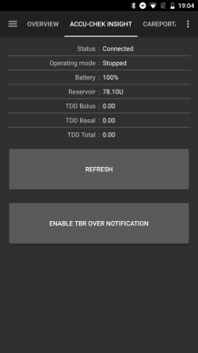

# Accu Chek Insight Pump

**This software is part of a DIY solution and is not a product, but
requires YOU to read, learn and understand the system including how to use it.
It is not something that does all your diabetes management for you, but
allows you to improve your diabetes and your quality of life 
if you're willing to put in the time required. Don't rush into it,
but allow yourself time to learn. You alone are responsible for what
you do with it.**

## Hardware & software requirements

- A Roche Accu-Chek Insight (any firmware, they all work)
- An Android phone
- AndroidAPS (at least V 2.1)

## Setup

- In [Config builder](../Configuration/Config-Builder) select Accu-Chek Insight in the pump section

   

- Click the cog-wheel to open Insight settings.
- In settings click button 'Insight pairing' on top of the screen. All bluetooth devices that are found will be displayed.
 - On the Insight pump go to Menu > Settings > Communication > Add Device. The following screen should be displayed on your pump.
 
   

- On your phone click on the correpsonding bluetooth device with the name shown on the pump display. After that confirm pairing on the phone.

   

- Pump and phone should display a code. If this code is identical on both devices confirm on pump and phone.

   

- Successful pairing will be prompted on phone and pump.

   

- If you click "Insight pairing" in settings of the Insight pump on AAPS after pairing was successful some information about the pump will be displayed:

   

## Settings in AAPS

You can enable the following options in the Insight settings on AAPS:
- "Log site changes": Automatic entry of insulin cartridge change when pump program "fill cannula" is started on the pump. Note: Cannula change resets Autosens</b>
- "Log tube changes": Note in AAPS database when "tube filling" program is started on the pump.
- "Log battery changes": Automatic entry of pump battery change when new battery is inserted in the pump.
- "Log operating mode changes": Note in AAPS database when pump is started, stopped or paused on the pump.
- "Log alerts": Note in AAPS database when is issueing an alert.
- "Enable TBR emulation": As Insight can only issue TBR up to 250% this is important. With this setting a delayed bolus is issued instead of TBR in case more than 250% are needed.
- "Recovery duration": Waiting period after failed connection attempts. Can be increased if connection problems occur. Select value between 0 and 20 seconds.
- "Disconnect delay": Duration in seconds until the driver disconnects from pump after connection is no longer needed.

   
   
In status tab the following buttons are available:
- "Refresh": refresh pump status
- "Enable/Disable TBR over notification": As a standard Insight pump starts an alarm once a TBR is finished. This alarm can be activated / deactivated through this button without use of configuration software.

   

## Pump settings

Configure pump alarms as follows:
- Menu > Settings > Device settings > Mode settings > Quiet > Signal > Sound Menu > Settings > Device settings > Mode settings > Quiet > Volume > 0 (remove all bars)
- Menu > Modes > Signal mode > Quiet

By default all alarms will be silent allowing AAPS to confirm if alarm is not relevant for the user. If alarms are not confirmed by AAPS volume will rise (first beep, then vibration).

Insight pumps with newer firmware vibrate once bolus is delivered via a bluetooth device (i.e. AAPS issuing SMB or delayed bolus for TBR emulation). Vibration cannot be deactivated. Older pumps are not vibrating in these cases.

