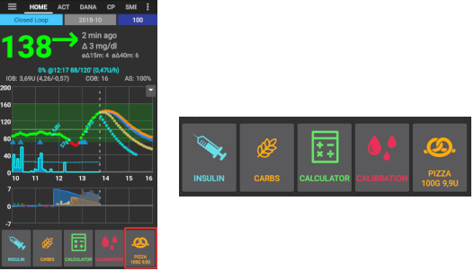

# Config Builder

Depending on your settings you can open Config Builder through a tab at the top of the screen or through hamburger menu.

Config Builder (Conf) is the tab where you turn the modular features on and off.  The boxes on the left-hand side (A) allow you to select which one to use, the boxes on the right-hand side (C) allow you to view these as a tab (E) in AndroidAPS.  In case the right box is not activated you can reach the function by using the hamburger menu (D) on the top left of the screen.

Where there are additional settings available within the module, you can click on the cog wheel (B) which will take you to the specific settings within preferences.

**First configuration:** Since AAPS 2.0 a Setup wizard guides you through the process of setting up AndroidAPS. Push 3-dots-menu on the upper right-hand side of the screen (F) and select 'Setup Wizard' to use it.

(Config-Builder-tab-or-hamburger-menu)=
## Tab or hamburger menu

With the checkbox under the eye symbol you can decide how to open the corresponding program section.

(Config-Builder-profile)=
## Profile
* Select the basal profile you wish to use. See [Profiles](../Usage/Profiles.md) page for more setup information.
* As of AAPS 3.0, only the local profile is available.

However, it is possible to synchronise a Nightscout profile into a local profile. To do this, however, it is important to clone the whole database record consisting of several profiles in the Nightscout editor. Please see the instructions below. This can be helpful if major changes to a more extensive profile can be entered more easily via the web interface, e.g. to manually copy data from a spreadsheet.

(Config-Builder-local-profile)=
### Local profile
Local profile uses the basal profile manually entered in phone. As soon as it is selected, a new tab appears in AAPS, where you can change the profile data read out from the pump if necessary. With the next profile switch they are then written to the pump in profile 1. This profile is recommended as it does not rely on internet connectivity.

Your local profiles are part of [exported settings](../Usage/ExportImportSettings.md). So make sure to have a backup in a safe place.

Buttons:
* green plus: add
* red X: delete
* blue arrow: duplicate

If you make any changes to your profile, make sure, you are editing the correct profile. In profile tab there is not always shown the actual profile being used - e.g. if you made a profile switch by using the profile tab on homescreen it may differ from the profile actually shown in profile tab as there is no connection between these.

#### Clone profile switch
You can easily create a new local profile from a profile switch. In this case timeshift and percentage will be applied to the new local profile.

1. Click 3-dots-menu in upper right corner.
2. Select 'Treatments'.
3. Press star symbol to access profile switch page.
4. Select the desired profile switch and press "Clone".
5. You can edit the new local profile in Local Profile (LP) tab or via the hamburger menu.

(Config-Builder-upload-local-profiles-to-nightscout)=
#### Upload local profiles to Nightscout
Local profiles can also be uploaded to Nightscout. The settings can be found in [NSClient preferences](Preferences-nsclient).

#### Change profile in Nighscout profile editor
You can synchronoze changes to the profile in the Nighscout profile editor to local profiles. The settings can be found in [NSClient preferences](Preferences-nsclient).

It is necessary to clone the actual active entire Nightscout database records for the profiles and not just a profile with the blue arrow! The new database records then carries the current date and can be activated via the tab "local profile".

### Profile helper

Profile helper offers two functions:

   1. Find a profile for kids
   2. Compare two profiles or profile switches in order to clone a new profile

Details are explained on the separate [profile helper page](../Configuration/profilehelper.md).

(Config-Builder-insulin)=
## Insulin

* Select the type of insulin curve you are using.
* The options 'Rapid-Acting Oref', Ultra-Rapid Oref', 'Lyumjev' and 'Free-Peak Oref' all have an exponential shape. More information is listed in the [OpenAPS docs](https://openaps.readthedocs.io/en/latest/docs/While%20You%20Wait%20For%20Gear/understanding-insulin-on-board-calculations.html#understanding-the-new-iob-curves-based-on-exponential-activity-curves). 
* The curves will vary based on the DIA and the time to peak.

   * PURPLE line shows how much **insulin remains** after it has been injected as it decays with time.
   * BLUE line shows **how active** insulin is.

### DIA

* The DIA is not the same for each person. That's why you have to test it for yourself. 
* But it must always be at least 5 hours.
* For a lot of people using ultra-rapid insulins like Fiasp there is practically no noticeable effect after 3-4 hours any more, even if 0.0xx units are available as a rule then. This residual amount can still be noticeable during sports, for example. Therefore, AndroidAPS uses minimum 5h as DIA.
* You can read more about that in the Insulin Profile section of [this](Screenshots-insulin-profile) page.

### Insulin type differences
* For 'Rapid-Acting', 'Ultra-Rapid' and 'Lyumjev' the DIA is the only variable you can adjust by yourself, the time to peak is fixed. 
* Free-Peak allows you to adjust both the DIA and the time to peak, and must only be used by advanced users who know the effects of these settings. 
* The [insulin curve graph](Screenshots-insulin-profile) helps you to understand the different curves.
* You can view it by enabling the tickbox to show it as a tab, otherwise it will be in the hamburger menu.

#### Rapid-Acting Oref

* recommended for Humalog, Novolog and Novorapid
* DIA = at least 5.0h
* Max. peak = 75 minutes after injection (fixed, not adjustable)

#### Ultra-Rapid Oref

* recommended for FIASP
* DIA = at least 5.0h
* Max. peak = 55 minutes after injection (fixed, not adjustable)

(Config-Builder-lyumjev)=
#### Lyumjev

* special insulin profile for Lyumjev
* DIA = at least 5.0h
* Max. peak = 45 minutes after injection (fixed, not adjustable)

#### Free Peak Oref

* With the "Free Peak 0ref" profile you can individually enter the peak time. To do so click to cogwheel to enter advanced settings.
* The DIA is automatically set to 5 hours if it is not specified higher in the profile.
* This effect profile is recommended if an unbacked insulin or a mixture of different insulins is used.

(Config-Builder-bg-source)=
## BG Source
Select the blood glucose source you are using - see [BG Source](BG-Source.md) page for more setup information.

* [Build Your Own Dexcom App (BYODA)](https://docs.google.com/forms/d/e/1FAIpQLScD76G0Y-BlL4tZljaFkjlwuqhT83QlFM5v6ZEfO7gCU98iJQ/viewform?fbzx=2196386787609383750&fbclid=IwAR2aL8Cps1s6W8apUVK-gOqgGpA-McMPJj9Y8emf_P0-_gAsmJs6QwAY-o0).
* [xDrip+](https://xdrip-plus-updates.appspot.com/stable/xdrip-plus-latest.apk) - Cannot be used as receiver for Dexcom G6 as of AAPS 3.0 (see [release notes](Releasenotes-important-hints-3-0-0) for details.
* [MM640g](https://github.com/pazaan/600SeriesAndroidUploader/releases)
* [Glimp](https://play.google.com/store/apps/details?id=it.ct.glicemia&hl=de) - only version 4.15.57 and newer are supported
* [Poctech](https://www.poctechcorp.com/en/contents/268/5682.html)
* [Tomato App](http://tomato.cool/) for MiaoMiao device
* [Glunovo App](https://infinovo.com/) for Glunovo CGM system
* NSClient BG - not recommended as closed loop relies on mobile data / wifi coverage in this case. CGM data will only be received if there is an online connection to your NS site. Better use local broadcast from one of the other CGM data sources.
* Random BG: Generates random BG data (Demo mode only)

(Config-Builder-pump)=
## Pump
Select the pump you are using.  

* [Dana R](DanaR-Insulin-Pump.md)
* Dana R Korean (for domestic DanaR pump)
* Dana Rv2 (DanaR pump with unofficial firmware upgrade)
* [Dana-i/RS](DanaRS-Insulin-Pump.md)

   * For dana pumps, use <b>Advanced settings</b> to activate BT watchdog if necessary. It switches off bluetooth for one second if no connection to the pump is possible. This may help on some phones where the bluetooth stack freezes.
   * [Password for Dana RS pump](../Configuration/DanaRS-Insulin-Pump.md) must be entered correctly. Password was not checked in previous versions.

* [Accu Chek Insight](Accu-Chek-Insight-Pump.md)
* [Accu Chek Combo](Accu-Chek-Combo-Pump.md) (requires ruffy installation)
* [Omnipod Eros](OmnipodEros.md)
* [Omnipod DASH](OmnipodDASH.md)
* [Medtronic](MedtronicPump.md)
* [Diaconn G8](DiaconnG8.md)
- MDI (receive AAPS suggestions for your multiple daily injections therapy)
- Virtual pump (open loop for pump which don't have any driver yet - AAPS suggestions only)

## Sensitivity Detection
Select the type of sensitivity detection. For more details of different designs please [read on here](../Configuration/Sensitivity-detection-and-COB.md). This will analyze historical data on the go and make adjustments if it recognizes that you are reacting more sensitively (or conversely, more resistant) to insulin than usual.  More details about the Sensitivity algorithm can be read in the [OpenAPS docs](https://openaps.readthedocs.io/en/latest/docs/Customize-Iterate/autosens.html).  

You can view your sensitivity on the homescreen by selecting SEN and watching the white line.  Note, you need to be in [Objective 8](Objectives-objective-8-adjust-basals-and-ratios-if-needed-and-then-enable-autosens) in order to let Sensitivity Detection/[Autosens](Open-APS-features-autosens) automatically adjust the amount of insulin delivered. Before reaching that objective, the Autosens percentage / the line in your graph is displayed for information only.

(Config-Builder-absorption-settings)=
### Absorption settings
If you use Oref1 with SMB you must change <b>min_5m_carbimpact</b> to 8. The value is only used during gaps in CGM readings or when physical activity "uses up" all the blood glucose rise that would otherwise cause AAPS to decay COB. At times when [carb absorption](../Usage/COB-calculation.md) can't be dynamically worked out based on your bloods reactions it inserts a default decay to your carbs. Basically, it is a failsafe.

(Config-Builder-aps)=
## APS
Select the desired APS algorithm for therapy adjustments. You can view the active detail of the chosen algorithm in the OpenAPS(OAPS) tab.
- OpenAPS AMA (advanced meal assist, state of the algorithm in 2017) In simple terms the benefits are after you give yourself a meal bolus the system can high-temp more quickly IF you enter carbs reliably.
- [OpenAPS SMB](../Usage/Open-APS-features.md) (super micro bolus, most recent algorithm for advanced users)
Note you need to be in [Objective 9](Objectives-objective-9-enabling-additional-oref1-features-for-daytime-use-such-as-super-micro-bolus-smb) in order to use OpenAPS SMB and min_5m_carbimpact must be set to 8 in Config builder > Sensitivity detection > Sensitivity Oref1 settings.

## Loop

* Switch between Open Loop, Closed Loop and Low Glucose Suspend (LGS).

(Config-Builder-open-loop)=
### Open Loop
* AAPS continuously evaluates all available data (IOB, COB, BG...) and makes treatment suggestions on how to adjust your therapy if necessary. 
* The suggestions will not be executed automatically (as in closed loop) have to be entered manually into the pump or by using a button in case you are using a compatible pump (Dana R/RS or Accu Chek Combo). 
* This option is for getting to know how AndroidAPS works or if you are using an unsupported pump.

(Config-Builder-closed-loop)=
### Closed Loop
* AAPS continuously evaluates all available data (IOB, COB, BG...) and automatically adjusts the treatment if necessary (i.e. without further intervention by you) to reach the set target range or value (bolus delivery, temporary basal rate, insulin switch-off to avoid hypo etc.). 
* The Closed Loop works within numerous safety limits, which you can be set individually.
* Closed Loop is only possible if you are in [Objective 6](Objectives-objective-6-starting-to-close-the-loop-with-low-glucose-suspend) or higher and use a supported pump.
* Please note: In closed loop mode a single target instead of target range (i.e. 5,5 mmol or 100 mg/dl instead of 5,0 - 7,0 mmol or 90 - 125 mg/dl) is recommended.

### Low Glucose Suspend (LGS)
* maxIOB is set to zero
* This means if blood glucose is dropping it can reduce basal for you.
* But if blood glucose is rising no automatic correction will be made. Your basal rates will remain the same as your selected profile.
* Only if basal IOB is negative (from a previous Low Glucose Suspend) additional insulin will be given to lower BG.

### Minimal request change
* When using open loop you will receive notifications every time AAPS recommends to adjust basal rate. 
* To reduce number of notifications you can either use a wider bg target range or increase percentage of the minimal request rate.
* This defines the relative change required to trigger a notification.

## Objectives (learning program)
AndroidAPS has a leraning program (objectives) that you have to fulfill step by step. This should guide you safely through setting up a closed loop system. It guarantees that you have set everything up correctly and understand what the system does exactly. This is the only way you can trust the system.

You should [export your settings](../Usage/ExportImportSettings.md) (including progress of the objectives) on a regularly basis. In case you have to replace your smartphone later (new purchase, display damage etc.) you can simply import those settings.

See [Objectives](../Usage/Objectives.md) page for more information.

## Treatments
If you view the Treatments (Treat) tab, you can see the treatments that have been uploaded to nightscout.  Should you wish to edit or delete an entry (e.g. you ate less carbs than you expected) then select 'Remove' and enter the new value (change the time if necessary) through the [carbs button on the home screen](Screenshots-carb-correction).

## General
### Overview
Displays the current state of your loop and buttons for most common actions (see [section The Homescreen](../Getting-Started/Screenshots.md) for details).  Settings can be accessed by clicking the cog wheel.

#### Keep screen on
Option 'Keep screen on' will force Android to keep the screen on at all times. This is useful for presentations etc. But it consumes a lot of battery power. Therefore, it is recommended to connect the smartphone to a charger cable.

#### Buttons
Define which Buttons are shown on the home screen.
* Treatments
* Calculator
* Insulin
* Carbs
* CGM (opens xDrip+)
* Calibration

Furthermore, you can set shortcuts for insulin and carb increments and decide whether the notes field should be shown in treatment dialogues.

#### QuickWizard settings
Create a button for a certain standard meal (carbs and calculation method for the bolus) which will be displayed on the home screen. Use for standard meals frequently eaten. If different times are specified for the different meals you will always have the appropriate standard meal button on the home screen, depending on the time of day.

Note: Button will not be visible if outside the specified time range or if you have enough IOB to cover the carbs defined in the QuickWizard button.

#### Default Temp-Targets
Choose default temp-targets (duration and target). Preset values are:

* eating soon: target 72 mg/dl / 4.0 mmol/l, duration 45 min
* activity: target 140 mg/dl / 7.8 mmol/l, duration 90 min
* hypo: target 125 mg/dl / 6.9 mmol/l, duration 45 min

#### Fill/Prime standard insulin amounts
Choose the default amounts of the three buttons in fill/prime dialogue, depending on the length of your catheter.

#### Range of visualization
Choose the high and low marks for the BG-graph on AndroidAPS overview and smart watch. It is only the visualization, not the target range for your BG. Example: 70 - 180 mg/dl or 3.9 - 10 mmol/l

#### Shorten tab titles
Choose wether the tab titles in AndroidAPS are long (e.g. ACTIONS, LOCAL PROFILE, AUTOMATION) or short (e.g. ACT, LP, AUTO)

#### Show notes field in treatment dialogs
Choose if you want to have a notes field when entering treatments or not.

#### Status lights
Choose if you want to have [status lights](Preferences-status-lights) on overview for cannula age, insulin age, sensor age, battery age, reservoir level or battery level. When warning level is reached, the color of the status light will switch to yellow. Critical age will show up in red.

#### Advanced settings
**Deliver this part of bolus wizard result**: When using SMB, many people do not meal-bolus 100% of needed insulin, but only a part of it (e.g. 75 %) and let the SMB with UAM (unattended meal detection) do the rest. In this setting, you can choose a default value for the percenteage the bolus wizard should calculate with. If this setting is 75 % and you had to bolus 10u, the bolus wizard will propose a meal bolus of only 7.5 units. 

**Enable super bolus functionality in wizard** (It is different from *super micro bolus*!): Use with caution and do not enable until you learn what it really does. Basically, the basal for the next two hours is added to the bolus and a two hour zero-temp activated. **AAPS looping functions will be disabled - so use with care! If you use SMB AAPS looping functions will be disabled according to your settings in ["Max minutes of basal to limit SMB to"](Open-APS-features-max-minutes-of-basal-to-limit-smb-to), if you do not use SMB looping functions will be disabled for two hours.** Details on super bolus can be found [here](https://www.diabetesnet.com/diabetes-technology/blue-skying/super-bolus).

(Config-Builder-actions)=
### Actions
* Some buttons to quickly access common features.
* See [AAPS screenshots](Screenshots-action-tab) for details.

### Automation
User defined automation tasks ('if-then-else'). Please [read on here](../Usage/Automation.md).

(Config-Builder-sms-communicator)=
### SMS Communicator
Allows remote caregivers to control some AndroidAPS features via SMS, see [SMS Commands](../Children/SMS-Commands.md) for more setup information.

### Food
Displays the food presets defined in the Nightscout food database, see [Nightscout Readme](https://github.com/nightscout/cgm-remote-monitor#food-custom-foods) for more setup information.

Note: Entries cannot be used in the AndroidAPS calculator. (View only)

(Config-Builder-wear)=
### Wear
Monitor and control AAPS using your Android Wear watch (see [page Watchfaces](../Configuration/Watchfaces.md)). Use settings (cog wheel) to define which variables should be considered when calculating bolus given though your watch (i.e. 15min trend, COB...).

If you want to bolus etc. from the watch then within "Wear settings" you need to enable "Controls from Watch".

Through Wear tab or hamburger menu (top left of screen, if tab is not displayed) you can
* Resend all data.
Might be helpful if watch was not connected for some time and you want to push the information to the watch.
* Open settings on your watch directly from your phone.

### xDrip Statusline (watch)
Display loop information on your xDrip+ watchface (if you are not using AAPS/[AAPSv2 watchface](../Configuration/Watchfaces.md)

### NSClient
* Setup sync of your AndroidAPS data with Nightscout.
* Settings in [preferences](Preferences-nsclient) can be opened by clicking the cog wheel.

### Maintenance
Email and number of logs to be send. Normally no change necessary.

### Config Builder
Use tab for config builder instead of hamburger menu.
