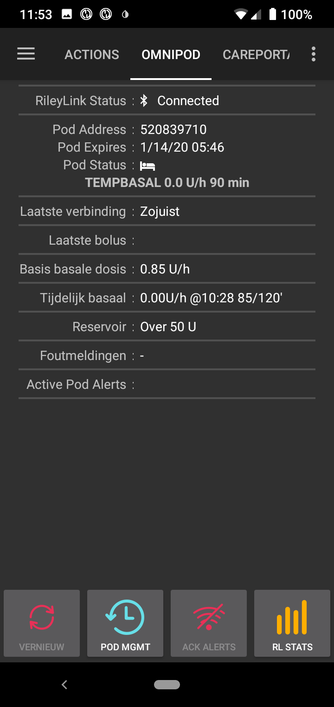
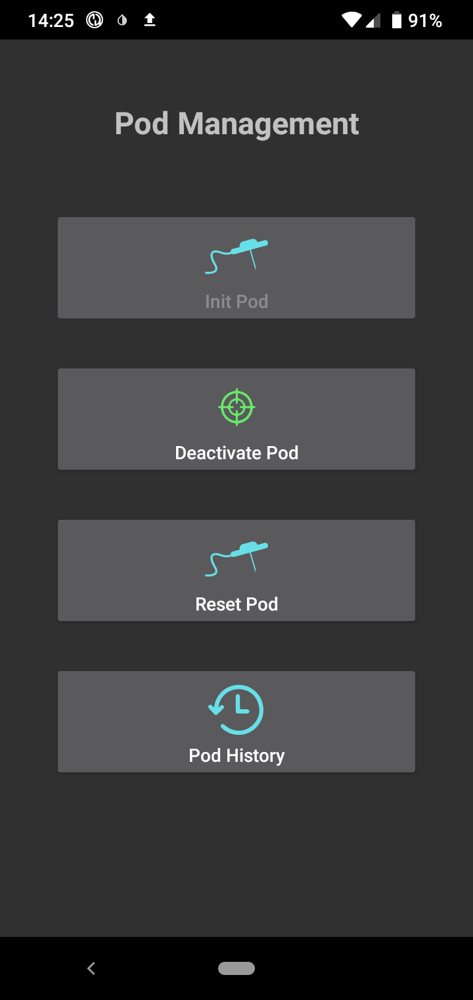
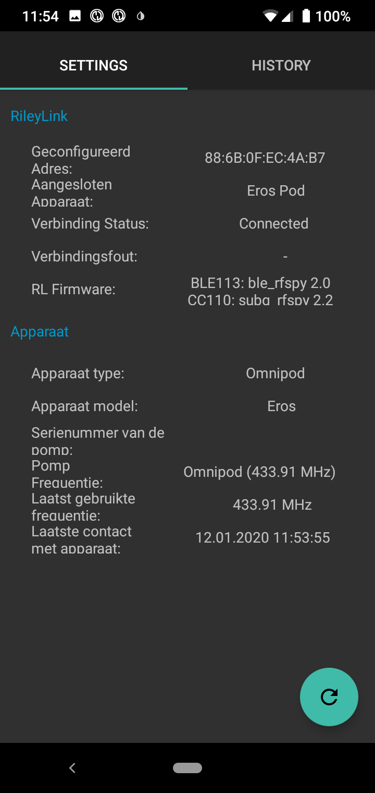
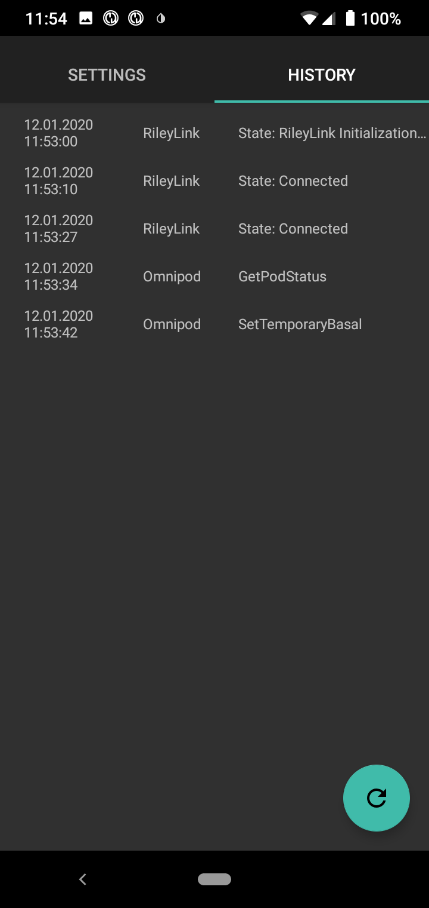

# Omnipod patch pump, original version (Eros)

**>>>> Omnipod patch pump driver is planned to be part of AndroidAPS (master) in the 2.6 version. While this is the case, Omnipod patch pump driver should still be considered beta software. Please install only if you are an experienced user. <<<<**

***

Works only with the first version of the Omnipod patch pump (Eros). Does not work with Omnipod Dash, the new Omnipod model introduced in 2019.

***

## Hardware and software requirements
- **Phone:** Omnipod patch pump driver should work with any phone supporting BLE. **IMPORTANT: While the driver works correctly on all phones, enabling/disabling Bluetooth doesn't (this is required when you loose connection to RileyLink and the system can't recover automatically - this happens from time to time). So you need to get a device with Android 6.0 - 8.1, in worst case scenario you can  install LinegaeOS 15.1 (required 15.1 or lower) on your phone. We are looking into problems with Android 9, but so far we haven't found a resolution (it seems to work on some models and not on others, and on some models it also works only sometimes).**
- **RileyLink:** For communication with a pod you need a device that converts BT commands from your phone into radio frequency commands that the pod understands. The device that does that, is called RileyLink (you can get it here [getrileylink.org](https://getrileylink.org/)). You need the version that is specifically for Omnipod, the 433 MHz version (that's the frequency Omnipod uses).  

## Configuration of Phone/AndroidAPS
- **Do not pair RileyLink with your Phone.** Pairing with Rileylink is done from within AndroidAPS. If you paired your RileyLink, then AndroidAPS won't be able to find it during configuration.
- Disable Auto-rotate on your phone (on some devices Auto-rotate restarts BT sessions, which is not something we would want).
- You can configure Omnipod in AndroidAPS two ways: 
1. Select Omnipod in the pumps section of the Setup wizard (on new install or through the three dot menu in the top right of AAPS) and press the cog wheel icon behind it
2. Directly in Config tab, where you select Omnipod and press the cog wheel icon behind it. Attention: when you switch from another pump to Omnipod in the Config tab, AndroidAPS automatically goes to the Overview tab. You have to return to the Config tab, to press the cog wheel icon behind Omnipod and configure Rileylink.
! [Omnipod in Config Tab] (../images/OmnipodinConfigTab.png)

### Omnipod Cog Wheel Window 
After you have pressed the cog wheel, you will see this window.
! [Omnipod Cog Wheel Window](../images/OmnipodCogWheelWindow.png)
The first line in the cog wheel window takes you to connecting your Rileylink. Press "Scan" in the upper right corner to let your phone start scanning for available RileyLinks. After your RileyLink has appeared, tap on it to select it. Then you'll automatically return to the cog wheel window. Attention: after you have selected your RileyLink, the green light of your RileyLink should light up and stay lit. This can take up to a minute. If it doesn't light up, Rileylink is not (yet) properly initialized and functioning. We'll get to that in the Omnipod Tab section.
! [Omnipod RileyLink Scan window] (../images/OmnipodRileyLinkScan.png)

With the other options in the cog wheel window you can enable and disable the beeps on your Omnipod. The last option (Pod Debugging Options) is for debugging purposes only: don't enable this unless you're absolutely sure what you're doing.

## OMNIPOD (POD) Tab

On the Omnipod tab you can see several lines that are showing the pods and connections current status.
- **RileyLink Status**: This shows the status of the RileyLink connection. This should say "Connected" like in the picture: then the connection is functioning properly. If it says something different (for instance "Bluetooth ready" of "Rileylink initializing") the connection is not properly initialized. Wait for a minute to see if it does If it doesn't: force stop AndroidAPS (go to apps on your phone, long press the AndroidAPS icon, choose app-info and press Stop) and start it back up again. A short while after AndroidAPS is started, the RileyLink should be initialized, the green light on it lit and the connection functioning.
- **Pod Address**: Once a pod has been primed and functioning, its address is shown here
- **Pod Expires**: The date and time when the pod should be replaced with a new one (3 days and 6 hours after it has been started)
- **Pod Status**: The icon behind it shows the status of the pod. Normally it's a bed: the pod is "sleeping". Under this a command can be shown (as in the image shown): this is the command that is communicated to the pod.
- **Last connection**: Time of the last succesful connection to the pod.
- **Last Bolus**: Amount and time of the last bolus given.
- **Base Basal Rate**: This is the base basal rate programmed in the pod (the basal rate from the profile you have activated).
- **Temp basal**: Temp basal that is running. When this is empty, the base basal rate is running.
- **Reservoir**: How much insulin is in the pod (updated at least every hour).
- **Errors**: Error string if there is problem (mostly shows if there is error in configuration).
- **Active Pod Alerts**: the alerts the pod gives (signaled by the typical frequent "beep-beep, beep-beep" sound coming from the pod). With the button "Ack Alerts" (described below) you can acknowledge alerts and stop the beeping.

On lower end we have 4 buttons:
- **Refresh**: for refreshing the state of the pod and the connection. This should be used after connection was not present for long time.
- **Pod MGMT**: this button leads you to the windows for stopping a pod and starting a new one (see [below](../Configuration/OmnipodEros#PodManagement))
- **Ack Alerts**: pressing this button acknowledges the alerts the pod is giving and stops the beeping sound it makes (not a screamer: you will have to stop the pod to stop that. This is done in PodManagement).
- **RL Stats**: leads you to the screens with RileyLink stats (see [bellow](../Configuration/OmnipodEros#RLStats))

## PodManagement

When you press the button Pod MGMT, this window opens. You have 4 options here:
- **Init Pod**: Press this when you are ready to fill, prime and initialize a new pod. You will be taken through that process step by step. Two important notices: 1. make sure your Rileylink is initialized properly (green light on it is lit) before you start this and 2. because a new pod uses only part of its communication strength when it's not yet initialized, you have to place RileyLink and pod very close together when priming and initializing. When it's initialized, pod uses all of its strength and RileyLink can be further away and still communicate.
- **Deactivate Pod**: when your pod reaches its expiry date and time or when you have another reason to stop the pod you are running, you select this option.
- **Reset Pod**: when the normal deactivation of a pod fails, you can use "reset pod" to remove it from AndroidAPS (and be able to start a new pod).
- **Pod History**: leads you to a screen where all the actions performed by the active pod are logged. 

## RLStats (RileyLink Status)
This window has two tabs. Both tabs have a green "refresh button" in the right bottom corner.

- **Settings** Shows the settings of 1.RileyLink (Configured Address, Connected Device, Connection Status, Connection Error and RileyLink Firmware versions) and of the connected Omnipod (device type (always Omnipod), model (always Eros), serial number (normally this is empty), pump frequency (433.91 MHz), last used frequency (433.91 MHz) and last contact with pod).

- **History**: Shows the communication history with RileyLink and Omnipod. Items with RileyLink show state changes for RileyLink and with Omnipod show which commands were sent to the active pod.

## Important notes

### Logging
Since Omnipod patch pump driver is very new, you need to enable logging, so that we can debug and fix problems, if they should arise. Select Maintenance - either the tab or in the hamburger menu in the upper left corner - and choose Log Settings. There, check the options Pump, PumpBTComm and PumpComm.

### CGMS
Medtronic CGMS are currently NOT supported.

## Timezone changes and DST (Daylight Saving Time) or Traveling with Omnipod and AndroidAPS

Important thing to remember is that you should never disable loop when you are traveling (unless your CGMS can't do offline mode). AAPS will automatically detect Timezone changes and will send command to Pump to change time, when time on Phone is changed. 

Now if you travel to East and your TZ changes with adding hours (ex. from GMT+0 to GMT+2), pump history won't have problem and you don't have to worry... but if you travel to West and your TZ changes by removing hours (GMT+2 to GMT-0), then sychronization might be little iffy. In clear text, that means that for next x hours you will have to be careful, because your IOB, might be little weird. 

We are aware of this problem, and we are already looking into possible solution (see https://github.com/andyrozman/RileyLinkAAPS/issues/145), but for now, have that info in mind when traveling.

## FAQ

### Can I see the power of RileyLink?
No. At the moment none of this devices support this and it probably won't even in the future.

### Where can I get RileyLink?
You can get RileyLinks here - [getrileylink.org](https://getrileylink.org/). Make sure you order the Omnipod version (433 MHz)

### What to do if I loose connection to RileyLink and/or pump?
1. Perform a profile switch. This may initiate the communication again.
2. Disable Bluetooth, wait 10s and enable it again. This will force reconnecting to RileyLink.
3. Switch RileyLink off and back on.
4. Scan for and select RileyLink again (cog wheel icon behind Omnipod in Config Tab)
5. Force stop AndroidAPS and start it back up.

