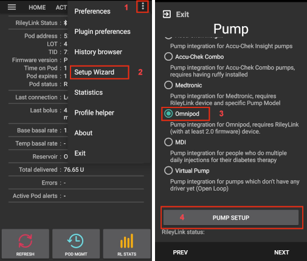
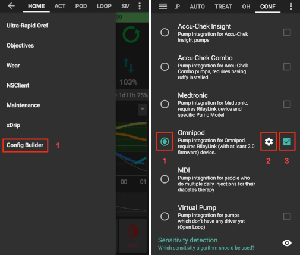

Omnipod Eros
***********************************************************

Before you begin
===========================================================
Safety first
---------------------------------------------------------
This software is part of a DIY artificial pancreas solution and is not a product but requires YOU to read, learn, and understand the system, including how to use it. You alone are responsible for what you do with it.

Do not attempt this process in an environment where you cannot recover from an error (extra pods, insulin, charged RileyLink, and phone devices are must-haves).

See also `general safety first page <../Getting-Started/Safety-first.html>`_!

Either PDM or AAPS
---------------------------------------------------------
* Your PDM will no longer work after the AAPS Omnipod driver activates your pod
* Previously you used your Omnipod PDM to send commands to your Omnipod Eros pod. 
* An  Omnipod Eros pod only allows a single device to send communication to it.  
* The device that successfully activates the pod is the only device allowed to communicate with it from that point forward.  
* This means that once you activate an Omnipod Eros pod with your RileyLink through the AAPS Omnipod driver, you will no longer be able to use your PDM with your pod. The AAPS Omnipod driver with the RileyLink is now your acting PDM.
* This does NOT mean you should throw away your PDM, it is recommended to keep it around as a backup and for emergencies with AAPS is not working properly.

Multiple RileyLinks
---------------------------------------------------------
* Multiple RileyLinks can be configured but only one selected RileyLink at a time can communicate with a pod.
* The AAPS Omnipod driver supports the ability to add multiple RileyLinks in the RileyLink configuration, however only one RileyLink at a time can be selected to be used for sending and receiving communication.

RileyLink out of range
---------------------------------------------------------
* Your pod will **not** shut off when the RileyLink is out of range.
* When your RileyLink is out of range or the signal is blocked from communicating with the active pod, your pod will continue to deliver basal insulin.
* Upon activating a pod, the basal profile defined in AAPS will be programmed into the new pod.
* Should you lose contact with the pod, it will revert to this basal profile.
* You will not be able to issue new commands until the RileyLink comes back in range and re-establishes the connection. 

Hardware and Software Requirements
===========================================================
At present two different Omnipod models are available:

a. `Omnipod Eros <https://www.omnipod.com/en-gb/about/how-to-use>`_ - launched in 2013 - called 'omnipod system' by manufacturer
b. `Omnipod Dash <https://www.omnipod.com/en-gb/about-dash>`_ - launched in 2019 - PDM looks like a phone-type device

**Only Omnipod Eros can be used with AndroidAPS!**

What you will need
---------------------------------------------------------
* Insulin Delivery Device: a fresh Omnipod (`Eros <https://www.omnipod.com/en-gb/about/how-to-use>`_ generation - NOT DASH) pod
* `Mobile Phone Device <..\Module\module.html#phone>`_: Supported Omnipod driver Android phone with a version of AAPS 2.7.1 (or newer) and related components setup
* Pod Communication Device: a 433MHz RileyLink from `getrileylink.org <getrileylink.org>`_, which is the bridge to communicate with Eros generation pods.

   Other hardware options are available.
   
   * RileyLink with modified Balun Antenna - Untested
   * Emalink - Untested
   * LoopLink - Untested
   
These instructions will assume that you are **starting a new pod session**. If this is not the case, please be patient and attempt to begin this process on your next pod change. 

Omnipod Driver in AAPS
===========================================================

Enabling the Omnipod Driver in AAPS
---------------------------------------------------------
* You can enable the Omnipod driver in AAPS via two mechanisms:

**1. AAPS Setup Wizard**

* Open setup wizard [2] through  three-dot menu (top right-hand corner) [1]
* Follow the wizard menus until you reach the Pump screen.
* Select Omnipod [3]
* Select Pump Setup [4] to open the Omnipod Settings screen

**2. Config Builder** (for details see `config builder page <../Configuration/Config-Builder.html>`_)

* Open config builder [1] via hamburger menu (top left corner)
* Scroll down to pump
* Select Omnipod [2]
* With the checkbox on the right you can decide whether you want to use Omnipod `via tab or via hamburger menu <../Configuration/Config-Builder.html#tab-or-hamburger-menu>`_ [4].
* Click cog wheel to enter Omnipod setup [3].

Identify RileyLink
---------------------------------------------------------
* Make sure you have a charged RileyLink near your phone for AAPS to identify it via its MAC address.
* After enabling the driver, you must identify your RileyLink.

   * Open config builder via hamburger menu (top left corner)
   * Scroll down to pump
   * Select Omnipod
   * Click cog wheel to enter Omnipod setup
   * Select RileyLink Configuration
   * Click Scan.

* Once selected, you can proceed to activate your first pod session. 

Verification of Omnipod Driver Activation
---------------------------------------------------------
Depending on your `settings <../Configuration/Config-Builder.html#tab-or-hamburger-menu>`_ you will either

* see an Omnipod or POD tab after swiping to the left from homescreen or
* can enter Omnipod page trough hamburger menu

If you have `identified RileyLink correctly <../Configuration/OmnipodEros.html#identify-riley-link>`_ you will see its status as 'Connected'.

.. image:: ../images/Omnipod_RLConnected.png
  :alt: Omnipod tab - RileyLink connected

Omnipod Configuration
===========================================================

RileyLink Setup
---------------------------------------------------------
* The Omnipod driver cannot select more than one RileyLink device at a time.
* Ensure that RileyLink was `successfully identified <../Configuration/OmnipodEros.html#identify-riley-link>`_.
* Open setup:

   * Open config builder via hamburger menu (top left corner)
   * Scroll down to pump
   * Select Omnipod
   * Click cog wheel to enter Omnipod setup

* In the section 'RileyLink Configuration' you should see the RileyLink's MAC address.

.. image:: ../images/Omnipod_RLMac.png
  :alt: Omnipod RileyLink MAC address

Omnipod settings
---------------------------------------------------------
Enable or disable the options via the toggle switches.

.. image:: ../images/Omnipod_Settings.png
  :alt: Omnipod settings

Confirmation beeps
^^^^^^^^^^^^^^^^^^^^^^^^^^^^^^^^^^^^^^^^^^^^^^^^^^^^^^^^^
* Bolus beeps: confirmation beeps when a bolus is delivered
* Basal beeps: confirmation beeps when 

   * a new basal rate is set,
   * active basal rate is canceled or 
   * current basal rate is changed

* SMB beeps: confirmation beeps when a SMB is delivered
* TBR beeps: confirmation beeps when a TBR is set or cancelled

Alerts
^^^^^^^^^^^^^^^^^^^^^^^^^^^^^^^^^^^^^^^^^^^^^^^^^^^^^^^^^
* Alert basics:

   * Provides AAPS alerts and Nightscout announcements for expiration, shutdown, low reservoir based on the defined threshold units. 
   * Note: An AAPS notification will ALWAYS be issued for any alert after the initial communication with the pod since the alert was triggered. 
   * Dismissing the notification will NOT dismiss the alert UNLESS automatically acknowledge Pod alerts is enabled.
   * To MANUALLY dismiss the alert you must visit the Omnipod (POD) tab and press the ACK ALERTS button.

* Expiration reminder: Pod expiration reminder set to trigger when the defined number of hours before shutdown is reached.
* Hours before shutdown: Defines the number hours before the active pod shutdown occurs, which will then trigger the expiration reminder alert.
* Low reservoir alert: Alert when the pod remaining units low reservoir limit is reached as defined in the number of units field.
* Number of units: The number of units at which to trigger the pod low reservoir alert.
* Automatically acknowledge Pod alerts: 

   * When enabled a notification will still be issued.
   * However immediately after the first pod communication contact since the alert was issued it will now be automatically acknowledged and the alert will be dismissed.

Notifications
^^^^^^^^^^^^^^^^^^^^^^^^^^^^^^^^^^^^^^^^^^^^^^^^^^^^^^^^^
* Provides AAPS and phone sound uncertainty notifications.
* Sound for uncertain TBR notifications: Trigger an audible alert and visual notification when AAPs is uncertain if a TBR was successfully set.
* Sound for uncertain SMB notifications: Trigger an audible alert and visual notification when AAPS is uncertain if an SMB was successfully delivered.
* Sound for uncertain bolus notifications: Trigger an audible alert and visual notification when AAPS is uncertain if a bolus was successfully delivered.

Other
^^^^^^^^^^^^^^^^^^^^^^^^^^^^^^^^^^^^^^^^^^^^^^^^^^^^^^^^^
* Provides advanced settings to assist debugging.
* Suspend delivery button: Hide or display the suspend delivery button in the Omnipod (POD) tab.
* Pulse log button: Hide or display the pulse log button in the Omnipod (POD) tab.
* DST/Time zone detect on: Allows for time zone changes to be automatically detected if the phone is used in an area where DST is observed.

Activating & deactivating a pod
===========================================================
Activating a pod
---------------------------------------------------------
Before you are able to activate a pod please ensure you have properly configured and connected your RileyLink connection in the `Omnipod settings  <../Configuration/OmnipodEros.html#identify-riley-link>`_.

REMINDER: **Pod communication occurs at limited ranges for both pod activation and deactivation due to security safety measures.**  During these procedures make sure that your pod is within a close proximity (~50cm or less) to the RileyLink.

* Click on the Pod Mgmt button [1]
* Then click on Activate Pod [2]
* You will see the Fill Pod screen be displayed.  Fill a pod with at least 85U of insulin and listen for two beeps indicating that the pod is ready to be primed.
* Ensure that pod and RileyLink are within close proximity of each other and click on the Next button [3].

   .. image:: ../images/Omnipod_Activate1.png
     :alt: Omnipod pod activation I
  
* The Initialize Pod screen will begin priming the pod (you will hear a click followed by a series of ticking sounds as the pod primes itself). 
* You will see a green checkmark, and the Next button [1] will become enabled upon successful priming.
* Click on the Next button [1], and you will see the Attach Pod screen displayed. 
* Proceed to prepare the infusion site, remove the pod's needle cap and white paper backing from the adhesive and apply the pod to your usually selected site. 
* Click on the Next button [2].
* The Attach Pod dialog box will now appear. 
* ONLY click on the OK button [3] if you are ready to deploy the cannula.

   .. image:: ../images/Omnipod_Activate2.png
     :alt: Omnipod pod activation II

* After pressing OK, it may take some time before the Omnipod responds and inserts the cannula (1-2 minutes maximum), so **be patient**.
* If  RileyLink is out of range of the pod being activated, you will receive an error message “No response from Pod”.
* If this occurs, move the RileyLink closer to (~50 cm away or less) but not on top of the Pod and click the Retry button [1].
* A green checkmark will appear, and the Next button will become enabled upon successful cannula insertion. 
* Click on the Next button [2].

   .. image:: ../images/Omnipod_Activate3.png
     :alt: Omnipod pod activation III

* You will see the Pod activated screen displayed. 
* Click on the green Finished button [1]. 
* You have now started a new pod session. 
* Click on the back button on your phone to return to the Omnipod (POD) tab screen.

   .. image:: ../images/Omnipod_Activate4.png
     :alt: Omnipod pod activation IV

Deactivating a pod
---------------------------------------------------------
REMINDER: **Pod communication occurs at limited ranges for both pod activation and deactivation due to security safety measures.**  During these procedures make sure that your pod is within a close proximity (~50cm or less) to the RileyLink.

Under normal circumstances, you should be able to get three days (72 hours) and an additional 8 hours after the pod expiration warning for a total of 80 hours of pod usage.

* To deactivate a pod (either from expiration or from a pod failure) open Omnipod (POD) tab or menu.
* Click on the Pod Mgmt button [1]
* Click on the Deactivate Pod button [2]
* Keep pod close to RileyLink and click Next button [3] to begin the process of deactivating the pod.

   .. image:: ../images/Omnipod_Deactivate1.png
     :alt: Omnipod pod deactivation I
     
* Deactivating Pod screen will appear and you will receive a confirmation beep from the pod that deactivation was successful.
* IF deactivation fails and you do not receive a confirmation beep, you may receive a red “No response from Pod message”. 
* Please click on the Retry button [1] to attempt deactivation again.

   .. image:: ../images/Omnipod_Deactivate2.png
     :alt: Omnipod pod deactivation II

Deactivating pod fails constantly
^^^^^^^^^^^^^^^^^^^^^^^^^^^^^^^^^^^^^^^^^^^^^^^^^^^^^^^^^
* If deactivation continues to fail, please click on the Discard Pod button to discard the Pod. 

.. image:: ../images/Omnipod_Discard_Button.jpg
     :alt: Omnipod Discard Button

* You may now remove your pod as its session has been deactivated. 
* If your Pod has a screaming alarm, you may need  to manually silence it (using a pin or a paperclip) as the Discard Pod button will not silence it.

Pod successfully deactivated
^^^^^^^^^^^^^^^^^^^^^^^^^^^^^^^^^^^^^^^^^^^^^^^^^^^^^^^^^
* A green checkmark will appear upon successful deactivation. 
* Click on the Next button [1] and you will see the pod deactivated screen. 
* You may now remove your pod as its session has been deactivated.
* Click on the green FINISH button [2] to return to the Pod management screen.
* Click on the back button on your phone to return to the Omnipod (POD) tab.
* Verify that the Pod status field displays a 'No active Pod' message in red.

   .. image:: ../images/Omnipod_Deactivate3.png
     :alt: Omnipod pod deactivation III

Daily usage
===========================================================
Omnipod tab
---------------------------------------------------------

   .. image:: ../images/Omnipod_Tab.png
     :alt: Information on Omnipod pod tab

Information fields
^^^^^^^^^^^^^^^^^^^^^^^^^^^^^^^^^^^^^^^^^^^^^^^^^^^^^^^^^
* RileyLink Status: Current connection status of the RileyLink

   * RileyLink Unreachable - RileyLink is either not within Bluetooth range of the phone, powered off or has a failure preventing Bluetooth communication.
   * RileyLink Ready - RileyLink is powered on and actively initializing the Bluetooth connection
   * Connected - RileyLink is powered on, connected and actively able to communicate via Bluetooth.

* Pod address: Current address in which the active pod is referenced
* LOT: LOT number of the active pod
* TID: Serial number of the pod
* Firmware Version: Firmware version of the active pod 
* Time on Pod: Current time on the active pod.
* Pod expires: Date and time when the active pod will expire
* Pod status: Status of the active pod.
* Last connection: Last time communication with the active pod was achieved.

   * Moments ago - less than 20 seconds ago.
   * Less than a minute ago - more than 20 seconds but less than 60 seconds ago.
   * 1 minute ago - more than 60 seconds but less than 180 seconds (2 min)
   * XX minutes ago - more than 2 minutes ago as defined by the value of XX 

* Last bolus: Dosage of the last bolus sent to the active pod and how long ago it was issued in parenthesis.
* Base Basal rate: Basal rate programmed for the current time from the basal rate profile 
* Temp basal rate: Currently running Temporary Basal Rate in the following format

   * Units / hour @ time TBR was issued (minutes run / total minutes TBR will be run)
   * Example:  0.00U/h @18:25 ( 90/120 minutes)

* Reservoir: 'Over 50 U left' when more than 50 units are left in the reservoir.  Below this value the exact units are displayed in yellow text.
* Total delivered: Displays the total number of units of insulin delivered from the reservoir.
* Errors: Last error encountered.  Review the Pod history, RileyLink history and log files for past errors and more detailed information.
* Active pod alerts: Reserved for currently running alerts on the active pod.  Normally during pod expiration past 72 hours and native pod beep alerts are running.

Buttons (Icons)
^^^^^^^^^^^^^^^^^^^^^^^^^^^^^^^^^^^^^^^^^^^^^^^^^^^^^^^^^
* REFRESH: Sends a refresh command to the active pod
* POD MGMT: Navigates to the Pod management interface with these operations

   * `Deactivate Pod <../Configuration/OmnipodEros.html#deactivating-a-pod>`_ - deactivates current pod
   * `Activate Pod <../Configuration/OmnipodEros.html#activating-a-pod>`_ - primes and activates a new pod
   * `Pod history <../Configuration/OmnipodEros.html#pod-history>`_ - displays active pod activity history

* RL STATS: Navigates to RileyLink Statistics displaying current settings and RileyLink Connection history

   * Settings - displays RileyLink and active pod settings information
   * History - displays RileyLink and Pod communication history

* PULSE LOG: Sends the active pod pulse log to the clipboard
* `SUSPEND <../Configuration/OmnipodEros.html#suspending-insulin-delivery>`_: Suspends the active pod

Suspending Insulin Delivery
---------------------------------------------------------
NOTE: If you do not see a SUSPEND button , then it has not been enabled to be displayed in the Omnipod (POD) tab.  Enable the Suspend delivery button enabled setting in the Omnipod settings under `Other <../Configuration/OmnipodEros.html#other>`_.

Use this command to put the active pod into a suspend state. In this suspend state, the pod will no longer deliver any insulin. This command mimics the suspend function that the original Omnipod PDM issues to an active pod.

* Open Omnipod (POD) tab or menu
* Click on the SUSPEND button [1]
* Suspend command is sent from the RileyLink to the active pod.
* The suspend button will become greyed out [2] and the Pod status will display SUSPEND DELIVERY [3].

   .. image:: ../images/Omnipod_Suspend1.png
     :alt: Omnipod suspend insulin delivery  I

* When the suspend command is successfully confirmed by the RileyLink a confirmation dialog will appear.
* Click OK [1] to confirm and proceed.
* Your active pod has now suspended all insulin delivery. 
* The Omnipod (POD) tab will update the Pod status to 'Suspended' [2].
* The SUSPEND button [3] will change to a new Resume Delivery button.

   .. image:: ../images/Omnipod_Suspend2.png
     :alt: Omnipod suspend insulin delivery  II

Resuming Insulin Delivery
---------------------------------------------------------
Use this command to instruct the active pod to resume insulin delivery. After the command is successfully processed, insulin will resume normal delivery using the current basal rate for the current time from the active basal profile. The pod will again accept commands for bolus, TBR and SMB.  

* Open Omnipod (POD) tab or menu
* Press the Resume Delivery button [1] to start the process to instruct the current pod to resume normal insulin delivery. 
* A message RESUME DELIVERY [2] will display in the Pod status field, signifying the RileyLink is actively sending the command to the suspended pod.
* When the Resume delivery command is successfully confirmed by the RileyLink a confirmation dialog will appear.
* Click OK [3] to confirm and proceed.
* The Omnipod (POD) tab will update the Pod status field to 'Running' [4].
* The Resume Delivery button will now display the SUSPEND button [5].

   .. image:: ../images/Omnipod_Resume.png
     :alt: Omnipod resume insulin delivery

Acknowledging Pod Alerts
---------------------------------------------------------
NOTE - if you do not see a ACK ALERTS button, it is because it is conditionally displayed on the Omnipod (POD) tab ONLY when the pod expiration or low reservoir alert has been triggered.

The process below will show you how to manually disable pod beeps that occur when the pod time reaches the defined warning limit in the `'Hours before shutdown' <../Configuration/OmnipodEros.html#alerts>`_ Omnipod alerts setting before the 72 hour (3 days) pod expiration.

NOTE - If you have enabled the Automatically acknowledge Pod alerts setting in `Omnipod Alerts <../Configuration/OmnipodEros.html#alerts>`_, this alert will be handled automatically after the first occurence and you will NOT need to manually disable the alert. 

* When the defined `'Hours before shutdown' <../Configuration/OmnipodEros.html#alerts>`_ limit is reached, the pod will issue warning beeps to inform you that it is approaching its expiration time and a pod change will soon be required. 
* You can verify this on the Omnipod (POD) tab under the 'Active Pod alerts' [1] field where the status message 'Pod will expire soon' is displayed.
* Press the ACK ALERTS button (acknowledge alerts) [2].
* The RileyLink sends the command to deactivate pod expiration warning beeps to the pod and updates the Pod status field with ACKNOWLEDGE ALERTS [3].
* Upon successful deactivation of the alerts two beeps will be issued by the active pod and a confirmation dialog will be displayed.
* Click OK [4] to confirm and dismiss the dialog.
* On the Omnipod (POD) tab the warning message under the Active Pod alerts will no longer be displayed [5] and the active pod will no longer issue pod expiration warning beeps.

   .. image:: ../images/Omnipod_AcknowledgeAlert.png
     :alt: Acknowledge Alert

Troubleshooting Omnipod
===========================================================
Pump Unreachable Alerts
---------------------------------------------------------
* It is recommended that pump unreachable alerts be configured to 120 minutes.

   * Three-dot menu on top right-hand side
   * Preferences
   * Local Alerts
   * Pump unreachable threshold [min]: 120
   
Pod Failures
---------------------------------------------------------
* Pods fail occasionally due to a variety of issues, including hardware issues with the Pod itself.
* It is best practice not to call these into Insulet, since AAPS is not an approved use case.
* A list of fault codes is available on this site `<https://github.com/openaps/openomni/wiki/Fault-event-codes>`_ to help determine the cause.

Import Settings
---------------------------------------------------------
* Please note that importing settings may import possibly outdated Pod status. As a result, you may lose any active Pod.
* It is therefore strongly recommended that you **do not import settings while on an active Pod session**.

   * Deactivate your pod session. Verify that you do not have an active pod session.
   * Export your settings and store a copy in a safe place.
   * Uninstall the previous version of AAPS and restart your phone.
   * Install new version of AAPS and verify that you have no active pod session prior to attempting to import your settings.
   * For details instructions on exporting and importing sessions see `this page <../Usage/ExportImportSettings.html>`_.

Omnipod driver alerts
---------------------------------------------------------
Please note that the Omnipod driver presents a variety of unique alerts on the Overview tab, most of them are informational and can be dismissed while some provide the user with an action to take to resolve the cause of the triggered alert.

A summary of the main alerts that you may encounter is listed below:
* 'No active Pod' - No active Pod session detected.  You may select SNOOZE on this alert which will remain or trigger again until a `Pod session is started <../Configuration/OmnipodEros.html#activating-a-pod>`_.
* 'Pod suspended' - Informational alert that Pod has been `suspended <../Configuration/OmnipodEros.html#suspending-insulin-delivery>`_.
* 'Setting basal profile failed. Delivery might be suspended! Please manually refresh the Pod status from the Omnipod tab and resume delivery if needed.' - Informational alert that the Pod basal profile setting has failed and you will need to hit Refresh on the `Omnipod tab <../Configuration/OmnipodEros.html#omnipod-tab>`_.

Best practice
===========================================================
Optimal Omnipod and RileyLink Positioning
---------------------------------------------------------
* For security reasons positioning of RileyLink and pod is crucial during activation and deactivation of pod.
* This includes the distance between the two as well as the orientation of RileyLink's antenna.
* The pod MUST not be set directly on top of the RileyLink - due to the way the RileyLink's antenna radiates the signal.
* Both should be less than 50 cm apart - see picture.

   .. image:: ../images/Omnipod_RLDistance.png
     :alt: Positioning of RileyLink and pod

* A wider range can be used for normal operations once pod has been activated.

Where to get help for Omnipod driver
---------------------------------------------------------
All of the development work for the Omnipod driver is done by the community on a volunteer basis; we ask that you please be considerate and use the following guidelines when requesting assistance:

Level 0: Read the relevant section of these docs to make sure you understand how the function you are experiencing difficulty with is supposed to work.
Level 1: If you are still encountering problems that are not resolvable by these docs, please use the *#androidaps* channel on Discord by using `this invite link <https://discord.com/invite/NhEUtzr>`_.
Level 2: Search existing `issues <https://github.com/nightscout/AndroidAPS/issues>`_ to see if one exists for your issue; if not, please create an issue and attach your `log files <https://androidaps.readthedocs.io/en/latest/CROWDIN/sk/Usage/Accessing-logfiles.html>`_.

Be patient - most of the community is good-natured in disposition and solving issues often requires time and patience from both users and developers.

Latest development version
---------------------------------------------------------
* Instructions on the latest features are often discussed on the Discord channel and documented on the `project's wiki page <https://github.com/AAPS-Omnipod/AndroidAPS/wiki>`_. 
* Most users' should use the latest AAPS omnipod bundled driver (available as of 2.7.1) for the latest stable release of the omnipod driver.
* Please also see information about dev branch `here <../Installing-AndroidAPS/Dev_branch.html>`_.
* If you are interested in development progress, please see the omnipod-eros-testers channel on the WeAreNotWaiting Discord server.  
* This channel’s intended audience is test users and developers to answer questions or discuss Omnipod driver beta and development versions. 
* Use the `invite link <https://discord.gg/NhEUtzr>`_ to join this channel.
