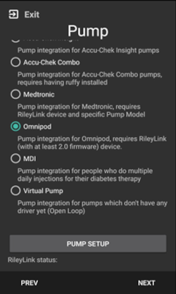
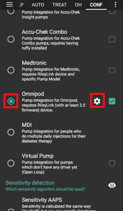
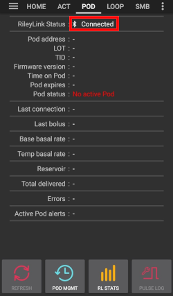
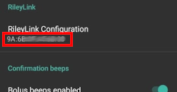
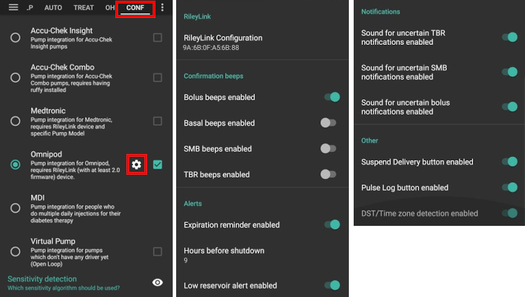

Omnipod Eros
***********************************************************

At present two different Omnipod models are available:

a. `Omnipod Eros <https://www.omnipod.com/en-gb/about/how-to-use>`_ - launched in 2013 - called 'omnipod system' by manufacturer
b. `Omnipod Dash <https://www.omnipod.com/en-gb/about-dash>`_ - launched in 2019 - PDM looks like a phone-type device

**Only Omnipod Eros can be used with AndroidAPS!**

Hardware and Software Requirements
===========================================================
* Insulin Delivery Device: a fresh Omnipod (`Eros <https://www.omnipod.com/en-gb/about/how-to-use>`_ generation - NOT DASH) pod
* `Mobile Phone Device <..\Module\module.html#phone>`_: Supported Omnipod driver Android phone with a version of AAPS 2.7.1 (or newer) and related components setup
* Pod Communication Device: a 433MHz RileyLink from `getrileylink.org <getrileylink.org>`_, which is the bridge to communicate with Eros generation pods.

   Other hardware options are available.
   
   * RileyLink with modified Balun Antenna - Untested
   * Emalink - Untested
   * LoopLink - Untested
   
These instructions will assume that you are **starting a new pod session**. If this is not the case, please be patient and attempt to begin this process on your next pod change. 

Omnipod Driver in AAPS
===========================================================

Enabling the Omnipod Driver in AAPS
---------------------------------------------------------
* You can enable the Omnipod driver in AAPS via two mechanisms:

**1. AAPS Setup Wizard**

* Open setup wizard through  three-dot menu (top right-hand corner)
* Follow the wizard menus until you reach the Pump screen.
* Select Omnipod 
* Select Pump Setup to open the Omnipod Settings screen

**2. Config Builder** (for details see `config builder page <../Configuration/Config-Builder.html>`_)

* Open config builder via hamburger menu (top left corner)
* Scroll down to pump
* Select Omnipod
* With the checkbox on the right you can decide whether you want to use Omnipod `via tab or via hamburger menu <../Configuration/Config-Builder.html#tab-or-hamburger-menu>`_.
* Click cog wheel to enter Omnipod setup

Identify RileyLink
---------------------------------------------------------
* Make sure you have a charged RileyLink near your phone for AAPS to identify it via its MAC address.
* After enabling the driver, you must identify your RileyLink.

   * Open config builder via hamburger menu (top left corner)
   * Scroll down to pump
   * Select Omnipod
   * Click cog wheel to enter Omnipod setup
   * Select RileyLink Configuration
   * Click Scan.

* Once selected, you can proceed to activate your first pod session. 

Verification of Omnipod Driver Activation
---------------------------------------------------------
Depending on your `settings <../Configuration/Config-Builder.html#tab-or-hamburger-menu>`_ you will either

* see an Omnipod or POD tab after swiping to the left from homescreen or
* can enter Omnipod page trough hamburger menu

If you have `identified RileyLink correctly <../Configuration/OmnipodEros.html#identify-riley-link>`_ you will see its status as 'Connected'.

Omnipod Configuration
===========================================================

RileyLink Setup
---------------------------------------------------------
* The Omnipod driver cannot select more than one RileyLink device at a time.
* Ensure that RileyLink was `successfully identified <../Configuration/OmnipodEros.html#identify-riley-link>`_.
* Open setup:

   * Open config builder via hamburger menu (top left corner)
   * Scroll down to pump
   * Select Omnipod
   * Click cog wheel to enter Omnipod setup

* In the section 'RileyLink Configuration' you should see the RileyLink's MAC address.

Omnipod settings
---------------------------------------------------------
Enable or disable the options via the toggle switches.

Confirmation beeps
^^^^^^^^^^^^^^^^^^^^^^^^^^^^^^^^^^^^^^^^^^^^^^^^^^^^^^^^^
* Bolus beeps: confirmation beeps when a bolus is delivered
* Basal beeps: confirmation beeps when 

   * a new basal rate is set,
   * active basal rate is canceled or 
   * current basal rate is changed

* SMB beeps: confirmation beeps when a SMB is delivered
* TBR beeps: confirmation beeps when a TBR is set or cancelled

Alerts
^^^^^^^^^^^^^^^^^^^^^^^^^^^^^^^^^^^^^^^^^^^^^^^^^^^^^^^^^
* Alert basics:

   * Provides AAPS alerts and Nightscout announcements for expiration, shutdown, low reservoir based on the defined threshold units. 
   * Note: An AAPS notification will ALWAYS be issued for any alert after the initial communication with the pod since the alert was triggered. 
   * Dismissing the notification will NOT dismiss the alert UNLESS automatically acknowledge Pod alerts is enabled.
   * To MANUALLY dismiss the alert you must visit the Omnipod (POD) tab and press the ACK ALERTS button.

* Expiration reminder: Pod expiration reminder set to trigger when the defined number of hours before shutdown is reached.
* Hours before shutdown: Defines the number hours before the active pod shutdown occurs, which will then trigger the expiration reminder alert.
* Low reservoir alert: Alert when the pod remaining units low reservoir limit is reached as defined in the number of units field.
* Number of units: The number of units at which to trigger the pod low reservoir alert.
* Automatically acknowledge Pod alerts: 

   * When enabled a notification will still be issued.
   * However immediately after the first pod communication contact since the alert was issued it will now be automatically acknowledged and the alert will be dismissed.

Notifications
^^^^^^^^^^^^^^^^^^^^^^^^^^^^^^^^^^^^^^^^^^^^^^^^^^^^^^^^^
* Provides AAPS and phone sound uncertainty notifications.
* Sound for uncertain TBR notifications: Trigger an audible alert and visual notification when AAPs is uncertain if a TBR was successfully set.
* Sound for uncertain SMB notifications: Trigger an audible alert and visual notification when AAPS is uncertain if an SMB was successfully delivered.
* Sound for uncertain bolus notifications: Trigger an audible alert and visual notification when AAPS is uncertain if a bolus was successfully delivered.

Other
^^^^^^^^^^^^^^^^^^^^^^^^^^^^^^^^^^^^^^^^^^^^^^^^^^^^^^^^^
* Provides advanced settings to assist debugging.
* Suspend delivery button: Hide or display the suspend delivery button in the Omnipod (POD) tab.
* Pulse log button: Hide or display the pulse log button in the Omnipod (POD) tab.
* DST/Time zone detect on: Allows for time zone changes to be automatically detected if the phone is used in an area where DST is observed.

Activating & deactivating a pod
===========================================================
Activating a pod
---------------------------------------------------------
Before you are able to activate a pod please ensure you have properly configured and connected your RileyLink connection in the `Omnipod settings  <../Configuration/OmnipodEros.html#identify-riley-link>`_.
REMINDER: **Pod communication occurs at limited ranges for both pod activation and deactivation due to security safety measures.**  During these procedures make sure that your pod is within a close proximity (~50cm or less) to the RileyLink.

* Click on the Pod Mgmt button [1]
* Then click on Activate Pod [2]
* You will see the Fill Pod screen be displayed.  Fill a pod with at least 85U of insulin and listen for two beeps indicating that the pod is ready to be primed.
* Ensure that pod and RileyLink are within close proximity of each other and click on the Next button [3].

   .. image:: ../images/Omnipod_Activate1.png
     :alt: Omnipod pod activation I
  
* The Initialize Pod screen will begin priming the pod (you will hear a click followed by a series of ticking sounds as the pod primes itself). 
* You will see a green checkmark, and the Next button [1] will become enabled upon successful priming.
* Click on the Next button [1], and you will see the Attach Pod screen displayed. 
* Proceed to prepare the infusion site, remove the pod's needle cap and white paper backing from the adhesive and apply the pod to your usually selected site. 
* Click on the Next button [2].
* The Attach Pod dialog box will now appear. 
* ONLY click on the OK button [3] if you are ready to deploy the cannula.

   .. image:: ../images/Omnipod_Activate2.png
     :alt: Omnipod pod activation II

* After pressing OK, it may take some time before the Omnipod responds and inserts the cannula (1-2 minutes maximum), so **be patient**.
* If  RileyLink is out of range of the pod being activated, you will receive an error message “No response from Pod”.
* If this occurs, move the RileyLink closer to (~50 cm away or less) but not on top of the Pod and click the Retry button [1].
* A green checkmark will appear, and the Next button will become enabled upon successful cannula insertion. 
* Click on the Next button [2].

   .. image:: ../images/Omnipod_Activate3.png
     :alt: Omnipod pod activation III

* You will see the Pod activated screen displayed. 
* Click on the green Finished button [1]. 
* You have now started a new pod session. 
* Click on the back button on your phone to return to the Omnipod (POD) tab screen.

   .. image:: ../images/Omnipod_Activate4.png
     :alt: Omnipod pod activation IV

Deactivating a pod
---------------------------------------------------------
REMINDER: **Pod communication occurs at limited ranges for both pod activation and deactivation due to security safety measures.**  During these procedures make sure that your pod is within a close proximity (~50cm or less) to the RileyLink.

* Under normal circumstances, you should be able to get three days (72 hours) and an additional 8 hours after the pod expiration warning for a total of 80 hours of pod usage.
* To deactivate a pod (either from expiration or from a pod failure) open Omnipod (POD) tab or menu.
* Click on the Pod Mgmt button [1]
* Click on the Deactivate Pod button [2]
* Keep pod close to RileyLink and click Next button [3] to begin the process of deactivating the pod.

   .. image:: ../images/Omnipod_Dectivate1.png
     :alt: Omnipod pod deactivation I
     
* Deactivating Pod screen will appear and you will receive a confirmation beep from the pod that deactivation was successful.
* IF deactivation fails and you do not receive a confirmation beep, you may receive a red “No response from Pod message”. 
* Please click on the Retry button to attempt deactivation again.

   .. image:: ../images/Omnipod_Dectivate2.png
     :alt: Omnipod pod deactivation II
     
Deactivating pod failes constantly
^^^^^^^^^^^^^^^^^^^^^^^^^^^^^^^^^^^^^^^^^^^^^^^^^^^^^^^^^
* If deactivation continues to fail, please click on the Discard Pod button to discard the Pod. 
* You may now remove your pod as its session has been deactivated. 
* If your Pod has a screaming alarm, you may need  to manually silence it (using a pin or a paperclip) as the Discard Pod button will not silence it.

