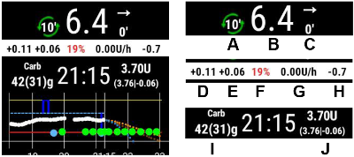

# Watchfaces

AndroidAPS is designed to be _controlled_ by Android Wear watches. If you want to bolus etc from the watch then within "Wear settings" you need to enable "Controls from Watch".

The following functions can be triggered from the watch:
* set a temporary target
* administer a bolus
* use the bolus calculator (calculation variables can be defined in [settings](../Configuration/Config-Builder#wear) on the phone)
* check the status of loop and pump
* show TDD (Total daily dose = bolus + basal per day)

To achieve this you needed to select the build variant "fullRelease" when [building the APK](../Installing-AndroidAPS/Building-APK.md) (or "pumpRelease" will allow you to just remote control the pump without looping).  Within AndroidAPS, in the ConfigBuilder you need to [enable Wear](../Configuration/Config-Builder#wear). 

There are several watchfaces to choose from that include average delta, IOB, currently active temp basal rate and basal profiles + CGM readings graph.  

Ensure notifications from AndroidAPS are not blocked on the watch. Confirmation of action (e.g. bolus, tempt target) comes via notification which you will need to swipe and tick. 

To get faster to the AAPS menu, do a double tap on your BG. 
With a double tap onto the BG curve you can change the time scale..

## Troubleshooting the wear app: 
*  On Android Wear 2.0 the watch screen does not install by itself anymore.  You need to go into the playstore on the watch (not the same as the phone playstore) and find it in the category apps installed on your phone, from there you can activate it.  Also enable auto update.  
*  Sometimes it helps to re-sync the apps to the watch as it can be a bit slow to do so itself: Android Wear > Cog icon > Watch name > Resync apps.
*  Enable ADB debugging in Developer Options (on watch), connect the watch via USB and start the Wear app once in Android Studio.

## Legend AndroidAPSv2 watchface

A - time since last loop run

B - CGM reading

C - minutes since last CGM reading

D - change compared to last CGM reading (in mmol or mg/dl)

E - average change CGM reading last 15 minutes

F - phone battery

G - basal rate (shown in U/h during standard rate and in % during TBR)
    
H - BGI (blood glucose interaction)
    -> the degree to which BG “should” be rising or falling based on insulin activity alone.

I - carbs (carbs on board | e-carbs in the future)

J - insulin on board (from bolus | from basal)

## Settings (in wear watch)

To access to the watchface settings, double tap on your BG, slide up and select "Settings".

### AAPS companion parameters

Vibrate on Bolus (default On):

Units for Actions (default mg/dl): if "On" units for actions is mg/dl, if "Off" unit is mmol/l. Used when setting a TT from watch.

### Watchface settings

Show Date (default Off): note, date is not available on all watchfaces

Show IOB (default On):

Show COB (default On):

Show Delta (default On):

Show AvgDelta (default On):

Show Phone Battery (default On): Phone battery in %. Red if below 30% .

Show Rig Battery (default Off):

Show Basal Rate (default On):

Show Loop Status (default On): 

Show BG (default On):

Show Direction Arrow (default On):

Show Ago (default On): show how many minutes since last reading.

Dark (default On): 

Highlight Basals (default Off): Improve the visibility of basal rate and temp basals

Chart Timeframe (default 3 hours): you can select in the sub menu the max time frame of your chart between 1 hour and 5 hours.

### User Interface setting

Input Design: with this parameter, you can select the position of "+" and "-" buttons when you enter commands for AAPS (TT, Insulin, Carbs...)

- Default:
- Quick righty:
- Quick lefty:
- Modern Sparse:

### Specific watchface parameters

#### Steampunk watchface

Delta Granularity (default Medium)

- Low:
- Medium:
- High:

#### Circle WF

Big Numbers:

Ring History:

Light Ring History:

Animations:

### Commands settings

Wizard in Menu (default On):

Prime in Menu (default Off):

Single Target (default On):

Wizard Percentage (default Off):

### Version Number

## View Nightscout data

If you are using another looping system and want to _view_ your looping detail on an Android Wear watch, or want to watch your child's looping, then you can build/download just the NSClient APK.  To do this follow the [build APK instructions](../Installing-AndroidAPS/Building-APK.md) selecting the build variant "NSClientRelease".  There are several watchfaces to choose from that include average delta, IOB, currently active temp basal rate and basal profiles + CGM readings graph.

## Pebble
Pebble users can use the [Urchin watchface](https://github.com/mddub/urchin-cgm) to _view_ looping data (if uploaded to nightscout), but you will not be able to interact with AndroidAPS through the watch.  You can choose fields to display such as IOB and currently active temp basal rate and predictions.  If open looping you can use [IFTTT](https://ifttt.com/) to create an applet that says if Notification received from AndroidAPS then send either SMS or pushover notification.
