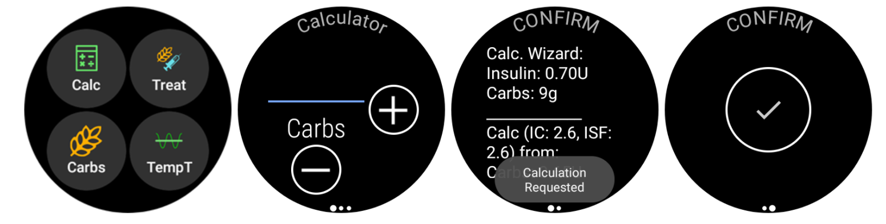

# AAPS on Wear OS smartwatch

You can install AAPS app on your **Wear OS based** smartwatch.
Watch version of AAPS allows you to:
* **display data on your watch**: by providing [custom watchfaces](Watchfaces-aaps-watchfaces) or in standard watchfaces with use of [complications](Watchfaces-complications)
* **control AAPS on phone**: to bolus, set a temporary target etc.

### Before you buy watch...

* Some features like _complications_ require Wear OS version 2.0 or newer to work
* Google rebranded _Android Wear 1.x_ to _Wear OS_ from version 2.x, so when it says _Android Wear_ it may indicate older 1.x version of system
* If description of smartwatch indicates only compatibility with _Android_ and _iOS_ - it **does not** means it runs on _Wear OS_ - it may as well be some other sort of Vendor specific OS **which is not compatible with AAPS wear!**
* Check [list of tested phones and watches](Phones-list-of-tested-phones) and [ask community](../Where-To-Go-For-Help/Connect-with-other-users.md) if in doubt if your watch will be supported

### Building Wear OS version of AAPS

The Wear OS App of AAPS has been seperated from the AAPS build for the Android mobile. Therefore you have to generate a second signed APK. Select as module "AndroidAPS.wear" and as build variant "fullRelease" and a second apk file for the Wear OS clock is generated when [building the APK](../Installing-AndroidAPS/Building-APK.md) (or "pumpcontrolRelease" which will allow you to just remote control the pump without looping).

From March 2021 you need to sideload AAPS onto the watch, it is no longer accessible via the watch's Google Play Store.  You can sideload using [Wear Installer](https://youtu.be/8HsfWPTFGQI) which you will need to install on both your watch and phone.  The Wear Installer app can be downloaded from the Google Play Store. The linked video from Malcolm Bryant the developer of Wear Installer gives you detailed instructions to
a) download the apk to your mobile
b) setup the Android Debugger on the wear
c) use Wear Installer on mobile and wear to sideload the AAPS wear app to the mobile.
Once you have selected AAPS as your app to upload wear version onto the watch you will be able to use watchfaces and complications and the AAPS controls.

### Setup on the Phone

Within AAPS, in the ConfigBuilder you need to [enable Wear plugin](Config-Builder-wear).

## Controlling AAPS from Watch

AAPS is designed to be _controlled_ by Android Wear watches. If you want to bolus etc. from the watch then within "Wear settings" you need to enable "Controls from Watch".

The following functions can be triggered from the watch:
* set a temporary target
* use the bolus calculator (calculation variables can be defined in [settings](Config-Builder-wear) on the phone)
* administer eCarbs
* administer a bolus (insulin + carbs)
* watch settings
* status
    * check pump status
    * check loop status
    * check and change profile, CPP (Circadian Percentage Profile = time shift + percentage)
    * show TDD (Total daily dose = bolus + basal per day)

(Watchfaces-aaps-watchfaces)=

## AAPS Watchfaces

There are several watchfaces to choose from that include average delta, IOB, currently active temp basal rate and basal profiles + CGM readings graph.  

Ensure notifications from AAPS are not blocked on the watch. Confirmation of action (e.g. bolus, tempt target) comes via notification which you will need to swipe and tick.

To get faster to the AAPS menu, do a double tap on your BG.
With a double tap onto the BG curve you can change the time scale..

## Watchfaces available

(Watchfaces-new-watchface-as-of-AAPS-2-8)=
### New watchface as of AAPS 2.8

* Color, lines and circle are configurable in setting menu on cog-sign of watchface chooser menu.

## AAPSv2 watchface - Legend

A - time since last loop run

B - CGM reading

C - minutes since last CGM reading

D - change compared to last CGM reading (in mmol or mg/dl)

E - average change CGM reading last 15 minutes

F - phone battery

G - basal rate (shown in U/h during standard rate and in % during TBR)

H - BGI (blood glucose interaction)
    -> the degree to which BG “should” be rising or falling based on insulin activity alone.

I - carbs (carbs on board | e-carbs in the future)

J - insulin on board (from bolus | from basal)

## Accessing main menu of AAPS

To access main menu of AAPS you can use on of following options:
* double tap on your BG value
* select AAPS icon in watch applications menu
* tap on AAPS complication (if configured for menu)

## Settings (in wear watch)

To access to the watchface settings, enter AAPS main menu, slide up and select "Settings".

Filled star is for enabled state (**On**), and hollow star icon indicates that setting is disabled (**Off**):

### AAPS companion parameters

* **Vibrate on Bolus** (default `On`):
* **Units for Actions** (default `mg/dl`): if **On** units for actions is `mg/dl`, if **Off** unit is `mmol/l`. Used when setting a TT from watch.

(Watchfaces-watchface-settings)=

### Watchface settings

* **Show Date** (default `Off`): note, date is not available on all watchfaces
* **Show IOB** (default `On`): Display or not IOB value (setting for detailed value is in AAPS wear parameters)
* **Show COB** (default `On`): Display or not COB value
* **Show Delta** (default `On`): Display or not the BG variation of the last 5 minutes
* **Show AvgDelta** (default `On`): Display or not the average BG variation of the last 15 minutes
* **Show Phone Battery** (default `On`): Phone battery in %. Red if below 30% .
* **Show Rig Battery** (default `Off`): Rig battery is a synthesis of Phone battery, pump battery and sensor battery (generally the lowest of the 3 values)
* **Show Basal Rate** (default `On`): Display or not current basal rate (in U/h or in % if TBR)
* **Show Loop Status** (default `On`): show how many minutes since last loop run (arrows around value turn red if above 15').
* **Show BG** (default `On`): Display or not last BG value
* **Show Direction Arrow** (default `On`): Display or not BG trend arrow
* **Show Ago** (default `On`): show how many minutes since last reading.
* **Dark** (default `On`): You can switch from black background to white background (except for Cockpit and Steampunk watch face)
* **Highlight Basals** (default `Off`): Improve the visibility of basal rate and temp basals
* **Matching divider** (default `Off`): For AAPS, AAPSv2 and AAPS(Large) watchfaces, show contrast background for divider (**Off**) or match divider with the background color (**On**)
* **Chart Timeframe** (default `3 hours`): you can select in the sub menu the max time frame of your chart between 1 hour and 5 hours.

### User Interface setting

* **Input Design**: with this parameter, you can select the position of "+" and "-" buttons when you enter commands for AAPS (TT, Insulin, Carbs...)

### Specific watchface parameters

#### Steampunk watchface

* **Delta Granularity** (default `Medium`)

#### Circle WF

* **Big Numbers** (default `Off`): Increase text size to improve visibility
* **Ring History** (default `Off`): View graphically BG history with gray rings inside the hour's green ring
* **Light Ring History** (default `On`): Ring history more discreet with a darker gray
* **Animations** (default `On`): When enabled, on supported by watch and not in power saving low-res mode, watchface circle will be animated

### Commands settings

* **Wizard in Menu** (default `On`): Allow wizard interface in main menu to input Carbs and set Bolus from watch
* **Prime in Menu** (default `Off`): Allow Prime / Fill action from watch
* **Single Target** (default `On`):
  * `On`: you set a single value for TT
  * `Off`: you set Low target and high target for TT

* **Wizard Percentage** (default `Off`): Allow bolus correction from wizard (value entered in percentage before confirmation notification)

(Watchfaces-complications)=

## Complications

_Complication_ is a term from traditional watchmaking, where it describes addition to the main watchface - as another small window or sub-dial (with date, day of the week, moon phase, etc.). Wear OS 2.0 brings that metaphor to allow custom data providers, like weather, notifications, fitness counters and more - to be added to any watchfaces that support complications.

AAPS Wear OS app supports complications since build `2.6`, and allow any third party watchface that supports complications to be configured to display AAPS related data (BG with the trend, IOB, COB, etc.).

Complications also serve as **shortcut** to AAPS functions. By tapping them you can open AAPS related menus and dialogs (depending on complication type and configuration).

### Complication Types

AAPS Wear OS app provides only raw data, according to predefined formats. It is up to third-party watchface to decide where and how to render complications, including its layout, border, color, and font. From many Wear OS complication types available, AAPS uses:

* `SHORT TEXT` - Contains two lines of text, 7 characters each, sometimes referred to as value and label. Usually rendered inside a circle or small pill - one below another, or side by side. It is a very space-limited complication. AAPS tries to remove unnecessary characters to fit-in: by rounding values, removing leading and trailing zeroes from values, etc.
* `LONG TEXT` - Contains two lines of text, about 20 characters each. Usually rendered inside a rectangle or long pill - one below another. It is used for more details and textual status.
* `RANGED VALUE` - Used for values from predefined range, like a percentage. It contains icon, label and is usually rendered as circle progress dial.
* `LARGE IMAGE` - Custom background image that can be used (when supported by watchface) as background.

### Complication Setup

To add complication to watchface, configure it by long press and clicking the gear icon below. Depending on how specific watchface configures them - either click on placeholders or enter the watchface setup menu for complications. AAPS complications are grouped under the AAPS menu entry.

When configuring complications on watchface, Wear OS will present and filter the list of complications that can be fit into selected complication place on watchface. If specific complications cannot be found on the list, it is probably due to its type that cannot be used for the given place.

### Complications provided by AAPS

AAPS provides following complications:

* **BR, CoB & IoB** (`SHORT TEXT`, opens _Menu_): Displays _Basal Rate_ on the first line and _Carbs on Board_ and _Insulin on Board_ on the second line.
* **Blood Glucose** (`SHORT TEXT`, opens _Menu_): Displays _Blood Glucose_ value and _trend_ arrow on the first line and _measurement age_ and _BG delta_ on the second line.
* **CoB & IoB** (`SHORT TEXT`, opens _Menu_): Displays _Carbs on Board_ on the first line and _Insulin on Board_ on the second line.
* **CoB Detailed** (`SHORT TEXT`, opens _Wizard_): Displays current active _Carbs on Board_ on the first line and planned (future, eCarbs) Carbs on the second line.
* **CoB Icon** (`SHORT TEXT`, opens _Wizard_): Displays _Carbs on Board_ value with a static icon.
* **Full Status** (`LONG TEXT`, opens _Menu_): Shows most of the data at once: _Blood Glucose_ value and _trend_ arrow, _BG delta_ and _measurement age_ on the first line. On the second line _Carbs on Board_, _Insulin on Board_ and _Basal Rate_.
* **Full Status (flipped)** (`LONG TEXT`, opens _Menu_): Same data as for standard _Full Status_, but lines are flipped. Can be used in watchfaces which ignores one of two lines in `LONG TEXT`
* **IoB Detailed** (`SHORT TEXT`, opens _Bolus_): Displays total _Insulin on Board_ on the first line and split of _IoB_ for _Bolus_ and _Basal_ part on the second line.
* **IoB Icon** (`SHORT TEXT`, opens _Bolus_): Displays _Insulin on Board_ value with a static icon.
* **Uploader/Phone Battery** (`RANGED VALUE`, opens _Status_): Displays battery percentage of AAPS phone (uploader), as reported by AAPS. Displayed as percentage gauge with a battery icon that reflects reported value. It may be not updated in real-time, but when other important AAPS data changes (usually: every ~5 minutes with new _Blood Glucose_ measurement).

Additionally, there are three complications of `LARGE IMAGE` kind: **Dark Wallpaper**, **Gray Wallpaper** and **Light Wallpaper**, displaying static AAPS wallpaper.

### Complication related settings

* **Complication Tap Action** (default `Default`): Decides which dialog is opened when user taps complication:
  * _Default_: action specific to complication type _(see list above)_
  * _Menu_: AAPS main menu
  * _Wizard_: bolus wizard - bolus calculator
  * _Bolus_: direct bolus value entry
  * _eCarb_: eCarb configuration dialog
  * _Status_: status sub-menu
  * _None_: Disables tap action on AAPS complications
* **Unicode in Complications** (default `On`): When `On`, the complication will use Unicode characters for symbols like `Δ` Delta, `⁞` vertical dot separator or `⎍` Basal Rate symbol. Rendering of them depends on the font, and that can be very watchface-specific. This option allows switching Unicode symbols `Off` when needed - if the font used by custom watchface does not support those symbols - to avoid graphical glitches.

## Wear OS Tiles

Wear OS Tiles provide easy access to users' information and actions to get things done. The tiles are only available on Android smartwatches running on Wear Os version 2.0 and higher.

Tiles allow you to quickly access actions on the AAPS application without going through the watch face menu. The tiles are optional and can be added and configured by the user. 

The tiles are used "next to" any watch face. To access a tile, when enabled, swipe right to left on your watch face to show them. 

Please note; that the tiles do not hold the actual state of the AAPS phone app and will only make a request, which has to be confirmed on the watch before it is applied.

## How to add Tiles

Before using the tiles, you have to switch on "Control from Watch" in the "Wear OS" settings of Android APS.

Depending on your Wear OS version, brand and smartphone there are two ways of enabling the tiles:
1. On your watch, from your watch face;
    - Swipe right to left till you reach the "+ Add tiles" 
    - Select one of the tiles.
2. On your phone open the companion app for your watch. 
    - For Samsung open "Galaxy Wearable", or for other brands "Wear OS"
   - In the click on the section "Tiles", followed by "+ Add" button
   - Find the AAPS tile you like to add by selecting it.
    
The order of the tiles can be changed by dragging and dropping

The content of the tiles can be customized by long-pressing a tile and clicking the "Edit" or "gear icon" button.

### APS(Actions) Tile

The action tile can hold 1 to 4 user-defined action buttons. To configure, long-press the tile, which will show the configuration options. Similar actions are also available through the standard watch menu.

Actions supported in the Action tile can request the AAPS phone app for:

* **Calc**; do a bolus calculation, based on carb input and optional a percentage [1]
* **Insulin**; request insulin delivery by entering the unit of insulin
* **Treatment**; request both insulin delivery and add carbs
* **Carbs**; add (extended) carbs
* **TempT**; set a custom temporary target and duration

[1] Via, the Wear OS menu, set the "Calculator Percentage" option to "ON" to show the percentage input in the bolus calculator. The default percentage is based on the phone settings in the"Overview" section ["Deliver this part of the bolus wizard result %"](Config-Builder.html#advanced-settings) When the user does not provide a percentage, the default value from the phone is used. Configure the other parameters for the bolus calculator in the phone app via "Preferences" "Wizard Settings".

### AAPS(Temp Target) Tile

The Temp Target Tile can request a temporary target based on AAPS phone presets. Configure preset time and targets through the phone app setting by going to "Preferences", "Overview", ["Default Temp-Targets"](Config-Builder.html#default-temp-targets)  and set the duration and targets for each preset. Configure the visible actions on the tile through the tile settings. Long press the tile to show the configuration options and select 1 to 4 options:

* **Activity**; for sport
* **Hypo**; to raise the target during hypo treatment
* **Eating soon**; to lower the target to raise the insulin on board
* **Manual**; set a custom temporary target and duration
* **Cancel**; to stop the current temporary target

### AAPS(QuickWizard)Tile

The QuickWizard tile can hold 1 to 4 quick wizard action buttons, defined with the phone app[2]. See [QuickWizard](Config-Builder.html#quickwizard-settings). You can set standard meals (carbs and calculation method for the bolus) to be displayed on the tile depending on the time of the day. Ideal for the most common meals/snacks you eat during the day. You can specify if the quick wizard buttons will show on the phone, watch, or both. Please note that the phone can show only one quick wizard button at a time. The quick wizard setup also can specify a custom percentage of the insulin for the bolus. The custom percentage enables you to vary, for example, snack at 120%, slow absorbing breakfast 80% and hypo treatment sugar snack at 0%

[2] Wear OS limits tiles update frequency to only once every 30 seconds. When you notice that the changes on your phone are not reflected on the tile, consider; waiting 30 seconds, using the "Resend all data" button from the Wear OS section of AAPS, or removing the tile and adding it again. To change the order of the QuickWizard buttons dragging an item up or down.

## Always on

Long battery life for Android Wear OS smartwatches is a challenge. Some smartwatches get as much as 30 hours before recharging. The display should be switched off for optimal power saving when not in use. Most watches support the “Always on” display.

Since AAPS version 3, we can use a “Simplify UI” during always-on-mode. This UI only contains the blood glucose, direction, and time. This UI is power-optimized with less frequent updates, showing less information and lightening fewer pixels to save power on OLED displays.

The simplified UI mode is available for the watch-faces: AAPS, AAPS V2, Home Big, Digital Style, Steampunk, and Cockpit. The simplified UI is optional and is configured through the watch face settings. (log press the watch face and click “edit” or the gear icon) Select the configuration “Simplify UI" and set it to “Always on” or “Always on and charging”.

### Night-time mode

While charging, it would be helpful if the display could stay “always-on” and show your blood glucose during the night. However, the standard watch-faces are too bright and have too much information, and the details are hard to read with sleepy eyes. Therefore, we added an option for the watch-face to simplify the UI only during charging when set in the configuration.

The simplified UI mode is available for the watch-faces: AAPS, AAPS V2, Home Big, Digital Style, Steampunk, and Cockpit. The simplified UI is optional and is configured through the watch face settings. (log press the watch face and click “edit” or the gear icon) Select the configuration “Simplify UI" and set it to “During charging” or “Always on and charging”

The Android developer options enable your watch to stay awake during charging. To make the developer options available, see https://developer.android.com/training/wearables/get-started/debugging. Set the “Stay awake when charging” to “on” in the developer options”.

Note: not all displays can handle always-on very well. It can cause screen burn-in, especially on the older OLED displays. The watches will generally dim the display to prevent burn-in; please check your owner’s manual, the manufacturing, or the internet for advice.

### Performance and battery life tips

Wear OS watches are very power-constrained devices. The size of the watch case limits the capacity of the included battery. Even with recent advancements both on hardware and software side, Wear OS watches still require daily charging.

If an experienced battery span is shorter than a day (from dusk to dawn), here are some tips to troubleshoot the issues.

Main battery-demanding areas are:

* Active display with a backlight on (for LED) or in full intensity mode (for OLED)
* Rendering on screen
* Radio communication over Bluetooth

Since we cannot compromise on communication (we need up-to-date data) and want to have the most recent data rendered, most of the optimizations can be done in _display time_ area:

* Stock watchfaces are usually better optimized than custom one, downloaded from the store.
* It is better to use watchfaces that limit the amount of rendered data in inactive / dimmed mode.
* Be aware when mixing other Complications, like third party weather widgets, or other - utilizing data from external sources.
* Start with simpler watchfaces. Add one complication at the time and observe how they affect battery life.
* Try to use **Dark** theme for AAPS watchfaces, and [**Matching divider**](Watchfaces-watchface-settings). On OLED devices it will limit the amount of pixels lit and limit burnout.
* Check what performs better on your watch: AAPS stock watchfaces or other watchfaces with AAPS Complications.
* Observe over a few days, with different activity profiles. Most watches activate the display on glancing, movement and other usage-related triggers.
* Check your global system settings that affect performance: notifications, backlight/active display timeout, when GPS is activated.
* Check [list of tested phones and watches](Phones-list-of-tested-phones) and [ask community](../Where-To-Go-For-Help/Connect-with-other-users.md) for other users experiences and reported battery lifetime.
* **We cannot guarantee that data displayed on watchface or complication is up-to-date**. In the end, it is up to Wear OS to decide when to update a watchface or a complication. Even when the AAPS app requests update, the System may decide to postpone or ignore updates to conserve battery. When in doubt and low on battery on watch - always double-check with main AAPS app on phone.

(Watchfaces-troubleshooting-the-wear-app)=
## Troubleshooting the wear app:

*  Sometimes it helps to re-sync the apps to the watch as it can be a bit slow to do so itself: Android Wear > Cog icon > Watch name > Resync apps.
*  Enable ADB debugging in Developer Options (on watch), connect the watch via USB and start the Wear app once in Android Studio.
*  If Complications does not update data - check first if AAPS watchfaces work at all.

### Sony Smartwatch 3

* The Sony Smartwach 3 is one of the most popular watches to be used with AAPS.
* Unfortunately Google dropped support for wear OS 1.5 devices in fall 2020. This leads to problems when using Sony SW3 with AAPS 2.7 and above.
* A possible workaround can be found on this [troubleshooting page](../Usage/SonySW3.md).

## View Nightscout data

If you are using another looping system and want to _view_ your looping detail on an Android Wear watch, or want to watch your child's looping, then you can build/download just the NSClient APK. To do this follow the [build APK instructions](../Installing-AndroidAPS/Building-APK.md) selecting the build variant "NSClientRelease".  There are several watchfaces to choose from that include average delta, IOB, currently active temp basal rate and basal profiles + CGM readings graph.

# Pebble
Pebble users can use the [Urchin watchface](https://github.com/mddub/urchin-cgm) to _view_ looping data (if uploaded to Nightscout), but you will not be able to interact with AAPS through the watch.  You can choose fields to display such as IOB and currently active temp basal rate and predictions.  If open looping you can use [IFTTT](https://ifttt.com/) to create an applet that says if Notification received from AAPS then send either SMS or pushover notification.
