# AAPS screens

```{contents}
:backlinks: entry
:depth: 2
```

(AapsScreens-the-homescreen)=
## The main screen

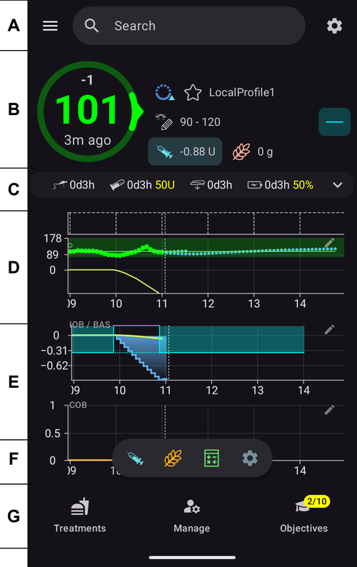

This is the first screen you will come across when you open **AAPS**, and it contains most of the information that you will need day to day.

### Section A - Top bar

* The **menu** (☰) on the left opens the navigation drawer with **Treatments history**, **History browser**, **Statistics**, **Profile helper**, **Maintenance**, **Setup Wizard**, **Configuration** and more.
* The **search bar** finds settings, dialogs and documentation — just start typing (see [Global search](../DailyLifeWithAaps/GlobalSearch.md)).
* The **Settings** (gear) icon on the right opens all [settings](../SettingUpAaps/Preferences.md).

(aaps-screens-profile--target)=
### Section B - Status block

#### Current blood glucose

The latest blood glucose reading from your CGM is shown in the big circle on the left, together with the difference to the previous reading (delta) and the age of the reading.

The color of the BG value reflects the status to the defined [range](#Preferences-range-for-visualization).
   * green = in range
   * red = below range
   * yellow = above range

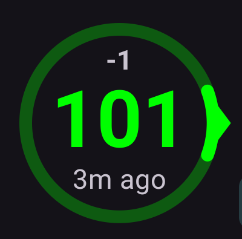

(AapsScreens-loop-status)=
#### Loop status

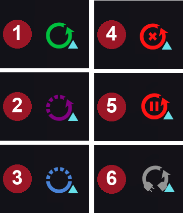

Next to the BG circle, an icon shows the running mode of the loop (from top to bottom in the picture):
1. Green circle = [closed loop](#KeyAapsFeatures-ClosedLoop), loop running
2. Purple circle with dotted line = [low glucose suspend (LGS)](#KeyAapsFeatures-LGS)
3. Blue circle with dotted line = [open loop](#KeyAapsFeatures-OpenLoop)
4. Red circle with cross = loop disabled (not working permanently)
5. Red pause icon = loop suspended (temporarily paused but basal insulin will be given) - remaining time is shown next to the icon
6. Grey circle with plug = pump disconnected (temporarily no insulin dosage at all) - remaining time is shown next to the icon

Press the icon to open the Loop dialog. The dialog's content depends on the current state, as shown below (each icon opens the dialog underneath it):

   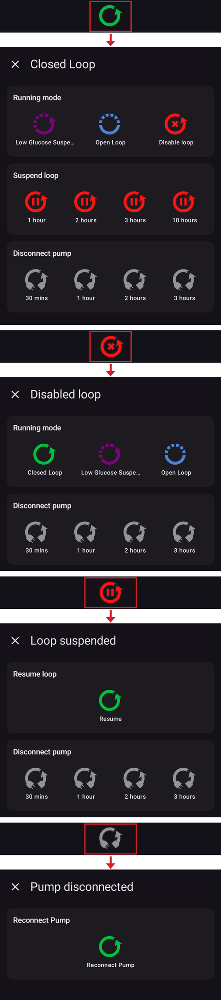

* While the loop is **running** (closed, open or LGS), you can switch the running mode (Closed Loop, Low Glucose Suspend, Open Loop or Disable loop), **suspend** the loop or **disconnect** the pump for a chosen duration.
* While the loop is **disabled**, you can re-enable it by selecting a running mode, or disconnect the pump.
* While the loop is **suspended**, you can **resume** it or disconnect the pump.
* While the pump is **disconnected**, the only option is to **reconnect** the pump.

A validation is required after each selection.

Note: the modes offered depend on your progress in the [Objectives](../SettingUpAaps/CompletingTheObjectives.md) — Closed Loop and LGS only become available as you complete them.

(aaps-screens-bg-warning-sign)=
#### BG warning sign

If for any reason, there are issues in the BG readings **AAPS** receives, you will get a warning signal beneath your BG number on the main screen.

##### Red warning sign: Duplicate BG data

The red warning sign is signaling you to get active immediately: You are receiving **duplicate BG data**, which prevents the loop from doing its work right. **AAPS** cannot calculate your BG trend reliably from duplicated readings, so it stops correcting.

If your loop was closed, **AAPS** switches it to [Low Glucose Suspend (LGS)](#KeyAapsFeatures-LGS) mode. When you press the sign, the message indicates "LGS mode due to doubled values in BG source".

```{admonition} Your loop is running in Low Glucose Suspend
:class: note
Your loop keeps running, but only to protect you against lows: **AAPS** can still reduce or suspend your basal, and it will not give any correction insulin until you solve this issue !
```

  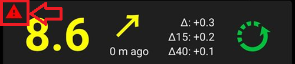

You need to find out why you get duplicate BGs:
* Is Dexcom bridge enabled on your Nightscout site? Disable the bridge by going to the administration panel of your Nightscout instance, edit the "enable" variable and remove the "bridge" part there. (For heroku [details can be found here](https://nightscout.github.io/troubleshoot/troublehoot/#heroku-settings).)
* Do multiple sources upload your BG to Nightscout? If you use the BYODA app, enable the upload in **AAPS** but do not enable it in xDrip, if you use that.
* Do you have any followers that might receive your BG but do also upload it again to your Nightscout site?
* Last resort: In [NSClient settings](#Preferences-nsclient), select the Synchronization settings and disable the "Receive CGM data from NS" option.

To remove the warning immediately and get your loop correcting again, you need to manually delete a couple of entries from the [BG source screen](#aaps-screens-bg-source).

However, when there are a lot of duplicates, it might be easier to
* [backup your settings](../Maintenance/ExportImportSettings.md),
* reset your database in the maintenance menu and
* [import your settings](../Maintenance/ExportImportSettings.md) again

```{admonition} Switch back to Closed Loop yourself
:class: important
**AAPS** does not return to **Closed Loop** on its own once the duplicates are gone. Press the loop icon on the main screen and select **Closed Loop** again.
```

##### Yellow warning sign

The yellow warning signal is indicating that your BG arrived in irregular time intervals or that some BGs are missing. When pressing the sign, the message indicates “Recalculated data used”.

  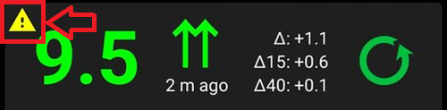

Usually you do not have to take any action. The closed loop will continue to work!

As a sensor change is interrupting the constant flow of BG data, a yellow warning sign after sensor change is normal and nothing to worry about.

Special note for Libre users:

* Every single libre slips a minute or two every few hours, meaning you never get a perfect flow of regular BG intervals.
* Also, jumpy readings interrupt the continuous flow.
* Therefore, the yellow warning sign will be 'always on' for Libre users.

*Note*:
Up to 30h hours are taken into accord for **AAPS** calculations. So even after you solved the origin problem, it can take about 30 hours for the yellow triangle to disappear after the last irregular interval occurred.

#### Current Profile

The current profile is displayed next to the star icon.

Tap the profile name to open the [Profile screen](#aaps-screens-profile), where you can view the profile details and [switch between different profiles](../DailyLifeWithAaps/ProfileSwitch-ProfilePercentage.md).

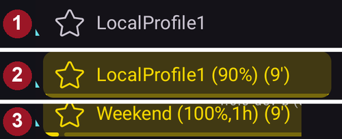

1. Regular display with a standard profile activation.
2. Profile switch with a specific percentage of 90% and a remaining duration of 9 minutes — the profile name turns yellow while a temporary profile switch is running.
3. Profile switch with a time shift of 1 hour and a remaining duration of 9 minutes.

#### Target

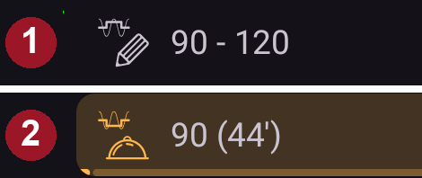

The current target blood glucose level is displayed below the profile name.

Short press the target to open the **[Temporary Target](../DailyLifeWithAaps/TempTargets.md)** screen.

1. Regular display: the target range defined in your profile.
2. If a temp target is set, the target turns yellow/orange with the icon of the used preset, and the remaining time in minutes is shown in brackets.

(AapsScreens-visualization-of-dynamic-target-adjustment)=
#### Visualization of Dynamic target adjustment

When using the [SMB algorithm](#Config-Builder-aps) and [Autosens](#Open-APS-features-autosens) functionality, **AAPS** can dynamically adjust your target based on sensitivity.

Enable either one or both of the following options in [OpenAPS SMB settings](#Preferences-openaps-smb-settings):
   * "Sensitivity raises target" and/or
   * "Resistance lowers target"

If **AAPS** detects resistance or sensitivity, the target will change from what is set from profile, and the displayed target changes color to indicate the adjustment.

(aaps-screens-iob-cob-basal-sens)=
#### IOB, COB, basal and sensitivity

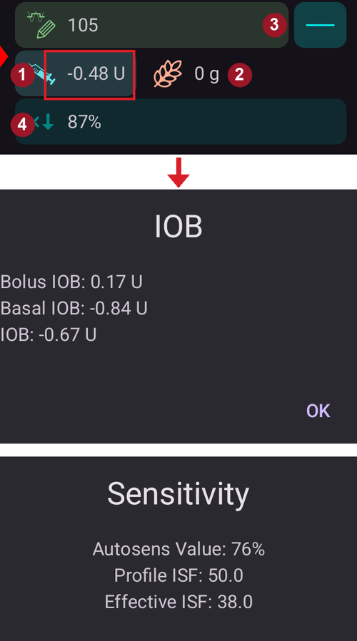

1. **Syringe**: insulin on board (IOB) - amount of active insulin inside your body<br/>
The insulin on board figure would be zero if just your standard basal was running and there was no insulin remaining from previous boluses.
   - IOB may be negative if there have recently been periods of reduced basal.
   - Press the chip to see the split of bolus and basal insulin (first dialog in the picture — here with a negative IOB after a period of reduced basal)
2. **Grain**: [carbs on board (COB)](../DailyLifeWithAaps/CobCalculation.md) - yet unabsorbed carbs you have eaten before
3. The teal button on the right reflects the **current basal delivery**: a flat line when the profile basal is running, a changed icon while a temporary basal rate is active
4. The **percentage row** shows the current sensitivity ([Autosens](#Open-APS-features-autosens) / [DynamicISF](../DailyLifeWithAaps/DynamicISF.md)): press it to see the Autosens value and the effective ISF (second dialog in the picture)

(aaps-screens-carbs-required)=
#### Carbs required

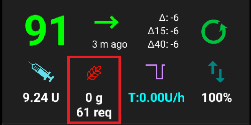

Carbs suggestions are given when the reference design detects that it requires carbs.

This is when the oref algorithm thinks it can't rescue you by zero-temping, and you will need carbs to fix.

The carb notifications are much more sophisticated than the bolus calculator ones. You might see a carbs suggestion while the bolus calculator does not show missing carbs.

Carb required notifications can be pushed to Nightscout if wished, in which case an announcement will be shown and broadcast.

### Section C - Status row

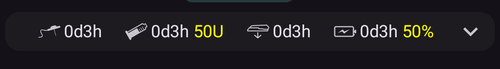

The status row gives a visual warning for
* Cannula age
* Insulin age (days reservoir is used) and reservoir level (units)
* Sensor age
* Pump battery age and level (%)

If threshold warning is exceeded, values will be shown in yellow.

If threshold critical is exceeded, values will be shown in red.

Thresholds can be changed via the small **Settings** icon shown when the status row is **expanded** (chevron on the right) — see [Status lights](#Preferences-status-lights).

The expanded status panel also offers the **Prime/Fill** and **Sensor Insert** buttons to record a pump site change, an insulin cartridge change, a sensor insertion or a pump battery change — these entries reset the corresponding ages.

Depending on the pump you use, you may not have all of these icons.

(screens-sensor-level-battery)=
#### Sensor level (battery)

Works for CGM with an additional transmitter such as MiaoMiao 2. (Technically sensor has to send battery level information to xDrip.)

Thresholds can be set in [Status lights](#Preferences-status-lights).

(aaps-screens-main-graph)=
### Section D - Main graph

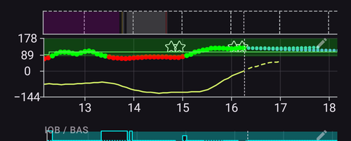

The graph shows your blood glucose (BG) as read from your glucose monitor (CGM).

Use scroll and pinch-zoom gestures on the graph to change the visible time frame.

The green area reflects your target range.

This information is also shown on this graph :
* Boluses: blue triangle on the BG curve and insulin amount
* Carbs entries: orange triangle on the BG curve and carb amount
* Target as defined in the profile or modified by temporary target: green line
* Profile switches: pencil icons at the top of the graph
* Loop status: color band at the top of the graph when the status is anything else than closed loop - see [Loop status](#AapsScreens-loop-status) for the colors (in the screenshot: purple = LGS, grey = suspended/disconnected). The history of these changes is listed in [Running mode](#AapsScreens-running-mode)
* [SMB](#Open-APS-features-super-micro-bolus-smb) - if enabled in [OpenAPS SMB settings](#Preferences-openaps-smb-settings): blue triangles at the bottom of the graph

(AapsScreens-activate-optional-information)=
#### Activate optional information

Press the **pencil** icon in the top-right corner of the graph to open the graph settings:

   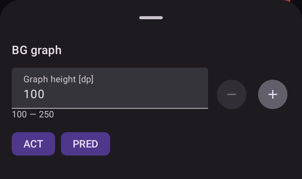

* **Graph height** adjusts how tall the graph is drawn.
* **ACT** overlays the insulin activity curve: yellow line
* **PRED** overlays the [prediction lines](#aaps-screens-prediction-lines) (see below)

(aaps-screens-prediction-lines)=
#### Prediction lines

* **Orange** line: [COB](CobCalculation) (color is used generally to represent COB and carbs)

  This prediction line shows where your BG (not where COB itself!) will go based on the current **Profile** settings, assuming that the deviations due to carb absorption remain constant. This line only appears if there are known COB.
* **Dark blue** line: IOB (color is used generally to represent IOB and insulin)

  This prediction line shows what would happen under the influence of insulin only. For example if you dialed in some insulin and then didn’t eat any carbs.
* **Light blue** line: zero-temp (predicted BG if temporary basal rate at 0% would be set)

  This prediction line shows how the BG trajectory line would change if the pump stopped all insulin delivery (0% TBR).

   *This line appears only when the [SMB](#Config-Builder-aps) algorithm is used.*
* **Dark yellow** line: [UAM](#SensitivityDetectionAndCob-sensitivity-oref1) (un-announced meals)

  Unannounced meals means that a significant increase in glucose levels due to meals, adrenaline or other influences is detected. Prediction line is similar to the **orange COB line**, but it assumes that the deviations will taper down at a constant rate (by extending the current rate of reduction).

   *This line appears only when the [SMB](#Config-Builder-aps) algorithm is used.*

* **Dark orange** line: aCOB (accelerated carbohydrate absorption)

   Similar to COB, but assuming a static 10 mg/dL/5m (-0.555 mmol/L/5m) carb absorption rate. Deprecated and of limited usefulness.

   *This line appears only when the older [AMA](#Config-Builder-aps) algorithm is used.*


Usually your real glucose curve ends up in the middle of these lines, or close to the one which makes assumptions that closest resemble your situation.

(aaps-screens-how-predictions-become-a-dosing-decision)=
#### How AAPS turns predictions into a dosing decision

AAPS doesn't dose insulin based on your current BG alone — every loop cycle (roughly every 5 minutes) it looks at all of the prediction lines above together and works out the safest course of action.

The core rule is **safety first**: if *any* prediction line, in any time frame, dips below your low safety threshold, AAPS issues a zero-temp (0% temporary basal rate) and withholds further insulin, even if your current BG is high. Only once every prediction line stays above that threshold will AAPS consider giving more insulin.

When it is safe to give more insulin, AAPS looks at where BG is ultimately predicted to end up (the **eventual BG**) across the blended predictions, and works out how much correction is needed to bring that eventual BG back to target — delivered either as an increased temporary basal rate, or (if the oref1/[SMB](#Open-APS-features-super-micro-bolus-smb) algorithm is enabled) as a small immediate bolus. If BG is high now but is already trending down enough on its own, AAPS will hold off, or may even reduce the basal rate, rather than add insulin that would only push a later low even lower.

For worked examples of this decision logic with real screenshots, see the [dosing scenarios in the Clinician's guide](#clinicianguide-dosing-scenarios) — they were written for a clinician audience but apply to any AAPS user.

*For the full technical treatment of how these predictions and the resulting dosing decision are calculated, see [OpenAPS's determine-basal documentation](https://openaps.readthedocs.io/en/latest/docs/While%20You%20Wait%20For%20Gear/Understand-determine-basal.html).*

#### Basals

A **solid blue** line shows the basal delivery of your pump and reflects the actual delivery over time.

The **dotted blue** line is what the basal rate would be if there were no temporary basal adjustments (TBRs).

When the standard basal rate is given, the area under the curve is shown in dark blue. When the basal rate is temporarily adjusted (increased or decreased), the area under the curve is shown in light blue.

#### Activity

The **thin yellow** line shows the activity of Insulin.

It is based on the expected drop in BG of the insulin in your system if no other factors (like carbs) were present.

(AapsScreens-section-g-additional-graphs)=
### Section E - Additional graphs

You can activate additional graphs below the main graph. When in [Simple Mode](#preferences-simple-mode), additional graphs are preset and cannot be changed. Switch off **Simple Mode** if you wish to set your own configuration of additional graphs.

To configure an additional graph, press the **pencil** icon in its top-right corner:

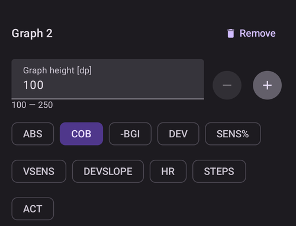

Select the chips corresponding to the data you want to see on this graph; the **Remove** button deletes the graph.

Most users find the following configuration of additional graphs to be adequate :
* Graph 1 with IOB, COB, Sensitivity change
* Graph 2 with Deviations and BGI.

#### Absolute insulin (ABS)

Active insulin including boluses **and basal**.

#### Insulin on board (IOB)

Shows the insulin you have on board (= active insulin in your body). It includes insulin from bolus and temporary basal (**but excludes basal rates set in your profile**).

If there were no [SMBs](#Open-APS-features-super-micro-bolus-smb), no boluses and no TBR during DIA time this would be zero.

IOB can be negative if you have no remaining bolus and zero/low temp for a longer time.

Decaying depends on your [DIA and insulin type settings](#Config-Builder-insulin-dia).

#### Carbs On Board (COB)

Shows the carbs you have on board (= active, not yet decayed carbs in your body).

Decaying depends on the [deviations the algorithm detects](../DailyLifeWithAaps/CobCalculation.md).

If it detects a higher carb absorption than expected, insulin would be given and this will increase IOB (more or less, depending on your safety settings).

#### Sensitivity change (SENS%)

Shows the sensitivity that [Autosens](#Open-APS-features-autosens) has detected.

Sensitivity is a calculation of sensitivity to insulin as a result of exercise, hormones etc.

Note, you need to be in [Objective 8](#objectives-objective8) in order to let Sensitivity Detection/[Autosens](#Open-APS-features-autosens) automatically adjust the amount of insulin delivered. Before reaching that objective, the line in your graph is displayed for information only.

### Variable sensitivity (VSENS)

Shows the sensitivity as calculated by [DynamicISF](../DailyLifeWithAaps/DynamicISF.md). Only populated if you use this feature.

(screen-heart-rate-steps)=
#### Heart rate (HR) & Steps

This data may be available when using a [Wear smartwatch](../WearOS/WearOsSmartwatch.md).
Enable them on **AAPS** Wear app and give permission for health data.

#### Deviations (DEV)
* **Grey** bars show a deviation due to carbs.
* **Green** bars show that BG is higher than the algorithm expected it to be. Green bars are used to increase resistance in [Autosens](#Open-APS-features-autosens).
* **Red** bars show that BG is lower than the algorithm expected. Red bars are used to increase sensitivity in [Autosens](#Open-APS-features-autosens).
* **Yellow** bars show a deviation due to UAM.
* **Black** bars show small deviations not taken into account for sensitivity

#### Blood Glucose Impact (-BGI)

This line shows the degree to which BG ‘should’ rise or fall based on insulin activity alone.

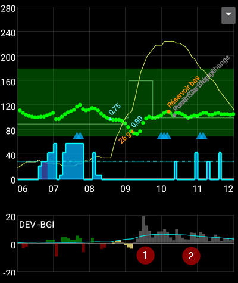

It is a good combination to display this line along with the Deviation bars. They share the same scale, but it is  a different one than the other optional data, so it is a good idea to display them on a separate graph, as shown above. Comparing the BGI line and the Deviation bars is another way to understand how **BG** fluctuates. Here, at the time marked **1**, the Deviation bars are greater than the BGI line, indicating that BG is rising. Later, during the hours marked **2**, BGI and DEV are pretty much in line, indicating that BG is stable.

### Section F - QuickLaunch toolbar

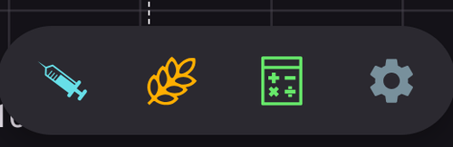

The floating toolbar at the bottom of the screen holds your **[QuickLaunch](../DailyLifeWithAaps/QuickLaunch.md)** actions. The small **gear** opens the QuickLaunch configuration where you choose which buttons are shown (treatments, careportal entries, CGM actions, [Quick Wizard](../DailyLifeWithAaps/QuickWizards.md) buttons, [Scenes](../DailyLifeWithAaps/Scenes.md) and more).

A typical configuration is shown above: **Insulin**, **Carbs** and the **Bolus wizard**.

While the pump is **disconnected**, the treatment buttons are hidden from the toolbar; the same actions remain available in the [Treatments sheet](#aaps-screens-treatments-sheet) of the bottom navigation.

(aaps-screens-buttons-insulin)=
#### Insulin

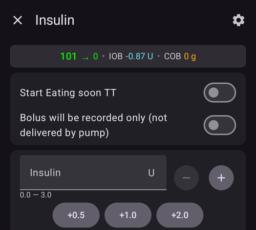

To give a certain amount of insulin without using the [bolus calculator](#aaps-screens-bolus-wizard).

By enabling **Start Eating soon TT**, you can automatically start your [eating soon temp target](#TempTargets-eating-soon-temp-target).

If you do not want to bolus through the pump but record an insulin amount (i.e. insulin given by pen) enable "**Bolus will be recorded only**". An additional field “Time offset” lets you record an insulin injection made in the past.

You can use the **+0.5 / +1.0 / +2.0** buttons to quickly increase the insulin quantity. The increment values can be changed in the [Bolus wizard settings](#Preferences-deliver-this-part-of-bolus-wizard-result).

The insulin dialog can be used when the pump is suspended or disconnected as well, e.g. to record insulin injected with a pen. In this case, "**Bolus will be recorded only**" is forced on (shown in red) and additional fields appear to select the insulin type and a **Time** offset for an injection made in the past:

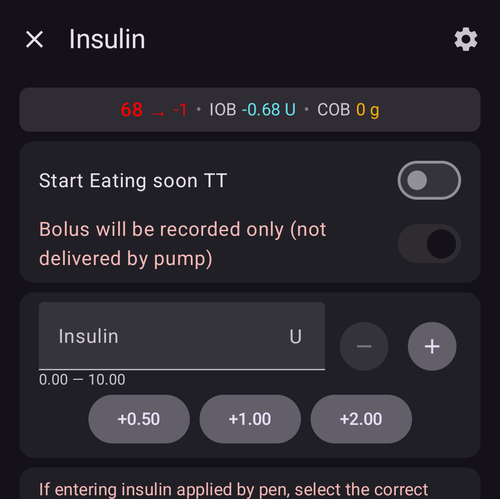

#### Carbs

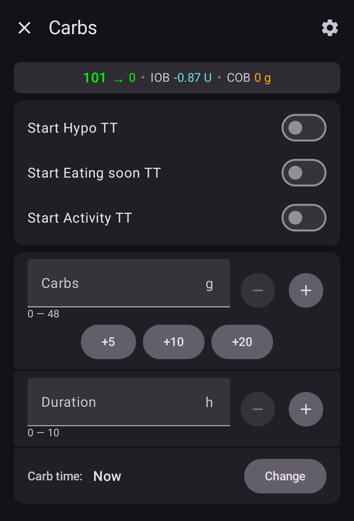

To record carbs without bolusing.

Certain [pre-set temporary targets](#TempTargets-hypo-temp-target) (Hypo, Eating soon, Activity) can be started directly with the switches on top.

**Carb time**: When will you / have you been eating carbs.

**Duration**: To be used for ["extended carbs"](ExtendedCarbs)

You can use the **+5 / +10 / +20** buttons to quickly increase the carb amount.

#### Quick Wizard

Easily enter amount of carbs and set calculation basics with a single pre-configured button.

Details are set up in [Quick Wizard](../DailyLifeWithAaps/QuickWizards.md).

(aaps-screens-treatments-sheet)=
### Section G - Bottom navigation

The bottom navigation bar gives access to:

* **Treatments** — a quick-actions sheet with your treatment actions:

  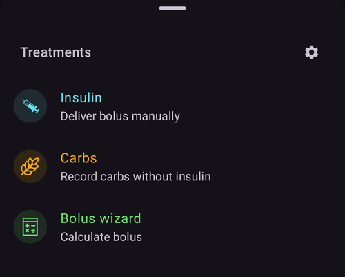

* **Manage** — the hub for everything you manage in **AAPS**: Profile, Insulin, Temp Target, QuickWizard, Scenes, Automation, Food, Site Rotation, Pump, Authorized clients, Sensor Insert and Prime/Fill:

  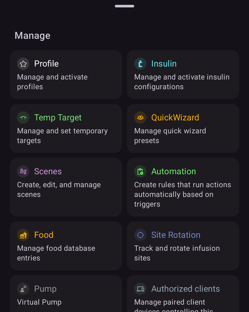

* **Objectives** — your progress through the [Objectives](../SettingUpAaps/CompletingTheObjectives.md); a badge shows how many are completed. This item disappears once all objectives are finished, and is not present on **AAPSClient**.

The red **notification bubble** that may appear above the bottom bar collects active notifications; tap it to read and dismiss them.

(aaps-screens-bolus-wizard)=
## Bolus Wizard

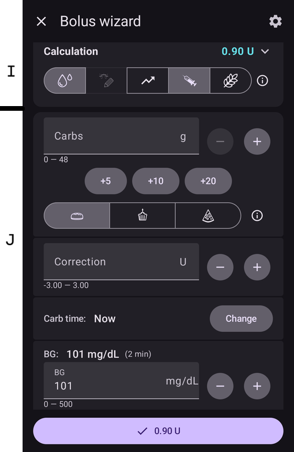

When you want to make a meal bolus, this is where you will normally make it from.

### Section I

The **Calculation** header shows the calculated bolus. If the amount of insulin on board already exceeds the calculated bolus then it will just display the amount of carbs still required.

The icon row below the header shows which inputs enter the calculation (BG, trend, IOB, temporary target, COB). Pressing an icon enables / disables this entry from the calculation; the **(i)** icon shows the detailed numbers behind the calculation.

#### Combinations of COB and IOB and what they mean
* For safety reasons, the IOB input cannot be disabled when COB is enabled as you might run the risk of too much insulin as **AAPS** is not accounting for what’s already given.
* If you enable COB and IOB, unabsorbed carbs that are not already covered with insulin + all insulin that has been delivered as TBR or SMB will be taken into account.
* If you enable IOB without COB, **AAPS** takes account of already delivered insulin but won’t cover that off against any carbs still to be absorbed. This leads to a 'missing carbs' notice.
* If you bolus for **additional food** shortly after a meal bolus (i.e. additional desert) it can be helpful to **disable all inputs**. This way just the new carbs are being added as the main meal won't necessarily be absorbed so IOB won't match COB accurately shortly after a meal bolus.
* For safety reasons, a **temporary target** is only included in the calculation if you enable its input manually.

(AapsScreens-section-j)=
### Section J - Entry fields

In the **Carbs** field, you add your estimate of the amount of carbs - or equivalent - that you want to bolus for; the meal-type buttons (bread, cake, pizza) pre-fill typical amounts.

The **Correction** field is if you want to modify the end dosage for some reason.

The **Carb time** field is for pre-bolusing so you can tell the system that there will be a delay before the carbs are to be expected. You can put a negative number in this field if you are bolusing for past carbs.

**Set alarm** (eating reminder): when a carb time in the future is entered, a "**Set alarm**" switch appears so that you are reminded at the given time, when to eat the carbs you have input into **AAPS**:

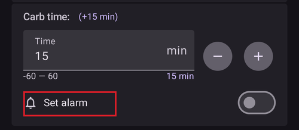

The reminder rings as an **AAPS** alarm. It does not create a timer in your phone's clock app, and it also works when the bolus was entered from **AAPSClient** while **AAPS** was running in the background.

The **BG** field is normally already populated with the latest reading from your CGM. If you don't have a working CGM then it will be blank.

The result button at the bottom shows the proposed bolus; pressing it asks for confirmation before any insulin is delivered.

(AapsScreens-wrong-cob-detection)=
#### Wrong COB detection


If you see the warning above after using bolus wizard, **AAPS** has detected that the calculated COB value may be wrong. So, if you want to bolus again after a previous meal with COB, you should be aware of overdosing!

For details, see the hints on [COB calculation page](#CobCalculation-detection-of-wrong-cob-values).

(screens-action-tab)=
## Where did the Actions tab go?

**AAPS** 3.x had an "Actions" tab. In **AAPS** 4 its functions live in other places:

* **Profile switch**: long-press the [profile name](#aaps-screens-profile--target) on the main screen, or **Manage → Profile**.
* **Temporary target**: press the [target](#aaps-screens-profile--target) on the main screen, or **Manage → Temp Target**.
* **Prime/Fill**, **Sensor Insert**, **BG check** and the other careportal entries: in the expanded [status panel](#aaps-screens-careportal), in **Manage**, or as [QuickLaunch](../DailyLifeWithAaps/QuickLaunch.md) buttons.
* **History browser**, **Statistics** (TDD): in the **menu** (☰).

(aaps-screens-careportal)=
### Careportal entries

The ages and levels shown in the [status row](#screens-sensor-level-battery) (sensor, insulin, cannula, pump battery) are based on careportal entries: **Prime/Fill** (records pump site and insulin cartridge changes), **Sensor Insert** and **Pump Battery Change**.

You can record them from the expanded status panel on the main screen, from the **Manage** sheet, or with [QuickLaunch](../DailyLifeWithAaps/QuickLaunch.md) buttons. Exercise, announcement, question and note entries reflect the Nightscout careportal and are special forms of notes.

### Tools

(Aapsscreens-site-rotation)=

#### Site Rotation

**Manage → Site Rotation** opens the Site Rotation Dialog in View mode:

- You can select if you want to see Cannula sites only, Sensor sites only, or both with upper checkboxes
- All Cannula change and Sensor change event since the past 45 days are available.
- Click on a Site area, or in one entry in the list below to filter the list with only entries in selected area. The selected area will be highlighted in light green color.
- You can open the Edit view to update Site location, Arrow, or Comment associated to each entry

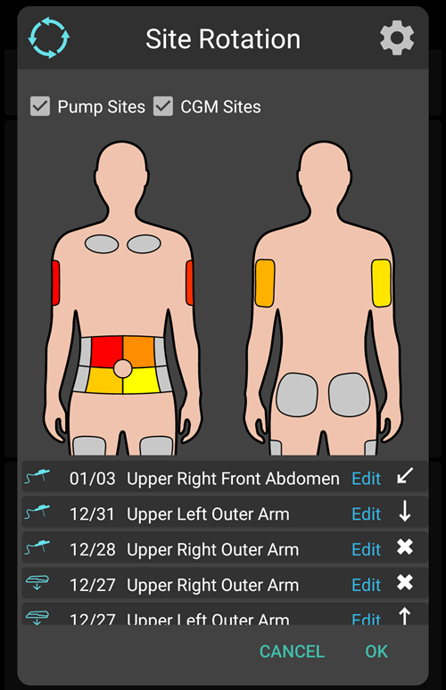

- The Setting tab (upper right cog) allows you to adjust the patient view (Man, Woman or Child), and to select if you want to manage only Pump sites, only Sensor sites or both.

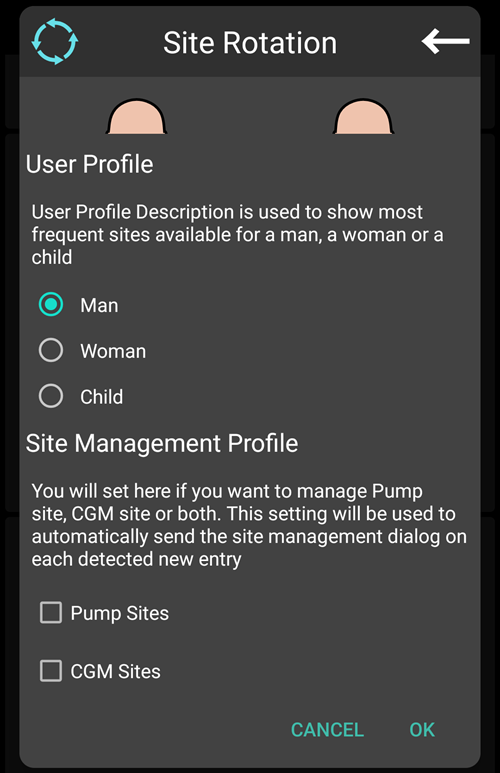

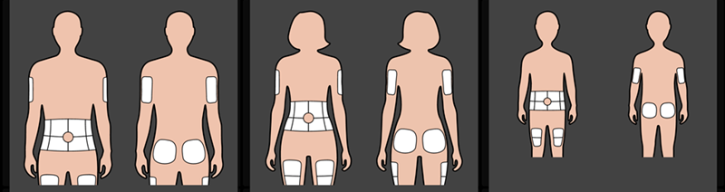

*Note: this setting will be used to automatically open or not Site Rotation Dialog (Edit mode) when a new entry is done from "Prime/Fill button" or "CGM Sensor Insert button"*

- For Site change done directly from Pump, you have to open the View Mode and Edit the new entry to select Location and Arrow

Edit Mode allows you to select Location, Arrow, and Note associated to selected Entry:

- Entry type is visible on the to of Edit mode (Cannula Icon, or Sensor Icon)
- You have to select Front or Back tab and then the Area
- Once a Site selected (highlighted in green), you will see in the list below the list of all entries done in the pas 45 days in this site

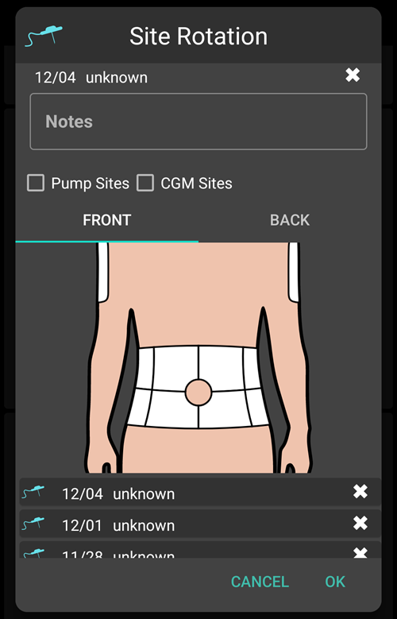

- You can adjust an optional arrow with a click on little arrow icon on the top (Arrow allow you to precise sub-location, from 2 to 9, or Pod Orientation)

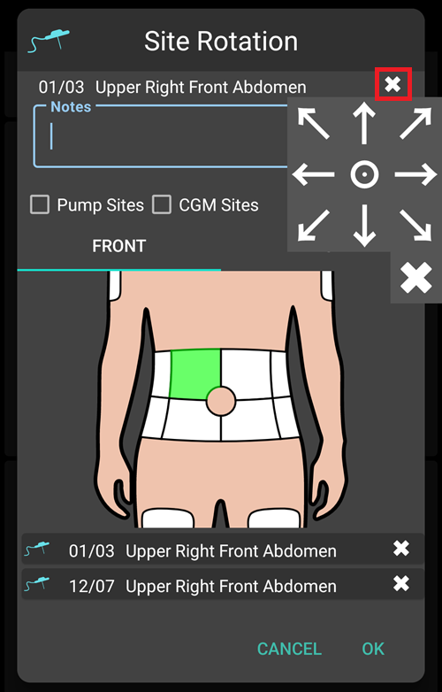

- You can also adjust comments concerning selected site
- After confirmation, the site is recorded

Filtering can be done graphically on the image, or clicking a therapy event in the list
To remove filtering, just click on the image outside any sites

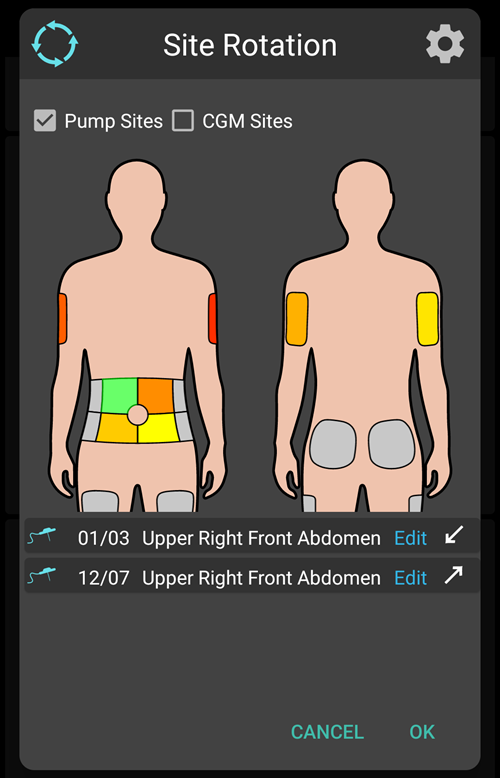

#### TDD

Total daily dose = bolus + basal per day, shown in [Statistics](#aaps-screens-statistics).

Some doctors use - especially for new pumpers - a basal-bolus-ratio of 50:50.

Therefore, ratio is calculated as TDD / 2 * TBB (Total base basal = sum of basal rate within 24 hours).

Others prefer range of 32% to 37% of TDD for TBB.

Like most of these rules-of-thumb it is of limited real validity. Note: Your diabetes may vary!

(AapsScreens-insulin-profile)=
## Insulin

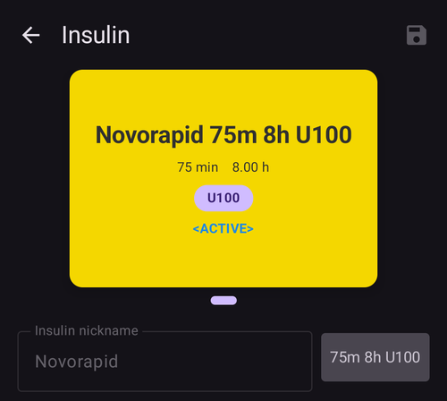

**Manage → Insulin** shows and manages your insulin configurations. The active configuration with its **peak time** and **[DIA](#Config-Builder-insulin-dia)** is shown on a card; below it you can edit the nickname, peak and DIA, and see the activity curve.

See [Config Builder > Insulin > Duration of insulin action](#Config-Builder-insulin-dia) to learn more about what it is and how to set it.

## Pump Status

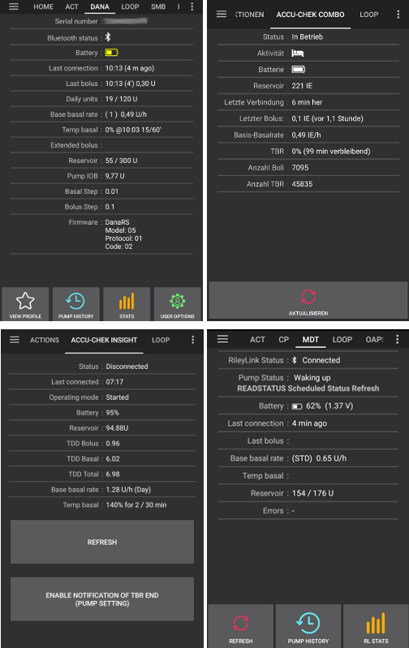

**Manage → Pump** (or **Configuration → Pump → Open plugin**) shows the status of your pump: last connection, base basal rate, battery, reservoir...

* Displayed information depends on your pump model.
* See [pumps page](../Getting-Started/CompatiblePumps.md) for details.

## Loop, AMA / SMB

**Configuration → Loop → Open plugin** (and **Configuration → APS → Open plugin**) show details about the algorithm's calculations and why **AAPS** acts the way it does: last run, the resulting request, and the active constraints.

Calculations are run each time the system gets a fresh reading from the CGM.

For more details see [APS section on config builder page](#Config-Builder-aps).

(aaps-screens-profile)=
## Profile

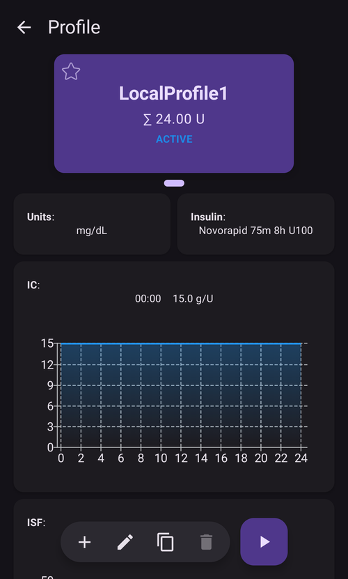

**Manage → Profile** (or a long press on the profile name on the main screen) opens the Profile screen: your profiles as a swipeable card carousel, with buttons to add, edit, clone, delete and **activate** a profile.

Profile contains information on your individual diabetes settings, see the detailed **[Profile](../SettingUpAaps/YourAapsProfile.md)** page for more information.

## Automation

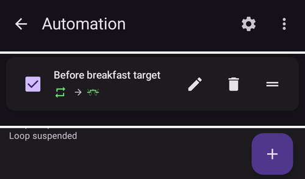

**Manage → Automation** lists your automation rules. See the dedicated page [here](../DailyLifeWithAaps/Automations.md).

## NSClient

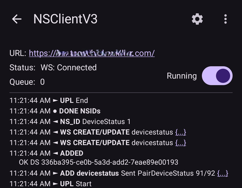

**Configuration → Communication → NSClientV3 → Open plugin** displays the status of the connection with your Nightscout site: URL, websocket status, queue and a log of the synchronization activity.

Settings can be changed in [NSClient settings](#Preferences-nsclient).

For troubleshooting see this [page](../GettingHelp/TroubleshootingNsClient.md).

(aaps-screens-bg-source)=
## BG Source - xDrip, BYODA...

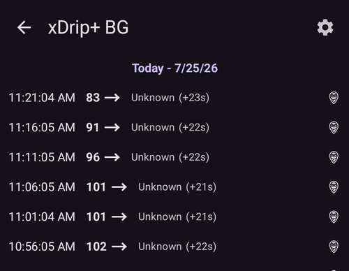

**Configuration → BG Source → Open plugin** shows the history of CGM readings and offers the option to remove readings in case of failure (i.e. compression low) or duplicate readings.

(aaps-screens-treatments)=
## Treatments history

Open the **menu** (☰) in the top-left corner of the main screen and select **Treatments history**.
In this view, you can view and alter the history of the following treatments, each on its own tab (swipe the tab row to see all of them):

* Carbs and bolus
* [Extended bolus](#Extended-Carbs-extended-bolus-and-switch-to-open-loop-dana-and-insight-pump-only)
* Temp basal
* [Temporary target](../DailyLifeWithAaps/TempTargets.md)
* [Profile switch](../DailyLifeWithAaps/ProfileSwitch-ProfilePercentage.md)
* Careportal: notes and careportal entries
* Running mode : history of loop status
* User entry: other notes that are not sent to Nightscout

In the last column, the data source for each line is displayed:
* NS for Nightscout : the data comes from or has been recorded to Nightscout
* PH for Pump History : the data has been processed by the pump

(screens-bolus-carbs)=
### Carbs and bolus

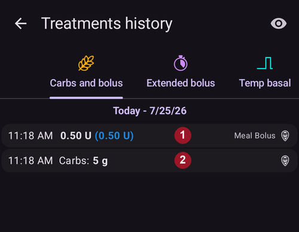

On this tab you can view the bolus and carbs log.
Each bolus (line **1**) shows the remaining associated IOB next to the insulin amount. The origin of the bolus can be either :
* Meal (manually entered though the Insulin, Quick Wizard or Bolus Wizard buttons)
* SMB, when using the SMB Functionality

The carbs entries (line **2**) are shown with their amount in grams.

If you have used the [Bolus Wizard](#aaps-screens-bolus-wizard) to calculate insulin dosage, you can press the “Calc” text on the bolus line to show the details of how the bolus was calculated.

Depending on the pump used, insulin and carbs can be shown in one single line, or will result in multiple lines: one for the calculation detail, one for the carbs, one for the bolus itself.

The Treatments history can be used to correct faulty carb entries (_i.e._ you over- or underestimated carbs). Note that it is not possible to edit an existing entry, you need to follow the following process:

1. Check and remember actual COB and IOB on the main screen.
2. Depending on pump, carbs might be shown together with insulin in one line or as a separate entry (i.e. with Dana RS).
3. Remove the entry with the faulty carb amount: press the trashcan icon, select the lines to remove, and then press the trashcan icon again to finalize.
4. Make sure carbs are removed successfully by checking COB on the main screen again.
5. Do the same for IOB if there is just one line including carbs and insulin.

   → If carbs are not removed as intended, and you add additional carbs as explained here (6.), COB will be too high and that might lead to too high insulin delivery.

6. Enter correct carb amount through the carbs button on the main screen and make sure to set the correct event time.
7. If there is just one line including carbs and insulin you have to add also the amount of insulin. Make sure to set the correct event time and check IOB on the main screen after confirming the new entry.

### Temp basal

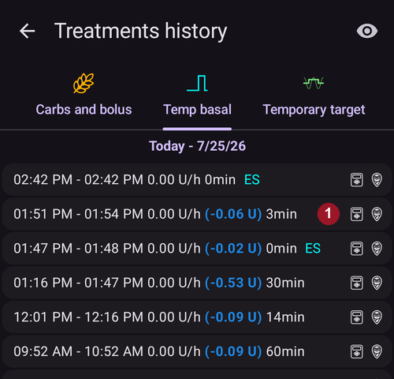

The **temp basals** applied by the loop are shown here. When there is still an impact on the IOB for an entry, the information is shown next to the rate (line **1**). It can be:
* Positive IOB if the temp basal was higher than the one set in the Profile
* Negative IOB for a zero-temp (as on line **1**) or if the temp basal was lower than the one set in the Profile

Deleting the entries only affects your reports in Nightscout and will probably tamper your real IOB - it is not recommended.

On the left of a line, a red S means “Suspend” : it happens when basal is not currently delivered. This is a normal situation when in the process of changing a pod, for example.

### Temporary target

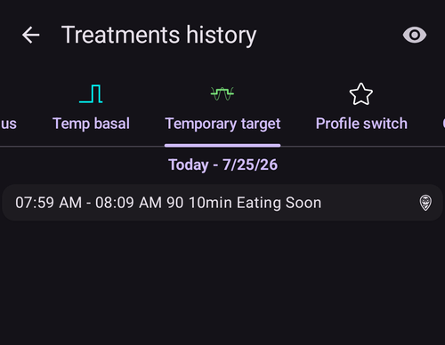

The history of temporary targets can be seen here.

### Profile switch

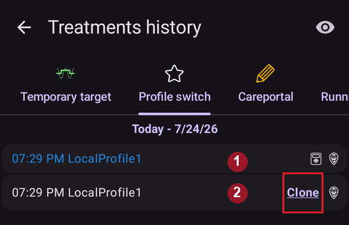

The history of profile switches can be seen here. You may see multiple entries each time you switch profile : line **1**, stored both in NS and Pump History, corresponds to the actual switch. Line **2**, stored in Nightscout but not in Pump History, corresponds to the request of a profile switch made by the user.

Deleting the entries only affects your reports in Nightscout and will never actually change the current profile.

You can use the **Clone** button shown on line **2** to make a copy of a **Profile Switch**. See [Your AAPS Profile > Manage your profiles](#your-aaps-profile-clone-profile-switch) for more information.

### Careportal

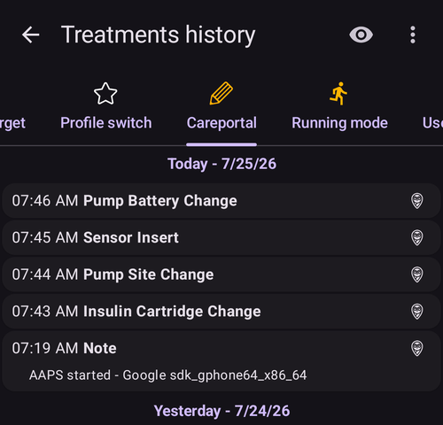

This tab shows all notes and careportal entries recorded in Nightscout.

(AapsScreens-running-mode)=
### Running mode

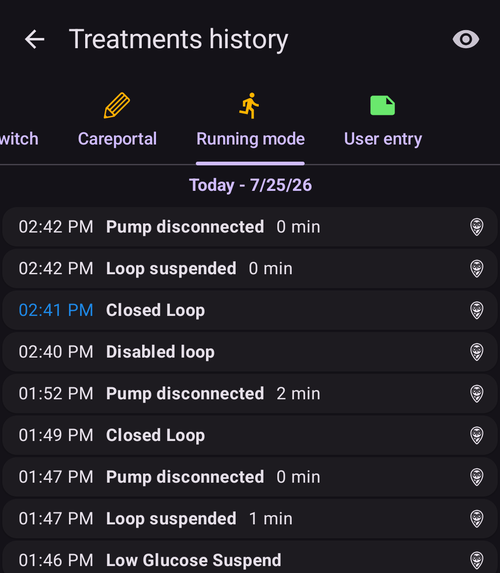

This tab shows the history of [loop status](#AapsScreens-loop-status) changes : open, closed, LGS, suspend, disconnect.

(aaps-screens-running-mode)=

## History Browser

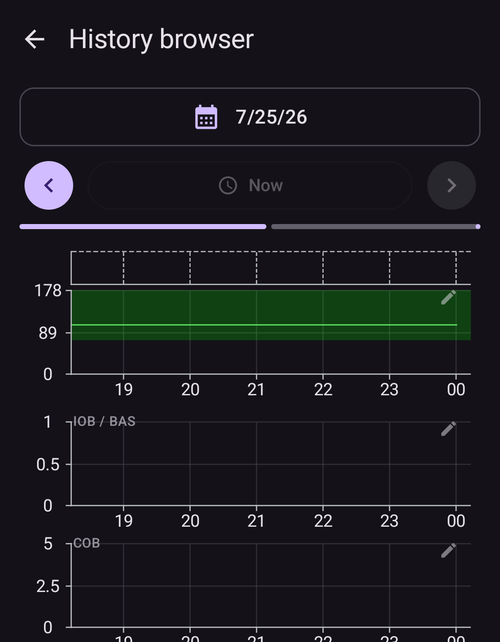

Open the **menu** (☰) and select **History browser**.

Allows you to ride back in **AAPS** history. See the dedicated page [Reviewing your data > History Browser](../Maintenance/Reviewing.md).

(aaps-screens-statistics)=
## Statistics

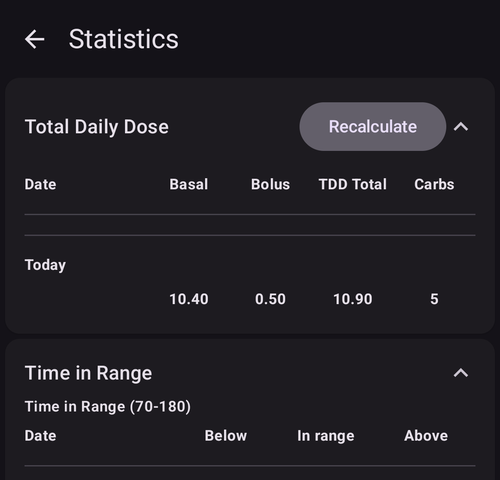

Open the **menu** (☰) and select **Statistics**.

Gives you statistics about your Total Daily Dose and Time In Range. See the dedicated page [Reviewing your data > Statistics](#reviewing-statistics).

(aaps-screens-profile-helper)=
## Profile Helper

Open the **menu** (☰) and select **Profile helper**.

The Profile helper lets you compare profiles and generate starting profiles for children. See [Your AAPS Profile](../SettingUpAaps/YourAapsProfile.md) — sections [Build a Profile from scratch for a kid](#your-aaps-profile-profile-from-scratch-for-a-kid) and [Compare two Profiles](#your-aaps-profile-compare-profiles).
