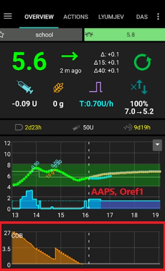
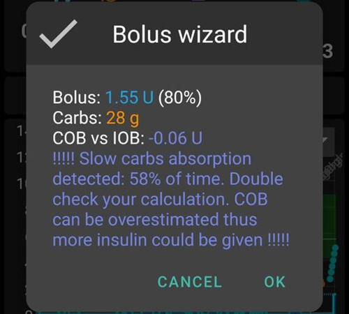
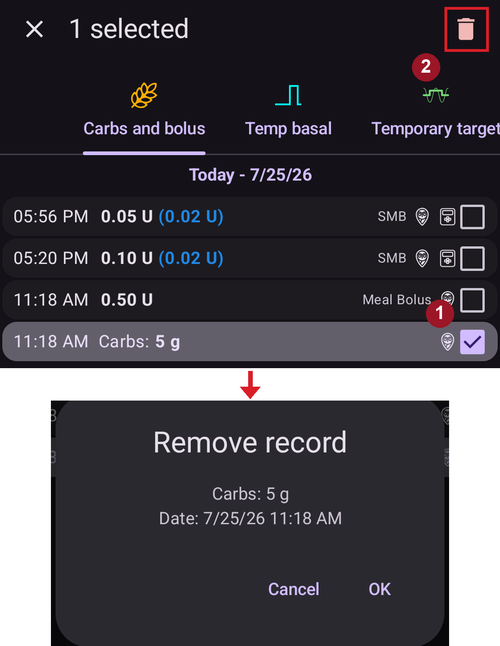

# COB calculation

## How does AAPS calculate the COB value?

When carbs are entered by the user as part of a meal entry or carb correction, **AAPS** will add this calculation to the current carbs on board (**COB**). **AAPS** then calculates the user’s carbs’ absorption based on observed deviations to the user’s **BG** values. The rate of absorption depends on the carb’s sensitivity factor (**’CSF**”). This is not a feature within the user’s **Profile** but is calculated by **AAPS** according to **ISF/I:C** setup, and is determined by how many mg/dL 1 g of carbs will raise the user’s **BG**.

## Carb Sensitivity Factor

The formula adopted by **AAPS** is:     

- absorbed_carbs = deviation * ic / isf. 

The effect on the user’s **Profile** will:

- _increase_ **IC**- by increasing the carbs absorbed every 5 minutes thus shorten total time of absorption;

- _increase_ **ISF** - by decreasing the carbs absorbed every 5 minutes thus prolong total time of absorption; and

- _change_ **Profile Percentage** -  increase/decrease both values thus has no impact on carbs absorption time.

For example, if the user’s  **Profile**  **ISF** is 100 and the **I:C** is 5, the user’s Carb Sensitivity Factor would be 20. For every 20 mg/dL the user’s **BG** goes up, 1 g of carbs will be calculated as absorbed by **AAPS**. Positive **IOB** also affects the **COB** calculation. So, if **AAPS** predicts the user’s **BG** to go down by 20 mg/dL because of **IOB** and it instead stayed flat, **AAPS** would also calculate 1 g of carbs as absorbed.

Carbs will also be absorbed via the methods described below based on which sensitivity algorithm has been selected within the user's **AAPS**.

## Carbs Sensitivity - Oref1

Unabsorbed carbs are cut off after specified time:




```{admonition} Older screenshot
:class: note
The screenshot above is from an earlier **AAPS** version — in **AAPS** 4 the graphs look slightly different, but the **COB** graph carries the same information.
```


## Carbs Sensitivity - WeightedAverage

Absorption is calculated to have COB = 0 after specified time:


If minimal carbs absorption (min_5m_carbimpact) is used instead of value calculated from **BG** deviations, an orange dot appears on the **COB** graph.

(CobCalculation-detection-of-wrong-cob-values)=
## Detection of wrong COB values

**AAPS**  will warn the user if they are about to bolus with **COB** from a previous meal if the algorithm detects current **COB** calculation as incorrect. In this case it will give the user an additional hint on the confirmation screen after usage of bolus wizard.

### How does AAPS detect wrong COB values?

Ordinarily __AAPS__ detects carb absorption through **BG** deviations. In case the user has entered carbs but **AAPS** cannot detect their estimated absorption through **BG** deviations, it will use the [min_5m_carbimpact](#Preferences-min_5m_carbimpact) method to calculate the absorption instead (so called ‘fallback’). As this method calculates only the minimal carb absorption without considering **BG** deviations, it might lead to incorrect COB values.



In the screenshot above (from an earlier **AAPS** version — the confirmation dialog looks slightly different in **AAPS** 4, but shows the same warning), 58% of time the carb absorption was calculated by the min_5m_carbimpact instead of the value detected from deviations. This indicates that the user may have had less **COB** than calculated by the algorithm.

### How to deal with this warning?

- Consider cancelling the treatment - press ‘Cancel’ instead of OK.
- Calculate your upcoming meal again with bolus wizard leaving **COB** unticked.
- If you need a correction bolus, enter it manually.
- Be careful not to overdose or insulin stacking!


### Why does the algorithm not detect COB correctly?

This could be because:
- Potentially the user overestimated carbs when entering them.
- Activity / exercise after your previous meal.
- I:C needs adjustment.
- Value for min_5m_carbimpact is wrong (recommended is 8 with SMB, 3 with AMA).


## Manual correction of carbs entered

If carbs are over or underestimated this can be corrected through the **Treatments history** screen as described [here](#screens-bolus-carbs).


## Carb correction - how to delete a Carb entry from Treatments


The **Treatments history** screen can be used to correct a faulty carb entry by deleting it. This may be because the user over or underestimated the carb entry:



1. Check and remember actual **COB** and **IOB** on the **AAPS'** homescreen.
2. Open **Treatments history** (drawer menu → *Treatments history*), tab **Carbs and bolus**. Depending on the pump, the carbs might show together with insulin in one line or as a separate entry (i.e. with Dana RS).
3. **Long-press** the faulty carb entry — the list switches to **selection mode** with a checkbox on every line, and the entry is ticked (marked **1** above). Tick any further entries you want to remove as well.
4. Tap the **🗑 Delete** icon in the top bar (marked **2**) and confirm — the confirmation dialog lists exactly what will be removed.
5. Make sure carbs are removed successfully by checking **COB** on **AAPS’** homescreen again.
6. Do the same for **IOB** if there is just one line including carbs and insulin.
7. If carbs are not removed as intended and additional carbs are added as explained in this section, the **COB** entry will be too high and this could lead to **AAPS** delivering too much insulin.
8. Enter the correct carbs amount through the **Carbs** dialog (**Treatments** → **Carbs**) and set the correct event time.
9. If there was just one line including carbs and insulin the user should also re-add the amount of insulin. Make sure to set the correct event time and check **IOB** on the homescreen after confirming the new entry.

