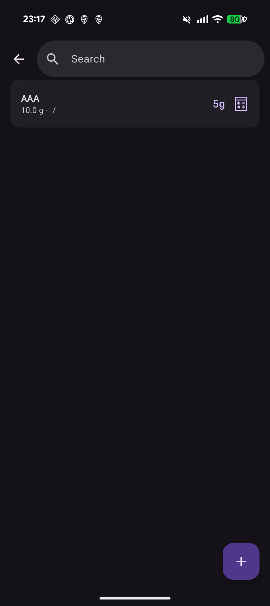
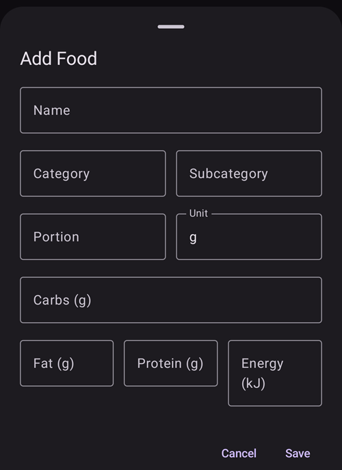

(food)=
# Food (your food database)

The **Food** database is your personal list of saved foods. Each entry stores a food's **carbs** (and, optionally, its fat, protein, energy and a category), so you can keep the things you eat often in one place and start a bolus from a saved food with its carbs already filled in.

```{contents} Table of contents
:depth: 2
:local: true
```

---

## Opening the food database

Open the **Manage** screen (bottom navigation) and choose **Food** (*“Manage food database entries”*). In **AAPS** v4 Food is **no longer a plugin** — there is nothing to enable; it is a standalone screen reached from the [Manage sheet](#v4changes-manage).

---

## The food list

Your foods are shown as a scrollable list. Each row shows the food's **name**, its **portion / unit / category**, and its **carbs**:



- **🔍 Search** (top) — filter the list by **name** (case-insensitive).
- **Category filter** — chips let you narrow the list to a **category**; once a category is picked, **subcategory** chips appear for it. (Tap a selected chip again to clear it.)
- **➕** (bottom-right) — add a new food (see below).
- Tap a row to **edit** that food.

If the list (or the current filter) has no entries, the screen shows **No data**.

---

## Adding and editing a food

Tap **➕** to add, or tap an existing row to edit. An editor opens as a bottom sheet (**Add Food** / **Edit Food**):



The fields are:

- **Name** — required (you can't save without it).
- **Category** and **Subcategory** — optional, used to group/filter foods.
- **Portion** and **Unit** — the typical serving size; **Unit** defaults to **g**.
- **Carbs (g)** — the carbohydrate amount for the food.
- **Fat (g)**, **Protein (g)**, **Energy (kJ)** — optional nutrition values.

Tap **Save** to store it, or **Cancel** to discard. When editing an existing food the editor also has a **Delete** button.

```{admonition} Deleting is undoable
:class: note
Deleting a food shows a **“Food deleted”** message with an **Undo** action, so an accidental delete is easy to reverse.
```

---

## Using a food for a bolus

Each food row has a **calculator** button. Tapping it opens the **bolus wizard** with that food's **carbs** already filled in and the food's **name** added as the treatment note — so you confirm and deliver without re-typing the carbs.

```{admonition} The carbs value is used as-is
:class: note
The food's stored **carbs** number is passed straight to the wizard — **AAPS** does not multiply it by the portion or by how much you ate. If you have a different amount, adjust the carbs in the wizard before confirming. (There is no food picker *inside* the bolus wizard or the carbs dialog; you start from the food row here.)
```

---

## Where foods come from (Nightscout sync)

The food database is shared through **Nightscout**, but **in one direction only**:

- **Download:** **AAPS** **reads** foods from your Nightscout site's **food database** and keeps the local list in sync with it. This runs as part of NSClientV3 syncing, so a paired **client/follower** ends up with the same foods too.
- **Upload:** **AAPS** does **not** push foods **to** Nightscout — NSClientV3 does not support uploading food entries. Foods you create or edit **inside AAPS** therefore stay **on that device** and are not propagated to Nightscout or to your other devices.

```{admonition} Maintain your shared list in Nightscout
:class: important
Because food is **download-only**, the way to share one food list across your phone, your follower/[client](../RemoteFeatures/ClientMasterControl.md) and the rest of your setup is to maintain it in **Nightscout** (its built-in food editor). **AAPS** will pull those entries down. A food added only in **AAPS** is local to that device — and stays put: a download matches Nightscout entries by their Nightscout ID, so it adds and updates those but never overwrites or removes a food you created locally (a food is only removed when its Nightscout copy is deleted in Nightscout).

Note that the food database is **not** part of the master ↔ client signed control channel either — it travels purely as Nightscout data.
```

---

## Not on the watch

The food database is a **phone** feature — there is no food browser, tile or menu on a **Wear OS watch**.

---

<!-- =====================================================================
     Screenshots captured from a real master device:
       - food_list.png    (Manage → Food: list row, search, add button)
       - food_editor.png  ("Add Food" editor: name/category/subcategory/portion/unit/carbs/fat/protein/energy)
     No food was created or deleted (the editor was cancelled).
     Sync facts code-verified: download via LoadFoodsWorker.getFoods(); upload disabled
     (DataSyncSelectorV3 processChangedFoods() commented out — "NSCv3 doesn't support food update").
     Maintainers: relocate page + images and fix cross-links as needed.
     ===================================================================== -->
