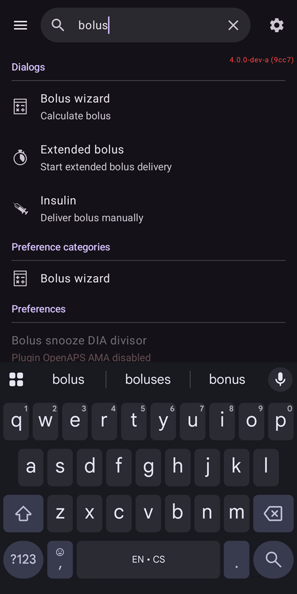
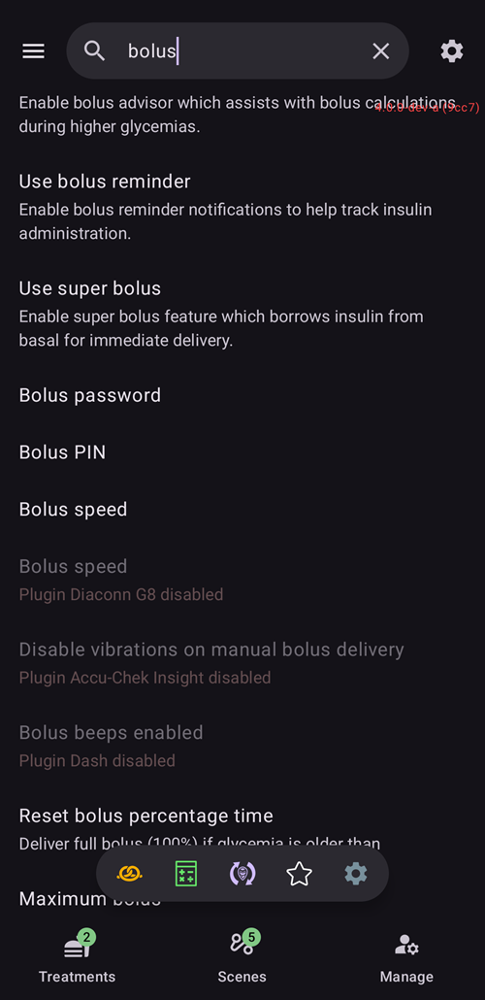
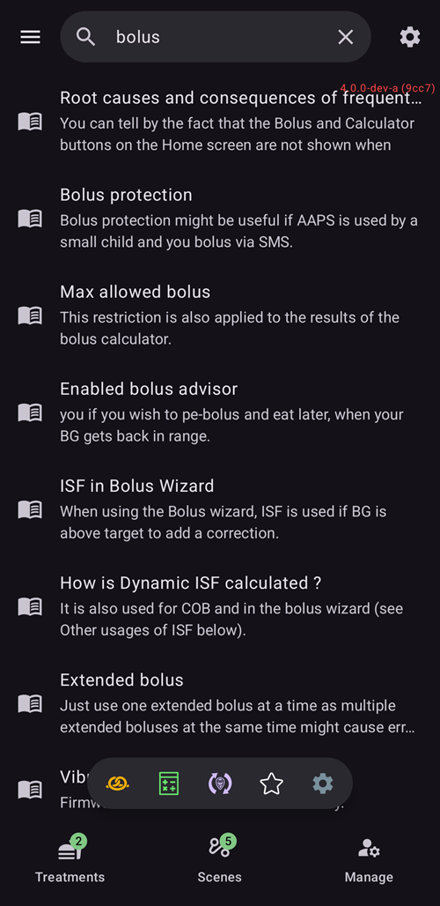

(global-search)=
# Global search

**AAPS** v4 has a **global search** box at the top of the main screen. Type a word and it looks across the whole app at once — plugins, dialogs, settings screens, individual preferences — and, if you are online, the **AndroidAPS documentation** too. It is the fastest way to jump to a setting or screen without remembering where it lives.

```{contents} Table of contents
:depth: 2
:local: true
```

---

## Opening search

Tap the **🔍 Search** field at the top of the **Overview** (next to the ☰ menu). Start typing and results appear as you type (after a short pause), grouped by category:



Clear the box with the **✕**, or close search with the device **Back** button.

---

## Search in English *or* your own language

This is the part worth knowing: search matches against **both** the text in your **selected language** **and** the original **English** text.

- If your app is in, say, German or Czech, you can type the **localized** word **or** the **English** word — either finds the setting.
- A match on the **localized** title ranks highest, then the **English** title, then the localized and English **descriptions**.
- Matching ignores **accents/diacritics** (so *ů* matches *u*, *é* matches *e*) and is **case-insensitive**.

This means a guide or forum post written in English still leads you to the right setting even when your phone shows everything translated.

---

## What search covers

Results are grouped into these categories:

- **Plugins** — every plugin visible in your build (the same ones listed under [Configuration](../SettingUpAaps/ConfigBuilder.md)).
- **Dialogs** — the treatment/action and management screens (Bolus wizard, Insulin, Extended bolus, Calibration, Temp Target, Profile, …). Screens that don't apply to your build are left out (for example *Pair with master* on a master, *Authorized clients* on a client).
- **Preference categories** — the settings **screens** and sub-screens, both built-in (General, Appearance, Protection, Alerts, Maintenance, …) and from plugins, plus the small settings groups reached from dialogs (Fill buttons, Insulin/Carbs button steps, status-light thresholds, wizard settings, …).
- **Preferences** — every **individual setting** that has a title. These are filtered to your build/mode, so you only see settings that actually apply (APS / NSClient / pump-control).
- **Documentation** — pages from the online **AndroidAPS docs** (see below).

```{admonition} Settings that belong to a disabled plugin
:class: note
A preference whose plugin is currently **disabled** still shows up — **greyed out** and not tappable — with a *“Plugin … disabled”* note, so you can tell the setting exists and which plugin to enable to reach it.


```

---

## Documentation results (online)

While the local search runs, **AAPS** also queries the official **AndroidAPS documentation** (hosted on ReadTheDocs) in parallel. Matching pages appear in a **Documentation** group at the bottom, each with a 📖 icon, the section title and a short snippet:



- Tapping a documentation result opens that page in your **browser**.
- Documentation search needs **internet** — when you are offline you get a *“Documentation search requires internet connection”* note instead, and the local (in-app) results still work normally.

---

## Opening a result

Tap a result to go straight to it:

- **Plugin** → opens that plugin.
- **Dialog** → opens that screen or dialog.
- **Preference category** → opens that settings screen.
- **Preference** → opens the setting **in place** (jumps to it within its screen).
- **Documentation** → opens the page in your browser.

Opening settings and protected actions still respects your **[protection](../SettingUpAaps/ConfigBuilder.md)** (PIN/password), exactly as it would if you had navigated there by hand. After you act on a result you can press **Back** to return to your search results.

---

## Power-user shortcuts

Two special queries list a whole category at once:

- `%PLUGINS%` — list **all** plugins.
- `%DIALOGS%` — list **all** dialogs/action screens.

---

```{admonition} The index stays current
:class: note
The search index is built the first time you search and kept ready after that. It is rebuilt automatically when you **enable/disable a plugin** or **change the app language**, so results always reflect your current setup.
```

---

<!-- =====================================================================
     Screenshots captured from a real master device (query "bolus"):
       - search_results.png        (categorized local results: Dialogs / Preference categories / Preferences)
       - search_disabled_plugin.png (greyed-out preference from a disabled plugin)
       - search_documentation.png   (online ReadTheDocs results with 📖 icon + snippets)
     Maintainers: relocate page + images and fix cross-links as needed.
     ===================================================================== -->
