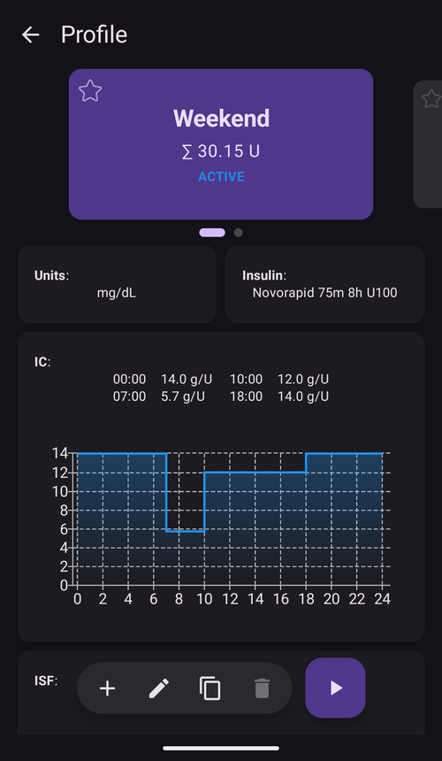
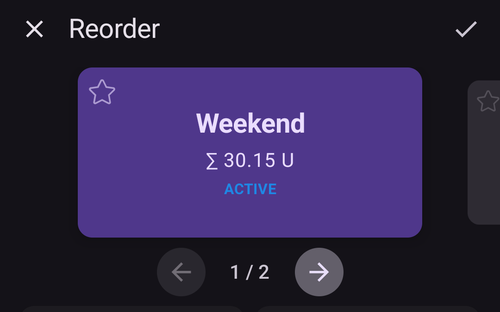
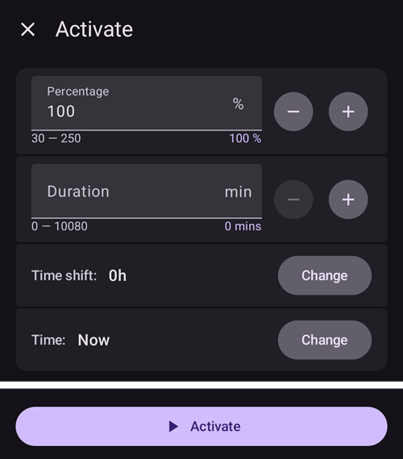
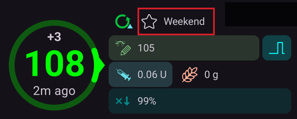
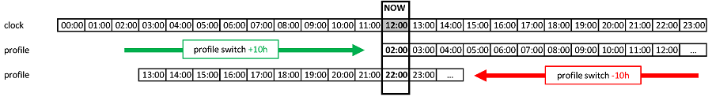

# Profile switch & Profile Percentage

This section will explain what is a **Profile Switch** and **Profile Percentage**. You can learn about how to create a **Profile** at [Config Builder > Profile](#setup-wizard-profile).

When first embarking on your **AAPS** journey, you will need to create a **Profile**, understand how to action a **Profile Switch** and learn the impact of a **Profile Percentage** within **AAPS**. The features of a **Profile Switch** or **Profile Percentage** can offer be particularly beneficial for:

- the Menstrual Cycle - a percentage adjustment within a **Profile** can be set up in **Automations** in order to allow **AAPS** to accommodate for different stages of the hormone cycle and with predicted insulin resistance.

- Exercise - a percentage adjustment within a **Profile** can be set up in **Automations** for exercise in order to reduce basal intake.

- Night or pattern shift workers - a time shift in **Profile** can be set up for pattern shift workers by altering the number of hours in the **Profile** to how much later/earlier the user will go to bed or wake up.

Why use a  **Profile Percentage** rather than a temporary basal adjustment?  To be more effective in its application a  **Profile Percentage** applies a proportionate reduction or increase across: basal, ISF and I:C. This ensures a balanced approach is calculated by **AAPS** when administering the user’s insulin intake. Little benefit can be gained in a user’s **Profile** in **AAPS** by a basal reduction if the algorithm continues to deliver the same ratios for ISF and I:C.

(ProfileSwitch-manage-v4)=
## Managing and activating profiles (Manage → Profile)

In **AAPS** v4 profiles are managed and activated from the **Manage** screen (bottom navigation) → **Profile** (*“Manage and activate profiles”*).

The Profile screen shows your profiles as a **swipeable card carousel**. The card of the running profile is marked **ACTIVE** and shows its total daily basal (e.g. *∑ 30.15 U*). Below the selected card you see that profile's details — **Units**, **Insulin** type, and the **IC**, **ISF**, **basal** and **target** schedules with graphs.



The action bar at the bottom acts on the **selected** profile: **➕ Add**, **✏️ Edit**, **⧉ Clone**, **🗑️ Delete** and **▶ Activate**. For how to fill in the four schedules in the editor (IC / ISF / BAS / TARG), see [Create and edit Profiles](#your-aaps-profile-create-and-edit-profiles).

### Reordering profiles

If you have more than one profile you can choose their order in the carousel: tap the **⋮** menu in the top bar and choose **Reorder**. The page indicator is replaced by **◀ / ▶ move buttons** with a *position / total* readout — step the centred card earlier or later, then confirm with **✓** (or discard with **✕**). The new order is saved once, when you confirm.



### Activating a profile

Select a profile and tap **▶ Activate**. A **profile switch** dialog lets you tailor how it is applied:



- **Percentage** (30–250 %) — scale the whole profile. 100 % uses it as-is; for example 70 % reduces basal and the calculated insulin dose (both meal boluses and corrections) by 30 %. It does not change your glucose targets or carb absorption. See [Profile Percentage](#profile-percentage) for the full effect.
- **Duration** — how long the switch lasts. **0 = indefinite** (until you switch again); a non-zero value reverts to the previous profile when it ends.
- **Time shift** — move the schedule forward/back in time (useful for shift work or travel). See [Time shift](#ProfileSwitch-ProfilePercentage-time-shift-of-the-circadian-percentage-profile).
- **Time** — when the switch takes effect (normally *Now*).

Tap **Activate**. The running profile then carries the **ACTIVE** badge on its card.

```{admonition} Percentage and time shift make one profile go a long way
:class: note
Rather than building many similar profiles, keep one base profile and apply it at a different **percentage** or **time shift** for recurring situations (illness, exercise, travel). This is exactly what [scenes](Scenes.md) automate.
```

A profile switch is not limited to this screen. The same switch can also be triggered from a **Wear OS watch**, a paired **client** (see [Master ↔ Client control](../RemoteFeatures/ClientMasterControl.md)), a **[scene](Scenes.md)**, or an **Automation** rule.

---

## How to activate a Profile Switch?

In order to use this feature the user must have at least one **Profile** saved within **AAPS**. The quickest way to the **Profile** screen is to tap the **profile name** at the top of the main screen:



Then, on the [Profile screen](#ProfileSwitch-manage-v4):

1. **swipe** to the desired **Profile** card;
2. tap the **▶ Activate** button;
3. adjust **Percentage**, **Duration** and **Time shift** if needed (see below); and
4. tap **Activate** and confirm.

The same screen is also reachable via **Manage** → **Profile**.

To activate a **Profile Percentage**, set the **Percentage** field in the same dialog before confirming. For the **Duration** field, note:

* left at ‘zero’, the switch remains active for an infinite amount of time — the **Profile** stays active until a new “Profile switch” is made by the user;
* entered with a number of [x] minutes, the switch lasts for that time period. Upon expiry of the selected time frame, the previous **Profile** reverts in **AAPS**.

## Profile Percentage

It is important that a user understands the essential features of a **Profile Percentage**. By applying a percentage increase or decrease to a **Profile Switch** this will apply in the same percentage to either raise or lower the user’s settings parameters as set within the **Profile**.

For example: a **Profile Switch** to 130% (means the user is 30% more insulin resistant) will instruct **AAPS** to 
- __increase__ the basal rate by 30%; 
- __lower__ the **ISF**: by dividing by 1.3;
- __lower__ the **I:C** by dividing by 1.3.

Remember lowering the **ISF** or **I:C** means a stronger ratio and more insulin being administered. This fact can be easily overlooked by new users to **AAPS**.

Once selected, **AAPS** readjusts the default basal rate, and **AAPS** (open or closed) will continue to work on top of the selected percentage **Profile**. 

The effect of a **Profile** Percentage is summarized in the table below:

| Profile Switch<br>Percentage |    Effect    |    I:C<br>g/UI     | example<br>15g |         ISF<br>mmol/L/UI<br/>mg/dL/UI          | UI to lower<br/>2mmol/L<br/>40mg/dL |
| :--------------------------: | :----------: | :----------------: | :------------: | :--------------------------------------------: | :---------------------------------: |
|             90%              |    Weaker    | 5/0.9<br>=**5.55** |     2.7 UI     | 2.2/0.9<br>=**2.4**<br><br>40/0.9<br>=**44.4** |               0.8 UI                |
|           **100%**           | **Standard** |       **5**        |    **3 UI**    |                 **2.2<br>40**                  |             **0.9** UI              |
|             130%             |   Stronger   | 5/1.3<br>=**3.85** |     3.9 UI     | 2.2/1.3<br>=**1.7**<br><br>40/1.3<br>=**30.8** |               1.2 UI                |

(ProfileSwitch-ProfilePercentage-time-shift-of-the-circadian-percentage-profile)=
## Time shift of the Circadian Percentage Profile

A ‘time shift’ within a user’s **Profile** feature will move the user’s **Profile’s** settings around the day-to-day clock (‘circadian’) to the desired number of hours entered. This can be helpful for:

- __night shift or pattern workers__:  work night shifts by altering the number of hours to how much later/earlier in the **Profile** the user will go to bed or wake up; 
- __users changing time zones during travelling__; or
- __users who are type 1 children__: and have a set bedtime routine and insulin resistance catered for within their **Profile**. If for whatever reason, there is a predicted later bedtime for the child, the caregiver can apply a ‘time shift’ to the child’s **Profile** to allow **AAPS** to react to insulin resistance at a desired time period as set by the user.

It is always a question of which hour’s **Profile’s** settings should replace the settings of the current time. This time must be shifted by x hours. So please be mindful of the directions as described in the following example:
  * Current time: 12:00
  * **Positive** time shift 
    * 2:00 **+10 h** -> 12:00
    * Settings from 2:00 will be used instead of the settings normally used at 12:00 because of the positive time shift.
  * **Negative** time shift
    * 22:00 **-10 h** -> 12:00
    * Settings from 22:00 (10 pm) will be used instead of the settings normally used at 12:00 because of the negative time shift.



This mechanism of taking snapshots of the **Profile** allows a much more precise calculation of the past and the possibility to track **Profile**  changes.

## Keep a profile switch for later use

Once you have performed a profile switch with percentage and/or timeshift, you can make a copy of this temporary profile into a new profile.

To do this, go to the tab [Treatments > Profile Switch](#your-aaps-profile-clone-profile-switch).
