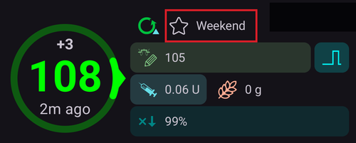
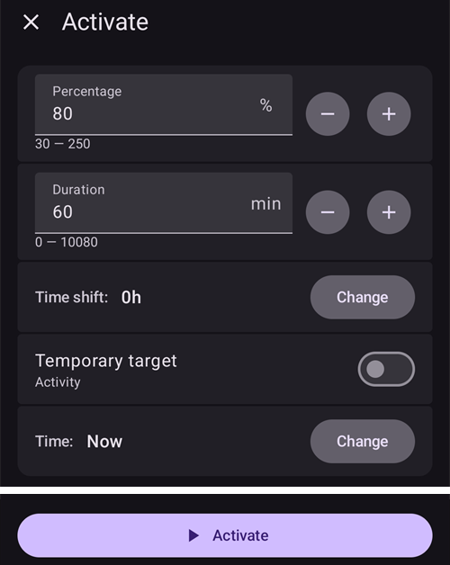
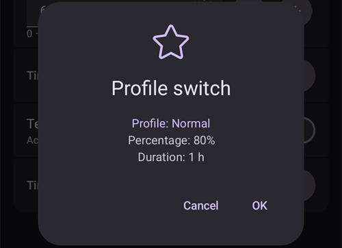
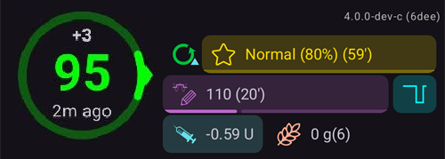
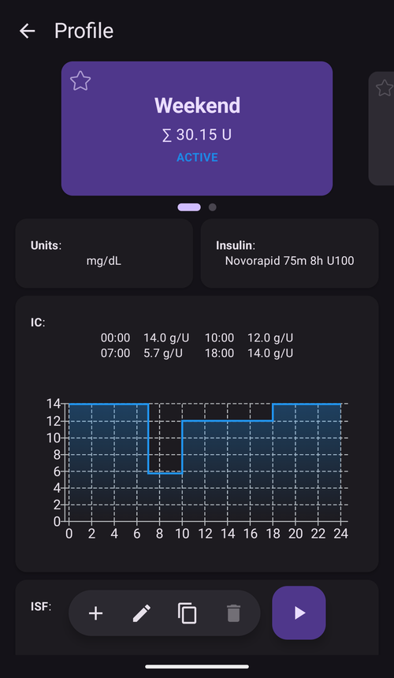
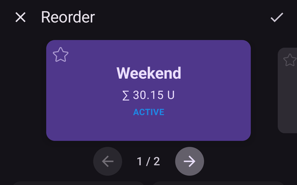
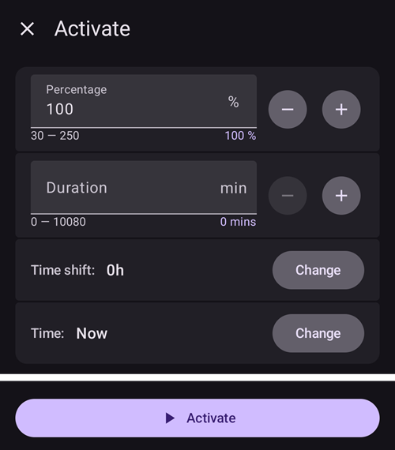
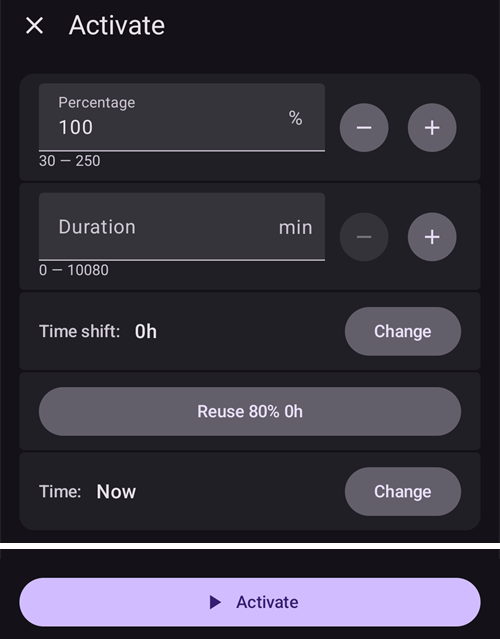
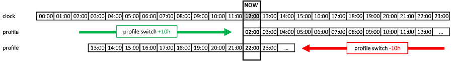

# Profile switch & Profile Percentage

This section will explain what is a **Profile Switch** and **Profile Percentage**. You can learn how to create a **Profile** in [Your AAPS Profile](#your-aaps-profile-create-and-edit-profiles).

When first embarking on your **AAPS** journey, you will need to create a **Profile**, understand how to action a **Profile Switch** and learn the impact of a **Profile Percentage** within **AAPS**. The features of a **Profile Switch** or **Profile Percentage** can offer be particularly beneficial for:

- the Menstrual Cycle - a percentage adjustment within a **Profile** can be set up in **Automations** in order to allow **AAPS** to accommodate for different stages of the hormone cycle and with predicted insulin resistance.

- Exercise - a percentage adjustment within a **Profile** can be set up in **Automations** for exercise in order to reduce basal intake.

- Night or pattern shift workers - a time shift in **Profile** can be set up for pattern shift workers by altering the number of hours in the **Profile** to how much later/earlier the user will go to bed or wake up.

Why use a  **Profile Percentage** rather than a temporary basal adjustment?  To be more effective in its application a  **Profile Percentage** applies a proportionate reduction or increase across: basal, ISF and I:C. This ensures a balanced approach is calculated by **AAPS** when administering the user’s insulin intake. Little benefit can be gained in a user’s **Profile** in **AAPS** by a basal reduction if the algorithm continues to deliver the same ratios for ISF and I:C.

(ProfileSwitch-change-percentage)=
## Change the Profile Percentage from the main screen

You need at least one saved **Profile**. A **Profile Percentage** is always applied through a **Profile Switch**: you activate a **Profile** again, this time with a percentage.

```{admonition} Coming from AAPS 3?
:class: note
A long press on the profile name no longer opens the profile switch dialog. **Tap** the profile name, then tap the round **▶** button at the bottom right: it opens the same settings (percentage, duration, Activity temp target).
```

1. On the main screen, **tap the profile name** (next to the star icon). The [Profile screen](#ProfileSwitch-manage-v4) opens on the card of the running **Profile**, marked **ACTIVE**.

   

2. To keep the same **Profile**, leave the **ACTIVE** card selected. To change **Profile** at the same time, swipe to another card.
3. Tap the round **▶** button (**Activate**) at the bottom right. The **Activate** screen opens.
4. Set the **Percentage** with **−** / **+** (steps of 5 %), or type it in (30 to 250 %). The field always starts at **100 %**: it does not show the percentage that is running now. For example, enter **80** for 20 % less insulin, or **120** for 20 % more.
5. Set the **Duration** in minutes:
   * **0** keeps the new percentage until you make another **Profile Switch**;
   * any other value ends the switch after that time, and **AAPS** goes back to the **Profile** that was running before.

   

6. Tap **▶ Activate** at the bottom of the screen. Check the summary in the **Profile switch** dialog and tap **OK**.

   

Back on the main screen, the profile name shows the percentage and the remaining time, for example *Normal (80%) (59')*, and turns yellow while a switch with a duration is running. A star marks the switch on the glucose graph. See [the main screen](#aaps-screens-profile--target).



To **go back to 100 %** before the end, repeat the steps and keep **Percentage** at 100 and **Duration** at 0.

```{admonition} One-tap percentages
:class: tip
If you often use the same percentage (sport, illness), add a [Profile shortcut](#profile-shortcuts) to the Quick Launch bar, or create a [scene](Scenes.md). Both apply a profile with a preset percentage and duration in one tap.
```

(ProfileSwitch-manage-v4)=
## Managing and activating profiles (Manage → Profile)

In **AAPS** v4 profiles are managed and activated from the **Manage** screen (bottom navigation) → **Profile** (*“Manage and activate profiles”*).

The Profile screen shows your profiles as a **swipeable card carousel**. The card of the running profile is marked **ACTIVE** and shows its total daily basal (e.g. *∑ 30.15 U*). Below the selected card you see that profile's details — **Units**, **Insulin** type, and the **IC**, **ISF**, **basal** and **target** schedules with graphs.



The buttons at the bottom act on the **selected** profile: **➕ Add**, **✏️ Edit**, **⧉ Clone** and **🗑️ Delete**, and the round **▶ Activate** button on the right. For how to fill in the four schedules in the editor (IC / ISF / BAS / TARG), see [Create and edit Profiles](#your-aaps-profile-create-and-edit-profiles).

### Reordering profiles

If you have more than one profile you can choose their order in the carousel: tap the **⋮** menu in the top bar and choose **Reorder**. The page indicator is replaced by **◀ / ▶ move buttons** with a *position / total* readout — step the centred card earlier or later, then confirm with **✓** (or discard with **✕**). The new order is saved once, when you confirm.



### Activating a profile

Select a profile and tap **▶ Activate**. The **Activate** screen lets you tailor how the **Profile Switch** is applied:



- **Percentage** (30–250 %, starts at 100 % every time) — scale the whole profile. 100 % uses it as-is; for example 70 % reduces basal and the calculated insulin dose (both meal boluses and corrections) by 30 %. It does not change your glucose targets or carb absorption. See [Profile Percentage](#profile-percentage) for the full effect.
- **Duration** (0–10080 minutes, that is up to 7 days) — how long the switch lasts. **0 = indefinite** (until you switch again); a non-zero value reverts to the previous profile when it ends.
- **Temporary target / Activity** — appears only when you set a **Duration** and a **Percentage** below 100 %. Switch it on to also start an [Activity temp target](#TempTargets-activity-temp-target) for the same duration, as you would before exercise.
- **Time shift** — shows *0h*; tap **Change** to move the schedule forward or back by up to 23 hours (useful for shift work or travel). See [Time shift](#ProfileSwitch-ProfilePercentage-time-shift-of-the-circadian-percentage-profile).
- **Reuse** — appears when the running switch has a percentage other than 100 % or a time shift, for example **Reuse 80% 0h**. Tap it to fill in the same percentage and time shift, for instance to prolong a switch that is about to end.

  

- **Time** — leave it at *Now*.
- **Notes** — only shown if [Show notes in dialogs](#Preferences-show-notes-field-in-treatments-dialogs) is on.

If the basal rates at the chosen percentage are not compatible with your pump, a warning appears at the top and **▶ Activate** stays disabled: choose another percentage.

Tap **▶ Activate**, then **OK** in the confirmation dialog. The running profile then carries the **ACTIVE** badge on its card.

```{admonition} Percentage and time shift make one profile go a long way
:class: note
Rather than building many similar profiles, keep one base profile and apply it at a different **percentage** or **time shift** for recurring situations (illness, exercise, travel). This is exactly what [scenes](Scenes.md) automate.
```

A profile switch is not limited to this screen. The same switch can also be triggered from a **Wear OS watch**, a paired **client** (see [Master ↔ Client control](../RemoteFeatures/ClientMasterControl.md)), a **[scene](Scenes.md)**, or an **Automation** rule.

## Profile Percentage

It is important that a user understands the essential features of a **Profile Percentage**. By applying a percentage increase or decrease to a **Profile Switch** this will apply in the same percentage to either raise or lower the user’s settings parameters as set within the **Profile**.

For example: a **Profile Switch** to 130% (means the user is 30% more insulin resistant) will instruct **AAPS** to 
- __increase__ the basal rate by 30%; 
- __lower__ the **ISF**: by dividing by 1.3;
- __lower__ the **I:C** by dividing by 1.3.

Remember lowering the **ISF** or **I:C** means a stronger ratio and more insulin being administered. This fact can be easily overlooked by new users to **AAPS**.

Once selected, **AAPS** readjusts the default basal rate, and **AAPS** (open or closed) will continue to work on top of the selected percentage **Profile**. 

The effect of a **Profile** Percentage is summarized in the table below:

| Profile Switch<br>Percentage |    Effect    |    I:C<br>g/UI     | example<br>15g |         ISF<br>mmol/L/UI<br/>mg/dL/UI          | UI to lower<br/>2mmol/L<br/>40mg/dL |
| :--------------------------: | :----------: | :----------------: | :------------: | :--------------------------------------------: | :---------------------------------: |
|             90%              |    Weaker    | 5/0.9<br>=**5.55** |     2.7 UI     | 2.2/0.9<br>=**2.4**<br><br>40/0.9<br>=**44.4** |               0.8 UI                |
|           **100%**           | **Standard** |       **5**        |    **3 UI**    |                 **2.2<br>40**                  |             **0.9** UI              |
|             130%             |   Stronger   | 5/1.3<br>=**3.85** |     3.9 UI     | 2.2/1.3<br>=**1.7**<br><br>40/1.3<br>=**30.8** |               1.2 UI                |

(ProfileSwitch-ProfilePercentage-time-shift-of-the-circadian-percentage-profile)=
## Time shift of the Circadian Percentage Profile

A ‘time shift’ within a user’s **Profile** feature will move the user’s **Profile’s** settings around the day-to-day clock (‘circadian’) to the desired number of hours entered. This can be helpful for:

- __night shift or pattern workers__:  work night shifts by altering the number of hours to how much later/earlier in the **Profile** the user will go to bed or wake up; 
- __users changing time zones during travelling__; or
- __users who are type 1 children__: and have a set bedtime routine and insulin resistance catered for within their **Profile**. If for whatever reason, there is a predicted later bedtime for the child, the caregiver can apply a ‘time shift’ to the child’s **Profile** to allow **AAPS** to react to insulin resistance at a desired time period as set by the user.

It is always a question of which hour’s **Profile’s** settings should replace the settings of the current time. This time must be shifted by x hours. So please be mindful of the directions as described in the following example:
  * Current time: 12:00
  * **Positive** time shift 
    * 2:00 **+10 h** -> 12:00
    * Settings from 2:00 will be used instead of the settings normally used at 12:00 because of the positive time shift.
  * **Negative** time shift
    * 22:00 **-10 h** -> 12:00
    * Settings from 22:00 (10 pm) will be used instead of the settings normally used at 12:00 because of the negative time shift.



This mechanism of taking snapshots of the **Profile** allows a much more precise calculation of the past and the possibility to track **Profile**  changes.

## Keep a profile switch for later use

Once you have performed a profile switch with percentage and/or timeshift, you can make a copy of this temporary profile into a new profile.

To do this, go to the tab [Treatments > Profile Switch](#your-aaps-profile-clone-profile-switch).
