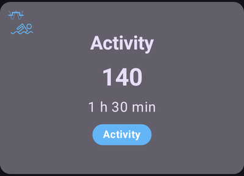
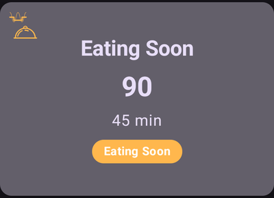
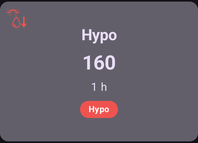
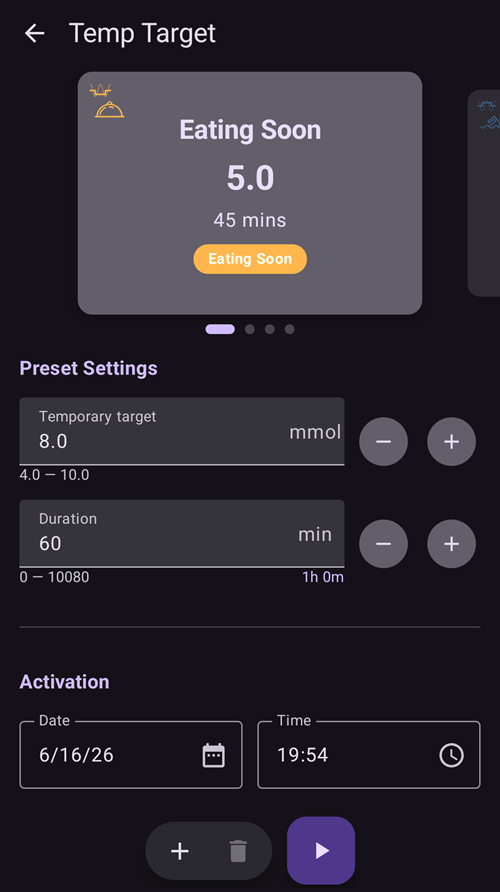
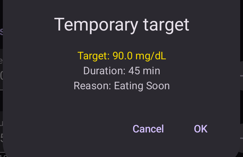
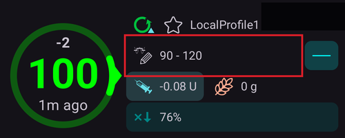
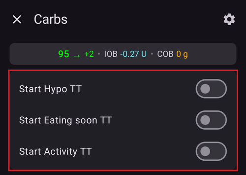
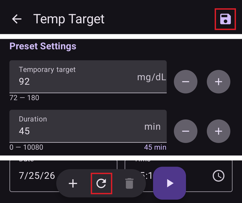
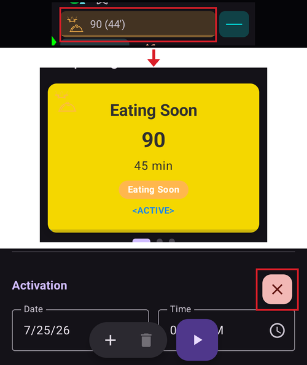
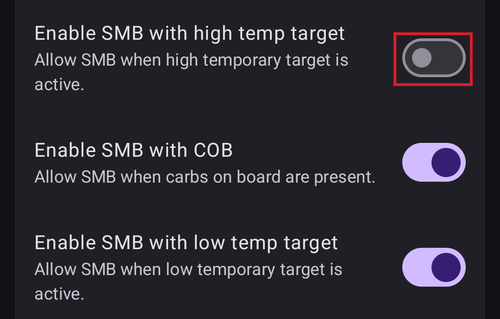

# Temp-Targets

## What are Temp-Targets and where can I set and configure them?
A **Temp-Target** (or short **TT**) is an **AAPS** feature that allows the user to alter their [**BG** target range](#profile-glucose-targets) for planned activities. This is achieved by **AAPS** manipulating the user’s insulin usage. 

A glucose target, particularly if it is only short-term (less than 4 hours in duration), does not need to be the *actual value* you expect or want your glucose level to get to, rather, it is a good way to tell **AAPS** to be more or less aggressive, while still keeping your glucose levels in range.

Temporary targets can be defined within those boundaries :

|         | Temporary target       |
|---------|------------------------|
| Minimum | 4 mmol/L or 72 mg/dL     |
| Maximum | 10 mmol/L or 180 mg/dL |

**AAPS** provides three built-in **Temp-Target** presets suitable for exercise (**Activity**), meals (**Eating Soon**) and predicted hypoglycemia (**Hypo**). They live on the **Temp Target** screen (**Manage** → **Temp Target**), which you can also open by simply tapping the **target chip** on the main screen.

Users should have realistic expectations on the results that can be achieved when selecting a **Temp-Target** in **AAPS**. The success of attaining a desired **BG** target will vary depending on a multiple factors ranging from: the reliability of the user’s **AAPS** settings, overall **BG** control, **IOB**, insulin sensitivity, insulin resistance, level of exertion undertaken during the exercise and so forth. 

A **Temp-Target** can take approximately 30 minutes or longer in order to attain a desired **BG** target. It is impossible for **AAPS** to achieve a **BG** target with immediate effect and users should be mindful of this when selecting a **Temp-Target**. 

The sections below summarize the features of **Temp-Target- Activity**, **Temp-Target- Eating soon**,  and **Temp-Target-Hypo**. The values shown are the shipped defaults — you can [adjust each preset](#TempTargets-change-preset-defaults) to your own needs.

### TT - Activity



**BG Target (default preset, adjustable)**

AAPS will aim to reach 140 mg/dL or 7.8 mmol/L for 1 h 30 min

**Other considerations users may wish to factor in when selecting**:

Depending on **BG** level, **AAPS** will "decrease" insulin usage in order to reach **BG** target. If **BG** target is not within range (i.e. above the users **Profile's** selected **BG** target), then **AAPS** may keep the basal on.

In closed loop mode, **SMB**:

- *may be* deactivated (discussed further below); and/or
- basal may be activated if **AAPS** is in negative **IOB** or <0.

Users may also wish to consider:

- *selecting* this **TT** 1-2 hours before the planned exercise to ensure reduced IOB (the correct timing for this TT will vary person to person); and
- *selecting* a temporary Profile (decrease) for the duration of the planned activity to ensure reduced **IOB**;
- *ensuring* **TT** is timed to be *deactivated* shortly before the exercise as reduced **IOB** as some users experience a rapid rise in **BG **post exercise.

### TT - Eating soon



**BG Target (default preset, adjustable)**

AAPS will aim to reach 90 mg/dL or 5.0 mmol/L for 45 minutes

**Other considerations users may wish to factor in when selecting**:

In closed loop mode, **SMB**:

- will remain activated; and/or
- basal may be also activated depending on the user's **Profile's** settings.

Depending on **BG** level, **AAPS** will "increase" insulin usage within the user's **AAPS** setting parameters in order to achieve the desired **BG** target.

### TT - Hypo



**BG Target (default preset, adjustable)**

AAPS will aim to reach 160 mg/dL or 8.9 mmol/L for 1 hour

**Other considerations users may wish to factor in when selecting**:

In closed loop mode, **SMB**:

- *may be* deactivated (discussed further below); and/or
- basal may be activated if **AAPS** is in negative **IOB** or <0.

(TempTargets-manage-v4)=
## Setting and managing temporary targets (Manage → Temp Target)

In **AAPS** v4 you manage your TT **presets** and start a temporary target from the **Manage** screen (bottom navigation) → **Temp Target** (*“Manage and set temporary targets”*).



The screen has three parts:

1. **Preset carousel** (top) — swipe through your TT presets. Each card shows the preset's **name**, **target** and **duration**; the currently running TT is highlighted.
2. **Editor** (middle) — the **Temporary target** and **Duration** that will actually be applied, plus an **Activation** date/time.
3. **Action bar** (bottom) — **➕ add**, **🗑️ delete** and the **▶ activate** button.

Selecting a preset card loads its **target** and **duration** into the editor.

```{admonition} Built-in vs custom presets
:class: note
The built-in presets — **Eating Soon**, **Activity** and **Hypo** — always exist and **cannot be deleted** (you can change their values and save, though). Any presets you create yourself are **custom** and can be edited or deleted freely.
```

### Activating a temporary target

Swipe to the preset you want (its values load into the editor), optionally adjust the **target**/**duration** in the editor, then tap **▶ Activate**. A confirmation shows the exact target, duration and reason before anything starts:



After you confirm, the temporary target starts immediately (or at the chosen **Activation** time) and runs for the set **duration**.

```{admonition} Editing the numbers is a one-off — it does not change the preset
:class: important
The **target** and **duration** in the editor are the values **Activate** will use *right now*. If you change them, that change is **temporary**: it applies only to this activation and **does not modify the saved preset**. This lets you "tweak and activate" a one-off TT (for example activate *Activity* at a slightly different target today) without permanently altering the preset.
```

### Saving changes to a preset

If you *do* want to keep an edited value, **Save** it: when the editor differs from the selected preset, a **Save** icon appears in the top toolbar. Tapping it stores the current **target** and **duration** (and name, for custom presets) back into the selected preset.

So the rule of thumb is:

- **Activate** → use the numbers **once** (preset unchanged).
- **Save** → make the numbers the preset's **new defaults**.

To put a built-in preset back the way it shipped, select it and tap the **↺ Revert** button — it appears in the action bar only for a **built-in** preset whose values currently differ from its factory defaults, and it restores that preset's original **target** and **duration**.

### Adding and removing presets

- **➕ Add** — create a **new custom preset** from the current editor values. The new card appears in the carousel.
- **🗑️ Delete** — remove the selected **custom** preset. Built-in presets (*Eating Soon*, *Activity*, *Hypo*) cannot be deleted.

Once you have at least two **custom** presets, you can also change their order in the carousel: tap the **⋮** menu in the top bar and choose **Reorder**, step the centred card with the **◀ / ▶ move buttons**, then confirm with **✓**. The built-in presets keep their places — only custom presets can be moved. (The controls look the same as [reordering profiles](ProfileSwitch-ProfilePercentage.md).)

Your presets are part of the synced configuration, so they are shared across your master and paired clients.

### Other ways to set a temporary target

A temporary target can also be set without opening this screen:

- with the **TT toggles in the Carbs dialog** — see [below](#TempTargets-carbs-dialog),
- with a **preset button on the [QuickLaunch toolbar](QuickLaunch.md)** — the *Temp Target Presets* category in *Configure QuickLaunch* offers a one-tap button for each of your presets,
- from a **Wear OS watch** (the **Temp Target** menu item / tile),
- from a paired **client** — see [Master ↔ Client control](../RemoteFeatures/ClientMasterControl.md),
- as part of a **[scene](Scenes.md)** (the *Temporary target* action), or
- from an **Automation** rule (*Start temp target* / *Stop temp target*).

---

(TempTargets-where-can-i-select-a-temp-target)=
## Where can I select a Temp-Target?

The quickest way is to tap the **target chip** on the main screen (it shows your current target range):



This opens the **Temp Target** screen described above — swipe to a preset and tap **▶ Activate**. The same screen is also reachable via **Manage** → **Temp Target**.

(TempTargets-carbs-dialog)=
When entering carbs, you don't need to open the **Temp Target** screen at all: the **Carbs dialog** (**Treatments** → **Carbs**) has **Start Hypo TT**, **Start Eating soon TT** and **Start Activity TT** toggles at the top. Switch one on and the corresponding preset is activated together with the carb entry:



```{admonition} Automatic Hypo TT
:class: note
If you open the **Carbs dialog** while your glucose is below 72 mg/dL (4 mmol/L), **AAPS** pre-selects the **Start Hypo TT** toggle for you (unless a higher temporary target with a longer remaining duration is already running).
```

(TempTargets-change-preset-defaults)=
## Where can I change the default Temp-Target and override with my own preferences?

Each preset's **target** and **duration** are edited directly on the **Temp Target** screen — there is no separate preferences entry for this anymore:

1. Open the **Temp Target** screen (tap the target chip, or **Manage** → **Temp Target**).
2. Swipe to the preset you want to change.
3. Adjust **Temporary target** and/or **Duration** in the editor.
4. Tap the **Save** icon that appears in the top toolbar.



While the editor differs from a built-in preset's factory values, a **↺ Revert** button also appears in the action bar — tap it to restore the preset's original target and duration.

## How do I cancel a Temp-Target?

While a temporary target is running, the target chip on the main screen shows the target and its remaining time. Tap it — on the **Temp Target** screen the running preset is highlighted as **ACTIVE**, and a red **✗ Cancel** button appears. Tap it and confirm:



A running temporary target can also be stopped from a **Wear OS watch**, from a paired **client**, or by an **Automation** rule (*Stop temp target*).

(TempTargets-hypo-temp-target)=
## Hypo Temp-Target

**Temp-Target Hypo** enables **AAPS** to prevent the user from experiencing low blood sugar by reducing insulin intake. If the user predicts their **BG** will go low: usually, **AAPS** should handle it, but much will depend on the stability of the user’s **AAPS'** settings. A **Temp-Target Hypo** enables the user to get ahead of the predicted low and update **AAPS** to reduce insulin.

Sometimes when hypo-treated carbs are eaten, the user's **BG** can rapidly rise, and **AAPS** will correct against the fast rising **BG** by enabling **SMBs**. 

Some users wish to avoid **SMBs** being given during **Temp-Target Hypo**. This is achieved by deactivating _'Enable SMB with high temp target'_ in **Settings** → **OpenAPS SMB** (see further below):

- In (Advanced, objective 9): the user can enable _“High temp target raises sensitivity”_ for **Temp-Targets** of 100 mg/dL or 5.5 mmol/L or higher in OpenAPS SMB, **AAPS** will be more sensitive.

- In (Advanced, objective 9): the user can deactivate _“Enable SMB with high temp target”_, so that even if **AAPS** has COB > 0, “Enable SMB with low temp target” or “Enable SMB always” enabled and OpenAPS SMB active, **AAPS** will not give SMBs while high temp targets are active.

Note: if you open the **Carbs dialog** while your blood glucose is less than 72 mg/dL or 4 mmol/L, **AAPS** pre-selects the **Start Hypo TT** toggle automatically.

(TempTargets-activity-temp-target)=
## Activity Temp-Target

Before and during exercise, the user may require a higher target to prevent hypoglycemia during the activity.

To simplify **Temp-Target Activity**, the user can configure a default **Temp-Target - Activity** to raise **BG** levels by reducing insulin usage in order to slow down **BG** fall and avoid hypoglycemia. 

New users to **AAPS** may need to experiment and personalize their **Temp-Target Activity** default settings in order to optimize this feature to work best for them. Everyone is different when it comes to attaining stable BG control during exercise. See also the [sports section in FAQ](#FAQ-sports).

Some users also prefer to activate a **Profile switch** (being a Profile decrease < 100% to reduced insulin delivery by **AAPS**) before and while **Temp-Target Activity** is on. 

Advanced, objective 9: users can enable _'High temp target raises sensitivity'_ for **Temp-Targets** higher than or equal to 100 mg/dL or 5.5 mmol/L in OpenAPS **SMB**. Then **AAPS** is more sensitive. 

Additionally, if _'Enable SMB with high temp target'_ is deactivated, **AAPS** will not deliver **SMBs**, even with COB > 0, _'Enable SMB with low temp target'_ or _'Enable SMB always'_ enabled and OpenAPS **SMB** active.

(TempTargets-eating-soon-temp-target)=
## Eating soon Temp-Target

**Temp-Target -Eating soon** can help accomplish a gentle drive down of **BG** and ensure there is ample **IOB** before eating. 

This can be an important tool for those users who do not pre bolus, however the efficacy of **Temp-Target -Eating soon** will depend on a number of factors including: the user’s settings, if they eat a low carb diet and whether they are using a fast acting insulin (like Fiasp or Lyjumjev) in order to eliminate the need to pre bolus. Ordinarily, until users are experienced in **AAPS** they should expect to pre bolus when using **Temp-Target -Eating soon**  and this is particularly so, if eating a high carb diet.

You can read more about the “Eating soon mode” in the article ['How to do “eating soon” mode'](https://diyps.org/2015/03/26/how-to-do-eating-soon-mode-diyps-lessons-learned/) or [here](https://diyps.org/tag/eating-soon-mode/).

Advanced, [objective 9](#objectives-objective9): If you use OpenAPS SMB and have _'Low temp target lowers sensitivity'_, **AAPS** works a little bit more aggressively. For this option there is a requirement for **Temp-Target** to be less than 100 mg/dL or 5.5 mmol/L.

## How do I turn off SMB during Temp-Targets?

To action this open **Settings** → **OpenAPS SMB** and deactivate _'Enable SMB with high temp target'_.



This will ensure **AAPS** will not give **SMBs**, even with COB > 0, _'Enable SMB with low temp target'_ or _'Enable SMB always'_ enabled and OpenAPS SMB active.
