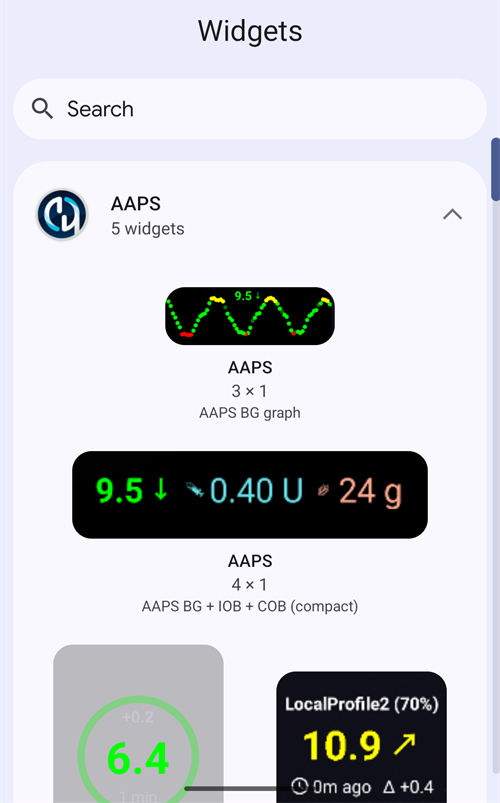
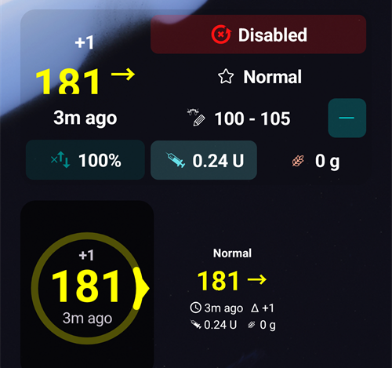
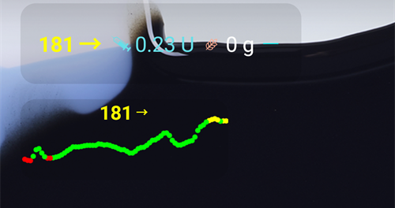
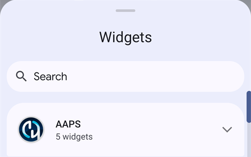
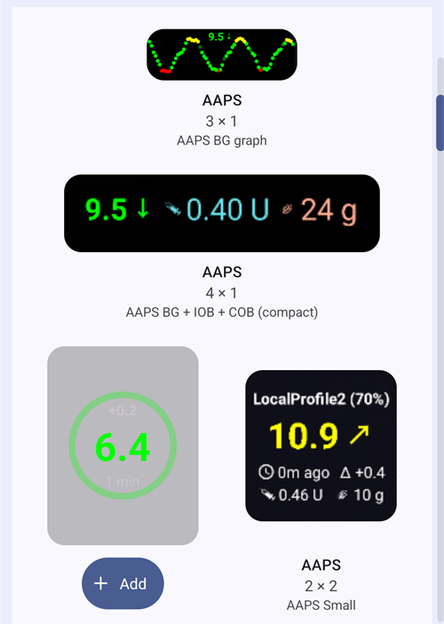
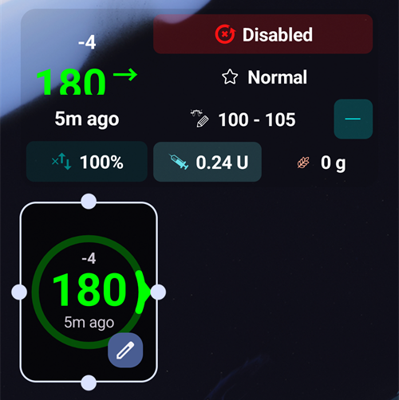
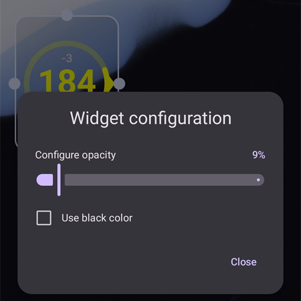

(widgets)=
# Home screen widgets

**AAPS** provides widgets that you can add to your phone's home screen. A widget shows your current data without opening the app. Tap a widget to open **AAPS**.

```{contents} Table of contents
:depth: 2
:local: true
```

---

## Available widgets

Five widgets are available. They are listed under **AAPS** in the Android widget picker:



| Widget | Default size | What it shows |
|---|---|---|
| **AAPS widget** | 5 × 2 | The status block of the main screen: BG with trend and delta, loop mode, profile, target, sensitivity, IOB and COB. |
| **AAPS glucose circle** | 2 × 2 | The BG circle of the main screen: a ring in the BG colour, the trend arc, the delta, the BG value and the time since the last reading. |
| **AAPS Small** | 2 × 2 | Profile name, BG with trend arrow, time since the last reading, delta, IOB and COB. |
| **AAPS BG + IOB + COB (compact)** | 4 × 1 | One line with BG and trend arrow, IOB and COB. |
| **AAPS BG graph** | 3 × 1 | The BG value with a small graph of the recent readings. |

The **AAPS widget**, the **glucose circle** and the **Small** widget on a home screen:



The **compact** widget and the **BG graph** widget:



BG values use the same colours as in **AAPS**: green in range, yellow above range, red below range.

---

## Adding a widget

The exact steps depend on your phone and its launcher. On most phones:

1. Long-press an empty area of the home screen and select **Widgets**.

   

2. Open **AAPS** in the list and tap the widget you want.
3. Press **Add** (or drag the widget to the place you want).

   

The widget is placed on the home screen. Right after adding it, it is shown with handles: drag a handle to **resize** the widget, or drag the widget to move it. The glucose circle can be resized to any size.



If the home screen page is full, the phone puts the widget on a new page.

---

## Widget configuration

Tap the **pencil** button shown on the widget just after you added it. Later, long-press the widget to get the handles and the pencil back.

The **Widget configuration** dialog has two settings:

- **Configure opacity** — how opaque the background of the widget is. A low value lets the wallpaper show through.
- **Use black color** — use a black background instead of the default one.



Each widget has its own configuration.

---

## Good to know

- A widget only **displays** data. You cannot bolus or change anything from a widget.
- The widget is refreshed by **AAPS**. If **AAPS** is not running, or if Android restricts it in the background, the widget may show old data. Check the time since the last reading, and make sure **AAPS** is excluded from [battery optimization](#SetupWizard-StoragePermission).
- With **AAPSClient**, the widget has a different background colour so that you can tell the apps apart — see [About AAPSClient and AAPSClient2](#remotecontrol-aapsclient-versions).
