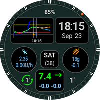
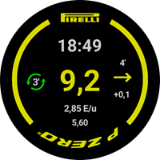
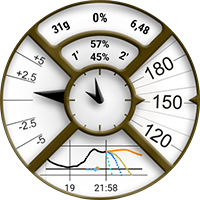

# Exchange site for custom watchfaces

Here you can download Zip-Files with custom watchfaces users have prepared and want to share with you.

The Zip-Files can be uploaded in the folder "**[_static/ExchangeSiteCustomWatchfaces](https://github.com/openaps/AndroidAPSdocs/tree/master/docs/_static/ExchangeSiteCustomWatchfaces)**" via a Pull Request into GitHub as usual.

During merge of the pull request the documentation team will extract the CustomWatchface.png file and prefix it with the filename of the Zip-file, and add it to the list below.

|                                                              |                                                              |                                                              |
| :----------------------------------------------------------: | :----------------------------------------------------------: | :----------------------------------------------------------: |
| [  **AAPS V2**](https://github.com/openaps/AndroidAPSdocs/raw/refs/heads/master/docs/_static/ExchangeSiteCustomWatchfaces/AAPS_V2.zip) | [  **AAPS**](https://github.com/openaps/AndroidAPSdocs/raw/refs/heads/master/docs/_static/ExchangeSiteCustomWatchfaces/AAPS.zip) | [  **AIMICO**](https://github.com/openaps/AndroidAPSdocs/raw/refs/heads/master/docs/_static/ExchangeSiteCustomWatchfaces/AIMICO-V1_1.zip) |
| [  **AAPS (BigChart)**](https://github.com/openaps/AndroidAPSdocs/raw/refs/heads/master/docs/_static/ExchangeSiteCustomWatchfaces/AAPS_BigChart.zip)* | [  **AAPS (Large)**](https://github.com/openaps/AndroidAPSdocs/raw/refs/heads/master/docs/_static/ExchangeSiteCustomWatchfaces/AAPS_Large.zip)* | [  **AAPS (NoChart)**](https://github.com/openaps/AndroidAPSdocs/raw/refs/heads/master/docs/_static/ExchangeSiteCustomWatchfaces/AAPS_NoChart.zip)* |
| [  **Analog G-Watch**](https://github.com/openaps/AndroidAPSdocs/raw/refs/heads/master/docs/_static/ExchangeSiteCustomWatchfaces/Analog_G-Watch.zip) | [  **AAPS (Cockpit)**](https://github.com/openaps/AndroidAPSdocs/raw/refs/heads/master/docs/_static/ExchangeSiteCustomWatchfaces/Cockpit.zip) | [  **Digital G-Watch**](https://github.com/openaps/AndroidAPSdocs/raw/refs/heads/master/docs/_static/ExchangeSiteCustomWatchfaces/Digital_G-Watch.zip) |
| [  **DigitalBigGraph**](https://github.com/openaps/AndroidAPSdocs/raw/refs/heads/master/docs/_static/ExchangeSiteCustomWatchfaces/DigitalBigGraph_v1.5.zip) | [  **Gears**](https://github.com/openaps/AndroidAPSdocs/raw/refs/heads/master/docs/_static/ExchangeSiteCustomWatchfaces/Gears.zip) | [  **Gota**](https://github.com/openaps/AndroidAPSdocs/raw/refs/heads/master/docs/_static/ExchangeSiteCustomWatchfaces/Gota_v2.4.zip) |
| [  **LuckyLoopKoeln**](https://github.com/openaps/AndroidAPSdocs/raw/refs/heads/master/docs/_static/ExchangeSiteCustomWatchfaces/LuckyLoopKoeln.zip) | [  **P-Zero watchface**](https://github.com/openaps/AndroidAPSdocs/raw/refs/heads/master/docs/_static/ExchangeSiteCustomWatchfaces/pzero_v1.0.zip) | [  **PinkFloydTheWall**](https://github.com/openaps/AndroidAPSdocs/raw/refs/heads/master/docs/_static/ExchangeSiteCustomWatchfaces/PinkFloydTheWall.zip) |
| [  **Robby watchface**](https://github.com/openaps/AndroidAPSdocs/raw/refs/heads/master/docs/_static/ExchangeSiteCustomWatchfaces/Robby_watchface.zip) | [  **SimpleDigital**](https://github.com/openaps/AndroidAPSdocs/raw/refs/heads/master/docs/_static/ExchangeSiteCustomWatchfaces/SimpleDigital_v1.3.zip) | [  **AAPS (SteamPunk)**](https://github.com/openaps/AndroidAPSdocs/raw/refs/heads/master/docs/_static/ExchangeSiteCustomWatchfaces/SteamPunk.zip) |
| [  **Blue Ring**](https://github.com/openaps/AndroidAPSdocs/raw/refs/heads/master/docs/_static/ExchangeSiteCustomWatchfaces/Blue_Ring.zip) |                                                              |                                                              |

*Requires Custom WatchFace V2 or above installed within Wear Watch (AAPS V3.3.0 or above)

