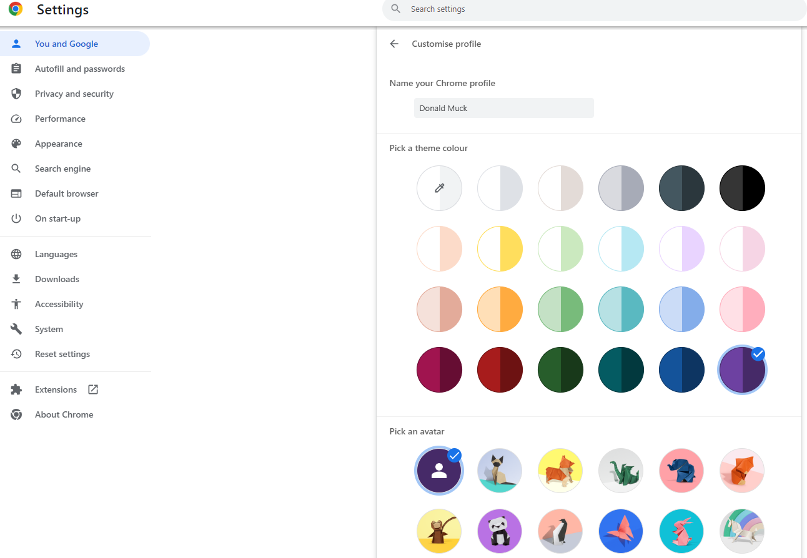

## How to set up a dedicated Google account for AAPS

#### Step-by-step guide to setting up a separate Google account and drive: 

In this example: 
- Your existing “_Everyday_” Google account is <donald.muck42@gmail.com>  using Gmail; 
- new “_AAPS_” email account will be: <donald.muck42.aaps@gmail.com>; 

Either follow thIS step-by-step guide OR watch the video: <https://youtu.be/ohdY7ob0E1g> 

Things to consider:

- You could use a name different from your own name that has relevance to the account (like t1dsuperstar) for privacy reasons. That way you can use it in AAPS public forums as well while keeping your own identity private. Since Google requires a recovery email and phone number, it is still traceable.
- The new “_AAPS_” account will use the same phone number for verification as your “_everyday_” one. It will use the “everyday” email address for verification;
- We will setup email forwarding such that any email sent to the new dedicated AAPS account will be forwarded to the primary one (so there is no need to check two different mailboxes);
- Use separate passwords for your _everyday_ Gmail account and the AAPS-dedicated Gmail account
- If you use google “2-step verification” (aka multifactor) authentication for one Gmail account, you might as well do it for both Gmail accounts.
- If you plan to use Google “Passkeys”, make sure you register multiple devices. This is so you don’t lock yourself out. Only do it on devices that nobody else can access (ie: not on a PC with a shared account that other people can unlock).

 

#### Go <https://account.google.com> 

 If already logged into Google, the scenario below will redirect you to your “Everyday” **Myaccount** page. 
(1) Click on the top right of the page on your profile picture (in the case a simple  
(2) select “_add another account_”.

####  On the Gmail page enter your NEW dedicated account: 

- Enter the new account: 
- Create Account
- for my personal use. 

 #### Next enter your persona:
 - Enter firstname
 - lastname
 - birthdate (needs to be an Adult age)

#### Choose your NEW email address & password

This example appends “.AAPS” to Donald Muck’s existing one…\
Set a password

####  Enter a phone number which can receive Gmail’s SMS verification

Gmail will now send you a unique code to enter for validation.

#### Enter the recovery email address, 

In this case it will be your existing “_everyday_” email…

#### Finishing up the account.

Gmail will display the account name, 

it will ask you to accept Gmail’s terms and conditions & confirm your personalization settings

#### Customizing the new profile.

At this point you should be on Gmail’s MyAccount page showing your new AAPS dedicated email account… The profile picture will be set by default to the first letter of your name. Change it to something unique to avoid confusion… in this Donald.Muck.AAPS has replaced  with 

\

#### Configuring the new Gmail account

So that you don’t need to monitor a separate email account, forward all the emails from the new dedicated AAPS’ account to your everyday account \
This part can be a bit confusing since you will have to switch back and forth between both accounts. In order to make it a bit easier, open 2 separate browser windows on top of each other:

1. Move your existing browser to the top of your screen and resize it such that it only takes about half of the top of the screen… 
2. Right click on your Browser logo in your taskbar 
3. From the menu select “New Window”... and adjust it so it only takes the bottom half of the screen.

<!---->

#### Open the Gmail website on both windows

Open <https://gmail.com>  in each browser window and make sure Donald Muck’s personal account is on top and the new dedicated **AAPS** account is on the bottom of the screen, and is easily identifiable by the profile picture in the top right corner. (if needed you can always switch accounts by clicking on the profile picture and selecting the proper one like you did earlier in step 6)

Your Gmail homepages  screen should look like this:\

 #### In the new Gmail account (bottom window) open Gmail settings… 

- Click on the gear on the left of the profile picture 
- then select “**See all Settings**”

#### Setup forwarding…

- Click on the “Forwarding and POP/IMAP” Setting tab
- Click on “add a forwarding address”
- Add your “everyday” email address
- Gmail will send a verification code to your “everyday” email address. 
- You will switch back to your everyday profile and click on the link to verify that you accept the forwarding (or get the code from Gmail’s verification email in your “everyday” gmail window and cut and paste it in your “new AAPS dedicated” gmail window… 

There is quite a bit of back and forth between the windows but this will ensure that when you check your “everyday” account emails you will also see the emails forwarded from your AAPS dedicated account such as Gmail alerts…  

#### Verify the forwarded email address…

- In the “Everyday” gmail (top window), you will get the “Gmail forwarding Confirmation” email. 
- Open it and “click the link to confirm the request”

#### Finally archive forwarded emails in the new dedicated account gmail(bottom window)

<!---->

1. Refresh the bottom window
2. Check “forward incoming email”
3. And archive Gmail’s copy (to keep your new dedicated mailbox clean)
4. Scroll all the way to the bottom to save your changes\
   

Now you have created a secondary Gmail account dedicated to **AAPS**\*. You will use it to safely store key information in its dedicated google drive later. 
