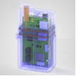
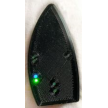

# Compatible Pumps

AAPS works with a number of insulin pumps.  The following list shows the currently supported devices and indicates if AAPS communicates with the pump using your phone's native Bluetooth function or if it requires a Rileylink Compatible device in brackets.

<!-- List of hidden pages to avoid overcrowding the menu -->

```{toctree}
:hidden:

../CompatiblePumps/Accu-Chek-Combo-Pump-v2.md
../CompatiblePumps/Accu-Chek-Combo-Tips-for-Basic-usage.md
../CompatiblePumps/Accu-Chek-Insight-Pump.md
../CompatiblePumps/DanaR-Insulin-Pump.md
../CompatiblePumps/DanaRS-Insulin-Pump.md
../CompatiblePumps/DiaconnG8.md
../CompatiblePumps/EOPatch2.md
../CompatiblePumps/Equil5.3.md
../CompatiblePumps/MedtronicPump.md
../CompatiblePumps/MedtrumNano.md
../CompatiblePumps/OmnipodDASH.md
../CompatiblePumps/OmnipodEros.md
../CompatiblePumps/Future-possible-Pump-Drivers.md
```

- [Accu-Chek Combo](../CompatiblePumps/Accu-Chek-Combo-Pump-v2.md) (Bluetooth; see also [Accu-Chek Combo Tips for Basic usage](../CompatiblePumps/Accu-Chek-Combo-Tips-for-Basic-usage.md))
- [Accu-Chek Insight](../CompatiblePumps/Accu-Chek-Insight-Pump.md) (Bluetooth)
- [DanaR](../CompatiblePumps/DanaR-Insulin-Pump.md) (Bluetooth)
- [DanaRS](../CompatiblePumps/DanaRS-Insulin-Pump.md) (Bluetooth)
- [Dana-i](../CompatiblePumps/DanaRS-Insulin-Pump.md) (Bluetooth)
- [Diaconn G8 ](../CompatiblePumps/DiaconnG8.md)  (Bluetooth)
- [EOPatch2](../CompatiblePumps/EOPatch2.md) (Bluetooth)
- [Omnipod Eros](../CompatiblePumps/OmnipodEros.md)  ([additional communication device](#CompatiblePumps-additional-communication-device) needed)
- [Omnipod DASH](../CompatiblePumps/OmnipodDASH.md)  (Bluetooth)
- [Medtrum Nano](../CompatiblePumps/MedtrumNano.md)  (Bluetooth)
- [Medtrum 300U](../CompatiblePumps/MedtrumNano.md)  (Bluetooth)
- [Equil 5.3](../CompatiblePumps/Equil5.3.md) (Bluetooth)
- Certain older [Medtronic](../CompatiblePumps/MedtronicPump.md) ([additional communication device](#CompatiblePumps-additional-communication-device) needed)

## My pump is not listed

Details of the status of other pumps that may have the potential to work with AAPS are listed on the [Future (possible) Pumps](../CompatiblePumps/Future-possible-Pump-Drivers.md) page.

(CompatiblePumps-additional-communication-device)=
## Additional communication device

If no additional communication device is mentioned, the communication between insulin pump and **AAPS** is based on the integrated bluetooth stack of Android, without the need of an additional communication device to translate the communication protocol.

For old Medtronic pumps and Omnipod Eros, an additional communication device (besides your phone) is needed to "translate" the radio signal from pump to bluetooth. Make sure to choose the correct version depending on your pump.

-   [OrangeLink Website](https://getrileylink.org/product/orangelink)
-  [433MHz RileyLink](https://getrileylink.org/product/rileylink433)
-   [Emalink Website](https://github.com/sks01/EmaLink) - [Contact Info](mailto:getemalink@gmail.com)
-   DiaLink - [Contact Info](mailto:Boshetyn@ukr.net)
-   [LoopLink Website](https://www.getlooplink.org/) - [Contact Info](https://jameswedding.substack.com/) - Untested