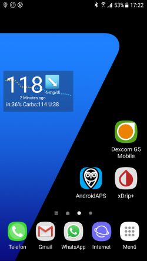

# Sample setup: Samsung S7, DanaR, Dexcom G5 and Sony Smartwatch

## Description

In this setup, the Samsung Galaxy S7 smartphone is used as control center of the loop. The slightly modified Dexcom App reads glucose values from the Dexcom G5 CGM. AndroidAPS is used to control the Dana R insulin pump from Korean manufacturer SOOIL via bluetooth. Further devices are not required.

As the Dexcom App offers only limited alarm options the open source app xDrip+ is used to define not only high and low alarms but also additional alarms according to individual requirements.

Optional an Android wear smartwatch can be used (in this sample setup the Sony Smartwatch 3 (SWR50)) to display glucose and AndroidAPS values at your wrist. The watch can even be used to control AndroidAPS (i.e. discreetly set a meal bolus).

The system works offline. This means there is no need for a data connection from the smartphone to the Internet for operation.

Nevertheless, the data is automatically uploaded to Nightscout "in the cloud" when a data connection is established. By doing so you can provide comprehensive reports for the doctor's visit or share the current values with family members at any time. It is also possible to send data to Nightscout only when using a (predefined) wifi connection in order to profit from the different Nightscout reports.

## Required components

1. Samsung Galaxy S7
 * Alternatives: see [list of tested phones and watches](https://docs.google.com/spreadsheets/d/1gZAsN6f0gv6tkgy9EBsYl0BQNhna0RDqA9QGycAqCQc/edit#gid=698881435) for AndroidAPS

2. [DanaR](http://www.sooil.com/eng/product/) or Dana RS insulin pump
 * Alternatives:  
   - [Accu-Chek Combo](../Configuration/Accu-Chek-Combo-Pump.md)
   - Other pumps might be available in the future, see [future possible pump drivers](Future-possible-Pump-Drivers.md) for details.

3. [Dexcom G5](https://dexcom.com)
 * Alternatives: see list of possible [BG sources](../Configuration/BG-Source.md)
   
4. Optional: Sony Smartwatch 3 (SWR50)
 * Alternatives: see [list of tested phones and watches](https://docs.google.com/spreadsheets/d/1gZAsN6f0gv6tkgy9EBsYl0BQNhna0RDqA9QGycAqCQc/edit#gid=698881435) for AndroidAPS (OS must be Anroid Wear)

## Nightscout setup
See detailed [Nightscout setup](../Installing-AndroidAPS/Nightscout.md)

## Computer setup
To be able to create an Android app from the freely available AAPS open source code you need Android Studio on your computer or notebook (Windows, Mac, Linux). A detailed instruction can be found at [building the APK](../Installing-AndroidAPS/Building-APK.md).

Please be patient when installing AndroidStudio as the software downloads a lot of additional data once installed on your computer.

## Smartphone setup

### Check smartphone firmware
* Menu > Preferences > Phone info > Software info: At least "Android-Version 7.0" (successfully tested up to Android version 8.0.0 Oreo - Samsung Experience Versoin 9.0)  
* For firmware update: menu > Preferences > software update

### Allow installation from unknown sources
Menu > Preferences > Device security > Unknown sources > slider to right side (= active)

For security reasons this setting should be set back to inactive once the installation of all apps described here has been completed.

### Enable Bluetooth
Menu > Preferences > Connections > Bluetooth > slider to right side (= active)

### Install Dexcom App (modified version)
  

The original Dexcom app from the Google Play Store will not work because it does not broadcast the values to other apps. Therefore, a version slightly modified by the community is required. Only this modified Dexcom app can communicate with AAPS.
Additionally the modified Dexcom App can be used with all Android smartphones not only the ones in [Dexcom's compatibility list](https://www.dexcom.com/dexcom-international-compatibility).
A mmol/l version and a mg/dl version of the modified Dexcom app are available at https://github.com/dexcomapp/dexcomapp?files=1. 

To do this perform the following steps on your smartphone:

1. If the original Dexcom app is already installed: 
 - Stop sensor
 - uninstall app via Menu > Preferences > Apps > Dexcom G5 Mobile > Uninstall
2. Download modified Dexcom app (check unit mg/dl or mmol/l according to your needs): [https://github.com/dexcomapp/dexcomapp?files=1](https://github.com/dexcomapp/dexcomapp?files=1)
3. Install modified Dexcom app on your smartphone(= select the downloaded APK file)
4. Start modified Dexcom app, activate/calibrate the sensor according to the given instructions and wait until the warm-up phase is finished.
5. Once the first two calibrations have been entered successfully and the modified Dexcom app shows actual glucose value setup the warnings (hamburger menu on top left side of the screen) as follows:
* Urgent low `55mg/dl` (cannot be disabled)
* Low `OFF`
* High `OFF`
* Rise rate `OFF`
* Fall rate `OFF`
* Signal loss `OFF`

## AAPS installieren

1. Auf dem wie oben beschrieben vorbereiteten Computer/Notebook [https://github.com/MilosKozak/AndroidAPS](https://github.com/MilosKozak/AndroidAPS) aufrufen
2. Branch "master" Version 1.58 auswählen (mit älteren Versionen geht es nicht)
3. Schaltfläche "Clone or download" > Download ZIP auswählen
4. Heruntergeladene ZIP-Datei in einem neuen Ordner entpacken
5. Android Studio auf dem Computer/Laptop starten
6. Der Anleitung unter [https://github.com/MilosKozak/AndroidAPS/wiki/APK-erstellen_de](https://github.com/MilosKozak/AndroidAPS/wiki/APK-erstellen_de) folgen
> Wichtig: Die Variante "fullRelease" verwenden!
7. Die erstellte *.apk-Datei auf das Smartphone laden / per E-Mail schicken und dort installieren
8. AAPS im Smartphone starten und folgende Einstellungen unter dem Menüpunkt **Konfigurations-Generator** (ehemals "Config Builder") vornehmen:
* Profil: je nach Wunsch
* Insulin: das verwendete Insulin auswählen
* BZ Quelle: `Dexcom G5 App (patched)`, dann auf das Zahnrädchen daneben, Upload BG data to NS `aktivieren`, Send BG data to xDrip+ `aktivieren`
* Pumpe: DanaR
* Empfindlichkeitserkennung: je nach Wunsch
* APS: je nach Wunsch
* Loop: aktivieren
* Beschränkungen: Zielsetzungen aktivieren
* Treatments: Behandlungen aktivieren
* Generell: Aktionen, Careportal, Laufende Benachrichtigungen jeweils aktivieren
* "Integrierter NSClient" aktivieren und im Zahnrädchen daneben: Nightscout URL = `https://DEINAPPNAME.herokuapp.com`, Nightscout API-Key = `DEINAPIKEY`, Aktiviere lokalen Broadcast = `aktivieren`, Alarm-Optionen > `alles deaktivieren`  

## xDrip+ installieren
xDrip+ ist eine weitere ausgereifte App, die unzählige Möglichkeiten bietet. Anders als von den Entwicklern eigentlich gedacht, wird xDrip+ aber bei dieser Methode nicht auch zum Sammeln der Glukosedaten vom Dexcom G5 verwendet, sondern nur, um Alarme auszugeben und auf dem Android-Homescreen im Widget den aktuellen Gluosewert samt Kurve anzuzeigen. Mit xDrip+ können die Alarme nämlich viel individueller eingestellt werden als mit der Dexcom-Software, AAPS oder Nightscout (keine Einschränkung bei der Auswahl der Sounds, verschiedene Alarme je nach Tages-/Nachtzeit etc.).

1. Letzte stabile apk-Version von xDrip+ mit dem Smartphone herunterladen unter [https://xdrip-plus-updates.appspot.com/stable/xdrip-plus-latest.apk](https://xdrip-plus-updates.appspot.com/stable/xdrip-plus-latest.apk) - nicht die Version aus dem GooglePlay-Store!

2. xDrip+ installieren, indem die heruntergeladene *.apk-Datei ausgewählt wird

3. xDrip+ starten und im Menü (drei waagerechte Striche links oben) folgende Einstellungen vornehmen:

* Einstellungen > Warnungen > Glukose-Alarm-Liste > Warnungen (niedrig) und (hoch) je nach Bedarf erstellen. Die bestehenden Alarme können mit einem langen Fingerdruck geändert werden
* Einstellungen > Kalibrierungs-Erinnerungen: deaktiviert (wird über die Dexcom-App erinnert)
* Einstellungen > Datenquelle > 640G/EverSense
* Einstellungen > Inter-App-Einstellungen > Accept Calibrations > AN
* Menü > Sensor starten (ist nur "pro forma" und hat nichts mit dem laufenden G5-Sensor zu tun. Dies ist nötig, da sonst regelmäßig eine Fehlermeldung kommt)

Beispiel für ein Alarm-Setup:
 

Der "< 55 mg/dl-Alarm" wird über die Dexcom-App ausgegeben, dies kann auch nicht abgeschaltet werden. 
> Tipp für Besprechungen / Kirchenbesuche / Kino etc.: Wenn im Samsung Galaxy S7 der "Nicht stören-Modus" aktiviert ist (Menü > Einstellungen > Töne und Vibration > Nicht stören: nach rechts schieben), dann vibriert das Smartphone bei dem nicht abschaltbaren Dexcom-Niedrigalarm nur und gibt keine akustische Warnung aus. Bei den übrigen, über xDrip+ eingerichteten Alarmen kann jeweils ausgewählt werden, ob der Lautlosmodus ignoriert werden soll oder nicht.

4. Auf dem Android Homescreen an eine freie Stelle lange drücken > Widgets > "xDrip+" auswählen, halten und an die gewünschte Stelle ziehen > loslassen

## Energiesparoptionen deaktivieren
Im Samsung Galaxy S7 auf Menü > Einstellungen > Gerätewartung > Akku > Nicht überwachte Apps > +Apps hinzufügen: Hier nacheinander die Apps AndroidAPS, Dexcom G5 Mobile, xDrip+ und ggf. AndroidWear auswählen (falls die Smartwatch verwendet wird)

## Optional: Sony Smartwatch 3 (SWR50) einrichten

 
Mit der Smartwatch lässt sich das Leben mit Diabetes noch viel unauffälliger gestalten. Über sie kann am Handgelenk jederzeit der aktuelle Glukosezucker, der Status der Loop etc. angezeigt werden und es können Bolusgaben vorgenommen werden. Dazu mit dem Finger auf dem AAPSv2-Ziffernblatt die linke obere Ecke doppelt antippen. Die SWR50 läuft in der Regel einen ganzen Tag, bis der Akku wieder aufgeladen werden muss (selbes Ladegerät wie das Samsung Galaxy S7: microUSB). 

Die Uhr wird wie folgt eingerichtet:

* Im Smartphone über das GooglePlay-Store die App "Android Wear" installieren und die SWR50 nach dortigen Anweisungen koppeln
* In AAPS im Smartphone: Config Builder > Generell > Wear > aktivieren und im Zahnrädchen daneben: Steuerung von der Uhr = aktiv
* In der Smartwatch: Einstellungen > Ziffernblatt ändern > AAPSv2
* Ggf. beide Geräte einmal neu starten

## Pumpe einrichten

siehe [Einrichtung DanaR für AAPS](https://github.com/MilosKozak/AndroidAPS/wiki/DanaR-Insulinpumpe_de)
