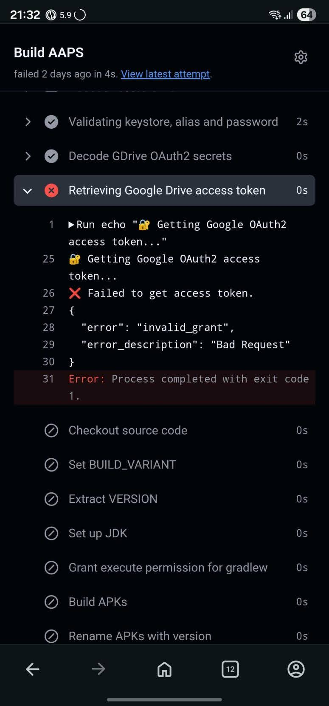
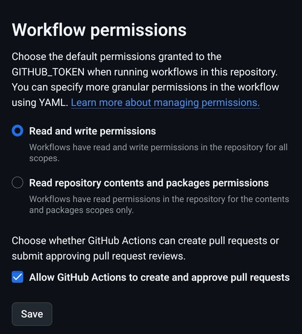

(aaps-ci-troubleshooting)=

# Browser build: troubleshooting

```{note}
This page collects troubleshooting tips for the [Browser build](../SettingUpAaps/BrowserBuild.md).
```

## AAPS-CI Troubleshooting

(aaps-ci-preparation-web)=
### aaps-ci-preparation web page
  - When you open aaps-ci-preparation.html using a file manager, it will start a temporary local server on your phone to display the webpage and receive the Google refresh token.
  - This local server times out after about 10 minutes. If you see the screen below, the file manager has already shut down the local server.
  - Close **both** the preparation page and the file manager app, then reopen aaps-ci-preparation.html from the file manager and complete the remaining steps. This is needed in particular when creating the initial Google connection during setup.

  

(aaps-ci-google-token-expired)=
### Google Refresh Token Expired
  - Google OAuth2 refresh tokens will expire if not used for 6 months, and may also become invalid under other conditions (e.g., you have changed your Google account password, or manually revoked access). For more details, see the [Google OAuth2 documentation](https://developers.google.com/identity/protocols/oauth2).
  - You will see an error indicating that the access token is invalid, as shown below:

  

  - If your build fails due to an expired or revoked Google refresh token, you will need to redo the [Google Drive Auth](#aaps-ci-google-drive-auth) steps to obtain a new `GDRIVE_OAUTH2` token and update the secret in your GitHub repository, then re-run the build workflow.

(aaps-ci-disable-software)=
### Disable Software That May Interfere With OAUTH Verification
  - Disable any VPN or security app (firewall, antimalware,...) on the phone before trying to get the OAUTH key.

(aaps-ci-actions-permission)=
### Check GitHub Actions Permission Settings
  - Make sure GitHub Actions policies are set to “Allow all actions and reusable workflows” (Settings → Actions → General).

  

`actions/checkout@v4` and `actions/setup-java@v4` are not allowed to be used in `xxxxx/AndroidAPS`.
 Actions in this workflow must be: within a repository owned by `xxxxx`

(aaps-ci-workflow-permissions)=
### Check GitHub Workflow Permissions Settings
  - If the build fails immediately with an "Invalid workflow file" error similar to the one below, the default workflow permissions of your repository are too restrictive:

```
Invalid workflow file
The workflow is not valid. .github/workflows/aaps-ci.yml (Line: 361, Col: 3):
Error calling workflow 'xxxxx/AndroidAPS/.github/workflows/cleanup-workflow-runs.yml@...'.
The nested job 'cleanup' is requesting 'actions: write', but is only allowed 'actions: none'.
```

  - Make sure Workflow permissions are set to “Read and write permissions” (Settings → Actions → General → Workflow permissions), then save and re-run the build workflow.

  
