(aaps-ci-troubleshooting)=

# Browser build: troubleshooting

```{note}
This page collects troubleshooting tips for the [Browser build](../SettingUpAaps/BrowserBuild.md).

Using **AAPS Builder**? Start with its own [troubleshooting section](#aaps-builder-troubleshooting). The Google Drive sections below also apply to it.
```

## AAPS-CI Troubleshooting

(aaps-ci-read-the-logs)=
### First: find out what went wrong

When a build fails, GitHub keeps a log of every step. The log tells you which step failed and why. Read it before you try anything else: the error message is what you look for on this page, and what helpers will ask for.

1. In your GitHub copy of AndroidAPS, open **Actions**. A failed build has a red cross. Tap its name.

   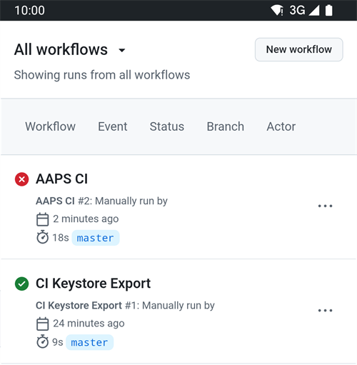

2. The run summary shows **Failure** and, below, the job that failed (**Build AAPS**, with a red cross).

   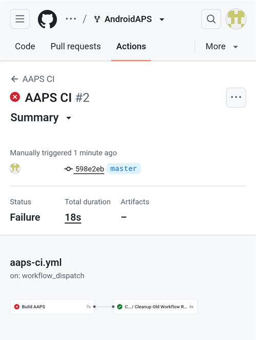

3. Scroll down to **Annotations** and tap the red **Build AAPS** line.

   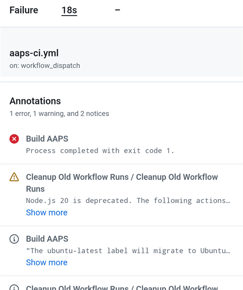

4. The job opens. Steps with a grey tick worked. The step with the red cross is the one that failed: GitHub opens it for you. The steps after it were skipped (grey circle).

   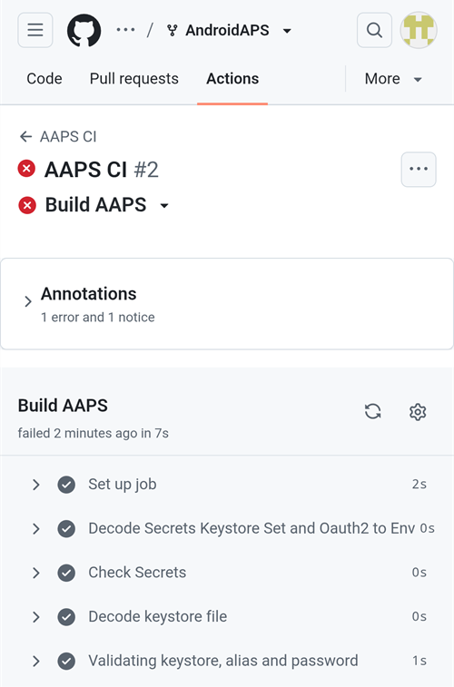

5. Read the lines just above `Error: Process completed with exit code 1.`: they explain the problem. In this example, the step **Retrieving Google Drive access token** failed with `invalid_grant` and `Token has been expired or revoked.`, see [Google Refresh Token Expired](#aaps-ci-google-token-expired).

   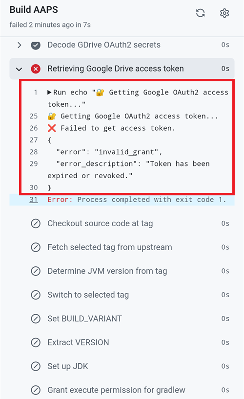

```{tip}
Asking for help? Share the name of the failed step and the error lines (a screenshot like the one above is fine). Never share the content of your secrets.
```

(aaps-ci-update-secret)=
#### Update a secret

Many fixes mean replacing the value of a secret. In your GitHub copy of AndroidAPS, go to **Settings** → **Secrets and variables** → **Actions** and tap the pencil next to the secret.

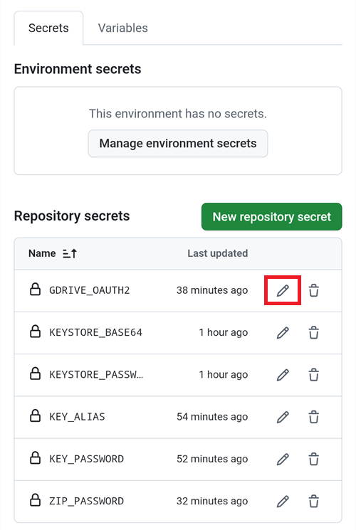

Enter or paste the new value and tap **Update secret**. GitHub never shows the old value: the field is always empty.

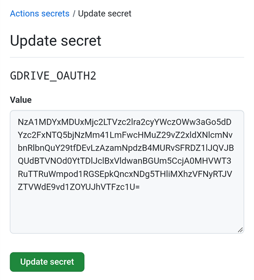

(aaps-ci-rerun)=
#### Run the build again after a fix

Once you have fixed the cause, you do not need to start from scratch: open the failed run, tap **...** (top right), then **Re-run failed jobs**.

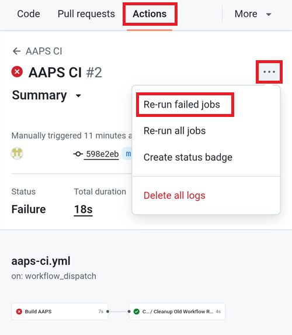

Tap **Re-run jobs**. You can also start a new build from **Run workflow** as usual.

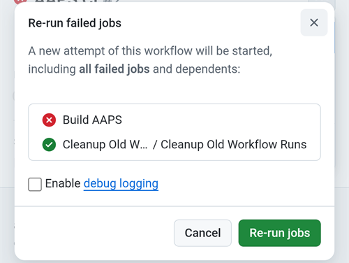

(aaps-ci-preparation-web)=
### aaps-ci-preparation web page
  - The preparation page is displayed by a temporary local server (for example Simple Web Server on a computer), which also receives the Google refresh token.
  - If you see the screen below, the local server has stopped or is not reachable.
  - Close the preparation page, check that the local server is running, then reopen aaps-ci-preparation.html the same way as in Step 2 and complete the remaining steps. This is needed in particular when creating the initial Google connection during setup.

  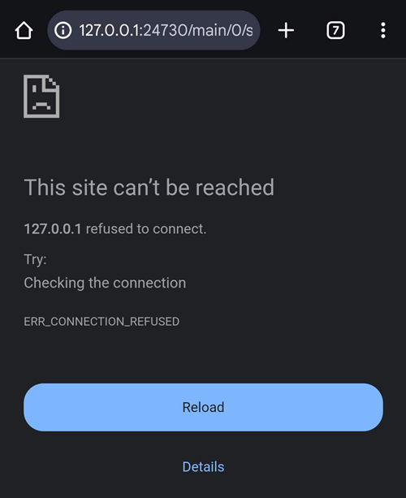

(aaps-ci-google-token-expired)=
### Google Refresh Token Expired
  - Google OAuth2 refresh tokens will expire if not used for 6 months, and may also become invalid under other conditions (e.g., you have changed your Google account password, or manually revoked access). For more details, see the [Google OAuth2 documentation](https://developers.google.com/identity/protocols/oauth2).
  - In the [build log](#aaps-ci-read-the-logs), the step **Retrieving Google Drive access token** fails with `invalid_grant` and `Token has been expired or revoked.`:

  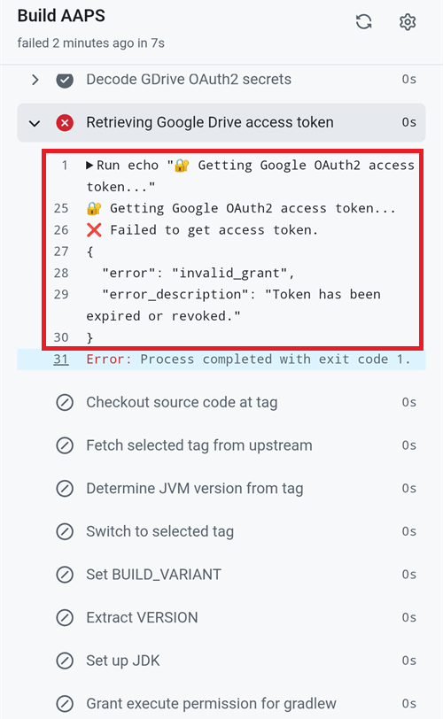

  - If your build fails due to an expired or revoked Google refresh token, you will need to redo the [Google Drive Auth](#aaps-ci-google-drive-auth) steps to obtain a new `GDRIVE_OAUTH2` token, [update the secret](#aaps-ci-update-secret) in your GitHub repository, then [re-run the build](#aaps-ci-rerun).
  - If the authorization fails again, or Google does not ask for your consent anymore, remove the existing AAPS access from your Google Account first, see [below](#aaps-ci-google-remove-access).

(aaps-ci-google-remove-access)=
### Remove AAPS Access From Your Google Account And Restart The Authorization
  - If the Google Drive authorization keeps failing, or you want to start again from a clean state, first remove the access you previously gave to AAPS, then redo the authorization.
  - On your phone, open [https://myaccount.google.com](https://myaccount.google.com), tap **Security**, scroll down to **Your connections to third-party apps & services** and open the list of linked apps. You can also go directly to [https://myaccount.google.com/connections](https://myaccount.google.com/connections).
  - Tap **AAPS** in the list.

  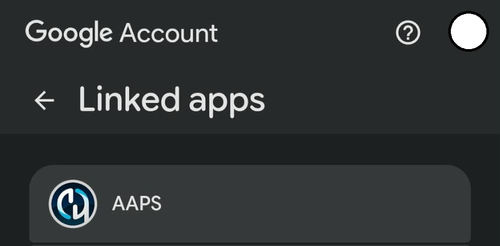

  - The page shows the access you gave to AAPS (the Google Drive files used with the app). Tap **Delete all** to remove the connection, or tap **See details** to review it first.

  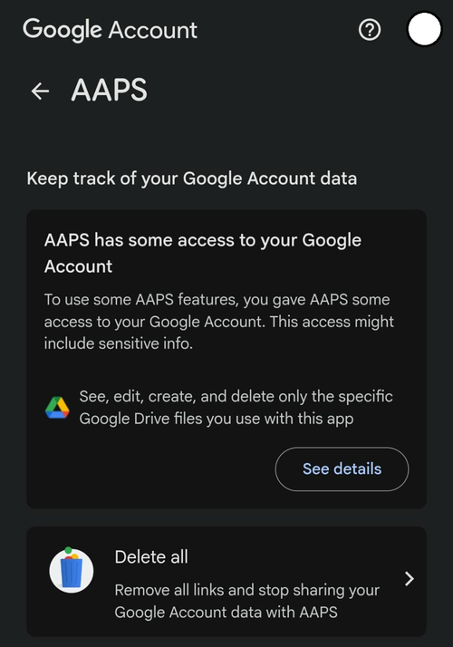

  - On the details page, tap **Remove all access**.

  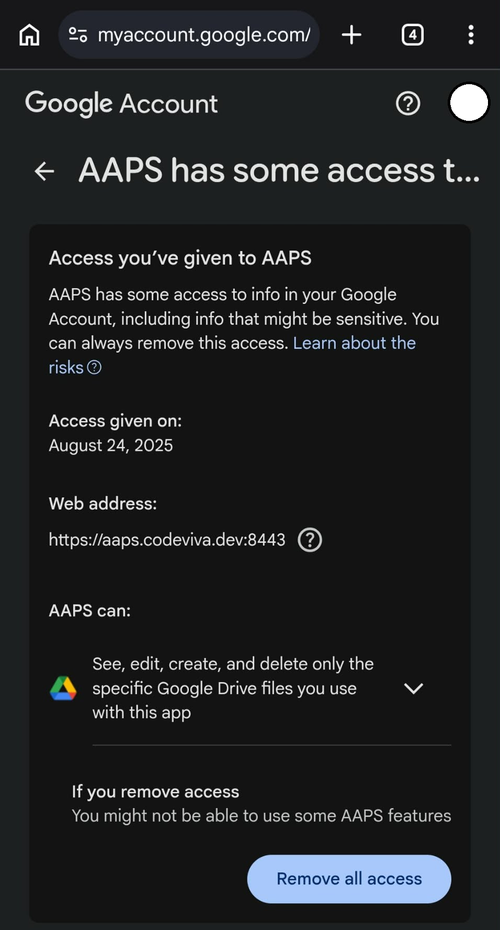

  - Tap **Confirm**.

  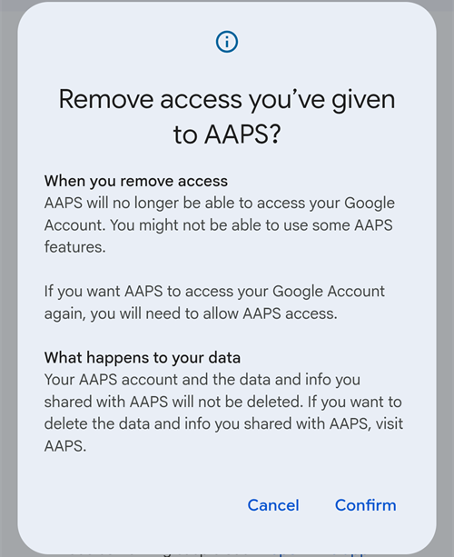

  - Google confirms that AAPS no longer has access. AAPS no longer appears in the list of linked apps.

  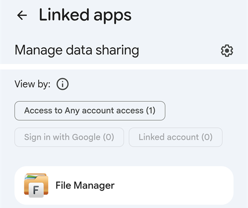

  - Now restart the authorization cleanly: close **both** the preparation page and the file manager app, reopen aaps-ci-preparation.html from the file manager and redo the [Google Drive Auth](#aaps-ci-google-drive-auth) steps. Google will ask you to grant access again and the page will provide a new `GDRIVE_OAUTH2` token.
  - [Update the `GDRIVE_OAUTH2` secret](#aaps-ci-update-secret) in your GitHub repository with the new token, then [re-run the build](#aaps-ci-rerun).

(aaps-ci-disable-software)=
### Disable Software That May Interfere With OAUTH Verification
  - Disable any VPN or security app (firewall, antimalware,...) on the phone before trying to get the OAUTH key.

(aaps-ci-actions-permission)=
### Check GitHub Actions Permission Settings
  - Make sure GitHub Actions policies are set to “Allow all actions and reusable workflows” (Settings → Actions → General).

  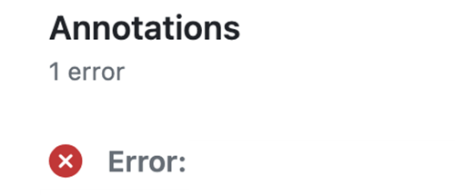

`actions/checkout@v4` and `actions/setup-java@v4` are not allowed to be used in `xxxxx/AndroidAPS`.
 Actions in this workflow must be: within a repository owned by `xxxxx`

(aaps-ci-workflow-permissions)=
### Check GitHub Workflow Permissions Settings
  - If the build fails immediately with an "Invalid workflow file" error similar to the one below, the default workflow permissions of your repository are too restrictive:

```
Invalid workflow file
The workflow is not valid. .github/workflows/aaps-ci.yml (Line: 361, Col: 3):
Error calling workflow 'xxxxx/AndroidAPS/.github/workflows/cleanup-workflow-runs.yml@...'.
The nested job 'cleanup' is requesting 'actions: write', but is only allowed 'actions: none'.
```

  - Make sure Workflow permissions are set to “Read and write permissions” (Settings → Actions → General → Workflow permissions), then save and re-run the build workflow.

  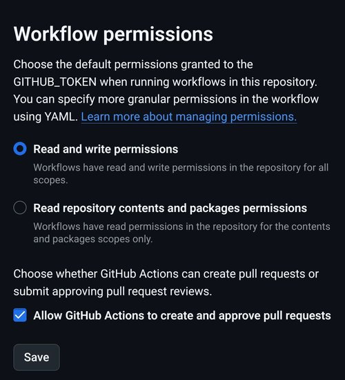

(aaps-ci-password-special-characters)=
### Build Fails Checking The Keystore Password
  - In the [build log](#aaps-ci-read-the-logs), the step **Validating keystore, alias and password** fails with `Either KEYSTORE_BASE64, KEYSTORE_PASSWORD, KEY_PASSWORD, or KEY_ALIAS is incorrect`, followed by `Keystore was tampered with, or password was incorrect`. The build stops there: the keystore and passwords are checked before AAPS is built.

  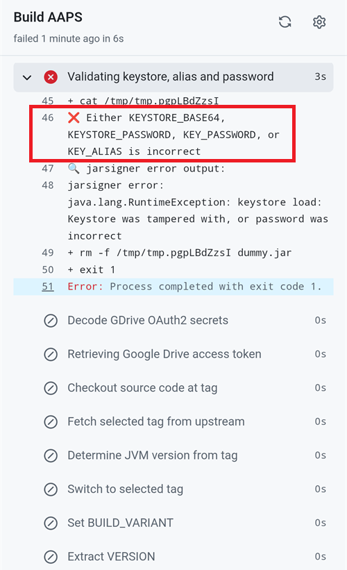

  - The build workflow keeps every character of your passwords intact. Enter `KEYSTORE_PASSWORD` and `KEY_PASSWORD` exactly as they are, without adding a backslash or any other escape character. If you added backslashes, [update the secrets](#aaps-ci-update-secret) with the password exactly as it is. The example below is wrong: the password is `Example2026`, the backslash was added.

  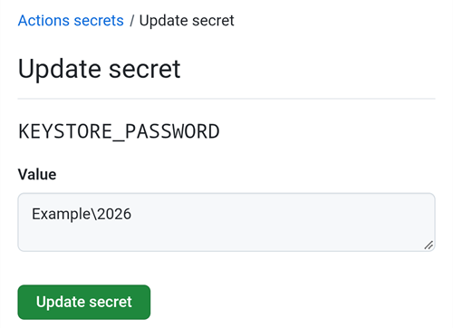

  - If the build still fails when signing the APK although your password is correct, and the password contains `$`, a backtick, `"` or `\`, the workflow file in your fork is older than September 2026 and still parses these characters. [Sync your fork](#Update-to-new-version-update-your-repo) with the latest dev, then re-run the build workflow.
  - The vertical bar `|` is a special case. The preparation page of [Option 1](#aaps-ci-option1) combines the keystore, passwords and alias into one `KEYSTORE_SET` secret separated by `|`, and the workflow splits it on that character. The password generated by the preparation page contains only letters and digits, so this cannot happen with Option 1. It can only happen if you assembled a `KEYSTORE_SET` secret yourself from a password containing `|`. In that case, delete `KEYSTORE_SET` and enter the separate secrets of [Option 2](#aaps-ci-option2) instead.
