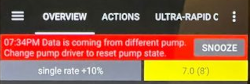
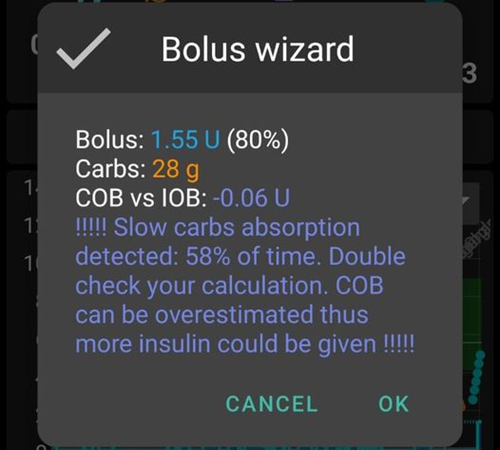
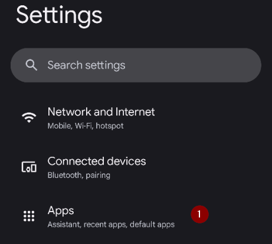
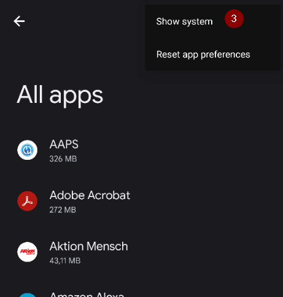
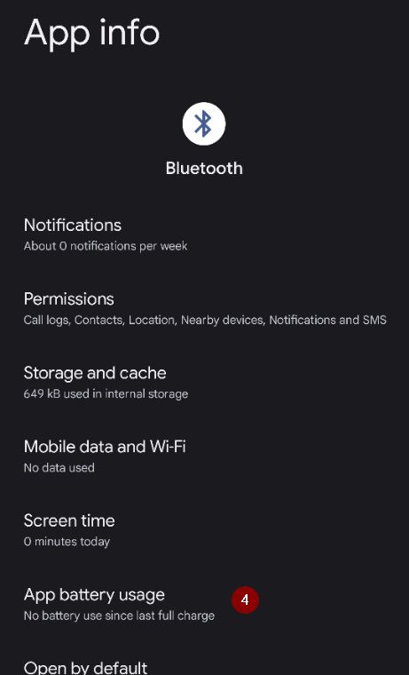
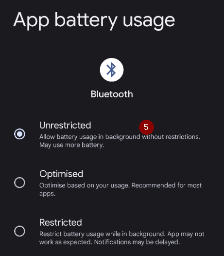
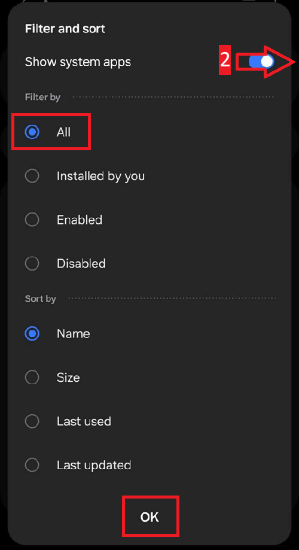

(generaltroubleshooting)=

# Troubleshooting

**Start here when something is not working.** Troubleshooting information lives on many pages across the documentation. This page brings it together: it is a single collection of links, sorted by topic, to help you solve the most common problems.

If you do not find your answer below, also check:

* the [FAQ](../UsefulLinks/FAQ.md) for answers to frequent questions, and
* the [Profile tuning guide](ProfileTuning.md) if your loop runs but your glucose control needs improving.

```{admonition} Still stuck?
:class: tip
If none of the links solve your problem, see [Where can I get help](WhereCanIGetHelp.md) to ask the community (Facebook, Discord), or send your [log files](AccessingLogFiles.md) to the developers.
```

---

(generaltroubleshooting-aaps-app)=

## AAPS app

### Building & updating

* [Lost keystore](#troubleshooting_androidstudio-lost-keystore)
* [Troubleshooting AndroidStudio](TroubleshootingAndroidStudio)
* [Browser build (CI) troubleshooting](#aaps-ci-troubleshooting)

### Installing

You may see a Google Play Protect warning that the app is unsafe, was built for older Android versions and doesn't include latest privacy protections.

Ignore it: More details, Install anyway.


### Settings
* Profile

  

* [Pump - data from different pump](#update30-failure-message-data-from-different-pump)

  

* [Nightscout Client](../GettingHelp/TroubleshootingNsClient.md)

### Usage
* [Wrong carb values](#CobCalculation-detection-of-wrong-cob-values)

   

* [SMS commands](#SMSCommands-troubleshooting)

---

(generaltroubleshooting-bluetooth-related-issues)=


## Bluetooth related issues

For known issues with Bluetooth connections, dropouts of pump/pods, or activation and connection issues [Bluetooth Troubleshooting](../GettingHelp/BluetoothTroubleshooting.md)

---

(generaltroubleshooting-android-related-issues)=

## Android Related Issues

### Battery optimization

Android has implemented battery saving setting that are enabled by default. These settings automatically suspend/pause applications that are not required for the system to function to help conserve the amount of battery energy used by apps that don't always need to be running.

When this is enabled, it will very likely cause issue for **AAPS** and other supporting apps like **xDrip**.

It's important to ensure that you have disabled Battery Optimization to ensure **AAPS** and other supporting apps remain active all the time.

Depending on your phone model and make there may be more than one location and setting which needs to have this disabled.

***NOTE:** Follow the steps below to Disable Battery Optimization for the Bluetooth service if your phone has this option, the same steps can be used to disable for **AAPS** and other apps, however the screenshots will only show how to do this for the Bluetooth service.*

#### Pixel phones (stock Android)

* Go to the Android settings, select "Apps".
  
  
  
* Select "See all apps"
  
  
  
* On the menu on the right, select "Show system" apps.
  
  
  
* Now search and select the app "Bluetooth".
  
  
  
* Click the "App battery usage" and select "Not optimized".
  
  


#### Samsung phones

* Go to the android settings, select "Apps"

* On the icon that supposedly changes the sorting algorithm (1), select "Show system apps" (2).

  
  
  
  
* Now search the Bluetooth app and select it to see its settings.
  
  
  
* Select "battery".
  
  
  
* Set it to "Not optimized"
  
  

#### Huawei phones

See this guide for [Huawei Bluetooth & battery optimization](../CompatiblePhones/Huawei.md)
  
---

(generaltroubleshooting-cgm)=

## Continuous Glucose Monitor (CGM)

Useful links to known issues and steps to resolve for CGMs.

* [General](#general-cgm-troubleshooting)
* [Dexcom G6](#DexcomG6-troubleshooting-g6)
* [Libre 3](#libre3-experiences-and-troubleshooting)
* [xDrip - no CGM data](#xdrip-identify-receiver)
* [xDrip - Dexcom troubleshooting](#xdrip-troubleshooting-dexcom-g5-g6-and-xdrip)

---

(generaltroubleshooting-pumps)=

## Pumps

Useful links to known issues and steps to resolve for Pumps

* [DanaRS](#DanaRS-Insulin-Pump-dana-rs-specific-errors)
* [Accu-Chek Combo general](#combov2-tips-for-basic-usage)
* [Accu-Chek Insight](#Accu-Chek-Insight-Pump-insight-specific-errors)
* [Medtronic + RileyLink](#MedtronicPump-what-to-do-if-i-loose-connection-to-rileylink-and-or-pump)
* [Medtrum Nano](#medtrum-nano-troubleshooting)
* [Diaconn G8](#diaconn-g8-bluetooth-troubleshooting)
* [Omnipod DASH](#omnipod-dash-troubleshooting)
* [Omnipod Eros](#OmnipodEros-troubleshooting)

---

(generaltroubleshooting-phones)=

## Phones

Useful links to known issues and steps to resolve for Phones

* [List of tested phone and device setups](https://docs.google.com/spreadsheets/u/1/d/e/2PACX-1vScCNaIguEZVTVFAgpv1kXHdsHl3fs6xT6RB2Z1CeVJ561AvvqGwxMhlmSHk4J056gMCAQE02sAWJvT/pubhtml?gid=683363241&amp;single=true)
* [Jelly](../CompatiblePhones/Jelly.md)
* [Huawei Bluetooth & battery optimization](../CompatiblePhones/Huawei.md)

(generaltroubleshooting-smartwatches)=

## Smartwatches

Useful links to known issues and steps to resolve for Smartwatches

* [Troubleshooting Wear app](#Watchfaces-troubleshooting-the-wear-app)
