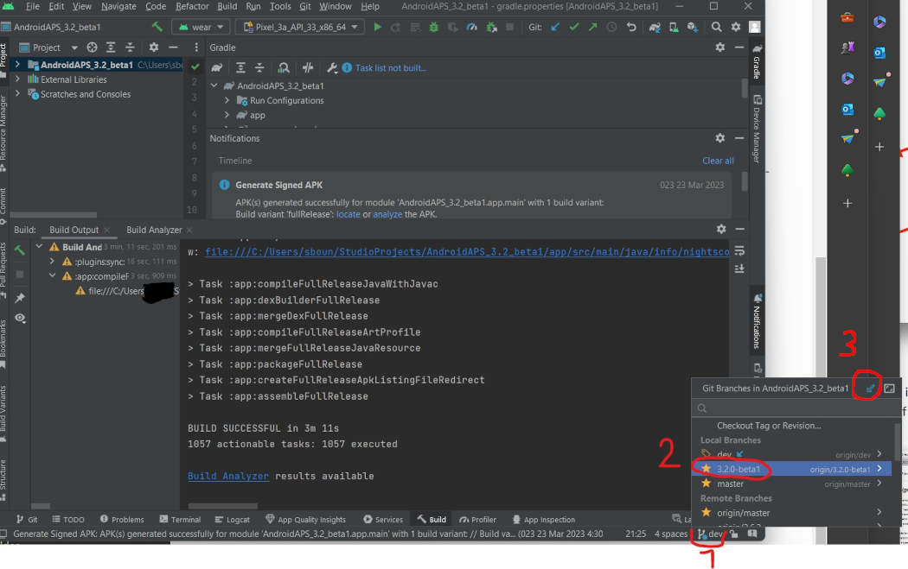

# Dexcom G7

```{admonition} Only available in dev branch
:class: note

This feature is only available in the in dev branch and not in master.

Please be aware of the warnings and follow the instructions in [building a dev version](../Installing-AndroidAPS/Dev_branch.md).

```

##   Fundamental in advance

In spring 2022, the Dexcom G7 received its CE certificate and was sold at the end of October '22.

Noteworthy is the fact that the G7 system, compared to the G6, does not smooth the values, neither in the app, nor in the reader. More details about this [here](https://www.dexcom.com/en-us/faqs/why-does-past-cgm-data-look-different-from-past-data-on-receiver-and-follow-app). Consequently, the values have to be smoothed to be able to use them sensibly in AAPS. 

There are **two** possibilities (as of 02/'23).


## 1.  Patched Dexcom G7 App

### Install a new patched (!) G7 app and start the sensor

A patched Dexcom G7 app gives acess to the Dexcom G7 data. This is not the BYODA app as this app can not receive G7 data at the moment.

Uninstall the original Dexcom app if you used it before (A running sensor session can be continued - note the sensor code before removal of the app!)

Download and install the patched.apk [here](https://github.com/authorgambel/g7/releases).

Enter sensor code in the patched app.

Follow the general recommendations for CGM hygiene and sensor placement found [here](../Hardware/GeneralCGMRecommendation.md).

After the warm-up phase, the values are displayed as usual in the G7 app.

### build a new signed APK from the dev branch

To be able to receive the values from the G7 App in AAPS and to smooth the received values, a change in AAPS is necessary.

Therefore build a new signed APK from the official dev branch and install it on your mobile.

For the configuration in AAPS
- Select 'BYODA' in the configuration generator - even if it is not the BYODA app!
- If AAPS does not receive any values, switch to another BG source and then back to 'BYODA' to invoke the query for approving data exchange between AAPS and BYODA.

The smoothing of glucose values can be activated by enabling the "Average smoothing" or "Exponential Smoothing" plugin in the Config Builder. To disable select the "No Smoothing" option.
"Exponential smoothing" is more aggressive and rewrites the newest Glucose Value but is good in dealing with heavy noise. "Average smoothing" is much like the back smoothing that was in BYODA G6 and only rewrites the past values but not the current value and therefore has a faster response time.

**Exponential Smoothing** **MUST** be enabled for meaningful use of the G7 values.

## 2. Xdrip+ (companion mode) 

-   Download and install Xdrip+: [xdrip](https://github.com/NightscoutFoundation/xDrip) 
- As data source in Xdrip "Companion App" must be selected and under Advanced Settings > Bluetooth Settings > "Companion Bluetooth" must be enabled.
- In AAPS select  > Configuration > BG source > xDrip+.
Adjust the xDrip+ settings according to the explanations on the xDrip+ settings page  [xDrip+ settings](../Configuration/xdrip.md) 


## 3. Step-by-step example to switch from G6 -> Xdrip+ -> AAPS -> NS  to G7 -> DIAKEM ->AAPS -> NS 
(as of 25-Mar-2023)

I just want to share my own personal experience as it might help folks in a similar position... I made several mistakes which hopefully you can avoid to make the transition smoother...
Assuming that you have been already looping hapily with a G6 transmitter sending its data to Xdrip+ which sends it to AAPS which uploads it to NightScout. In my case I have a samsun S22+ running the latest Android on Tmobile, I am using omnipod dash. I also use a google drive to share files between my PC and my phone. I never ran a dev/beta build of AAPS before... I just received a G7 prescription from my endocrinologist; so how can I use it? That's the way I did it...  I am sure there are other ways some of which might be simpler/better... don't hesitate to refine this doc accordingly!
note: If you happen to use the _BYODA g6 _app (aka Original recipe) instead of xdrip+ you will have to uninstall it before installing _diakem G7 _(aka new coke).

1. Disclaimer & al. 

    First and foremost understand that you will have to run a BETA version of AAPS instead of the MASTER version. it is basically a protoype which is still being tested. Furthermore, this is only a temporary stage until the testing complete and the code makes it to the MASTER branch at which point you should plan to rebuild again the app to get back to the normal flow. You might want to just wait until AAPS supports G7 officially in the master branch. If you are feeling advanturous and want to try the bleeding edge... then keep reading...
    
2.  Assumptions

    In my example I have decided to use option (1) aka *"Patched Dexcom G7 App"* aka *"DIAKEM"*... As of March 25th, the best option seems to use the 3.2.0-beta1. (due to several issues I ended up using a dev version but it wasn't on pupose and I would have sticked to 3.2.0-beta1 and you should as long as it works!)
    
    On a side note, I hadn't used Android Studio in a while so I had to update it (ie: run the install again) which also updated a bunch of android libraries.
    
    The overall process takes probably less than 30 minutes if you do it multiple times, but for first-timers, plan anything from 1 to 3h depending on how much aggravation the internet gods will unleash on you (for instance if you need to update Android Studio!). _In any cases, it surely is much faster than putting this documentation together! Why can't they make it as simple as editing a word document??? _

3. Google Drive Prep work
    1. before doing anything I made sure I had a copy of my current working AAPS application apk aside in my gooogle drive under the aptly named "AAPS" folder...
    2. In google drive on my PC, create the shared folder with a meaningul name like **"AAPS-beta-G7"**
    3. In that google drive folder on my PC create an emtpy file called "engineering_mode". -> this will be needed to enable looping on a beta/dev version of aaps
 (right click, New, Text Document) be careful on windows, it will open a textpad that will try to add ".txt" extension to the filename.  if that happens just rename the file from "engineering_mode.txt" to "engineering_mode"  

4. Switch your AAPS source branch in Android Studio
    1.  start your favorite Android Studio(AS) ... by default it should show your last Android APS project with everything already configured. 
    2. in AS, there is an extremely small tiny winny well hidden icon on the bottom right corner whhch controls which version of AAPS to build. by default it uses the MASTER branch... you will want to selec the 3.2.0-beta1 branch. just click on it and select the right version from the drop down. git is rather complicated, if you can't see the 3.2.0-beta1 you might need to update your local copy (fetch) and there are many ways to do it... 
    3. Here is an example on my screen, you click on the iny fork symbol(1) in my case I was using the "dev" branch, yours is most likely **"master"**. It will pop up a window where you can select the **"3.2.0-beta1"**. If you don't see it, click in the top right corner of the tiny window the blue arrow to fetch (3) the latest copy of the repo.


5. Build the app like you normally do, make sure you use the passwords for your jks file and aliases...

7. copy your apk file in your google folder **"AAPS-beta-G7"** like you normally do...

### 7. **BEFORE UPDATING THE APP ON YOUR PHONE  EXPORT YOUR APPS SETTINGS**
(don't do like me and *assume* that your yesterday's export is good enough... just do another one right before updating AAPS.)

8. copy the engineering_mode file to your phone:

    1. on your phone, select google drive and navigate to your folder **"AAPS-beta-G7"**. sometimes it might take a few minutes for everything to sync up but you should find your apk file and your engineering_mode file... 
    2. click on the 3 dots on the right of the engineering_mode file to download it into your samsung s22 download folder.
    3. start the google *"files by google"* app on your android phone and select the "Downloads" folder
    4. click on the 3 dots on the right of the engineering_mode file and select "Copy to", 
    5. then select "Internal Storage", then "AAPS", then "extra", then *"Copy there"*
9. still on your phone, select google drive and navigate to your folder **"AAPS-beta-G7"**. and double click the app-full-release.apk which you just built earlier and copied on step 10. This will install your new version of AAPS. if everything works fine, it should update the app for you without having to do anything. 
    1. if you made a mistake (like I did with one of the passwords) you might have to uninstall your existing app, reinstall the new version, and reimport your settings (from step 11).  Make sure you have a copy of your current app version just in case as mentioned in step 4 so you can always rollback.
    2. if you get an error message telling you that closed Loop is disabled and you are restriced to Open Loop because you are running a DEV version of AAPS; this means that you didn't copy the file "engineering_mode" properly in your phone AAPS/extra folder. so redo steps 12.  
10. As of now, everything is still the same on your phone except for the fact that you are running the new version of AAPS(you can see the version in AAP, top right **3 dots menu / About**). Here is a screenshot of my version which was "AAPS 3.2.0-dev-i" yours should say "AAPS 3.2.0-beta1"


11. install DIAKEM

    1. download the de DIAKEM app aka (replacement for the dexcom g7 app) on your phone from here: https://github.com/authorgambel/DiaKEM_G7
    direct link to v1.1 which I used: https://github.com/authorgambel/DiaKEM_G7/releases/download/v1.1/dexcom-v1.4.0.3906-screenshot-broadcast-compatibility.apk
    2. copy the apk file in your google drive folder
    3. if you already had installed the official dexcom G7 app or the original BYODA-for-g6 uninstall it first (if you have xdrip no need to uninstall you can run both in parallel ).         
    5. Install the new diakem G7 app. it will create a **dexcom g7** app icon on your phone and you can run the app to configure it like a normal dexcom G7
    6. The new dexcom G7 is supposedly more precise, faster response, much faster warmp (only minutes) than G6 but it also lack "smoothing"... long story short at this point your AAPS is still running with G6/Xdrip and you have the G7 running by itself in parallel... you might want to wait a bit before moving the next step and compare the results from the G6 vs G7 using a finger stick check to assess which is best for you... overall they seemed pretty close for me and I swapped after few hours.

12. Switch AAPS from old trusted G6 to bleeding edge G7!
    1. in the AAPS top tabs (normally **HOME** is the default tab selected), slide all the way to the right to the **CONF** tab.
    2. In the **BG Source** section, select BYODA. you might want to double check with the gear icon next to it that it is still configured to upload your BG data to NightSCout... for me it was already there. 
    3. In the **Smoothing** section, select **Exponential Smoothing**, it sounds cool and seems usefull (the diakem github has a nice description of it)

  

Normally, you should now have achieved your goal: swithing your AAPS input from _G6 through Xdrip+_ to _G7 through DIAKEM_

13. double check that your NightScout gets updates... 

    for some reasons, on my side I had an issue getting my BG updated to Nightscout but that was using one of the "DEV" branch version and it seems they working on a new version of the nightscout protocol... if that's your case you can try to:
    1. switch your AAPS client in the CONF from Nightscout to NightscoutV3.
    2. click the gear menu next to Nighscout v3, and re-enter your nightsbout API password (aka **NS access token**).  
    (I found it was a bit odd that AAPS did carry-over my nightscout URL settings from NS to NSV3 but not the password...) anyway that did the trick for me.

  

14 Final words...

. keep an eye on things, especially since you are running a dev or beta build as well as a new G7 dexcom... so don't remove your g6 and xdrip right away... and when in doubt check with a good old finger test your actual real time BG (remember that dexcom will  always be a bit behind)... 
. keep in mind that whenever 3.2 goes live, you would want to rebuild your AAPS with the official version, make sure you switch your git branch to MASTER.
. any issues can be reported in github, any help using the normal discord channels... 
. Feel free to update this doc if something is plain wrong or can be simplified... 
. good luck.
