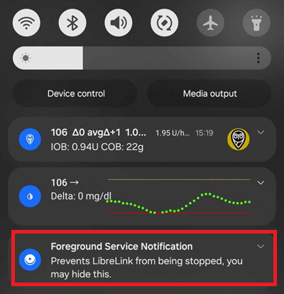

Freestyle Libre 2
**************************************************

The Freestyle Libre 2 system can automatically report dangerous blood glucose levels. The Libre2 Sensor sends the current blood sugar level to a receiver (reader or smartphone) every minute. The receiver triggers an alarm if necessary. With a self-modified LibreLink app and the xDrip+ app, you can continuously receive and display your blood sugar level on your smartphone. 

The sensor can be calibrated in the range of -40 mg/dl to +20 mg/dl (-2,2 mmol/l to +1,1 mmol/l) to adjust differences between finger prick measurements and sensor readings.

BG readings can also be done using a BT transmitter like with the Libre1.

Step 1: Build your own patched LibreLink-App
==================================================

For legal reasons, the so-called patching has to be done by yourself. Use search engines to find the corresponding links. There are mainly two variants: The recommended original patched app blocks any internet traffic to avoid tracking. The other variant supports LibreView which may be needed by your doctor.

The patched app has to be installed instead of the original app. The next sensor started with it will transmit the current BG values to the xDrip+ app running on your smartphone via Bluetooth.

Important: To avoid possible problems it may help to first install and uninstall the original app on an NFC capable smartphone. NFC has to be enabled. This costs no extra power. Then install the patched app. 

The patched app can be identified by the foreground authorization notification. The foreground authorization service improves the connection stability compared to the original app which do not use this service.

Other indications could be the Linux penguin logo three dot menu -> Info or the font of the patched app. These criteria are optional depending on the app source you choose.

.. image:: ../images/LibreLinkPatchedCheck.png
  :alt: LibreLink Font Check

Ensure that NFC is activated, enable the memory and location permission for the patched app, enable automatic time and time zone and set at least one alarm in the patched app. 

Now start the Libre2 sensor with the patched app by simply scanning the sensor. Ensure to have set all settings done.

Mandatory settings for successful sensor start: 

* NFC enabled / BT enabled
* memory and location permission enabled 
* location service enabled
* automatic time and time zone setting
* set at least one alarm in the patched app

Please note that the location service is a central setting. This is not the app location permission which has to be set also!

.. image:: ../images/Libre2_AppPermissionsAndLocation.png
  :alt: LibreLink permissions memory & location
  
  
.. image:: ../images/Libre2_DateTimeAlarms.png
  :alt: automatic time and time zone + alarm settings  

The sensor remembers the device it was started from. Only this device can receive alarms in the future.

The first connection setup to the sensor is critical. The LibreLink app tries to establish a wireless connection to the sensor every 30 seconds. If one or more mandatory settings are missing they have to be adjusted. You have no time limit to do that. The sensor is constantly trying to setup the connection. Even if is last some hours. Be patient and try different settings before even think of changing the sensor.

As long as you see a red exclamation mark ("!") on the upper left corner of the LibreLink's start screen there is no connection or some other setting blocks LibreLink to signal alarms. Please check if the sound is enabled and all sorts of blocking app notifications are disabled. When the exclamation mark is gone, the connection should be established and blood sugar values are sent to the smartphone. This should happen after a maximum of 5 minutes.

.. image:: ../images/Libre2_ExclamationMark.png
  :alt: LibreLink no connection
  
If the exclamation mark remains or you get an error message, this can have several reasons:

- Android location service is not granted - please enable it in the system settings
- automatic time and time zone not set - please change the settings accordingly
- activate alarms - at least one of the three alarms must be activated in LibreLink
- Bluetooth is switched off - please switch on
- sound is blocked
- app notifications are blocked
- idle screen notifications are blocked 
- you have a faulty Libre 2 sensor from a production LOT number with a 'K' followed by 8 digits. You find this printed on the yellow package. These sensors have to be replaced as they don't function on bluetooth.

Restarting the phone can help, you may have to do it several times. As soon as the connection is established, the red exclamation mark disappears and the most important step is taken. It may happen that depending on system settings the exclamation mark remain but you still get readings. In both cases you are fine. Sensor and phone are now connected, every minute a blood sugar value is transmitted.

.. image:: ../images/Libre2_Connected.png
  :alt: LibreLink connection established
  
In rare case it could help to empty the bluetooth cache and/or reset all network connections via the system menu. This removes all connected bluetooth devices which may help to setup a proper bluetooth connection. That procedure is save as the started sensor is remembered by the patched LibreLink app. Nothing additional has to be done here. Simply wait for the patched app to connect to the sensor.

After a successful connection the smartphone settings can be changed if necessary. This is not recommended but you may want to save power. Location service can be switched off, volume can be set to zero or alarms can be switched off again. The blood sugar levels are transferred anyway.

When starting the next sensor, however, all settings must be set again!

Remark: The patched app need the mandatory settings set in that hour after warmup to enable a connection. For the 14 days operation time they are not needed. In most cases when you have problems with starting a sensor the location service was switched off. For Android it is needed for proper bluetooth operation(!) to connect. Please refer to Google's Android documentation.

During the 14 days you can use in parallel one or more NFC capable smartphones (not the reader device!) running the original LibreLink app for scanning via NFC. There is no time limitation to start that. You could use a parallel phone for example on day 5 or so. The parallel phones(s) could upload the blood sugar values into the Abbott Cloud (LibreView). LibreView can generate reports for your diabetes team. There are many parents who absolutely need this. 

Please note that the original patched app **does not have any connection to the internet** to avoid tracking.

However there is a variant of the patched app supporting LibreView with enabled internet access. Please be aware that your data is transferred to the cloud then. But your diadoc tool- and reporting chain is fully supported then. With that variant it is also possible to move the alarms of a running sensor to a different device which not has started the sensor. Please google in diabetes related German forums how this could be done.

Step 2: Install and configure xDrip+ app
==================================================

The blood sugar values are received on the smartphone by the xDrip+ App. 

* If not already set up then download xDrip+ app and install one of the latest nightly builds from `here <https://github.com/NightscoutFoundation/xDrip/releases>`_.
* In xDrip+ select "Libre2 (patched App)" as data source
* If necessary, enter "BgReading:d,xdrip libre_receiver:v" under Less Common Settings->Extra Logging Settings->Extra tags for logging. This will log additional error messages for trouble shooting.
* In xDrip+ go to Settings > Interapp Compatibility > Broadcast Data Locally and select ON.
* In xDrip+ go to Settings > Interapp Compatibility > Accept Treatments and select OFF.
* to enable AAPS to receive blood sugar levels (version 2.5.x and later) from xDrip+ please set `Settings > Interapp Settings > Identify Receiver "info.nightscout.androidaps" <https://androidaps.readthedocs.io/en/latest/EN/Configuration/xdrip.html#identify-receiver>`_
* If you want to be able to use AndroidAPS to calibrate then in xDrip+ go to Settings > Interapp Compatibility > Accept Calibrations and select ON.  You may also want to review the options in Settings > Less Common Settings > Advanced Calibration Settings.

.. image:: ../images/Libre2_Tags.png
  :alt: xDrip+ LibreLink logging

Step 3: Start sensor
==================================================

In xDrip+ start the sensor with "Start Sensor" and "not today". 

In fact this will not physically start any Libre2 sensor or interact with them in any case. This is simply to indicate xDrip+ that a new sensor is delivering blood sugar levels. If available, enter two bloody measured values for the initial calibration. Now the blood glucose values should be displayed in xDrip+ every 5 minutes. Skipped values, e.g. because you were too far away from your phone, will not be backfilled.

After a sensor change xDrip+ will automatically detect the new sensor and will delete all calibration data. You may check you bloody BG after activation and make a new initial calibration.

Step 4: Configure AndroidAPS (for looping only)
==================================================
* In AndroidAPS go to Config Builder > BG Source and check 'xDrip+' 
* If AndroidAPS does not receive BG values when phone is in airplane mode, use `Identify receiver` as describe on `xDrip+ settings page <../Configuration/xdrip.html#identify-receiver>`_.

Until now, using Libre 2 as BG source you cannot activate ‘Enable SMB always’ and ‘Enable SMB after carbs’ within SMB algorithm. The BG values of Libre 2 are not smooth enough to use it safely. See `Smoothing blood glucose data <../Usage/Smoothing-Blood-Glucose-Data-in-xDrip.html>`_ for more details.

Experiences and Troubleshooting
==================================================

Connectivity
--------------------------------------------------
The connectivity is extraordinarily good. With the exception of Huawei mobile phones, all current smartphones seams to work well. The reconnect rate in case of connection loss is phenomenal. The connection can break off if the mobile phone is in the pocket opposite the sensor or if you are outdoors. When I am gardening, I use to wear my phone on the sensor side of my body. In rooms, where Bluetooth spreads over reflections, no problems should occur. If you have connectivity problems please test another phone. It may also help to set the sensor with the internal BT antenna pointing down. The slit on the applicator must be pointing down when setting the sensor.

Value smoothing & raw values
--------------------------------------------------
Technically, the current blood sugar value is transmitted to xDrip+ every minute. A weighted average filter calculates a smoothed value over the last 25 minutes. This is mandatory for looping. The curves look smooth and the loop results are great. The raw values on which the alarms are based jitter a little more, but correspond to the values that the reader also displays. In addition, the raw values can be displayed in the xDrip+ graph in order to be able to react in time to rapid changes. Please switch on Less Common Settings > Advanced Settings for Libre2 > "show Raw values" and "show Sensors Infos". Then the raw values are additionally displayed as small white dots and additional sensor info is available in the system menu.

The raw values are very helpful when the blood sugar is moving fast. Even if the dots are more jumpy you would detect the tendency much better as using the smoothed line to make proper therapy decisions.

.. image:: ../images/Libre2_RawValues.png
  :alt: xDrip+ advanced settings Libre 2 & raw values

Sensor runtime
--------------------------------------------------
The sensor runtime is fixed to 14 days. The 12 extra hours of Libre1 no longer exist. xDrip+ shows additional sensor information after enabling Advanced Settings for Libre2 > "show Sensors Infos" in the system menu like the starting time. The remaining sensor time can also be seen in the patched LibreLink app. Either in the main screen as remaining days display or as the sensor start time in the three-point menu->Help->Event log under "New sensor found".

.. image:: ../images/Libre2_Starttime.png
  :alt: Libre 2 start time

New sensor
--------------------------------------------------
A sensor exchange takes place on-the-fly: Set new sensor shortly before activation. As soon as xDrip+ receives no more data from the old sensor, start the new sensor with the patched app. After one hour new values should appear automatically in xDrip+. 

If not, please check the phone settings and proceed as with the first start. You have no time limit. Try to find the correct settings. No need to immediately replace the sensor before you tried different combinations. The sensors are robust and try permanently to establish a connection. Please take your time. In most cases you accidentally changed one setting which causes now problems. 

Once successful please select "Sensor Stop" and "Delete calibration only" in xDrip. This indicates for xDrip+ that a new sensor is releasing blood sugar levels and the old calibrations are no longer valid and therefore have to be deleted. No real interaction is done with the Libre2 sensor here! You do not need to start the sensor in xDrip+.

.. image:: ../images/Libre2_GapNewSensor.png
  :alt: xDrip+ missing data when changing Libre 2 sensor

Calibration
--------------------------------------------------
You can calibrate the Libre2 with an offset of -40 mg/dl to +20 mg/dL [-2,2 mmol/l to +1,1 mmol/l] (intercept). The slope isn't changeable as the Libre2 is much more accurate compared to the Libe1. Please check by fingerpricking early after setting a new sensor. It is know that there can arise big differences to the blood measurements. To be on the safe side, calibrate every 24 - 48 hours. The values are accurate up to the end of the sensor and do not jitter as with the Libre1. However, if the sensor is completely off, this will not change. The sensor should then be replaced immediately.

Plausibility checks
--------------------------------------------------
The Libre2 sensors contain plausibility checks to detect bad sensor values. As soon as the sensor moves on the arm or is lifted slightly, the values may start to fluctuate. The Libre2 sensor will then shut down for safety reasons. Unfortunately, when scanning with the App, additional checks are made. The app can deactivate the sensor even though the sensor is OK. Currently the internal test are too strict. I have completely stopped scanning and haven't had a failure since then.

Time zone travelling
--------------------------------------------------
In other `time zones <../Usage/Timezone-traveling.html>`_ there are two strategies for looping: 

Either 

1. leave the smartphone time unchanged and shift the basal profile (smartphone in flight mode) or 
2. delete the pump history and change the smartphone time to local time. 

Method 1. is great as long as you don't have to set a new Libre2 sensor on-site. If in doubt, choose method 2., especially if the trip takes longer. If you set a new sensor, the automatic time zone must be set, so method 1. would be disturbed. Please check before, if you are somewhere else, you can run otherwise fast into problems.

Experiences
--------------------------------------------------
Altogether it is one of the smallest CGM systems on the market. Small, no transmitter necessary and mostly very accurate values without fluctuations. After approx. 12 hours running-in phase with deviations of up to 30 mg/dl (1,7 mmol/l)the deviations are typical smaller than 10 mg/dl (0,6 mmol/l). Best results at the rear orbital arm, other setting points with caution! No need to set a new sensor one day ahead for soaking. That would disturb the internal leveling mechanism.

There seem to be bad sensors from time to time, which are far away from the blood values. It stays that way. These should be immediately replaced.

If the sensor moved a little bit on the skin or is lifted somehow this can cause bad results. The filament which sits in the tissue is a little bit pulled out of the tissue and will measure different results then. Mostly probably you will see jumping values in xDrip+. Or the difference to the bloody values change. Please replace the sensor immediately! The results are inaccurate now.

Step 5: Using bluetooth transmitter and OOP
==================================================

Besides the patched app the new Droplet transmitter or (soon available) the new OOP algorithm of xDrip+ can be used to receive blood sugar values. MM2 and blucon do NOT work so far.

Bluetooth transmitter can be used with the Libre2 with the latest xDrip+ nightlys. Please refer to the miaomiao website to find a description. This will also work with the Bubble devices and in the future with other transmitter devices.

The Droplet transmitter is working with Libre2 but uses a internet service. Please refer to FB or Google to get further information.

Even if the patched LibreLink app approach is smart there may be some reasons to use a bluetooth transmitter instead.

* the BG readings are identical to the reader results
* the Libre2 sensor can be used 14.5 days as with the Libre1 before 
* 8 hours Backfilling is fully supported.
* get BG readings during the 1 hour startup time of a new sensor

Remark: The transmitter can be used in parallel to the LibreLink app. It doesn't disturb the patched LibreLink app operation.
