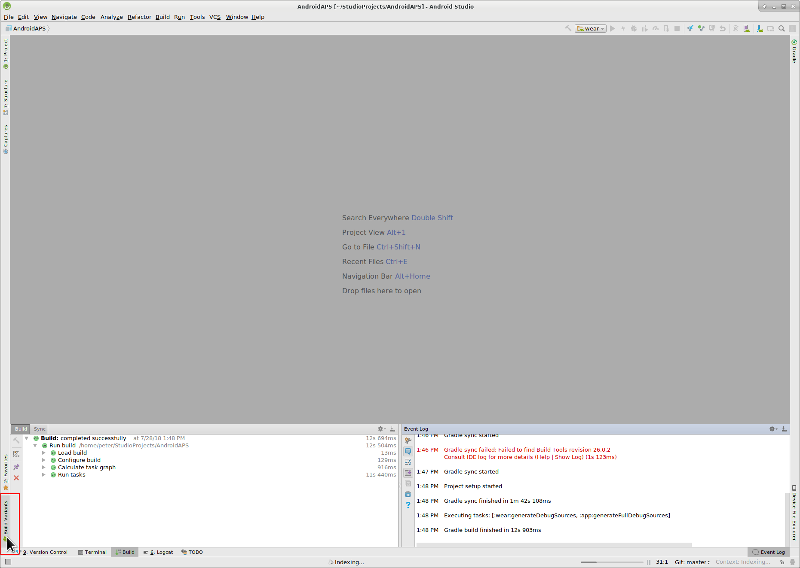
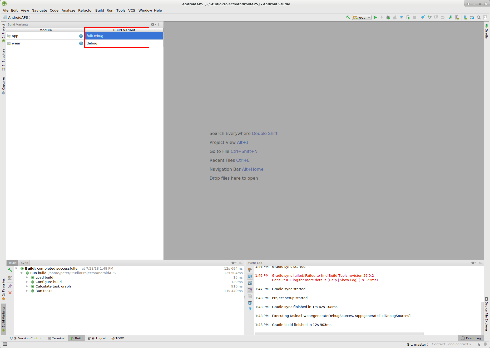
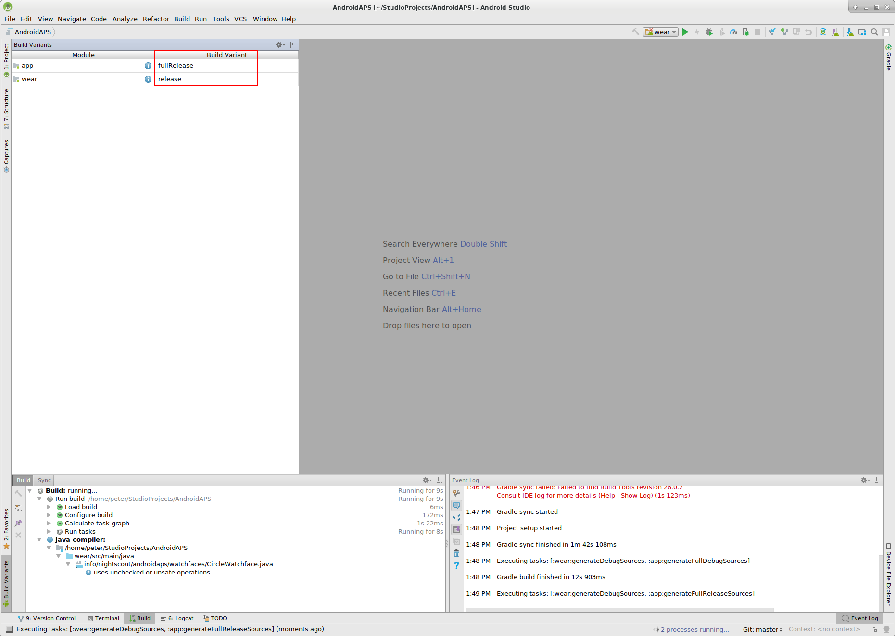
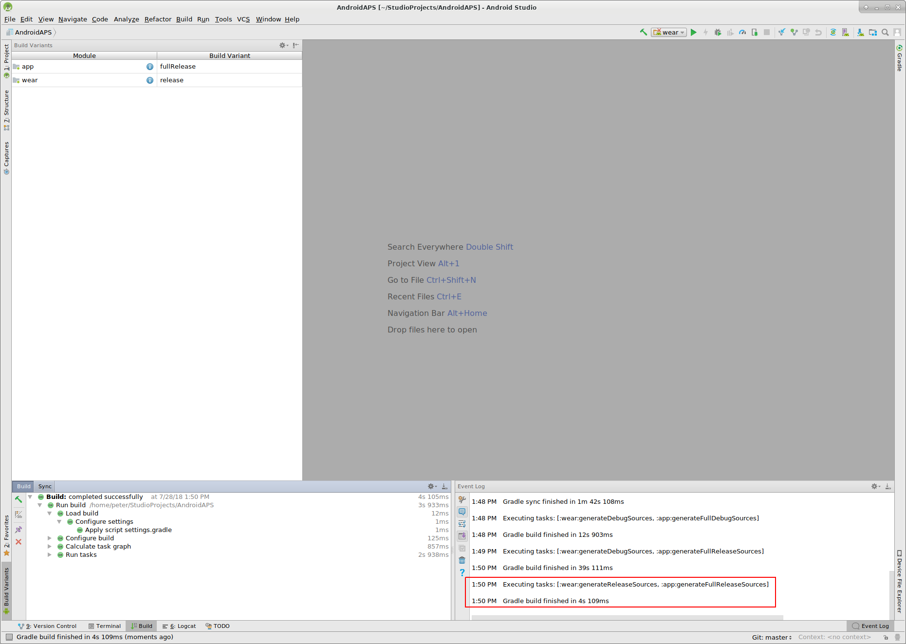

# Installing AndroidAPS - Build the APK

This article is divided in two parts.
* In the overview part you will get the explanation on what steps are necessary in general to build the APK file.
* In the step by step walkthrough part you will find the screenshots of a concrete installation. Because the versions of Android Studio - the software development environment which we will use to build the APK will - change very quickly this will be not identical to your installation but it should give you a good starting point. If you find something important wrong or missing please inform the facebook group "AndroidAPS" users though can have a look on this.

## Overview

In general description of the steps necessary to build the APK file.

* Install Android Studo the software development environment used for building the AndroidAPS app.
* Use git to clone the source code from the central Github repository where the developer put the actual code for the app.
* Open the cloned project in Android Studio as active project.
* Configure the build variants.
* Build the signed APK.
* Transfer the signed APK to you smartphone.

## Step by step walkthrough

Detailed description of the steps necessary to build the APK file.

--
* Install [Android Studio](https://developer.android.com/studio/install.html).
* Configure Android Studio during first start

Select "Do not import settings" as you have not used it before.

Click "Next".

Select "Standard installation" and click "Next".

Select "Intellij" as UI (user interface) theme and click "Next".

Click "Next" on the "Verify Settings" dialog.

* Use git clone in Android Studio as shown in screenshot below.

--

* Run Android Studio and select 'Open an existing Android Studio project', selecting the location of the extracted files.

* You might get an error message about not finding build tools - click on the links Android Studio provides to download all the software updates suggested.
 
* Go to Build Menu and click on Generate Signed APK

* Select 'app' as Module

* Set a keystore and password, if this is your first time then Create new, or fill in the details of your existing one.  For more information about using the keystore see [https://developer.android.com/studio/publish/app-signing.html#generate-key](https://developer.android.com/studio/publish/app-signing.html#generate-key)

[[https://github.com/gempickfordwaugh/AndroidAPS/raw/b09d7dc444f59b799888bcd596e36e1d562a9674/generate%20signed%20APK.png]]

* 'Release' should be your default choice for "Build Type", 'Debug' is just for people coding.
* Select the build type you want to build. 
    * full (i.e. recommendations automatically enacted in closed looping)
    * openloop (i.e. recommendations given to user to manually enact)
    * pumpcontrol (i.e. remote control for pump, no looping)
    * nsclient (i.e. looping data of another user is displayed and careportal entries can be added)

*   Select V1 "Jar Signature" (V2 is optional) and click Finish. 

* Please wait for some time until the APK is created. You will get the pop-up below when the process is done.

[[https://github.com/MilosKozak/AndroidAPS/wiki/images/androidstudio3.png]]

* Click on 'Show in Explorer'. You'll find the APK is generated, sometimes it may take time to display.

* Copy the APK with the same filename as the buildtype you chose to your android phone, and install it.  If the apk does not install and you have an older version of AndroidAPS on your phone that was signed with a different key then you will need to uninstall this first, remember to export your settings if so.
