# Building the APK

## Build yourself instead of download

**AndroidAPS is not available as download due to regulation for medical devices. It is legal to build the app for your own use, but you must not give a copy to others!
See [FAQ page](../Getting-Started/FAQ.md) for details.**

## Important notes

* Please use **[Android Studio Version 2020.3.1](https://developer.android.com/studio/)** or newer to build the apk.
* [Windows 10 32-bit systems](../Installing-AndroidAPS/troubleshooting_androidstudio#unable-to-start-daemon-process) are not supported by Android Studio 2020.3.1

## Recommended specification of computer for building apk file

<table class="tg">
<thead>
  <tr>
    <th class="tg-baqh">OS (Only 64 bit)</th>
    <th class="tg-baqh">Windows 8 or higher</th>
    <th class="tg-baqh">Mac OS 10.14 or higher</th>
    <th class="tg-baqh">Any Linux supports Gnome, KDE, or Unity DE;&nbsp;&nbsp;GNU C Library 2.31 or later</th>
  </tr>
</thead>
<tbody>
  <tr>
    <td class="tg-baqh"><p align="center">CPU (Only 64 bit)</td>
    <td class="tg-baqh">x86_64 CPU architecture; 2nd generation Intel Core or newer, or AMD CPU with support for a <br><a href="https://developer.android.com/studio/run/emulator-acceleration#vm-windows" target="_blank" rel="noopener noreferrer"><span style="text-decoration:var(--devsite-link-text-decoration,none)">Windows Hypervisor</span></a></td>
    <td class="tg-baqh">ARM-based chips, or 2nd generation Intel Core or newer with support for <br><a href="https://developer.android.com/studio/run/emulator-acceleration#vm-mac" target="_blank" rel="noopener noreferrer"><span style="text-decoration:var(--devsite-link-text-decoration,none)">Hypervisor.Framework</span></a></td>
    <td class="tg-baqh">x86_64 CPU architecture; 2nd generation Intel Core or newer, or AMD processor with support for AMD Virtualization (AMD-V) and SSSE3</td>
  </tr>
  <tr>
    <td class="tg-baqh"><p align="center">RAM</td>
    <td class="tg-baqh" colspan="3"><p align="center">8GB or more</td>
  </tr>
  <tr>
    <td class="tg-baqh"><p align="center">Disk</td>
    <td class="tg-baqh" colspan="3"><p align="center">At least 30GB free space. SSD is recommended.</td>
  </tr>
  <tr>
    <td class="tg-baqh"><p align="center">Resolution</td>
    <td class="tg-baqh" colspan="3"><p align="center">1280 x 800 Minimum <br></td>
  </tr>
  <tr>
    <td class="tg-baqh"><p align="center">Internet</td>
    <td class="tg-baqh" colspan="3"><p align="center">Broadband</td>
  </tr>
</tbody>
</table>

Please be in mind that both **64 bit CPU and 64 bit OS are mandatory condition.** If your system DOES NOT meet this condition, you have to change affected hardware or software or the whole system. **It is strongly recommended to use SSD (Solid State Disk) instead of HDD (Hard Disk Drive) because it will take less time when you are building the APS installation apk file.** Recommended is just recommended and it is not a mandatory. However, you may still use a HDD when you are building apk file but note that the building process can take a long time to complete, although once started, you can leave it running unattended.

---
### This article is divided into two parts.
* In the overview part there is an explanation on what steps are necessary to build the APK file.
* In the step by step walkthrough part you will find the screenshots of a concrete installation. Because the versions of Android Studio - the software development environment which we will use to build the APK - will change very quickly this will be not identical to your installation but it should give you a good starting point. Android Studio also runs on Windows, Mac OS X and Linux and there might be small differences in some aspects between each platform. If you find that something important is wrong or missing, please inform the facebook group "AndroidAPS users" or in the Discord chat [Android APS](https://discord.gg/4fQUWHZ4Mw) so that we can have a look at this.

## Overview

In general, the steps necessary to build the APK file:

1. [Install git](../Installing-AndroidAPS/git-install.rst)
2. [Install Android Studio](../Installing-AndroidAPS/Building-APK#install-android-studio)
3. [Set git path in Android Studio preferences](../Installing-AndroidAPS/Building-APK#set-git-path-in-preferences)
4. [Download AndroidAPS code](../Installing-AndroidAPS/Building-APK#download-androidaps-code)
5. [Download Android SDK](../Installing-AndroidAPS/Building-APK#download-android-sdk)
6. [Build the app](../Installing-AndroidAPS/Building-APK#generate-signed-apk) (generate signed apk)
7. [Transfer apk file to your phone](../Installing-AndroidAPS/Building-APK#transfer-apk-to-smartphone)
8. [Identify receiver if using xDrip+](../Installing-AndroidAPS/Building-APK#identify-receiver-if-using-xdrip)


## Step by step walkthrough

Detailed description of the steps necessary to build the APK file.

## Install git (if you don't have it)

Follow the manual on the [git installation page](../Installing-AndroidAPS/git-install.rst).

## Install Android Studio

The following screenshots have been taken from Android Studio Version Arctic Fox | 2020.3.1. Screens can change in future versions of Android Studio. But you should be able to find your way through. [Help from the community](../Where-To-Go-For-Help/Connect-with-other-users.md) is provided.

One of the most important things when installing Android Studio: **Be patient!** During installation and setup Android Studio is downloading a lot of stuff which will take its time.

Download [Android Studio from here](https://developer.android.com/studio/install.html) and install it on your computer.

On first start you will find the setup wizard:

Select "Do not import settings" as you have not used it before.

   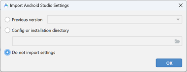

Decide whether you want to share data with Google or not.

   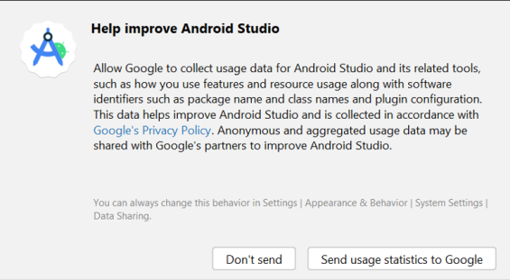

On the following screen click "Next".

   

Select "Standard" installation and click "Next".

   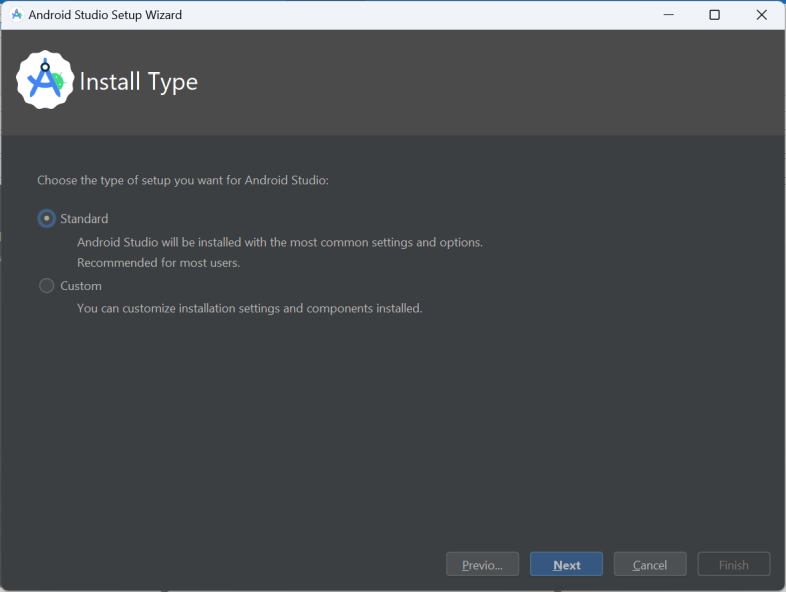

Select the theme for the user interface you like. (In this manual we used "Light".) Then click "Next".

> **_Note:_**  This is just the color scheme. You can select whatever you like (i.e. "Darcula" for dark mode).
This selection has no influence on building the APK but the following screenshots might look different.


   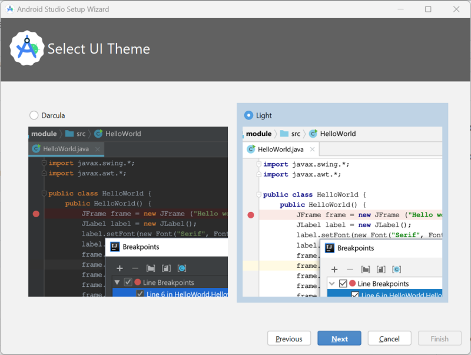

Click "Finish" on the "Verify Settings" dialog.

   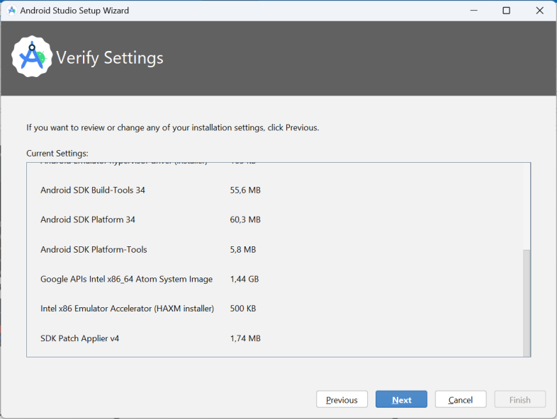

Wait while Android Studio downloads additional components and be patient. Once everything is downloaded button "Finish" turns blue. Click the button now.

   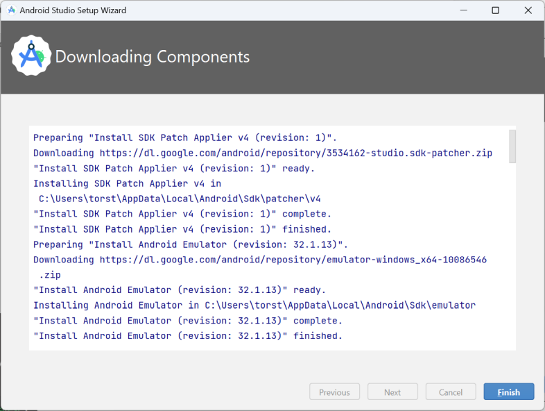


## Set git path in preferences

Make sure [git is installed](../Installing-AndroidAPS/git-install.rst) on your computer and you have restarted your computer after installing.


On the Android Studio welcome screen click "Customize" (1) on the left and then select the link  "All settings..." (2):

   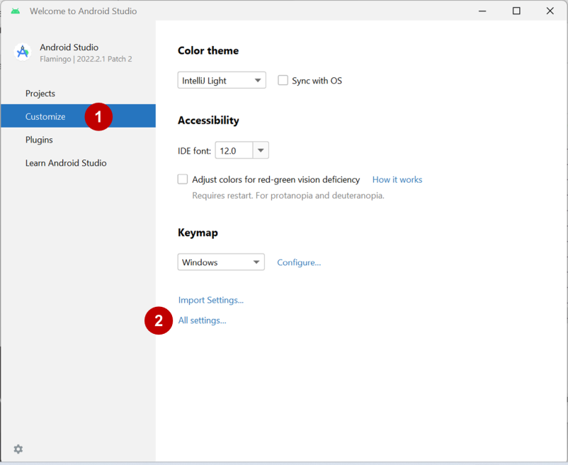


### Windows

* As windows user, make sure you have restarted your computer after [installing Git](../Installing-AndroidAPS/git-install.rst).

* Double-click "Version Control" (1) to open the sub-menu.
* Click Git (2).
* Make sure update method "Merge" (3) is selected.
* Check if Android Studio can locate path to git.exe automatically by clicking the button "Test" (4).

   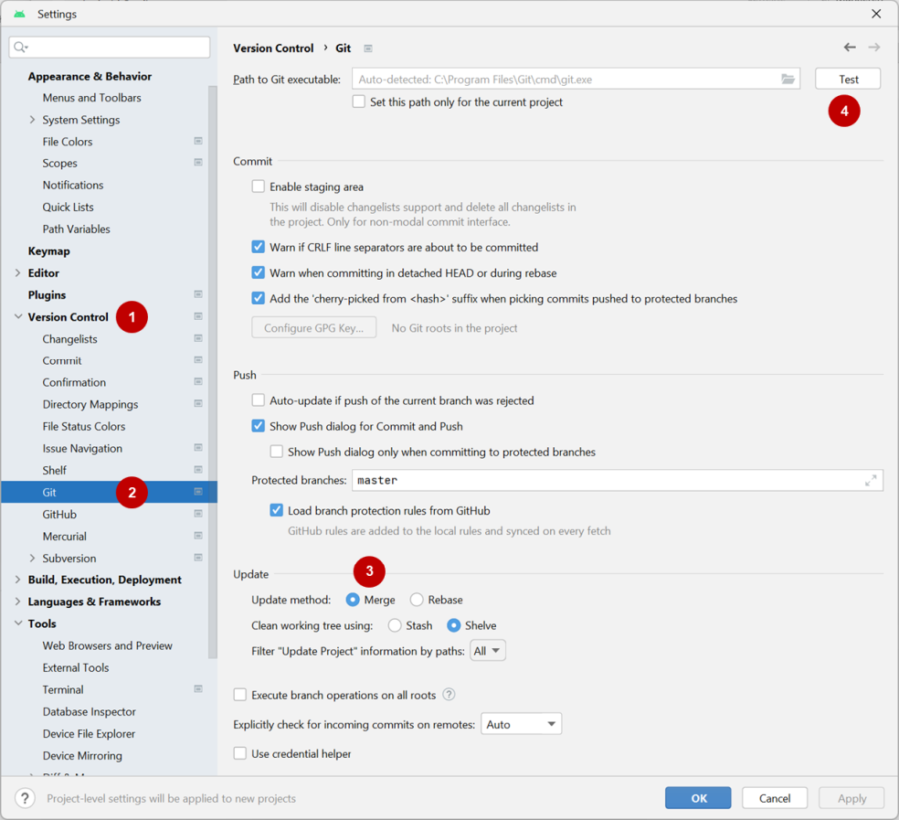

* If automatic setting is successful git version will be displayed next to the path.

   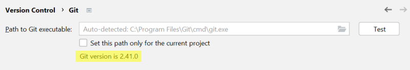


* Eventually git.exe cannot be found automatically or the Test will result in an error (1):

  

  In this case click on the folder icon (2).

* Use [search function](https://www.tenforums.com/tutorials/94452-search-file-explorer-windows-10-a.html) in windows explorer to find "git.exe" if you are unsure where git has been installed. You are looking for a file named "git.exe", located in **\bin\** folder.

* Select path to git.exe and make sure you selected the one in ** \bin\ ** folder (3) and click "OK" (4).

  

* Check your selected git path again with the "Test" button as described above.

* When the git version is displayed next to the path (see screenshot above), close settings window by clicking "OK" button (5).

### Mac

* Any git version should work. For example [https://git-scm.com/download/mac](https://git-scm.com/download/mac).
* Use homebrew to install git: ```$ brew install git```.
* For details on installing git see the [official git documentation](https://git-scm.com/book/en/v2/Getting-Started-Installing-Git).
* If you install git via homebrew there is no need to change any preferences. Just in case: They can be found here: Android Studio - Preferences.


## Download AndroidAPS code

* On the Android Studio welcome screen select "Projects" (1) on the left and then "Get from VCS" (2).

  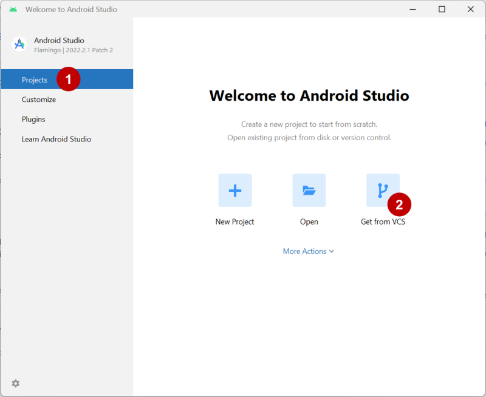

 * If you already opened Android Studio and do not see the welcome screen anymore select File (1) > New (2) > Project from Version Control... (3)

      

  * We will now tell Android Studio were to get the code from:

    - Make sure you have selected "Repository URL" on the left (1).
    - Check if "Git" is selected as version control (2).
    - Copy and paste the URL
      ```
      https://github.com/nightscout/AndroidAPS
      ```
      to the main AndroidAPS repository into the URL textbox (3).
    - Choose the directory where you want to save the cloned code (4).

      
      
* Click button "Clone" (5).

   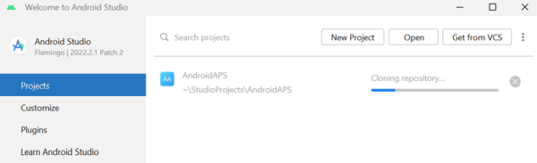

* Do not click "Background" while repository is cloned!

* After the repository is cloned successfully, Android Studio will open the cloned project.

* You will be asked whether you want to trust the project. Click on "Trust project"!

  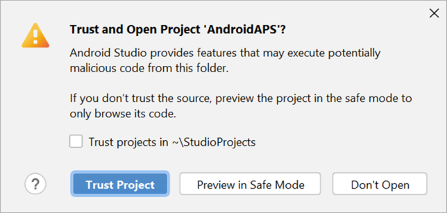

* In the status bar at the bottom you will see the information that Android Studio is running background tasks.

   

* Grant access if your firewall is asking for permission.

   

* Once the background tasks are finished you will probably see an error saying that errors occurred (1) or (2) or (3).

      

   Don't worry, this will be solved soon!

## Download Android SDK

* In the menu, go to  File (1) > Settings (2).

   

* Double-click on Appearance & Behaviour to open its submenu (1).
* Double-click on System Settings (2) and select Android SDK (3).
* Tick the box left of "Android 9.0 (Pie)" (4) (API Level 28).

   

* Confirm changes by clicking OK.

   

* Accept licence agreement (1) and click "Next" (2).

   

* Wait until the SDK download and installation is finished.

   

* When SDK installation is completed the "Finish" button will turn blue. Click this button.

   


* Android Studio might recommend to update the gradle system. **Never update gradle!** This will lead to difficulties!

* If you see an information on the lower right side of your Android Studio window that Android Gradle Plugin is ready to update click on the text "update" (1).

   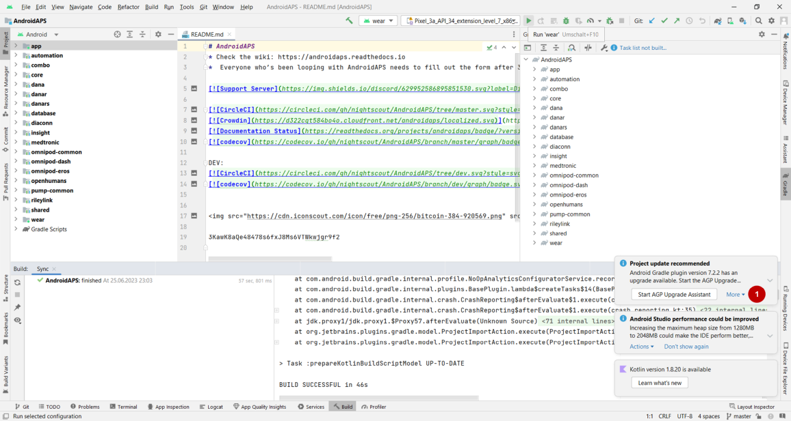

* In the dialog box the select "Don't remind me again for this project" (2).

   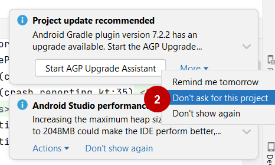

* Restart Android Studio before you continue.


## Generate signed APK

Signing means that you indicate your app to be your own creation but in a digital way as a kind of digital fingerprint within the app itself. That is necessary because Android has a rule that it only accepts signed code to run for security reasons. For more information on this topic, follow [this link](https://developer.android.com/studio/publish/app-signing.html#generate-key).

* After Android Studio is started, wait until all background tasks are finished.

   

 * **_Warning:_**  If errors occur, do not continue with the following steps.
  \
  Consult the [troubleshooting section](../Installing-AndroidAPS/troubleshooting_androidstudio.rst) for known problems!

   

* Click "Build" (1) in the menu bar and select "Generate Signed Bundle / APK..." (2).

   

* Select "APK" (1) instead of "Android App Bundle" and click "Next" (2).

   

* Make sure that module is set to "AndroidAPS.app" (1).
* Click "Create new..." (2) to start creating your key store.

   **_Note:_** A key store in this case is nothing more than a file in which the information for signing is stored. It is encrypted and the information is secured with passwords.

   

* Click the folder symbol to select a path on your computer for your key store.

   

* Select the path where your key store shall be saved (1).

   

  **_Warning: Do not save in same folder as project. You must use a different directory!_**
  A good location would be your home folder.

* Type a file name for your key store (2) and confirm with "OK" (3).


* Enter (2) and confirm (3) the password for your key store.
  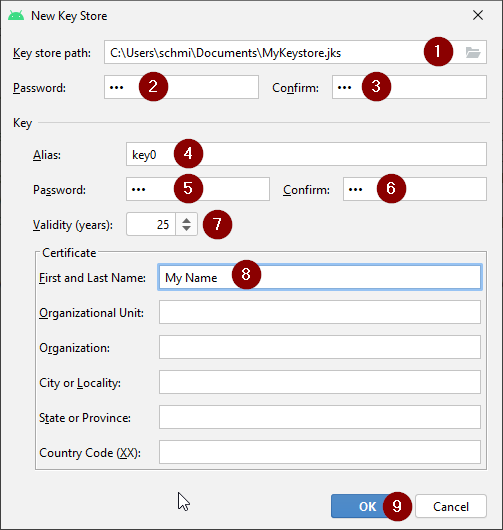

  **_Note:_** Passwords for key store and key do not have to be very sophisticated. Make sure to remember those or make a note in a safe place. In case you will not remember your passwords in the future, see [troubleshooting for lost key store](../Installing-AndroidAPS/troubleshooting_androidstudio#lost-keystore).

* Enter an alias (4) for your key. Choose whatever you like.

* Enter (5) and confirm (6) the password for your key

* Validity (7) is 25 years by default. You do not have to change the default value.

* First and last name must be entered (8). All other information is optional.

* Click "OK" (9) when you are done.

* Make sure the box to remember passwords is checked (1). So you don't have to enter them again next time you build the apk (i.e. when updating to a new AndroidAPS version).
* Click "Next" (2).

   

* Select build variant "fullRelease" (1) and press "Finish".

   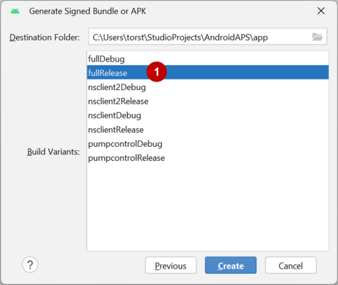

* Android Studio will show "Gradle Build running" at the bottom. This takes some time, depending on your computer and internet connection. **Be patient!**

   

* Android Studio will display the information "Generate Signed APK" after build is finished.

   

* In case build was not successful refer to the [troubleshooting section](../Installing-AndroidAPS/troubleshooting_androidstudio.rst).

* Click on the notification to expand it.

* Click on the link "locate".

   
 * If the notification is gone, you can always open the "Event log" and select the same link there.
    

* Your file manager/explorer will open. Navigate to the directory "full" (1) > "release" (2).

   

* "app-full-release.apk" (3) is the file you are looking for!


## Transfer APK to smartphone

Easiest way to transfer app-full-release.apk to your phone is via [USB cable or Google Drive](https://support.google.com/android/answer/9064445?hl=en). Please note that transfer by mail might cause difficulties and is not the preferred way.

On your phone you have to allow installation from unknown sources. Manuals how to do this can be found on the internet (i.e. [here](https://www.expressvpn.com/de/support/vpn-setup/enable-apk-installs-android/) or [here](https://www.androidcentral.com/unknown-sources)).


## Troubleshooting

See separate page [troubleshooting Android Studio](../Installing-AndroidAPS/troubleshooting_androidstudio.rst).
