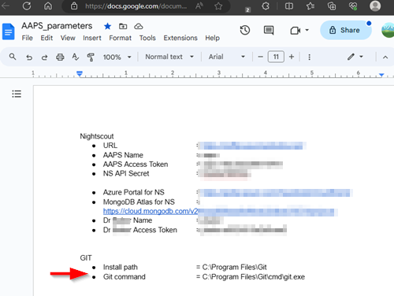
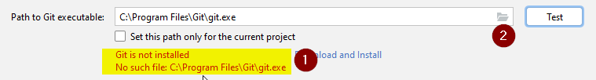
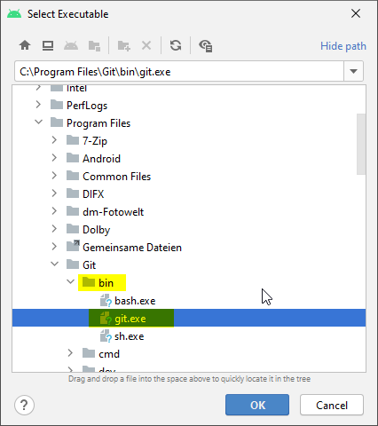
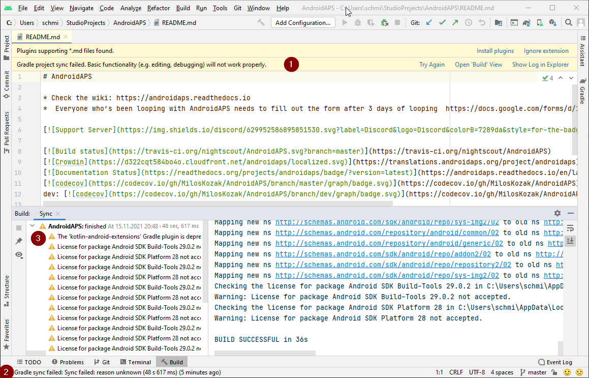
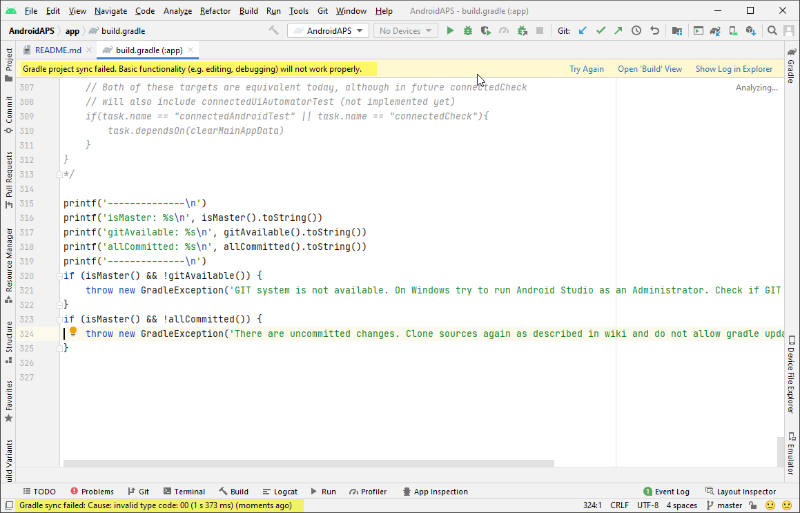

# **Building the App**

Prerequisites: 

- You have read the whole of this section “**3. Building the App**” before starting

- You have a computer and a Android phone (which will host the AAPS app) are running recent supported versions (windows 10+,  Android 9+,...)  and **all the latest security updates, have internet access and admin privileges**, since some steps require downloading and installing programs. 

- The Android phone is already tied to your personal”everyday”  email such as a Gmail account.\
  In this tutorial we use an alias "Donald Muck" with email address: <donald.muck42@gmail.com> as an example

- In this  tutorial:

  - Your CGM will send data to **AAPS**
  - **AAPS** will control your pump 
  - **AAPS** will receive BG from the CGM
  - **AAPS** will send BG & Treatments to NightScout.

Note: There are several ways to build and configure an **AAPS** system. Here we provide a step-by-step guide for building and installing the AAPS app for the most common scenario (Windows 11 PC & Android 13). 

## **Computer setup & building AAPS**

This section will get you ready for building AAPS, by setting up a dedicated email account, and downloading and installing  **Android Studio** You will then download **AAPS** source code from the internet and  build the AAPS app This includes several steps to facilitate day-to-day use, any required maintenance, tracking and troubleshooting.

### **Create an AAPS dedicated google account**

(⌛ About 5 minutes)

Since you are using an Android phone it is recommended to have a personal email account tied to your phone and which has access to an online drive (such as Gmail which has Google Drive). Some AAPS users have a dedicated email account and drive set up only for their AAPS usage (like parents or caregivers). Other AAPS users prefer to use their main email account (and online drive, if available) for AAPS as well.\
Potential advantages of using a dedicated Google account for AAPS: 

:::{admonition} why a dedicated google account?
:class: note

- Dedicated Google drive space means you will not risk filling up your personal Google drive limit with **Export Preferences**.
- Each version of **AAPS** (and supporting apps like xdrip+, BYODA, etc) will be stored in one single place which is independent of your computer hardware. If your Computer or phone is stolen/lost/broken you will still have access.
- By harmonizing the setup, it will make online support simpler across users with similar folder structure.
- Depending on the setup (see below), you will have a separate identity as an alias to communicate within the community which can protect your privacy. 
- Children with T1D can preserve their own “everyday” email account as minors while using **AAPS** and associated features which require an adult account.
- Gmail also allows you to register up to 4 accounts under the same phone number.\
  :::

If you want to set up a dedicated Google account and backup Google drive for AAPS 
follow the instructions in our  

### **Mount google drive(s) on your Computer & Phone**

(⌛About 10 minutes )\

A Gmail account provides access to free cloud storage from Gdrive which can be accessed directly as a “virtual” drive from both your Computer AND your phone. The scenario below will show you how to use this feature in order to simplify sharing files between the phone and the Computer and backup important settings/files in Gdrive.

If you have not done so already, install Gdrive on your Computer: 

#### Install Google drive (“Gdrive”) on your Computer

Please see enclosed step-by-step 4 minutes video  here:<https://youtu.be/lZs2_HOnUQ0>

1. Go to <https://drive.google.com/> 

2. Use your new  “AAPS-dedicated” account to login, (if needed switch the account from the profile window)

3. From the gear icon next to your profile picture select “Get drive for desktop”  

4. Download & Install the Gdrive application on your Computer

5. By default,Gdrive will appear on your Computer as G:\My Drive, create 3 subfolders under My Drive:

   - AAPS\_APK  \
     (to store your own versions of the AAPS application as you build it and update it overtime)
   - AAPS\_CONFIG\_BACKUP\
     (where you will keep a backup of your AAPS phone configurations overtime)
   - AAPS\_SECRETS \
     (where you will keep passwords required to rebuild the application and facilitate updates over time)

6. It is advisable to share these folders with your significant others in case they need to re-access or re-build the app for you. 

   - (1) Right click on the folder 3 vertical dots menu
   - (2) Click Share 
   - (3) Click Share 
   - Enter the email address of the people you will want to grant access to…\
     

7. Download & install the “google drive” on your phone from the playstore link\
   If you need more details, you can see the step-by-step 2 minutes video here: <https://youtu.be/1ev-DhnlJ5I> 

   - If you use an *aaps dedicated account*, make sure that you configure google drive to use the correct one by clicking on the profile picture if you use a dedidcated a…  

### **Prepare Nightscout for integration with AAPS**

(⌛About 30 minutes to setup + 15 minutes to prepare for AAPS)

:::{admonition} why Nightscout?
:class: note

Nightscout is mainly used to correlate data collected from the CGM and the pump  and generate reports which can be viewed by you and your careteam. Nightscout also has a large set of additional features including for \[caregivers]\(https\://androidaps.readthedocs.io/en/rework-project/remote-control.html#nightscout) you can read more about Nightscout in general \[here]\(<https://nightscout.github.io/#>)  

:::

#### Purchase or build a Nightscout Server

If you don’t already have one, you will need a Nightscout server]\(link to AAPS docs about Nightscout options) to use **AAPS**.  

This can be done very simply by using a paid hosting service ($5-$15 per month), or you can do it for free using cloud providers (about 1h to setup with Azure) or self-hosting solutions.\
 

A Nightscout account is currently required to pass objective 1 of the AAPS setup, and for most AAPS users it is a key reporting/analysis tool for you and your careteam. 

Instructions are available here: [New Nightscout Users — Nightscout Documentation documentation](https://nightscout.github.io/nightscout/new_user/) Make sure to store all your custom parameters, passwords and API\_TOKENs in a file on your google drive (In your google drive/My drive/AAPS\_SECRETS create a new google doc; Rename it “AAPS\_parameters”). 

For example:\
As of July 2023 these are the steps to follow to create a free Nightscout cloud hosting solution with Azure:

1.  setup the free Atlas Mongo DB\
   [MongoDB Atlas Database — Nightscout Documentation documentation](https://nightscout.github.io/vendors/mongodb/atlas/#create-an-atlas-database)
2. setup a free Nightscout docker Azure server\
   [Nightscout in Azure (Docker) — Nightscout Documentation documentation](https://nightscout.github.io/vendors/azure/new_user/)
3. make sure to save your NightScout API Secret. 

<!---->

#### Preparing Nightscout to receive data from AAPS

In this example Donald Muck is hosting Nightscout in Azure and using the free MongoDB, depending on which option you have gone for, adapt the following guidance accordingly…)

Enable Nightscout roles and disable public access

1. **First read the doc!** \
   read the whole page in nightscout documentation: [Nightscout Security and Privacy — Nightscout Documentation documentation](https://nightscout.github.io/nightscout/security/)
2. **Second create a role for AAPS**\
   (this will used with newer versions of Nightscout 15+)\
   In Nightscout itself, create a role for **AAPS** to get access to Nightscout.  In this case, since it is required to upload BG and treatments to Nightscout, it  will be using an “**admin**” role.\
   <https://nightscout.github.io/nightscout/security/#create-authentication-tokens-for-users> 

Consider if you would like to add another few roles to grant read access to your careteam, yourself, an M5 stack device etc…\

Take note of the Nightscout **AAPS** account name and access Token that you just created:

- In your google drive/My drive/AAPS\_SECRETS create a new Google doc
- Rename it “AAPS\_parameters”
- Enter “ Nightscout AAPS Name=...”
- Enter “Nightscout AAPS Access Token=...” 
- Enter “Nightscout URL= [https://XYZ…](about:blank) “
- Enter “Nightscout API Secret =...”  (saved earlier, you can also find it from your Azure configuration screen with the other environment variables, it is used by older versions of NightScout up to 14)

Here is an example of Donald Muck’s AAPS\_paramaters file, note that it has also created optional entries like an access Token for its doctor to have direct access to its nightscout instance and added links to remember its Azure portal URL and its MongoDB portal URL.

3. **Save your NS API Secret  & disable public access**\
   In Donald Muck’s azure configuration page:\
   (1) it can display the API\_SECRET value and save into its AAPS\_parameters file it hasn’t done so yet.

(2) Add the _AUTH\_DEFAULT\_ROLES_ variable and set it up to “_denied_”\
Then click the “restart” option in Azure to restart the nightscout server.\
This is the documentation link:  [Nightscout Security and Privacy — Nightscout Documentation documentation](https://nightscout.github.io/nightscout/security/#how-to-turn-off-unauthorized-access)\

### **Install Git on your computer**

(⌛About 4 minutes to setup)

:::{admonition} why git?
:class: note

Git is known as a “_Versioning control System_” (VCS).\
Git is a program that allows developers to track changes in their code and collaborate with each other. You will use Git to make a copy of the AAPS source code from the Github website to your local computer. Then you will use your local copy to build the AAPS phone application. You can also use Git to add your own enhancements in the code and send it back to the developer community etc… 

:::

A video recording of the installation is available here:\
<https://youtu.be/6glFOHpZGXA>

#### Download Git

<!---->

1. Any recent Git version should work for both Mac and Windows. For example <https://git-scm.com/download/win>.
2. Make sure to note down the installation path. You will need it in the next step.
3. The Git install program will ask you about many options, you should be fine picking the default to all options EXCEPT when asked about “**_Choosing the default editor for Git_**”.. Unless you are familiar with VIM, change the default to “**_notepad”_** (or any other preferred program that you are familiar with, personally I notepad++). In this tutorial, you will not  need the Git editor but if later on you have a need for it this will make life less difficult. 
4. After the install, check that everything is proper by starting a cmd prompt and confirm you can execute “**_git.exe –version_**”. You can also find the installation path of Git by running “**_where git_**” so you can save it in your AAPS\_parameters file. 
5. Save the git path and commands in your AAPS\_paramaters file as well. (This is useful when you need to reinstall Android Studio if it can’t detect it automatically).\
   
6. If you get an error try to reboot your computer before the next step.

<!---->

### **Install Android Studio**

(⌛About 7 minutes to setup)

:::{admonition} why Android Studio?
:class: note

Android Studio is a programme to programme programmes!  Basically, it is a studio programme which runs on your computer and allows you to:

- Download source code from the internet (using git)
- Modify (aka programme) some programming language source code (typically in java, kotlin, python… )
- Upload source code to the internet (using Git)
- Translate (aka compile) the source code into a binary language which can get executed by a microprocessor
- Merge this binary with android libraries (aka link) into an Android Application Package programme (aka an apk file) which can be executed by an Android device. 

:::

As of July 2023, using Android Studio (version:_Giraffe 2022.3.1_) you can still follow these steps and screenshots taken originally from Android Studio (version: _Flamingo 2022.2.1)_. Screens can change in future versions of Android Studio. But you should be able to find your way through. [Help from the community](https://androidaps.readthedocs.io/en/rework-project/Where-To-Go-For-Help/Connect-with-other-users.html) is provided.\
If you need more assistance you can see a screen recording  of an install here: <https://drive.google.com/file/d/1-hi1UD1bsY5R-NzFJd20tPQTsulBjcOC/view?usp=drive_link> 

One of the most important things when installing Android Studio: **Be patient!** During installation and setup, Android Studio is downloading a lot of packages and this  takes time!.

Download [Android Studio from here](https://developer.android.com/studio/install.html) and install it on your computer.

On first start you will find the setup wizard:

Select “Do not import settings” as we don’t want to import settings from previous installations.

Decide whether you want to share data with Google or not.

On the following screen click “Next”.

Select “Standard” installation and click “Next”.

Select the theme for the user interface you like. Then click “Next”.

Note**_:_** This is just the color scheme. You can select whatever you like (i.e. “Darcula” for dark mode). This selection has no influence on building the APK but the following screenshots might look different.

Click “Next” on the “Verify Settings” dialog.

Select “Accept” and click “Finish” on the License Agreement dialog.

**_Note:_** Depending on your setup the licenses to be accepted might vary from what is shown in the screenshot.

Wait while Android Studio downloads additional components and be patient. Once everything is downloaded in Android Studio select the “Finish” button when it turns blue. Click the button now.

## Set Git path in preferences

Make sure G[it is installed](https://androidaps.readthedocs.io/en/rework-project/Installing-AndroidAPS/git-install.html) on your computer and you have restarted your computer after installing it.

On the Android Studio welcome screen click “Customize” (1) on the left and then select the link “All settings…” (2):

### Windows

- Double-click “Version Control” (1) to open the sub-menu.
- Click Git (2).
- Make sure the update method “Merge” (3) is selected.
- Check if Android Studio can locate the path to git.exe automatically by clicking the button “Test” (4).\
  
- If automatic setting is successful, the Git version will be displayed next to the path (it does not matter if the GIT version is not the latest version. Any recent GIT version will do).\
  

:::{admonition} What to do if Git is not found?
:class: info

- Eventually git.exe cannot be found automatically or the Test will result in an error (1):\
  \
  In this case, if you can't locate git's location or didn't save it in your cheat sheet click on the folder icon (2).
- Use [search function](https://www.tenforums.com/tutorials/94452-search-file-explorer-windows-10-a.html) in windows explorer to find “git.exe” if you are unsure where git has been installed. You are looking for a file named “git.exe”, located in \*_\bin\*_ folder.
- Select path to git.exe and make sure you selected the one in ** \bin\ ** folder (3) and click “OK” (4).\
  
- Check your selected git path again with the “Test” button as described above.

:::

- When the Git version is displayed next to the path (see screenshot above), close settings window by clicking “OK” button (5).

### Mac

- Any Git version should work. For example <https://git-scm.com/download/mac>.
- Use homebrew to install git: `$ brew install git`.
- For details on installing git see the [official git documentation](https://git-scm.com/book/en/v2/Getting-Started-Installing-Git).
- If you install Git via homebrew there is no need to change any preferences. Just in case: They can be found here: Android Studio - Preferences.

### **Download the AAPS source code**

(⌛About 12 minutes to complete)

:::{admonition} why does it take so long the first time?
:class: note

The first time AAPS is downloaded, Android Studio will connect over the internet to the Github website to download the source code for AAPS. This includes the actual source code of the current version of AAPS as well as past versions and ongoing beta and development files.  This should take about 1 minute. 

Android Studio will then use Gradle (a development tool included  Android studio) to identify other components needed to install these items on your computer. This takes much longer, about 10 minutes the first time.

Later on, when you need to update your application, most of the files will already be present on your local computer and only newer/changed files will be downloaded which should speed up the process. 

Note: Even if you uninstall Android Studio, most of these files will remain, making the reinstallation of Android Studio “_from scratch”_ much faster.\
:::

Please follow the steps below\
(If needed, you can find an installation demo video recording here:\
<https://youtu.be/t_U8YSg1mwM> )

- On the Android Studio welcome screen select “Projects” (1) on the left and then “Get from VCS” (2). (VCS stands for Version Control System, which in our case is the Git program you just configured earlier.)\
  

-

- If you already opened Android Studio and do not see the welcome screen anymore select File (1) > New (2) > Project from Version Control… (3)

- 

- We will now tell Android Studio where to get the code from:

  - Make sure you have selected “Repository URL” on the left (1).
  - Check if “Git” is selected as version control (2).\
    Copy and paste the URL\
    `https://github.com/nightscout/AndroidAPS.git`
  - to the main AAPS repository into the URL textbox (3).
  - Choose the directory where you want to save the cloned code (4).

<!---->

- Click button “Clone” (5).\
  
- Android Studio will now download the source code from the internet Github web site on your local computer (aka _cloning the AAPS Git repository_)\
  
- After the Repository is cloned successfully, Android Studio will open the cloned project.
- If asked whether you want to trust the project: click on “Trust project”!\
  
- In the status bar at the bottom you will see the information that Android Studio is running background tasks. Be aware this can take a long time depending on your computer hardware, your internet access speed and if an earlier version of Android Studio was ever installed.\
  
- If your firewall asks you to grant access, allow it since Android Studio is going to need to download additional libraries/sdk etc...\
  
- Once the background tasks are finished you will probably see an error saying that errors occurred (1) or (2) or (3).\
  \
  Or like this: DO NOT UPDATE GRADLE 
- 

Don’t worry, this will be solved soon! Please ignore the following Gradle message prompt here:

Android Gradle plugin version 7.2.2. …upgrade available. Start the AGP Upgrade Assistant to update this project's AGP version.

This will interfere with your build.

### **Download the Android SDK**

(⌛About 5 minutes to complete)

:::{admonition} what is an Android SDK?
:class: note

In order to run AAPS on the phone the application needs to integrate with Android itself. Android provides “_software development kits_” (SDK)  which allow applications like AAPS to interface with an Android operating system. For instance each version of Android might have a slightly different way to handle keyboard inputs and gestures. 

- You will need to instruct Android Studio to use a specific version of the Android SDK to create an image compatible with your phone. Since AAPS 3.x is designed to run on top of Android 9 and above this is the version we will ask Android Studio to download. 
- Applications built with Android 9 SDK should work with subsequent versions (Android 10,11,12,13,...). However if you need to use an older phone, you will need to use an older version of AAPS as per the documentation\
  :::

Please follow the steps below\
(If needed, you can find an installation video recording here:
<https://youtu.be/kOwv3JlsQ0k> )

- In the menu, go to File (1) > Settings (2) (or Android Studio > Preferences on Mac).\
  

<!---->

- In the search box, search for “sdk” (1)
- Select Android SDK (2).
- Tick the box left of “Android 9.0 (Pie)” (3) (API Level 28).\
  
- Confirm changes by clicking OK.\
  
- If prompted,  Accept license agreement (1) and click “Next” (2).\
  
- Wait until the SDK download and installation is finished.\
  
- When SDK installation is completed the “Finish” button will turn blue. Click this button.\
  

:::{admonition} NEVER UPDATE GRADLE!
:class: warning

Android Studio might recommend updating the gradle system. **Never update gradle!** This will lead to difficulties!\
:::

- If you see a notification on the lower or  right side of your Android Studio window that Android Gradle Plugin is ready to update click on the text “More” (1).
- In the dialog box the select “Don’t ask for this project” (2).\
  

### **Restart Android Studio before the next step**

Might be doing something, might be for voodoo luck, in any case, just restart the program…\

### **Build & Sign  the APK**

(⌛About 17 minutes to complete - depends on your computer speed)

&#x20;

:::{admonition} Why signing Android apps?
:class: note

Android (like Apple’s IOS) requires each application to be signed to ensure that it can later only get updated from the same trusted source who released the original application.  For more information on this topic, follow [this link](https://developer.android.com/studio/publish/app-signing.html#generate-key).\
:::

Please follow the steps below\
(If needed , you can find an installation video recording here:\
)

So now that we have installed Git, Android Studio, downloaded the AAPS source code, a compatible Android version SDK and let Gradle do whatever Gradle does… We can actually build and sign the AAPS phone app itself!   

- After Android Studio has started, wait until all background tasks are finished and these are displayed in the bottom right section of the main window(1).:

- on the left side on Android Studio you have the status of the last activity 

  - "daemon started successfully"
  - on the right side there is what's actively going on right now\... "Scanning Files to index..."
  - Please wait for all the messages on the right side to disappear.. This means your apk build is finished...\
    

- **_Warning:_** If errors occur, do not continue with the following steps.\
  Consult the [troubleshooting section](https://androidaps.readthedocs.io/en/rework-project/Installing-AndroidAPS/troubleshooting_androidstudio.html) for known problems!\
  

- Click “Build” (1) in the menu bar and select “Generate Signed Bundle / APK…” (2).\
   

<!---->

- Select “APK” (1) instead of “Android App Bundle” and click “Next” (2).\
  

<!---->

- Make sure that module is set to “AAPS.app” (1).
- Click “Create new…” (2). ****\
  

<!---->

- This opens a “**new Key store”** window. Click the folder symbol to select a path on your computer for your key store by clicking the “**key store path**” folder icon.\
  **_Note:_** A key store in this case is a file in which the information for signing is stored. It is encrypted and the information is secured with passwords.\
  

- This will open a new window, aptly named  “Choose keystore file”... 

  - Select the path where your key store shall be saved (1); it is a good idea to keep your keystore on your google drive AAPS\_SECRETS folder.\
    **_Warning: Do not save in the same folder as project. You must use a different directory!_** 
  - Type a file name for your key store (2) 
  - confirm with “OK” (3).\
    

<!---->

- Open your Google drive AAPS\_paramaters file to save your passwords…\
  You will need a Keystore password and  key password. In our case, we will use the same relatively simple string made of letters and digits, no special characters.\
  Make sure to save the passwords (1 & 2) in your Google drive AAPS\_parameters file as well as the key alias(3). \
  The password is required to simplify the upgrade process of AAPS later on. Copy the passwords then go back to Android Studio’s screen  

<!---->

- Back to the Android Studio’s “**New Key Store**” window.\
  1 Check the **Key store path**2 & 3, Enter the  **Key store password**4 check the **key Alias**5 & 6,  Enter the **key Password**7 check that the **validity** is 25 years(default value)\
  8 Enter a name (use your dedicated AAPS google account pseudonym )\
  9 click “**OK**”\
  **_Note:_** In case you will not remember your passwords in the future, see [troubleshooting for lost key store](https://androidaps.readthedocs.io/en/rework-project/Installing-AndroidAPS/troubleshooting_androidstudio.html#troubleshooting-androidstudio-lost-keystore).

<!---->

- Back to “**Generate Signed Bundle or APK**” window!\
  1 IMPORTANT - Make sure the box to remember passwords is checked/ticked. This will avoid the need to enter your password again the next time you build the apk (i.e. when updating to a new AAPS version).\
  2 Click “Next”\
  

<!---->

- Select build variant “fullRelease” (1) and press “Create”.\
  
- Android Studio will show “Gradle Build running” at the bottom. This takes some time, depending on your computer and internet connection. **Be patient!** (about 18 minutes as timed for this Donald Muck’s build)********

<!---->

- When Android Studio is done:\
  1\) it will display the information “Generate Signed APK” in the bottom left.\
  → Ifn case the build was not successful refer to the [troubleshooting section](https://androidaps.readthedocs.io/en/rework-project/Installing-AndroidAPS/troubleshooting_androidstudio.html).\
  2\) if you can’t find the “generate signed APK” notification anymore, click on the notifications tab all the way on the right edge of the Android studio window. All the notifications will show on the right side of the screen starting with the most recent on top.\
  3\) click the “locate” link to find the folder where the “apk” file has been generated.\
  

<!---->

- This will open a window explorer window with a “release” folder…  \
  1\)  inside the release folder you will find the actual phone app: \
  2\) app-full-release.apk  \
  3\) (and a output-metadata.json that you can ignore)\
  4\) open another window explorer window in your google drive’s AAPS\_APK folder\
  5\) create a new subfolder with the name of your build: AAPS\_3.1.0.03\_AUGUST.2023 or AAPS\_3.1\_myfirstbuild or AAPS\_3.1… usually tracking the version number or the date makes the most sense.\
  

<!---->

- Copy and paste the “apk” file from your computer into google drive…\
  Since google drive is in the cloud and also visible to your phone, you will be able to install the application in the next chapter…\
  

Next Step: installing and configuring  **AndroidAPS** on the phone

