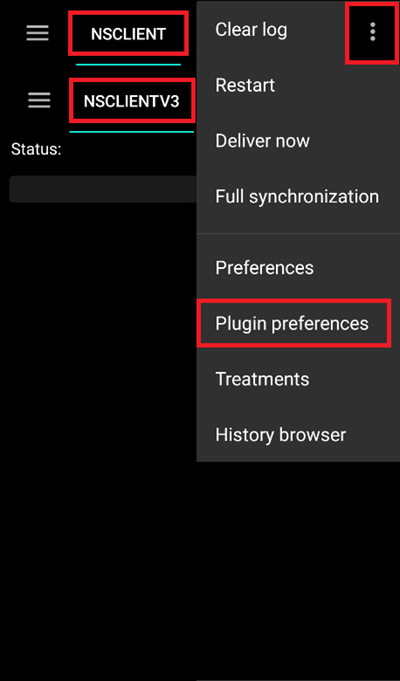
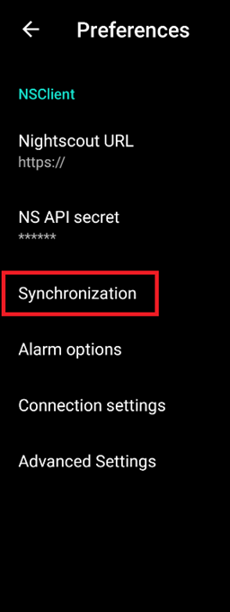
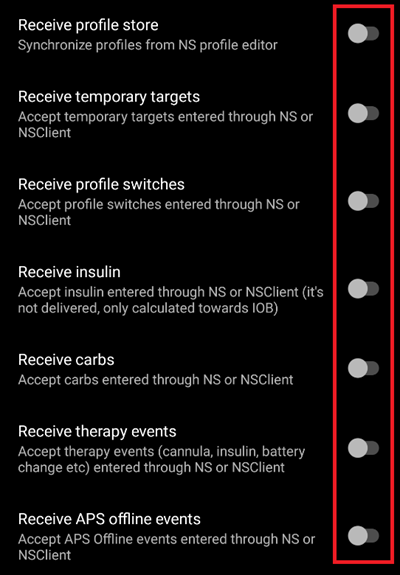

# Nightscout

(Nightscout-security-considerations)=
## Security considerations

Besides reporting, Nightscout can also be used to remotely control AAPS, meaning you can set temp targets, change or modify profiles, add future carbs or log insulin. This information will be picked up by AAPS and it will act correspondingly. Therefore it is worth thinking about securing your Nightscout website.

### Nightscout settings

You can deny public access (viewing) to your Nightscout site by using [authentication roles](https://nightscout.github.io/nightscout/security/#how-to-turn-off-unauthorized-access), this is a matter of privacy.  
Keep in mind you can only modify data in Nightscout when having an admin token or the API secret.

### AAPS settings

You can setup Nightscout to upload only (no sync) in AAPS settings. By doing so AAPS will not pick up and enact changes done in Nightscout. 

* Select the NSCLIENT tab from the main menu or in the tabs list.

* Open the plugin menu (three dots top right).

* Select "Plugin preferences".

  

* Scroll down and tap "Synchronization".

  

* Disable all "Receive" options.

### Further security settings

Keep your phone up to date as described in [safety first](../Getting-Started/Safety-first.md).

(Nightscout-manual-nightscout-setup)=
## Manual Nightscout setup

It is assumed you already have a Nightscout site, if not, visit the [Nightscout](http://nightscout.github.io/nightscout/new_user/) page for full instructions on set up. The information below are the settings you will also need to add/modify to your Nightscout site. 

Please check you are running the [latest version](https://nightscout.github.io/update/update/#updating-your-site-to-the-latest-version) otherwise you might get an error message on your AAPS app. 

* Enter the [variables editing](https://nightscout.github.io/nightscout/setup_variables/#nightscout-configuration) interface matching your Nightscout platform.
* Add or edit the variables as follows:
  * `ENABLE` = `careportal boluscalc food bwp cage sage iage iob cob basal pushover bgi pump openaps`  
    *Note: Add missing entries to the`ENABLE` variable.*
  * `DEVICESTATUS_ADVANCED` = `true`
  * `SHOW_FORECAST` = `openaps`
  * `PUMP_FIELDS` = `reservoir battery clock`
  * Various alarms can be set for [monitoring the pump](https://github.com/nightscout/cgm-remote-monitor#pump-pump-monitoring), battery % in particular is recommended (except for Omnipod):
    * `PUMP_WARN_BATT_P` = `51`
    * `PUMP_URGENT_BATT_P` = `26`  

* Make sure to save the modifications.

## Semi-automated Nightscout setup

Use your [vendor](https://nightscout.github.io/nightscout/new_user/#vendors-comparison-table) web interface to setup the variables mentioned above, contact the vendor support service if you need help.

