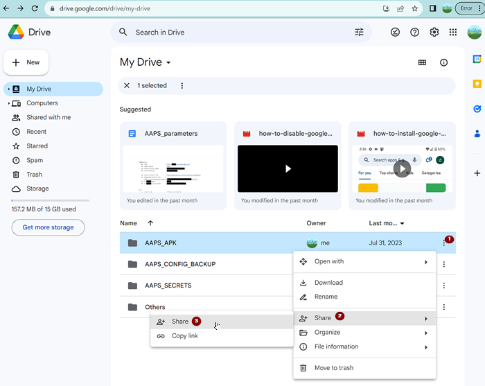

# Transferring, and Installing AAPS on your smartphone

In the previous section, [building **AAPS**](../building-AAPS.md), you built the **AAPS** app (which is an .apk file) on a computer. 

The next steps are to transfer the **AAPS** APK file (and other apps you may need, like BYODA, Xdrip+ or another CGM reciever app) to your Android smartphone and then install the app. 

Following installation of **AAPS** on the smartphone, you will then be able to move onto [**configuring the AAPS loop**](configuring-the-AAPS-loop.md).

There are several ways to transfer the **AAPS** APK file from your computer to the smartphone. Here we explain two different ways: 

* Option 1-  Use a USB cable
* Option 2 -  Use your Google drive (Gdrive)

The easiest way is with a USB cable, moving the file from the computer to the "downloads" folder on the phone. 

You can also use your **Google Drive** to do the transfer and installation. By using **Google Drive**, you automatically have a **backup copy** of the apk file, which will be very useful if you lose or break your computer or smartphone.

Once you have transferred the AAPS apk as well as the app you intend to use for receiving your CGM data (BYODA, Xdrip+ or ..Juggulo), to your Android phone, you can proceed to the next section, installing AAPS. 

## 1. Transfer using a USB cable


## 2. Transfer using Google drive
### **Mount Google drive on your PC & Phone**

(⌛About 10 minutes )\


A Gmail account provides access to free cloud storage from Gdrive which can be accessed directly as a “virtual” drive from both your PC AND your phone. You can use this feature to backup important settings/files in Gdrive and to share files between the phone and the PC.
If you have not done so already, install Gdrive on your PC: 


#### Install Google drive (“Gdrive”) on your PC as shown in this walk-through: 
<https://drive.google.com/file/d/1EnaQ7U8U7M84vOFjcMRoB43dNwqUuLty/view?usp=drive_link>


The steps are as follows: 

1. Go to <https://drive.google.com/> 

2. Use your new  “AAPS-dedicated” account to login, (if needed switch the account from the profile window)

3. From the gear icon next to your profile picture select “Get drive for desktop”  

4. Download & Install the Gdrive application on your PC

5. By default,Gdrive will appear on your PC as G:\My Drive, create 3 subfolders under My Drive:

   - AAPS\_APK  \
     (to store your own versions of the AAPS application as you build it and update it overtime)
   - AAPS\_CONFIG\_BACKUP\
     (where you will keep a backup of your AAPS phone configurations overtime)
   - AAPS\_SECRETS \
     (where you will keep passwords required to rebuild the application and facilitate updates over time)

6. It is advisable to share these folders with your significant others in case they need to re-access or re-build the app for you. 

   - (1) Right click on the folder 3 vertical dots menu
   - (2) Click Share 
   - (3) Click Share 
   - Enter the email address of the people you will want to grant access to…\
     

7. Download & install the “google drive” on your phone from the playstore link\
   If you need more details, you can see the step-by-step 2 minutes video here: <https://drive.google.com/file/d/1--qwxp95cG8pwCv1pDFZuuOl6ue22W4H/view?usp=drive_link> 

   - If you use an **AAPS**-dedicated Gmail account, make sure that you configure google drive to use the correct one by clicking on the profile picture.


Step-by-step guide:

a) Open [Google.com](https://www.google.com/) in your web browser.

b) On the right upper side select the Drive app in the Google menu.


c) Right-click in the free area below the files and folders in the **Google Drive** app and select "Upload File".


d) The apk file should now be uploaded on Google Drive.

## Install  the **AAPS** APK file on your Android smartphone

a) Switch to working on your Android smartphone, and start the **Google Drive** app, which should be preinstalled on the phone. 


b) Launch installation of the **AAPS** apk by double-clicking on the filename in the **Google Drive** App.


c) If you get a security notice that you are "not allowed to install apps from **Google Drive**", you will need to allow it while you are installing the app, and then disallow it afterwards to prevent it being a security risk.


d) Now that you have installed **AAPS** on the Android smartphone you should see the **AAPS** icon and be able to open the app. 

```{warning}
**IMPORTANT SAFETY NOTICE**

Did you remember to disallow the installation from Google Drive?

```
Congratulations! Now you can continue with the next section, [configuring the AAPS loop](configuring-the-AAPS-loop.md).
