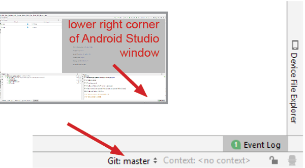
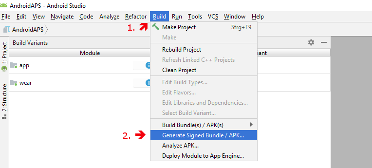

# Update to a new version or branch

## Build yourself instead of download

**AndroidAPS is not available as download due to regulation for medial devices. It is legal to build the app for your own use but you must not give a copy to others! See [FAQ page](../Getting-Started/FAQ.md) for dertails.**

## Important notes

<font color="#FF0000"><b>Important note: As of version 2.3 you have to use git to update. Updating via zip file does not work anymore.</font></b>. 

***Note***: Please use [Android Studio Version 3.5.1](https://developer.android.com/studio/) or newer to build the apk.

## Install git (if you don't have it)

### Windows

* Any git version should work. For example [https://git-scm.com/download/win](https://git-scm.com/download/win)
* Make sure to note down the installation path. You will need it in the next step.

   

* Reboot your PC to update System Environment.
* Let Studio know where is git.exe located: File - Settings 

   

* In the next window: Version Control - Git

* Choose correct path: .../Git<font color="#FF0000"><b>/bin</b></font>

* Make sure update method "Merge" is selected.

   

### Mac

* Any git version should work. For example [https://git-scm.com/download/mac](https://git-scm.com/download/mac)
* Use homebrew to install git: ```$ brew install git```.
* For details on installing git see the [official git documentation](https://git-scm.com/book/en/v2/Getting-Started-Installing-Git).
* If you install git via homebrew there is no need to change any preferences. Just in case: They can be found here: Android Studio - Preferences.


## Update your local copy

* Click: VCS->Git->Fetch

   


## Selecting branch

* If you want to change branch select another branch from tray: master (latest release) or another version (please see below)

   

and then checkout (You can use 'Checkout as New Branch' if 'Checkout' is not available.)

   


## Updating branch from Github

* Press Ctrl+T, select Merge method and press OK

   

On the tray you'll see green message about updated project

## Generate signed APK
<!--- Text is maintained in page building-apk.md --->
In the menu select "Build" and then "Generate Signed Bundle / APK...". (The menu in Android Studio changed as of September 2018. In older versions select in the menu “Build” and then “Generate Signed APK...”.)<br>
Signing means that you sign your generated app but in a digital way as a kind of digital fingerprint in the app itself. That is necessary because Android has a rule that it only accepts signed code to run for security reasons. For more information on this topic, follow the link [here](https://developer.android.com/studio/publish/app-signing.html#generate-key) Security is a deep and complex topic and you don't need this now.



In the following dialogue box select "APK" instead of "Android App Bundle" and click button "Next".


Select "app" and click "Next".


Enter your key store path, enter key store password, select key alias and enter key password. 

Select 'Remember passwords'.

Then click next.


Select "full" as flavour for the generated app.
Select V1 "Jar Signature" (V2 is optional) and click "Finish".
The following information might be important for later use.
* 'Release' should be your default choice for "Build Type", 'Debug' is just for people coding.
* Select the build type you want to build. 
  * full (i.e. recommendations automatically enacted in closed looping)
  * openloop (i.e. recommendations given to user to manually enact)
  * pumpcontrol (i.e. remote control for pump, no looping)
  * nsclient (i.e. looping data of another user is displayed and careportal entries can be added)


In the event log you see that the Signed APK was generated successfully.


Click the "locate" link in the event log.


## Transfer APK to smartphone
<!--- Text is maintained in page building-apk.md --->
A file manager window opens. It might look a bit different on your system as I am using Linux. On Windows there will be the File Explorer and on Mac OS X the Finder. There you should see the directory with the generated APK file. Unfortunately this is the wrong place as "wear-release.apk" is not the signed "app" APK we are searching for.


Please change to the directory AndroidAPS/app/full/release to find the "app-full-release.apk" file. Transfer this file to your Android smartphone. You can do it on your preferred way, i.e. Bluetooth, cloud upload, connect computer and phone by cable or use email. I use Gmail here in this example as it is fairly simple for me. I mention this because to install the self-signed app we need to allow Android on our smartphone to do this installation even if this file is received via Gmail which is normally forbidden. If you use something other please proceed accordingly.


In the settings of your smartphone there is an area "unknown apps install" where I have to give Gmail the right to install APK files which I get via Gmail.

Select "Allow from this source". After the installation, you can disable it again.


The last step is to press on the APK file I got via Gmail and install the app. If the APK does not install and you have an older version of AndroidAPS on your phone that was signed with a different key then you will need to uninstall this first, remember to export your settings if so!

Yeah, you got it and can now start with configuring AndroidAPS for your use (CGMS, insulin pump) etc.


## Check AAPS version on phone

You can check the AAPS version on your phone by clicking the three dots menu on the top right and then about.


# Troubleshooting

See separate page [troubleshooting Android Studio](../Installing-AndroidAPS/troubleshooting_androidstudio.rst).
