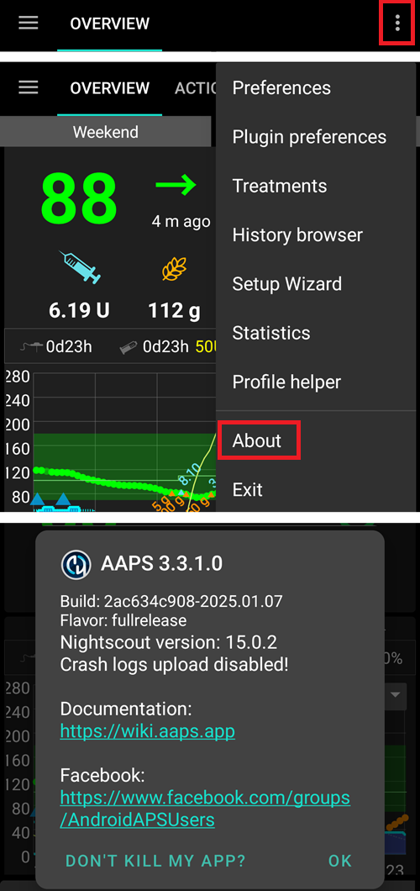

# Update to a new version or branch

## Build yourself instead of download

**AndroidAPS is not available as download due to regulation for medial devices. It is legal to build the app for your own use but you must not give a copy to others! See [FAQ page](../Getting-Started/FAQ.md) for details.**

## Important notes

* Please update as soon as possible after a new release is available. You will receive an [information on the AndroidAPS home screen](../Installing-AndroidAPS/Releasenotes#release-notes) about the new version.
* As of version 2.3 you have to use git to update. Updating via zip file does not work anymore.
* As of version 2.7 repository location changed to [https://github.com/nightscout/AndroidAPS](https://github.com/nightscout/AndroidAPS). If you are not familiar with git the easiest way for update is remove directory with AndroidAPS and do a [new clone](../Installing-AndroidAPS/Building-APK.md).
* Please use **[Android Studio Version 2020.3.1](https://developer.android.com/studio/)** or newer to build the apk.
* [Windows 10 32-bit systems](../Installing-AndroidAPS/troubleshooting_androidstudio#unable-to-start-daemon-process) are not supported by Android Studio 2020.3.1.
* If you are using xDrip make sure to [identify the receiver](../Configuration/xdrip#identify-receiver).
* You can also use Dexcom G6 with the ['Build your own Dexcom App'](../Hardware/DexcomG6.html#if-using-g6-with-build-your-own-dexcom-app).

## Quick walk-through for experienced users

Please skip this paragraph if you are updating for the first time. The quick walk-through is for experienced users. Your next step would be to [install git](../Installing-AndroidAPS/git-install.rst) if you do not have it already.

If you have already updated AAPS from previous versions and use a Windows PC you can update in four simple steps:

1. [Export your settings](../Usage/ExportImportSettings#export-settings) from the existing AAPS version on your phone to be on the save side
2. [Update local copy](../Installing-AndroidAPS/Update-to-new-version#update-your-local-copy) (VCS->Git->Pull)
3. [Generate signed APK](../Installing-AndroidAPS/Update-to-new-version#generate-signed-apk) (Select 'app' instead of 'wear' on your way!)
4. Depending on your [BG source](../Configuration/BG-Source.rst) make sure to [identify receiver](../Configuration/xdrip#identify-receiver) in xDrip or use the ['Build your own Dexcom App'](../Hardware/DexcomG6.html#if-using-g6-with-build-your-own-dexcom-app).

## Install git (if you don't have it)

Follow the manual on the [git installation page](../Installing-AndroidAPS/git-install.rst).

## Update your local copy

* As of version 2.7 repository location changed to [https://github.com/nightscout/AndroidAPS](https://github.com/nightscout/AndroidAPS). If you are not familiar with git the easiest way for update is remove directory with AndroidAPS on your disk and follow the instructions to do a [New clone](../Installing-AndroidAPS/Building-APK.md).
If you have already changed the URL or update from version 2.8.x, follow these steps:

* Open your existing AndroidAPS project with Android Studio. You might need to select your project. (Double) click on the AndroidAPS project.
  

* In the menu bar of Android Studio, select Git -> Fetch

   

* You will see a message in the lower right corner that Fetch was successful.

   

* In the menu bar, now select Git -> Pull

     

* Leave all options as they are (origin/master) and select Pull

   

* Wait while download is in progress, you will see this as info in the bottom bar. When it's done, you will see a success message.
Note: The files that were updated may vary! This is not an indication

   

* Gradle Sync will be running a couple of seconds do download some dependencies. Wait until it is finished.

  

* Your sourcecode is now the current released version.
It's time to build the signed apk from it.
[Build signed apk section](../Installing-AndroidAPS/Building-APK.html#generate-signed-apk)

## Check AAPS version on phone

After you installed the new apk, you can check the AAPS version on your phone by clicking the three dots menu on the top right and then About.

## Troubleshooting

See separate page [troubleshooting Android Studio](../Installing-AndroidAPS/troubleshooting_androidstudio.rst).
