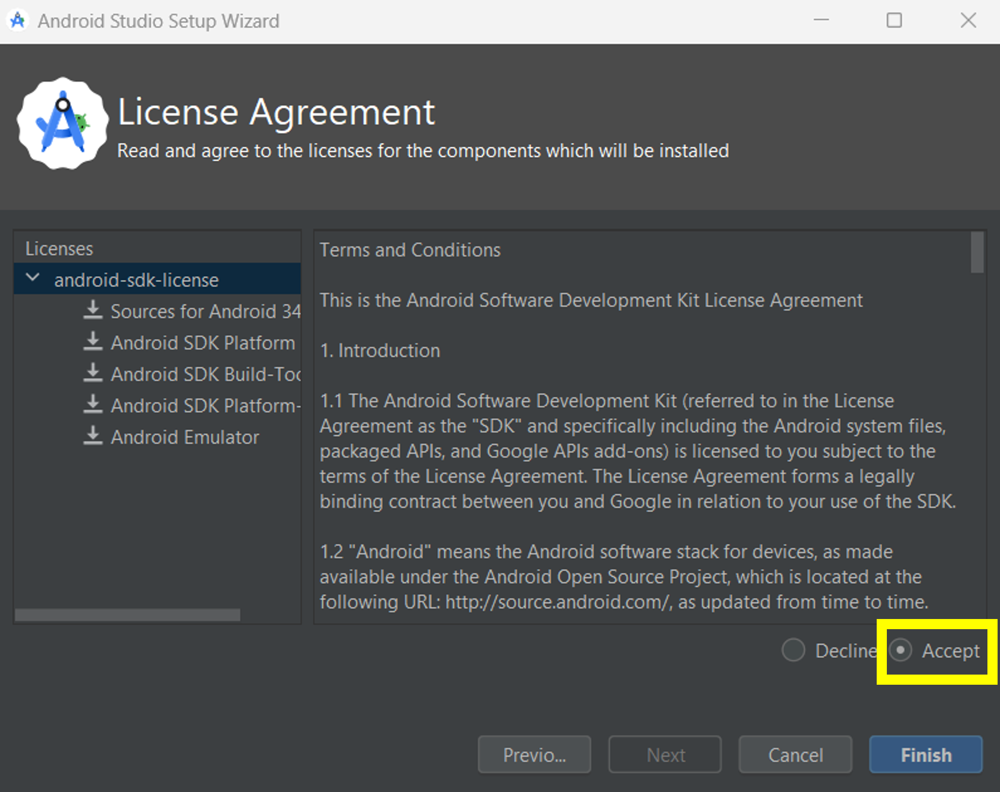

# Building AAPS

## Build yourself instead of download

**The AAPS app (an apk file) is not available for download, due to regulations around medical devices. It is legal to build the app for your own use, but you must not give a copy to others!**

See [FAQ page](../Getting-Started/FAQ.md) for details.


(Building-APK-recommended-specification-of-computer-for-building-apk-file)=
## Computer and software specifications for building AAPS

* Please use the **[Android Studio version called "Hedgehog"(2023.1.1)](https://developer.android.com/studio/)** to build the apk. If you use an older version, please use one which is no older than "**Giraffe**".
* [Windows 32-bit systems](troubleshooting_androidstudio-unable-to-start-daemon-process) are not supported by Android Studio. Please keep in mind that both **64 bit CPU and 64 bit OS are mandatory condition.** If your system DOES NOT meet this condition, you have to change affected hardware or software or the whole system.  

<table class="tg">
<thead>
  <tr>
    <th class="tg-baqh">OS (Only 64 bit)</th>
    <th class="tg-baqh">Windows 8 or higher</th>
    <th class="tg-baqh">Mac OS 10.14 or higher</th>
    <th class="tg-baqh">Any Linux supports Gnome, KDE, or Unity DE;&nbsp;&nbsp;GNU C Library 2.31 or later</th>
  </tr>
</thead>
<tbody>
  <tr>
    <td class="tg-baqh"><p align="center">CPU (Only 64 bit)</td>
    <td class="tg-baqh">x86_64 CPU architecture; 2nd generation Intel Core or newer, or AMD CPU with support for a <br><a href="https://developer.android.com/studio/run/emulator-acceleration#vm-windows" target="_blank" rel="noopener noreferrer"><span style="text-decoration:var(--devsite-link-text-decoration,none)">Windows Hypervisor</span></a></td>
    <td class="tg-baqh">ARM-based chips, or 2nd generation Intel Core or newer with support for <br><a href="https://developer.android.com/studio/run/emulator-acceleration#vm-mac" target="_blank" rel="noopener noreferrer"><span style="text-decoration:var(--devsite-link-text-decoration,none)">Hypervisor.Framework</span></a></td>
    <td class="tg-baqh">x86_64 CPU architecture; 2nd generation Intel Core or newer, or AMD processor with support for AMD Virtualization (AMD-V) and SSSE3</td>
  </tr>
  <tr>
    <td class="tg-baqh"><p align="center">RAM</td>
    <td class="tg-baqh" colspan="3"><p align="center">8GB or more</td>
  </tr>
  <tr>
    <td class="tg-baqh"><p align="center">Disk</td>
    <td class="tg-baqh" colspan="3"><p align="center">At least 30GB free space. SSD is recommended.</td>
  </tr>
  <tr>
    <td class="tg-baqh"><p align="center">Resolution</td>
    <td class="tg-baqh" colspan="3"><p align="center">1280 x 800 Minimum <br></td>
  </tr>
  <tr>
    <td class="tg-baqh"><p align="center">Internet</td>
    <td class="tg-baqh" colspan="3"><p align="center">Broadband</td>
  </tr>
</tbody>
</table>


**It is strongly recommended (not mandatory) to use SSD (Solid State Disk) instead of HDD (Hard Disk Drive) because it will take less time when you are building the AAPS apk file.**  You can still use a HDD when you are building the **AAPS** apk file. If you do, the building process may take a long time to complete, but once it has started, you can leave it running unattended.

## Help and support during the building process

If you run into difficulties in the process of building the **AAPS** app, there is a dedicated [**troubleshooting Android Studio**](../Installing-AndroidAPS/troubleshooting_androidstudio) section, please consult that first. 


If you think something in the building instructions is wrong, missing or confusing, or you are still struggling, please reach out to other **AAPS** users on [Facebook](https://www.facebook.com/groups/AndroidAPSUsers) or [Discord](https://discord.gg/4fQUWHZ4Mw). If you want to change something yourself (updating screenshots _etc_), please submit a [pull request (PR)](docs/EN/make-a-PR.md). 

## Step-by-step guide to building the AAPS app

The overall steps for building the **AAPS** apk file are as follows:

4.1 [Install Git](Install-Git)

4.2 [Install Android Studio](Building-APK-install-android-studio)

4.3 [Download AAPS code](Building-APK-download-AAPS-code)

4.4. [Set Git path in Android Studio preferences](Building-APK-set-git-path-in-preferences)

4.5. [Build AAPS "signed" apk](Building-APK-generate-signed-apk) 


In this guide you will find _example_ screenshots of building of **AAPS** apk file. Because  **Android Studio** - the software which we use to build the **AAPS** apk - is regularly updated, these screenshots may not be identical to your installation, but they should still be possible to follow. 

Since **Android Studio** runs on Windows, Mac OS X and Linux platforms, there might be also be minor differences in the steps for the different  platforms.

(Install-Git)=
### Install Git (if you don't have it)

:::{admonition} Why Git? 
:class: dropdown

Git is known as a “_Versioning Control System_” (VCS).\
Git is a program that allows you to track changes in code and to collaborate with others. You will use Git to make a copy of the **AAPS** source code from the Github website to your local computer. Then, you will use Git on your computer to build the **AAPS** application (apk). 
:::

#### Steps for Installing Git

1.	Check that you don’t already have **Git** installed. You can do this by typing “git” in the Windows search bar – if you see **“Git bash”** or some other form of Git, it is already installed and you can go straight to [installing Android Studio](Building-APK-install-android-studio): 


2. If you don’t have Git installed, download and install the latest version for your system from [**here**](https://git-scm.com/downloads). Any recent Git version should work, for both Mac and Windows.

(Make_a_note_of_Git_path)=

* During the installation, when you are asked to "select destination location" make a note of _where_ Git is being installed (the "**installation path**") you will need to check it in the next step. It will be something similar to "C:\Program Files\Git\cmd\git.exe"

*  As you proceed through several steps of the Git installation, just accept all the default options.

*  After the install, if you forgot to make a note of the where Git was installed, you can find it as follows: type "git" into the PC search bar, right click on "Git bash", select "open file location" hover over the "Git bash" icon with your mouse, which will then reveal where it is installed. 

* Reboot your computer before the next step.

#### Note for Mac users

- Use homebrew to install git: `` `$ brew install git` ``.
- For details on installing git see the [official git documentation](https://git-scm.com/book/en/v2/Getting-Started-Installing-Git).
- If you install git via homebrew there is no need to change any preferences.

(Building-APK-install-android-studio)=
### Install Android Studio

- **You have to be online all of the time during the following steps, as Android Studio downloads several updates**

:::{admonition} What is Android Studio?
:class: dropdown
Android Studio is a program which runs on your computer. It allows you to download source code from the internet (using Git) and build smartphone (and smartwatch) apps. You cannot "break" a current, looping version of **AAPS** which you might have running on a smartphone by building a new or updated app on your PC with Android Studio, these are totally separate processes. 
:::

The following screenshots have been taken from Android Studio Version **Hedgehog**. 

One of the most important things when installing Android Studio is **be patient!** During installation and setup, Android Studio is downloading a lot of stuff which will take time.

Download the latest version of Android Studio from [**here**](https://developer.android.com/studio#downloads), locate it in your browser downloads folder, and install it on your computer:


When you first start Android Studio, you will be greeted as follows:


 select "Next":


Leave the boxes checked, and select "Next":


Allow the installation at the default location suggested, and select "Next":


When asked to choose the Smart Menu Folder, simply select "Install". You will now need to wait a few minutes while Android Studio is being installed. You should then see that the Installation is Complete, select "Next":


Now select "Finish":


Android Studio will now start. 

Decide whether you want to share data with Google or not (if unsure, just select "Don't send").

   


You will now get a message about a missing software development kit (SDK) (don't worry, this will be solved soon), select "Next": 


The software should autoselect the required (SDK) and choose a location. 

:::{admonition} What is an Android SDK?
:class: dropdown

In order to run **AAPS** on the phone the application needs to integrate with Android itself. Android provides “_software development kits_” (SDK) which allow apps like **AAPS** to interface with an Android operating system.
:::

The SDK platform package does **not** relate to the version of Android running on your phone, but to the build of **AAPS**. **AAPS** version 3.2 (and newer) builds on top of API level 34, which is automatically selected in the **Hedgehog** version of **Android Studio**. Therefore, simply click "Next":


When asked to verify settings, just select "Next":


When asked about the Licence Agreement, select "Accept" and then click "Finish":




> **_Note:_**  Depending on your set-up, the licenses to be accepted might vary from what is shown in the screenshot.

Wait while Android Studio downloads additional components, this may take a few minutes: 


Once everything is downloaded, the "Finish" button turns blue, and you can click it:


You are now greeted with the "Welcome to Android Studio" screen:


(Building-APK-download-AAPS-code)=
### Download the AAPS code

:::{admonition} Why can it take a long time to download the AAPS code?
:class: dropdown

The first time **AAPS** is downloaded, Android Studio will connect over the internet to the Github website to download the source code for **AAPS**. This should take about 1 minute. 

Android Studio will then use **Gradle** (a development tool in  Android studio) to identify other components needed to install these items on your computer. 

:::

On the Android Studio Welcome screen, check that "**Projects**" (1) is highlighted on the left. Then click "**Get from VCS**" (2) at the top right:


* We will now tell Android Studio where to get the code from:

*  "Repository URL" should be selected (by default) on the left (1).
*  "Git" should be selected (by default) as version control (2).


Now copy this URL:
      ```
      https://github.com/nightscout/AndroidAPS.git
      ```

and paste it into the URL textbox (3).

* Check the (default) directory for saving the cloned code is sensible (4).

* Now click the button "Clone" (5).


You will now see a screen telling you that the repository is being cloned:


At some point, you may be asked whether you want to trust the project. Click on "Trust project":

  


* If your firewall asks for permission, grant access:

 

If asked if you want to import settings, select "Do not import settings". We don't want to import settings from previous installations:


After the repository is cloned successfully, Android Studio will open the cloned project. Wait patiently (this may take a few minutes), and particularly, do not update the project as suggested in the pop-up:


:::{admonition} NEVER UPDATE GRADLE!
:class: warning

Android Studio might recommend updating the gradle system. **Never update gradle!** This will lead to difficulties.
:::

_Optional_ - If you want to clear the pop-up for **"project update recommended"**, click on the blue text "More" (1). In the dialog box the select "Don't ask for this project" (2).


 If any errors occur, do not continue with the following steps, consult the [troubleshooting section](../Installing-AndroidAPS/troubleshooting_androidstudio) for known problems:

   

Now close Android Studio (select _File_-_Exit_). 

If you have not restarted your computer since installing or updating Git, restart your computer now, and then re-open Android Studio. 


(Building-APK-set-git-path-in-preferences)=
### Set git path in Android Studio preferences

Now we will tell Android studio where to find Git, which you installed [earlier](Install-Git).
* Make sure you have restarted your computer after [installing Git](Install-Git).
* Open **Android Studio** (you can find it by searching in the Start menu). 
* In the top right corner of **Android Studio**, navigate to _File-Settings_ (Windows) or _Android Studio > Preferences_ (Mac). This opens the following window, click to expand the dropdown called "version control" (1):


*  Now select "**Git**" (2). 
*  In the lower middle of the page, make sure update method "Merge" (3) is selected.
*  Check if **Android Studio** can locate path to git.exe automatically by clicking the button "Test" (4):


* If the automatic setting is successful, the Git version will be displayed next to the path.

   


* If you find that git.exe is not found automatically, or that "Test" results in an error (1), you can either manually enter the path which you saved [earlier](Make_a_note_of_Git_path), or click on the folder icon (2):

  


* Use the [search function](https://www.tenforums.com/tutorials/94452-search-file-explorer-windows-10-a.html) in windows explorer to find "git.exe" if you are unsure where git has been installed. You are looking for a file named "git.exe", located in **\bin\** folder.

* Select path to git.exe and make sure you selected the one in ** \bin\ ** folder (3) and click "OK" (4).

  

* Check your selected Git path again with the "Test" button as described above.

When the Git version is displayed next to the path (see screenshot above), close settings window by clicking the "**OK**" button (5).


(Building-APK-generate-signed-apk)=
### Build the AAPS "signed" APK

:::{admonition} Why does the AAPS app need to be "signed"?
:class: dropdown

Android (like Apple’s iOs) requires each application to be _signed_, to ensure that later it can only be updated from the same trusted source that released the original application. For more information on this topic, follow [this link](https://developer.android.com/studio/publish/app-signing.html#generate-key).
:::

* In the menu bar, click "Build" (1), select "Generate Signed Bundle/APK (2)


* Select "APK" instead of "Android App Bundle" and click "Next":

   

Updated up to here
----------------------

* Make sure that module is set to "AAPS.app" (1).
* Click "Create new..." (2) to start creating your key store.

   **_Note:_** A key store in this case is nothing more than a file in which the information for signing is stored. It is encrypted and the information is secured with passwords.

   

* Click the folder symbol to select a path on your computer for your key store.

   

* Select the path where your key store shall be saved (1).

   

  **_Warning: Do not save in same folder as project. You must use a different directory!_**
  A good location would be your home folder.

* Type a file name for your key store (2) and confirm with "OK" (3).


* Enter (2) and confirm (3) the password for your key store.
  

  **_Note:_** Passwords for key store and key do not have to be very sophisticated. Make sure to remember those or make a note in a safe place. In case you will not remember your passwords in the future, see [troubleshooting for lost key store](troubleshooting_androidstudio-lost-keystore).

* Enter an alias (4) for your key. Choose whatever you like.

* Enter (5) and confirm (6) the password for your key

* Validity (7) is 25 years by default. You do not have to change the default value.

* First and last name must be entered (8). All other information is optional.

* Click "OK" (9) when you are done.

* Make sure the box to remember passwords is checked (1). So you don't have to enter them again next time you build the apk (i.e. when updating to a new AAPS version).
* Click "Next" (2).

   

* Select build variant "fullRelease" (1) and press "Create".

   

* Android Studio will show "Gradle Build running" at the bottom. This takes some time, depending on your computer and internet connection. **Be patient!**

   

* Android Studio will display the information "Generate Signed APK" after build is finished.

   

_If the build was not successful, refer to the [troubleshooting section](../Installing-AndroidAPS/troubleshooting_androidstudio)._

* Click on the notification "Generate signed APK" in the bottom right corner of the screen to expand it.

* Click on the link "locate".

   
 * If the notification is gone, you can always open the "Event log" and select the same link there.
    

* Your file manager/explorer will open. Navigate to the directory "full" (1) > "release" (2).

   

* "app-full-release.apk" (3) is the file you are looking for!

Congratulations! Now you have built the **AAPS** apk file, you can move to the next stage of [Transferring and Installing AAPS](Transferring-and-installing-AAPS.md).


