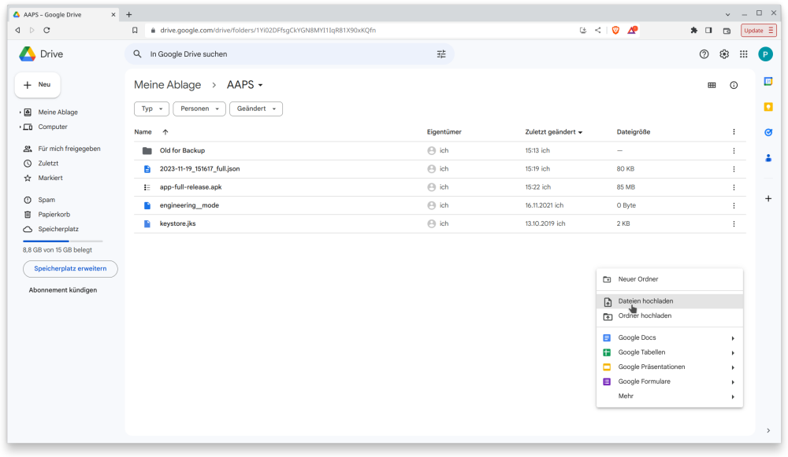

# installing AAPS

Here we describe how to install the APK on the smartphone including the transfer to the smartphone to be able to install.

To install AAPS on your mobile it is necessary to make the apk file which is at the moment located at your computer accessible to the mobile.

There are several ways to do this and we are trying to instruct you the easiest way with the nice benefit that you get automatically a backup copy of the apk file in case you loose or break your mobile.

## Overview

1. transfer the apk file from your computer to Google Drive
2. use the Google Drive app to excute the apk file for installation

Configuring the AAPS loop ist not part of the installation. Please read further here [Configuring the AAPS loop](configuring-the-AAPS-loop.md).

## Step by step walkthrough

### transfer the apk file from your computer to Google Drive

Open [Google.com](https://www.google.com/) in your web browser.

On the right upper side select the Drive app in the Google menu.


Right click in the free area below the files and folders in the Google Drive app and select "Upload File".



The apk file should now be uploaded on Google Drive.


### use the Google Drive app to excute the apk file for installation

Switch to your mobile and start the Google Drive app. It is a preinstalled app and can be found where the other Google apps are located or with search for the name of the app.


Launch the apk installation by double click on the filename in the Google Drive App on the mobile.


In case you get a security notice that you are not allowed to install apps from Google Driver at the moment please allow it for that short moment and disallow it afterwards as it is a security risk when you let it enable all the time.


After the installation finished your are done with this step.

```{warning}
**IMPORTANT SAFETY NOTICE**

Did you remeber to disallow the installation from Google Drive?

```

Please go on with [configuring the AAPS loop](configuring-the-AAPS-loop.md).
