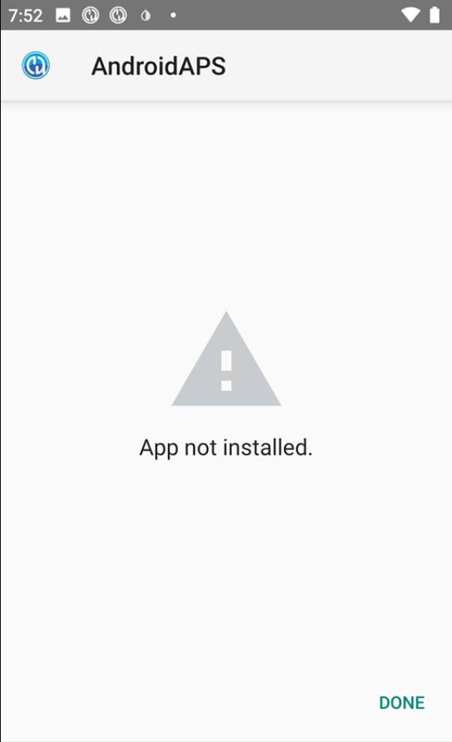

# Troubleshooting Android Studio

## Lost keystore
If you use the same keystore when updating AndroidAPS you do not have to uninstall the previous version on your smartphone. That's why it is recommended to store the keystore in a save place.

If you try to install the apk, signed with a different keystore than before, you will get an error message that the installation failed!

In case you cannot find your old keystore or its password anymore, proceed as follows:

1. [Export settings](../Usage/ExportImportSettings.html#export-settings) on your phone.
2. Copy or upload the settings file from your phone to an external location (i.e. your computer, cloud storage service...).
4. Generate signed apk of new version as described on the [Update guide](../Installing-AndroidAPS/Update-to-new-version.html) and transfer it to your phone.
5. Uninstall previous AAPS version on your phone.
6. Install new AAPS version on your phone.
7. [Import settings](../Usage/ExportImportSettings.html#export-settings) to restore your objectives and configuration.

   If you can't find them on your phone copy them from the external storage to your phone.
8. Keep on looping.

## Gradle Sync failed
Gradle Sync can fail to various reasons. Wen you get a message saying that gradle sync failed. Open the "Build" tab at the bottom and check what error message is displayed.

### No cached version of ... available for offline mode

On the right side, open the Gradle tab (1). Make sure the button shown at (2) is NOT selected.


If you can still see the message that the gradle sync failed, now select the Link "Try again".


If you don't see that message anymore, restart Android Studio. This will also trigger the Gradle Sync again!

###Uncommitted changes

If you receive a failure message like


####Step 1 - Check git installation
* Open the terminal tab (1) at the bottom of Android Studio and copy the following text and paste or type into the terminal.
  ```
  git --version
  ```
    

  Note: There is a space and two hyphens between git and version!

* You must receive a message saying what git version is installed, as you can see in the screenshot above. In this case, go to Step 2.

* In case you get an message saying
  ```
  Git: command not found
  ```
  your Git installation is not right.
  * if on Windows and git was just installed, you should restart your computer or at least log out and re-login once, to make git globally available after the installation
  * [Check git installation](../Installing-AndroidAPS/git-install.html#check-git-settings-in-android-studio)
  * If Git is installed, you have restarted (if on windows), and git still couldn't found:

    Search your computer for a file "git.exe".

    Note for yourself, what directory it is in.

    Go to the Environment variables in windows, select the variable "PATH" and click edit. Add the directory where you have found your git installation.

    Save and close.

    Restart Android Studio.

####Step 2: Check for uncommited changes.

  * In Android Studio, oben the "Commit" Tab (1) on the left-hand side.
    
  * You can see either a "Default changeset" (2) or "Unversioned files" (3):
    * For "Default changeset", you probably updated gradle or changed some of the file contents by mistake.

      Right click on "Default Changeset" and select "Rollback"
      

      The files are fetched again from the Git server. If there are no other changes in the commit tab, go to Step 3.

  * If you can see "Unversioned Files", you might have stored files in your sourecode directory which should be better places somewhere else, e.g. your keystore file.

    Use your regular file explorer on your computer to move or cut and paste that file to a save place.

    Go back to Android Studio and click the Refresh button (4) within the Commit tab to make sure the file is not stored in the AndroidAPS directory anymore. If there are no other changes in the commit tab, go to Step 3.


####Step 3: Resync Gradle (again)
  If you can still see the message that the gradle sync failed, now select the Link "Try again".
  

  If you don't see that message anymore, restart Android Studio. This will also trigger the Gradle Sync again!


## Error "on demand" Configuration

If your build fails with an error regarding "on demand configuration" you can do the following:
* Open the Preferences window by clicking File > Settings (on Mac, Android Studio > Preferences).
* In the left pane, click Build, Execution, Deployment > Compiler.
* Uncheck the Configure on demand checkbox.
* Click Apply or OK.


##Kotlin compiler warning

If build completed successfully but you get Kotlin compiler warnings then just ignore these warnings.

App was build successfully and can be transferred to phone.


##Key was created with errors

When creating a new keystore for building the signed APK, on Windows the following error message might appear


This seems to be a bug with Android Studio 3.5.1 and its shipped Java environment in Windows. The key is created correctly but a recommendation is falsely displayed as an error. This can currently be ignored.


##Unable to start daemon process

If you see an error message like the one below you probably use a Windows 10 32-bit system. This is not supported by Android Studio 3.5.1 and above. I you are using Windows 10 you must use a 64-bit operating system.

There are a lot of manuals on the internet how to determine wether you have a 32-bit or 64-bit OS - i.e. `this one <https://www.howtogeek.com/howto/21726/how-do-i-know-if-im-running-32-bit-or-64-bit-windows-answers/>`_.


##No CGM data

* In case you are using patched Dexcom G6 app: This app is outdated. Use `BYODA <../Hardware/DexcomG6.html#if-using-g6-with-build-your-own-dexcom-app>`_ instead.
* In case you are using xDrip+: Identify receiver as described on `xDrip+ settings page <../Configuration/xdrip.html#identify-receiver>`_.
* As of AndroidAPS 3.0 BYODA is mandatory for Dexcom users (due to bug in xDrip+) - see `_release notes <../Installing-AndroidAPS/Releasenotes.html#important-hints>`_.


##App not installed



* Make sure you have transferred the “app-full-release.apk” file to your phone.
* If "App not installed" is displayed on your phone follow these steps:

1. `Export settings <../Usage/ExportImportSettings.html>`__ (in AAPS version already installed on your phone)
2. Uninstall AAPS on your phone.
3. Enable airplane mode & turn off bluetooth.
4. Install new version (“app-full-release.apk”)
5. `Import settings <../Usage/ExportImportSettings.html>`__
6. Turn bluetooth back on and disable airplane mode

##App installed but old version

If you build the app successfully, transferred it to your phone and installed it successfully but the version number stays the same then you might have missed to `update your local copy <../Installing-AndroidAPS/Update-to-new-version.html#update-your-local-copy>`_.

##None of the above worked

If non of the above tips helped you might consider building the app from scratch:

1. `Export settings <../Usage/ExportImportSettings.html>`__ (in AAPS version already installed on your phone)
2. Have your key password and key store password ready. In case you have forgotten passwords you can try to find them in project files as described `here <https://youtu.be/nS3wxnLgZOo>`__. Or you just use a new keystore.
3. Build app from scratch as described `here <../Installing-AndroidAPS/Building-APK.html#download-androidaps-code>`__.
4. When you have build the APK successfully delete the exiting app on your phone, transfer the new apk to your phone and install.
5. `Import settings <../Usage/ExportImportSettings.html>`__

##Worst case scenario

In case even building the app from scratch does not solve your problem you might want to try to uninstall Android Studio completely. Some Users reported that this solved their problem.

**Make sure to uninstall all files associated with Android Studio.** If you do not completely remove Android Studio with all hidden files, uninstalling may cause new problems instead of solving your existing one(s). Manuals for complete uninstall can be found online i.e. `https://stackoverflow.com/questions/39953495/how-to-completely-uninstall-android-studio-from-windowsv10 <https://stackoverflow.com/questions/39953495/how-to-completely-uninstall-android-studio-from-windowsv10>`_.

Install Android Studio from scratch as described `here <../Installing-AndroidAPS/Building-APK.html#install-android-studio>`_ and **do not update gradle**.
